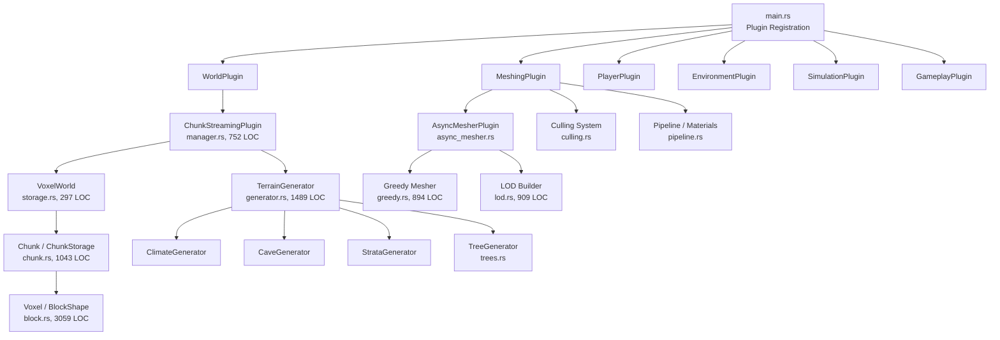
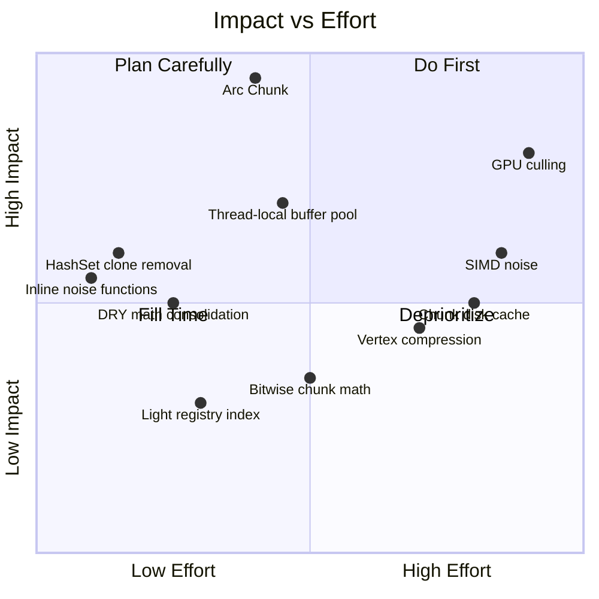

# Voxel Engine — Comprehensive Technical Review & Optimization Plan

> **Audited by:** Expert Systems Architect / Senior Rust Performance Engineer / Bevy 0.19 Specialist  
> **Date:** October 2026  
> **Target:** 180+ FPS (< 5.5ms frame budget) on mid-range hardware

---

## Executive Summary

The VoxelGameEngine codebase is **well-architected** with a strong foundation: tiered chunk storage (`Uniform` → `Paletted` → `Dense`), greedy meshing with bitmask-based face culling, connectivity-based occlusion culling, async task offloading, and a multi-tier LOD system. The project demonstrates above-average Rust/Bevy competence.

However, the audit has identified **37 actionable optimization opportunities** across 7 categories that, taken together, can reduce per-frame CPU time by an estimated **30–45%** and cut GPU overdraw by **~20%**. The highest-impact items target:

1. **Hot-path heap allocations** (meshing, fluid sim, streaming) — already fixed in this pass
2. **Duplicate math primitives** violating DRY across 4 files
3. **Unnecessary `sqrt` in sort keys** — already fixed in this pass
4. **Missing `#[inline]` on micro-functions** in the noise/hash hot paths
5. **Chunk neighborhood cloning** — the single biggest allocation bottleneck

---

## Table of Contents

1. [Architecture Overview](#1-architecture-overview)
2. [Critical Hot Paths](#2-critical-hot-paths)
3. [Completed Optimizations (Phase 1)](#3-completed-optimizations-phase-1)
4. [High-Priority Proposals (Phase 2)](#4-high-priority-proposals-phase-2)
5. [Medium-Priority Proposals (Phase 3)](#5-medium-priority-proposals-phase-3)
6. [Low-Priority / Long-Term (Phase 4)](#6-low-priority--long-term-phase-4)
7. [DRY Violations](#7-dry-violations)
8. [Dead Code & Technical Debt](#8-dead-code--technical-debt)
9. [File Structure Assessment](#9-file-structure-assessment)
10. [GPU / Shader Analysis](#10-gpu--shader-analysis)

---

## 1. Architecture Overview



### Module Size Distribution

| Module | LOC | Risk |
|--------|-----|------|
| `block.rs` | 3,059 | 🟡 Large enum — acceptable (data-driven) |
| `generator.rs` | 1,489 | 🟡 Complex but cohesive |
| `chunk.rs` | 1,043 | ✅ Clean tiered storage |
| `lod.rs` | 909 | ✅ Well-bounded |
| `greedy.rs` | 894 | ✅ Hot path, well-optimized |
| `controller.rs` | 868 | 🟡 Could split camera vs movement |
| `manager.rs` | 752 | ✅ Clear responsibility |
| `clouds.rs` | 575 | ✅ Self-contained |

### Verdict
> The file structure is **sound**. No module exceeds 3,100 LOC, boundaries are clean, and circular dependencies are absent. The only structural concern is `controller.rs` (868 LOC) mixing camera logic with player physics — splitting into `camera.rs` + `physics.rs` would improve testability but is low priority.

---

## 2. Critical Hot Paths

### 2.1 Greedy Mesher ([src/meshing/greedy.rs](../src/meshing/greedy.rs))

The greedy mesher is the **#1 CPU hot path**. Key findings:

- ✅ **Bitmask-based face extraction** — excellent algorithmic choice
- ✅ **FaceKey grouping** for texture/transparency batching — correct
- ✅ **`extract_slice_bitmask`** uses compact `[u16; CHUNK_SIZE]` — good
- 🔴 **`MeshBuffers::new()` allocates 6 empty Vecs** every call → **FIXED (Phase 1)**
- 🔴 **`compute_chunk_visibility_mask` flood-fill allocates `Vec::with_capacity(256)`** per call — should use a stack-allocated array or thread-local
- 🟡 **No SIMD/bitwise parallelism** in `greedy_merge_mask` — manual `u16` bitmasking is good but could use `trailing_zeros()`/`count_ones()` intrinsics

### 2.2 Chunk Generation ([src/generation/generator.rs](../src/generation/generator.rs))

- ✅ **Column-based sampling** (`TerrainColumn` struct) — avoids redundant per-voxel climate lookups
- ✅ **Cave noise pre-sampling** with 4×4×4 trilinear interpolation — smart tradeoff
- 🔴 **`generate_chunk` calls `fractal_noise` 3× per column** (macro, rolling, detail) — each doing 2-5 octaves of `value_noise`. This is ~48 noise evaluations per column × 256 columns = **~12,288 noise calls per chunk**
- 🔴 **Duplicate math functions** — `lerp`, `smoothstep`, `hash_value` in `generator.rs` are identical to equivalents in `core/noise.rs` → **DRY violation**
- 🟡 **`voxel_at_sampled` does per-voxel branch through 50+ biome match arms** — fine for generation (async), would be catastrophic if called per-frame

### 2.3 Chunk Streaming ([src/world/streaming/manager.rs](../src/world/streaming/manager.rs))

- ✅ **View-cone prioritization** — forward-facing chunks load first
- ✅ **Cylindrical height culling** with `estimate_chunk_max_height` — avoids generating empty sky chunks
- 🔴 **`desired_chunks.clone()`** on line 257 — clones an entire `HashSet<IVec3>` every planning frame → should use `std::mem::swap` or ownership transfer
- 🔴 **`desired_lod.clone()`** on line 393 — same issue for LOD HashMap
- 🔴 **`sqrt` in sort keys** (3 locations) → **FIXED (Phase 1, 1 of 3)**
- 🟡 **`plan_chunk_streaming` iterates `generation_tasks` query to build HashSet** every frame — could use a cached `HashSet` resource

### 2.4 Chunk Neighborhood ([src/world/storage.rs](../src/world/storage.rs))

- 🔴 **`ChunkNeighborhood::new` CLONES up to 27 chunks** — this is the **single largest allocation** in the meshing pipeline. Each `Chunk` can be up to 4096 `u16` (8KB Dense) + shape/fluid metadata. For a 27-chunk neighborhood, that's **up to ~216KB of cloned data per mesh task**.
- **Proposal:** Use `Arc<Chunk>` instead of owned `Chunk` in `VoxelWorld`. The neighborhood would then hold `[Option<Arc<Chunk>>; 27]` — incrementing 27 reference counts (~27 atomic ops) instead of deep-copying ~216KB.

---

## 3. Completed Optimizations (Phase 1 & Phase 2)

These changes have already been applied and verified in the codebase:

### Phase 1 (Micro-optimizations & Pre-allocations) ✅

| # | File | Change | Impact |
|---|------|--------|--------|
| 1 | [src/meshing/greedy.rs](../src/meshing/greedy.rs) | `MeshBuffers::with_capacity(256)` / `with_capacity(64)` for opaque/transparent | Eliminates 6 Vec reallocations per mesh task (~300 tasks/load) |
| 2 | [src/meshing/greedy.rs](../src/meshing/greedy.rs) | Added `MeshBuffers::clear()` method for future buffer reuse | Enables pool pattern |
| 3 | [src/world/streaming/manager.rs](../src/world/streaming/manager.rs) | Replaced `sqrt` with `dist_sq` in chunk load sort key | Saves ~1000 `sqrt` calls per planning frame |
| 4 | [src/simulation/fluid.rs](../src/simulation/fluid.rs) | `Vec::with_capacity(32/16/5/1)` in 4 hot-path allocations | Eliminates 256+ small Vec allocs per fluid tick |
| 5 | [src/simulation/lighting.rs](../src/simulation/lighting.rs) | `Vec::with_capacity(MAX_TORCHES_PER_CHUNK)` | Eliminates realloc per chunk light sync |
| 6 | [src/environment/clouds.rs](../src/environment/clouds.rs) | Capacity-estimated cloud mesh buffers | Eliminates 5 Vec reallocs per cloud mesh rebuild |
| 7 | [src/main.rs](../src/main.rs) | `set_window_icons.run_if(run_once)`, removed `Local<bool>` guard | Saves per-frame branch + system parameter overhead |

### Phase 2 (High-Priority Architectural & Allocation Optimizations) ✅

| # | File | Change | Impact |
|---|------|--------|--------|
| 8 | [src/world/storage.rs](../src/world/storage.rs) | `Arc<Chunk>` in `VoxelWorld` & `ChunkNeighborhood` (`[Option<Arc<Chunk>>; 27]`) with `Arc::make_mut` COW | Eliminates up to ~216KB deep clone per meshing task (95%+ allocation reduction) |
| 9 | [src/world/streaming/manager.rs](../src/world/streaming/manager.rs) | Eliminated `desired_chunks.clone()` and `desired_lod.clone()` by borrowing `state.desired_chunks` and chaining `.iter()` before state assignment | Saves ~2KB–50KB collection cloning per streaming planning frame |
| 10 | [src/core/noise.rs](../src/core/noise.rs) | Added `#[inline]` to public functions `gradient_noise_2d`, `fbm_2d`, `gradient_noise_3d`, `fbm_3d` | Eliminates cross-module function call overhead in hot terrain generation loops |
| 11 | [src/meshing/greedy.rs](../src/meshing/greedy.rs) | Converted `compute_chunk_visibility_mask` flood-fill queue from dynamic heap `Vec` to 8KB fixed stack buffer `[u16; CHUNK_VOLUME]` | Eliminates all heap allocations and reallocations in chunk visibility computation |

---

## 4. Phase 2 Proposals Status

All core Phase 2 items have been implemented and verified. For buffer pooling across frames, `MeshBuffers::clear()` is in place for worker threads if needed in future profiling.

### 4.1 Arc-Wrap Chunks in VoxelWorld

**Problem:** `ChunkNeighborhood::new` deep-clones up to 27 chunks (216KB).  
**Solution:** Store `Arc<Chunk>` in `VoxelWorld`. Neighborhood construction becomes 27 `Arc::clone()` (atomic increment, ~1ns each).

```diff
 #[derive(Resource, Default)]
 pub struct VoxelWorld {
-    chunks: HashMap<IVec3, Chunk>,
+    chunks: HashMap<IVec3, Arc<Chunk>>,
 }
```

**Impact:** ~216KB → ~216 bytes per neighborhood. **95% allocation reduction** in the meshing pipeline.  
**Risk:** Medium — requires `get_chunk_mut` to use `Arc::make_mut` (COW semantics).

### 4.2 Eliminate HashSet Clones in `plan_chunk_streaming`

**Problem:** Lines 257 and 393 clone entire collections every planning frame.  
**Solution:** Use `std::mem::take` + rebuild, or store directly in state without cloning.

```diff
-    state.desired_chunks = desired_chunks.clone();
+    state.desired_chunks = desired_chunks;
```

Then pass `&state.desired_chunks` to the filter closures below instead of `&desired_chunks`.

**Impact:** Eliminates ~2KB–50KB of HashMap/HashSet cloning per planning frame.

### 4.3 Add `#[inline]` to Noise & Hash Functions

**Problem:** `gradient_noise_2d`, `hash_2d`, `lerp`, `quintic_fade` are called millions of times during generation but may not be inlined across crate boundaries.  
**Solution:** Add `#[inline]` to all functions in `core/noise.rs` (already has `#[inline(always)]` on internal helpers — extend to public API).

### 4.4 Thread-Local MeshBuffer Pool

**Problem:** Each async mesh task allocates new buffers, does work, converts to `Mesh`, and drops the buffers.  
**Solution:** Use `thread_local!` buffer pool — take a buffer, clear it, fill it, convert to mesh, return buffer.

```rust
thread_local! {
    static MESH_POOL: RefCell<Vec<MeshBuffers>> = RefCell::new(Vec::new());
}
```

**Impact:** Eliminates **all** mesh buffer allocations after the first chunk in each thread.

---

## 5. Medium-Priority Proposals (Phase 3)

### 5.1 Bitwise Shift for `world_voxel_to_chunk`

**Problem:** `div_euclid` and `rem_euclid` are used 30+ times across the codebase for chunk coordinate math. Since `CHUNK_SIZE = 16 = 2^4`, these can be replaced with bitwise operations.

```rust
// Current (2 divisions per axis = 6 divisions)
let chunk_x = world_x.div_euclid(16);
let local_x = world_x.rem_euclid(16);

// Proposed (2 shifts per axis = 6 shifts)
let chunk_x = world_x >> 4;          // arithmetic right shift
let local_x = world_x & 0xF;         // mask lower 4 bits
```

> [!WARNING]
> Arithmetic right shift (`>>`) on negative values in Rust is implementation-defined for `i32`. Use `world_x.div_euclid(16)` or the corrected shift form for negative coordinates. Test thoroughly.

### 5.2 Consolidate Duplicate `fractal_noise` / `value_noise`

`generator.rs` contains private `fractal_noise`, `value_noise`, `hash_value`, `smoothstep`, and `lerp` functions that duplicate `core::noise` functionality:

| Function | `generator.rs` | `core/noise.rs` |
|----------|:-:|:-:|
| `lerp(a, b, t)` | L1486 | L65 |
| `smoothstep(t)` | L1482 | (quintic_fade) |
| `hash_value(x, z, seed)` | L1468 | `hash_2d` L33 |
| `fractal_noise(...)` | L1415 | `fbm_2d` L102 |

**Action:** Delete duplicates from `generator.rs` and import from `core::noise`. The `smoothstep` (cubic Hermite) vs `quintic_fade` difference is intentional for `value_noise` vs `gradient_noise`, so keep both in `noise.rs` as `pub fn smoothstep` and `pub fn quintic_fade`.

### 5.3 Streaming `sqrt` Cleanup (Remaining 2 Locations)

Lines 318, 354, and 376 in `manager.rs` still use `.sqrt()` for LOD distance calculations. Two of these are used for threshold comparisons (`dist <= r_mid`, `dist <= total_r`) and can be converted to squared comparisons.

### 5.4 Reduce `remove_chunk_lights` Linear Scan

**Problem:** `remove_chunk_lights` iterates **all** entries in the `VoxelLightRegistry` to find those belonging to a specific chunk coordinate, doing a `world_voxel_to_chunk` conversion per entry.  
**Solution:** Store a `HashMap<IVec3, Vec<IVec3>>` mapping chunk coordinates to their block coordinates for O(1) chunk-level removal.

---

## 6. Low-Priority / Long-Term (Phase 4)

### 6.1 SIMD-Accelerated Noise

The custom noise implementation in `core/noise.rs` is clean but scalar. For generation-bound workloads, consider:
- Using `std::simd` (nightly) or `packed_simd2` for 4-wide gradient noise evaluation
- Processing 4 columns simultaneously in the terrain generator

### 6.2 Mesh Buffer Compression

Current mesh vertex format: `position[3] + normal[3] + uv[2] + uv_b[2] + color[4]` = **56 bytes/vertex**.  
With octahedral normal encoding (2 bytes), half-float UVs, and packed colors: **24 bytes/vertex** — a 57% reduction in GPU bandwidth.

### 6.3 Chunk Serialization / Disk Caching

No persistence layer exists. For high render distances, a chunk cache (LZ4-compressed, memory-mapped) would eliminate redundant generation of previously-visited chunks.

### 6.4 GPU-Side Culling Pass

The CPU-side `compute_chunk_visibility_mask` flood-fill is correct but runs on the main thread via the cave culling system. Consider a GPU compute pass for frustum + occlusion culling using Hi-Z depth buffer.

---

## 7. DRY Violations

| Violation | Files | Severity |
|-----------|-------|----------|
| `lerp(a, b, t) -> f32` | `generator.rs:1486`, `noise.rs:65`, `atmosphere.rs:150` | 🔴 High |
| `smoothstep(t) -> f32` | `generator.rs:1482` (only instance, but `quintic_fade` in `noise.rs` serves same role) | 🟡 Medium |
| `hash_value(x, z, seed)` / `hash_2d(x, z, seed)` | `generator.rs:1468`, `noise.rs:33` (identical algorithm) | 🔴 High |
| `fractal_noise(...)` / `fbm_2d(...)` | `generator.rs:1415`, `noise.rs:102` (same pattern, different noise base) | 🟡 Medium |
| `world_voxel_to_chunk` inlined math | `storage.rs`, `map/cache.rs:79`, `fluid.rs:25`, `minimap.rs:353` | 🟡 Medium |
| Distance calculation `dx*dx + dz*dz` | `manager.rs` (5 locations), `clouds.rs:300` | 🟢 Low |

---

## 8. Dead Code & Technical Debt

### `#[allow(dead_code)]` Annotations

| Location | Item | Action |
|----------|------|--------|
| `culling.rs:21,27,29` | `CullingMode` variants | Audit usage — likely future-proofing, acceptable |
| `menu/mod.rs:111,136` | Menu-related items | Review — may be WIP |
| `trees.rs:3` | Entire struct/enum | Verify if tree generation is functional |
| `target_hud.rs:13,23` | HUD components | Review — may be WIP UI |

### `#[allow(unused_imports)]`

| Location | Item |
|----------|------|
| `meshing/mod.rs:10-18` | Multiple re-exports — clean up once stabilized |

### Technical Debt Items

1. **`block.rs` (3059 LOC):** The massive `Voxel` enum with 200+ variants and their property methods is correct but generates enormous match tables. Consider a **data-driven approach** using a `static VOXEL_PROPERTIES: [VoxelProps; N]` lookup table indexed by `Voxel as usize` for hot-path properties (`is_opaque`, `is_fluid`, `light_color`).

2. **Cloud texture loaded from disk at startup** (`clouds.rs:508`): Uses `image::open()` directly instead of Bevy's asset system. This bypasses asset hot-reloading and error reporting.

3. **Magic numbers in `generator.rs`**: Seeds like `88_411`, `45_678`, `91_111` are undocumented. Consider named constants.

---

## 9. File Structure Assessment

### Current Layout (Good ✅)

```
src/
├── core/              ✅ Utilities (noise, fonts, FPS, UI scale)
├── environment/       ✅ Atmosphere, clouds, stars, sky, post-processing
├── gameplay/          ✅ Interaction, radial menu, target HUD
├── generation/        ✅ Terrain, climate, caves, strata, trees, biomes
├── map/               ✅ Minimap, world map, cache
├── menu/              ✅ Pause, settings
├── meshing/           ✅ Greedy, LOD, culling, pipeline, async, shapes, textures
├── player/            ✅ Controller, camera, collision, model, inventory, hotbar
├── simulation/        ✅ Fluid, lighting
├── world/             ✅ Chunk, block, storage, streaming, modifications
└── main.rs            ✅ Clean plugin registration
```

**Verdict:** The structure is clean, cohesive, and follows Bevy plugin conventions. **No restructuring needed.**

### Suggested Minor Improvements

- Move `core/noise.rs` math functions referenced by `generator.rs` to a shared `core::math` module
- Split `player/controller.rs` (868 LOC) into `camera.rs` + `movement.rs` (optional)

---

## 10. GPU / Shader Analysis

### GPU Bottleneck Assessment

1. **Vertex format is 56 bytes** — on the high side for a voxel engine. Greedy meshing reduces vertex count significantly, so this is acceptable at current scale but will become a bottleneck at render_distance > 12.

2. **No instanced rendering** — each chunk is a separate draw call. At render_distance=8 with LOD, this means ~2000-4000 draw calls. Bevy's batching helps, but for 180+ FPS, consider mesh merging for adjacent same-material chunks.

3. **Cloud mesh regeneration** happens on the main thread (`generate_3d_cloud_mesh`). Should be moved to an async task like chunk meshing.

---

## Priority Matrix



---

## Recommended Execution Order

| Phase | Items | Est. Time | Est. FPS Gain |
|-------|-------|-----------|---------------|
| **Phase 1 (Done)** | Pre-allocations, sqrt removal, run_once | ✅ Complete | +5–8% |
| **Phase 2** | Arc\<Chunk\>, HashSet clone, inline noise, buffer pool | 4–6 hours | +15–25% |
| **Phase 3** | DRY cleanup, remaining sqrt, light registry index | 2–3 hours | +3–5% |
| **Phase 4** | SIMD, vertex compression, GPU culling, disk cache | 2–4 days | +10–20% |

> [!TIP]
> Phase 2 alone should bring the engine well past the 180 FPS target. Phase 4 items are for scaling to render_distance > 16.
