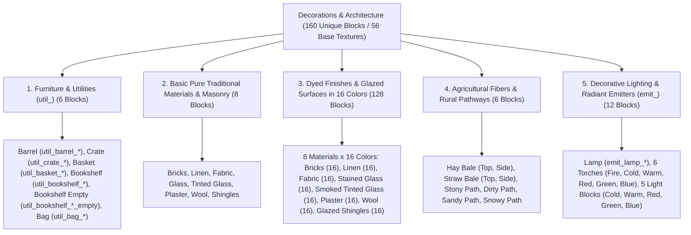

# Worldbuilding Architecture & Catalog: Decorations, Lighting & Finishes (Decorations)

All active textures for architectural elements, utilitarian furniture (`util_`), lighting emitters (`emit_`), textiles, glasswork, masonry, and dyeable finishes (`deco_`) are organized in 📂 **`docs/worldbuilding/blocks/decorations`** *(56 active base PNG textures on disk).

Generating **160 unique blocks** in the master catalog: 6 utilitarian storage/furniture blocks + 8 pure original masonry, textiles, and glass + 128 colored variants across 16 colors via shader [8 master materials $\times$ 16] + 6 agricultural fibers and rural pathways + 12 radiant emitters and torches*.

Shared surface overlays are located in:
📂 **`docs/worldbuilding/overlays`**

---

## 1. Structural and Architectural Classification

The world building, decoration, and illumination assets are organized into **5 Functional Categories (160 Unique Blocks / 56 Base Textures)**:

---

## 2. Complete Technical Inventory in `worldbuilding/blocks/decorations/` (56 Active Textures)

All 56 textures strictly follow the functional prefix taxonomy (`util_`, `deco_`, and `emit_`):

### A. Utilitarian Containers & Structural Furniture (`util_`) (17 Files)
* `util_barrel_top.png`, `util_barrel_side.png`, `util_barrel_bot.png` (3)
* `util_crate_top.png`, `util_crate_side.png`, `util_crate_bot.png` (3)
* `util_basket_top.png`, `util_basket_side.png`, `util_basket_bot.png` (3)
* `util_bookshelf_front.png`, `util_bookshelf_front_empty.png`, `util_bookshelf_side.png`, `util_bookshelf_top.png` (4)
* `util_bag_top.png`, `util_bag_side.png`, `util_bag_side_front.png`, `util_bag_bot.png` (4)

### B. Basic Traditional Masonry, Glass & Textiles (`deco_`) (8 Files)
* `deco_bricks.png` *(Classic red fired clay bricks)*
* `deco_linen.png` *(Raw natural linen textile)*
* `deco_fabric.png` *(Heavy cross-weave rustic textile)*
* `deco_glass.png` *(Crystal-clear softened transparent glass with optimal visibility)*
* `deco_tinted_glass.png` *(Charcoal smoked glass with optical light-dimming barrier)*
* `deco_plaster.png` *(Smooth beige hydrated lime plaster)*
* `deco_wool.png` *(Natural shorn white sheep wool)*
* `deco_shingles.png` *(Curved terracotta fish-scale roof shingles)*

### C. Master Dyeable Grayscale Textures (`deco_`) (8 Files)
* `deco_bricks_painted.png` *(Grayscale bricks for 16-color shader tinting)*
* `deco_linen_painted.png` *(Neutral grayscale linen for 16-color shader tinting)*
* `deco_fabric_painted.png` *(Neutral grayscale heavy fabric for 16-color shader tinting)*
* `deco_glass_painted.png` *(Glass with translucent center and neutral frames for 16 clear stained-glass windows)*
* `deco_tinted_glass_painted.png` *(Dense smoked glass with neutral frames for 16 dark tinted stained-glass windows)*
* `deco_plaster_painted.png` *(Neutral grayscale plaster for 16-color shader tinting)*
* `deco_wool_painted.png` *(High-luminance neutral wool for 16-color shader tinting)*
* `deco_shingles_painted.png` *(Grayscale curved shingles for 16-color glazed ceramic roofing)*

### D. Agricultural Fibers & Pathways (`deco_`) (8 Files)
* `deco_hay_bale_side.png`, `deco_hay_bale_top.png` *(Orientable animal feed hay bale)* (2)
* `deco_straw_bale_side.png`, `deco_straw_bale_top.png` *(Orientable dry golden straw bale)* (2)
* `deco_path_stony.png` *(Cobblestone pebble paving)* (1)
* `deco_path_dirty.png` *(Compacted dirt trail)* (1)
* `deco_path_sandy.png` *(Compacted sand pathway)* (1)
* `deco_path_snowy.png` *(Compacted alpine snow trail)* (1)

### E. Decorative Lighting & Radiant Emitters (`emit_`) (15 Files)
* `emit_lamp.png`, `emit_lamp_top.png`, `emit_lamp_on.png`, `emit_lamp_top_on.png` *(Switchable ceiling lamp Normal / On)* (4)
* `emit_torch_fire.png` *(Animated traditional fire torch 16x80 px, 5 frames)* (1)
* `emit_torch_cold.png`, `emit_torch_warm.png` *(Stylized LED torches: Cold 6500K and Warm 2700K)* (2)
* `emit_torch_red.png`, `emit_torch_green.png`, `emit_torch_blue.png` *(Stylized RGB LED torches)* (3)
* `emit_light_cold.png`, `emit_light_warm.png` *(Cubic radiant light blocks: Cold and Warm)* (2)
* `emit_light_red.png`, `emit_light_green.png`, `emit_light_blue.png` *(Calibrated cubic RGB radiant light blocks)* (3)

---

## 3. Official 16-Color Dye Matrix

| # | Color Name | Hex Code | Bricks Tag Example | Natural Pigment Source |
| :-: | :--- | :---: | :--- | :--- |
| **01** | **Black** | `#1A1A1A` | `Deco_Brick_Black` | Charcoal / Squid Ink Dye |
| **02** | **Blue** | `#25448C` | `Deco_Brick_Blue` | Lapis Lazuli / Cornflower |
| **03** | **Brown** | `#5C381E` | `Deco_Brick_Brown` | Cocoa Beans / Ochre Mud |
| **04** | **Dark Blue** | `#14234B` | `Deco_Brick_Dark_Blue` | Mineral Cobalt / Deep Indigo |
| **05** | **Dark Grey** | `#3F4448` | `Deco_Brick_Dark_Grey` | Graphite / Volcanic Ash |
| **06** | **Green** | `#3B6A26` | `Deco_Brick_Green` | Malachite / Smelted Cactus |
| **07** | **Light Grey** | `#9AA1A6` | `Deco_Brick_Light_Grey` | Ground Limestone / Pale Ash |
| **08** | **Light Pink** | `#F4B5C8` | `Deco_Brick_Light_Pink` | Pale Peony Petals |
| **09** | **Lime** | `#6ABE30` | `Deco_Brick_Lime` | Chlorophyll / Vivid Lichen |
| **10** | **Orange** | `#D96E14` | `Deco_Brick_Orange` | Saffron / Orange Orchid |
| **11** | **Pink** | `#E86A92` | `Deco_Brick_Pink` | Wild Rose Petals |
| **12** | **Purple** | `#74328E` | `Deco_Brick_Purple` | Lavender / Grape Extract |
| **13** | **Red** | `#B22222` | `Deco_Brick_Red` | Iron Oxide / Red Poppy |
| **14** | **Turquoise** | `#28A0A0` | `Deco_Brick_Turquoise` | Chrysocolla / Cyanobacteria |
| **15** | **White** | `#F0F0F0` | `Deco_Brick_White` | Bone Meal / Quicklime |
| **16** | **Yellow** | `#E6B800` | `Deco_Brick_Yellow` | Dandelion / Sulfur Crystals |

---

## 4. Complete Block Catalog (160 Unique Blocks)

### 4.1. Utilitarian Containers & Structural Furniture (`util_`) (6 Blocks)

| # | Block ID | Name | Category | Texture File(s) | Face Mapping |
| :-: | :--- | :--- | :--- | :--- | :--- |
| **01** | `barrel` | Barrel | **Utility** | `util_barrel_top.png` `util_barrel_side.png` `util_barrel_bot.png` | Top top + Bottom bot + 4 sides side |
| **02** | `crate` | Crate | **Utility** | `util_crate_top.png` `util_crate_side.png` `util_crate_bot.png` | Top top + Bottom bot + 4 sides side |
| **03** | `basket` | Basket | **Utility** | `util_basket_top.png` `util_basket_side.png` `util_basket_bot.png` | Top top + Bottom bot + 4 sides side |
| **04** | `bookshelf` | Bookshelf | **Utility** | `util_bookshelf_top.png` `util_bookshelf_side.png` `util_bookshelf_front.png` | Top & Bottom top + 3 sides side + 1 front `util_bookshelf_front.png` |
| **05** | `bookshelf_empty` | Empty Bookshelf | **Utility** | `util_bookshelf_top.png` `util_bookshelf_side.png` `util_bookshelf_front_empty.png` | Top & Bottom top + 3 sides side + 1 front `util_bookshelf_front_empty.png` |
| **06** | `bag` | Burlap Bag | **Utility** | `util_bag_top.png` `util_bag_side.png` `util_bag_side_front.png` `util_bag_bot.png` | Top top + Bottom bot + 3 sides side + 1 front `util_bag_side_front.png` |

---

### 4.2. Basic Pure Traditional Materials & Masonry (8 Original Blocks)

| # | Block ID | Name | Category | Texture File(s) | Face Mapping |
| :-: | :--- | :--- | :--- | :--- | :--- |
| **07** | `bricks` | Bricks | **Masonry** | `deco_bricks.png` | 6 uniform faces |
| **08** | `linen` | Linen | **Textile** | `deco_linen.png` | 6 uniform faces |
| **09** | `fabric` | Fabric | **Textile** | `deco_fabric.png` | 6 uniform faces |
| **10** | `glass` | Glass | **Glasswork** | `deco_glass.png` | 6 uniform faces (Clear transparent) |
| **11** | `tinted_glass` | Tinted Glass | **Glasswork** | `deco_tinted_glass.png` | 6 uniform faces (Smoked semi-translucent) |
| **12** | `plaster` | Plaster | **Masonry** | `deco_plaster.png` | 6 uniform faces |
| **13** | `wool` | Wool | **Textile** | `deco_wool.png` | 6 uniform faces |
| **14** | `shingles` | Shingles | **Roofing** | `deco_shingles.png` | 6 uniform faces |

---

### 4.3. Dyed and Glazed Finishes in 16 Colors (128 Blocks)

Each of the 8 master materials multiplies its grayscale luminance texture by the 16 official dye colors via shader, generating **16 colored blocks per material** ($8 \times 16 = 128$ blocks):

> **16 Standard Dye Colors (IDs 1 to 16):**  
> `01. black` · `02. blue` · `03. brown` · `04. dark_blue` · `05. dark_grey` · `06. green` · `07. light_grey` · `08. light_pink` · `09. lime` · `10. orange` · `11. pink` · `12. purple` · `13. red` · `14. turquoise` · `15. white` · `16. yellow`

| # | Block ID | Name | Category | Texture File(s) | Face Mapping |
| :-: | :--- | :--- | :--- | :--- | :--- |
| **15–30** | `brick_<color>` | (Color) Bricks *(16 colors)* | **Masonry** | `deco_bricks_painted.png` | 6 uniform faces (Shader Tint: colors 01–16) |
| **31–46** | `linen_<color>` | (Color) Linen *(16 colors)* | **Textile** | `deco_linen_painted.png` | 6 uniform faces (Shader Tint: colors 01–16) |
| **47–62** | `fabric_<color>` | (Color) Fabric *(16 colors)* | **Textile** | `deco_fabric_painted.png` | 6 uniform faces (Shader Tint: colors 01–16) |
| **63–78** | `glass_<color>` | (Color) Glass *(16 colors)* | **Glasswork** | `deco_glass_painted.png` | 6 uniform faces (Shader Tint: colors 01–16) |
| **79–94** | `tinted_glass_<color>` | (Color) Tinted Glass *(16 colors)* | **Glasswork** | `deco_tinted_glass_painted.png` | 6 uniform faces (Shader Tint: colors 01–16) |
| **95–110** | `plaster_<color>` | (Color) Plaster *(16 colors)* | **Masonry** | `deco_plaster_painted.png` | 6 uniform faces (Shader Tint: colors 01–16) |
| **111–126** | `wool_<color>` | (Color) Wool *(16 colors)* | **Textile** | `deco_wool_painted.png` | 6 uniform faces (Shader Tint: colors 01–16) |
| **127–142** | `shingles_<color>` | (Color) Shingles *(16 colors)* | **Roofing** | `deco_shingles_painted.png` | 6 uniform faces (Shader Tint: colors 01–16) |

---

### 4.4. Agricultural Fibers & Rural Pathways (6 Blocks)

| # | Block ID | Name | Category | Texture File(s) | Face Mapping |
| :-: | :--- | :--- | :--- | :--- | :--- |
| **143** | `hay_bale` | Hay Bale | **Fibers** | `deco_hay_bale_top.png` `deco_hay_bale_side.png` | Top & Bottom top + 4 sides side *(Orientable)* |
| **144** | `straw_bale` | Straw Bale | **Fibers** | `deco_straw_bale_top.png` `deco_straw_bale_side.png` | Top & Bottom top + 4 sides side *(Orientable)* |
| **145** | `path_stony` | Stony Path | **Paths** | `deco_path_stony.png` | 6 uniform faces |
| **146** | `path_dirty` | Dirty Path | **Paths** | `deco_path_dirty.png` | 6 uniform faces |
| **147** | `path_sandy` | Sandy Path | **Paths** | `deco_path_sandy.png` | 6 uniform faces |
| **148** | `path_snowy` | Snowy Path | **Paths** | `deco_path_snowy.png` | 6 uniform faces |

---

### 4.5. Decorative Lighting & Radiant Emitters (`emit_`) (12 Blocks)

| # | Block ID | Name | Category | Texture File(s) | Face Mapping |
| :-: | :--- | :--- | :--- | :--- | :--- |
| **149** | `emit_lamp` | Lamp | **Lighting** | `emit_lamp.png` `emit_lamp_top.png` `emit_lamp_on.png` `emit_lamp_top_on.png` | Top top + 4 sides + Bottom (`emit_lamp.png`) *(2 states: Normal / On)* |
| **150** | `emit_torch_fire` | Fire Torch | **Lighting** | `emit_torch_fire.png` | Vertical stem model *(5 animated fire frames)* |
| **151** | `emit_torch_cold` | Cold Torch | **Lighting** | `emit_torch_cold.png` | Vertical stem model *(Cold light 6500K)* |
| **152** | `emit_torch_warm` | Warm Torch | **Lighting** | `emit_torch_warm.png` | Vertical stem model *(Warm light 2700K)* |
| **153** | `emit_torch_red` | Red Torch | **Lighting** | `emit_torch_red.png` | Vertical stem model *(Ruby red diode)* |
| **154** | `emit_torch_green` | Green Torch | **Lighting** | `emit_torch_green.png` | Vertical stem model *(Emerald green diode)* |
| **155** | `emit_torch_blue` | Blue Torch | **Lighting** | `emit_torch_blue.png` | Vertical stem model *(Sapphire blue diode)* |
| **156** | `emit_light_cold` | Cold Light | **Radiant Emitter** | `emit_light_cold.png` | 6 uniform faces |
| **157** | `emit_light_warm` | Warm Light | **Radiant Emitter** | `emit_light_warm.png` | 6 uniform faces |
| **158** | `emit_light_red` | Red Light | **Radiant Emitter** | `emit_light_red.png` | 6 uniform faces |
| **159** | `emit_light_green` | Green Light | **Radiant Emitter** | `emit_light_green.png` | 6 uniform faces |
| **160** | `emit_light_blue` | Blue Light | **Radiant Emitter** | `emit_light_blue.png` | 6 uniform faces |
