# Worldbuilding Architecture & Catalog: Fluids, Hydrology & Cryology (Fluids)

All active textures for cryogenic ice blocks (`frost_`) and dynamic liquids (`liquid_`) are organized in the folder:
📂 **`docs/worldbuilding/blocks/fluids`** *(38 active PNG textures on disk)*

Generating **18 unique blocks** in the master catalog: 8 cryogenic ice blocks + 10 dynamic physical liquids (each supported by static block, animated still surface, and cascading flow strips).

Shared surface overlays are located in:
📂 **`docs/worldbuilding/overlays`**

---

## 1. Thermodynamic and Rheological Classification

In the planetary hydrosphere and fluid dynamics system, liquid and cryosphere matter is classified into **4 major rheological domains (18 Unique Blocks / 38 Textures)**:

```mermaid
graph TD
    A["Fluids & Cryology (18 Unique Blocks / 38 Textures)"] --> B["1. Cryology & Glaciers (8 Ice Blocks)"]
    A --> C["2. Aquatic Hydrosphere (2 Waters)"]
    A --> D["3. Magmatism & Pyroclastics (3 Lavas)"]
    A --> E["4. Chemical, Biological & Bituminous (5 Liquids)"]

    B --> B1["Clear Ice: Surface freezing (Normal translucent, Fragile hairline cracks, Packed opaque dense)"]
    B --> B2["Black Ice: Abyssal depth ice (Normal translucent, Fragile geometric fractures, Packed opaque dense)"]
    B --> B3["Blue Ice: Millennial glacial ice (Normal pure opaque, Cracked cellular chambers)"]

    C --> C1["Water: Neutral grayscale base for dynamic procedural biome tinting"]
    C --> C2["Spring Water: Steaming mineralized geothermal turquoise spring"]

    D --> D1["Lava: Surface effusive basaltic lava (1000°C – 1200°C)"]
    D --> D2["Core Magma: Deep mantle & planetary core incandescent magma"]
    D --> D3["Molten: Liquefied metallic slag and smelted minerals"]

    E --> E1["Acid: Corrosive neon-green chemical aqueous solution"]
    E --> E2["Blood: Visceral arterial crimson biological fluid"]
    E --> E3["Ooze: Gelatinous olive-green organic slime with vesicles"]
    E --> E4["Sludge: Dark muddy wetland mire and swamp muck"]
    E --> E5["Tar: Heavy black fossil hydrocarbon and natural bitumen"]
```

---

## 2. Complete Texture Inventory in `worldbuilding/blocks/fluids/` (38 Active Textures)

All 38 textures follow strict taxonomy prefixes (`frost_` for cryology, `liquid_` for fluid triads):

### A. Cryology and Ice Blocks (`frost_`) (8 Files, 16×16 px)
* `frost_ice.png` *(Clear crystalline translucent surface ice, alpha=153)*
* `frost_ice_fragile.png` *(Translucent surface ice with subtle stress hairline cracks, alpha=153)*
* `frost_ice_packed.png` *(Dense massive firn snow-compressed ice, 100% opaque RGB)*
* `frost_ice_black.png` *(Abyssal deep-water obsidian-clear black ice, alpha=160)*
* `frost_ice_black_fragile.png` *(Abyssal black ice with bold geometric cleavage fractures, alpha=160)*
* `frost_ice_black_packed.png` *(Deep permafrost sediment-rich solid black ice rock, 100% opaque RGB)*
* `frost_blue_ice.png` *(Colossal pressure glacial blue ice, 100% opaque RGB)*
* `frost_blue_ice_cracked.png` *(Glacial blue ice with cellular web of frost veins and trapped bubbles, 100% opaque RGB)*

### B. Static Fluid Block Icons (`liquid_`) (10 Files, 16×16 px)
Used for static block representations, bucket items, inventory icons, and particles:
* `liquid_water.png` *(Neutral grayscale template for biome tinting)*
* `liquid_spring_water.png` *(Geothermal turquoise mineral water)*
* `liquid_lava.png` *(Basaltic incandescent surface lava)*
* `liquid_core_magma.png` *(Ultra-incandescent yellow mantle magma)*
* `liquid_molten.png` *(Smelted liquid metallurgical slag)*
* `liquid_acid.png` *(Reactive neon-green corrosive acid)*
* `liquid_blood.png` *(Dense arterial crimson biological fluid)*
* `liquid_ooze.png` *(Organic bubbling colloidal olive slime)*
* `liquid_sludge.png` *(Dark alluvial muddy swamp mire)*
* `liquid_tar.png` *(Viscous black bitumen hydrocarbon)*

### C. Still Liquid Surface Animation Strips (`liquid_`) (10 Files, 16×N px)
Animated vertical sprite sheets for calm horizontal reservoir faces:
* `liquid_water_still.png` *(16×576 px, 36 frames)*
* `liquid_spring_water_still.png` *(16×512 px, 32 frames)*
* `liquid_lava_still.png` *(16×512 px, 32 frames)*
* `liquid_core_magma_still.png` *(16×320 px, 20 frames)*
* `liquid_molten_still.png` *(16×480 px, 30 frames)*
* `liquid_acid_still.png` *(16×256 px, 16 frames)*
* `liquid_blood_still.png` *(16×480 px, 30 frames)*
* `liquid_ooze_still.png` *(16×480 px, 30 frames)*
* `liquid_sludge_still.png` *(16×480 px, 30 frames)*
* `liquid_tar_still.png` *(16×480 px, 30 frames)*

### D. Flowing Waterfall Animation Strips (`liquid_`) (10 Files, 32×M px)
High-definition animated vertical sprite sheets for cascading and falling currents:
* `liquid_water_flow.png` *(32×256 px, 8 frames)*
* `liquid_spring_water_flow.png` *(32×1024 px, 32 frames)*
* `liquid_lava_flow.png` *(32×512 px, 16 frames)*
* `liquid_core_magma_flow.png` *(32×512 px, 16 frames)*
* `liquid_molten_flow.png` *(32×512 px, 16 frames)*
* `liquid_acid_flow.png` *(32×512 px, 16 frames)*
* `liquid_blood_flow.png` *(32×512 px, 16 frames)*
* `liquid_ooze_flow.png` *(32×512 px, 16 frames)*
* `liquid_sludge_flow.png` *(32×512 px, 16 frames)*
* `liquid_tar_flow.png` *(32×512 px, 16 frames)*

---

## 3. Complete Block Catalog (18 Unique Blocks)

### 3.1. Cryology and Ice Blocks (8 Blocks)

| # | Block ID | Name | Category | Texture File(s) | Face Mapping |
| :-: | :--- | :--- | :--- | :--- | :--- |
| **01** | `frost_ice` | Clear Ice | **Cryology** | `frost_ice.png` | 6 uniform faces *(Translucent, alpha=153)* |
| **02** | `frost_ice_fragile` | Fragile Ice | **Cryology** | `frost_ice_fragile.png` | 6 uniform faces *(Translucent with subtle hairline cracks)* |
| **03** | `frost_ice_packed` | Packed Ice | **Cryology** | `frost_ice_packed.png` | 6 uniform faces *(100% Opaque solid firn ice)* |
| **04** | `frost_ice_black` | Black Ice | **Cryology** | `frost_ice_black.png` | 6 uniform faces *(Translucent abyssal dark, alpha=160)* |
| **05** | `frost_ice_black_fragile` | Fragile Black Ice | **Cryology** | `frost_ice_black_fragile.png` | 6 uniform faces *(Translucent dark with bold cleavage fractures)* |
| **06** | `frost_ice_black_packed` | Packed Black Ice | **Cryology** | `frost_ice_black_packed.png` | 6 uniform faces *(100% Opaque solid dark permafrost)* |
| **07** | `frost_blue_ice` | Blue Ice | **Cryology** | `frost_blue_ice.png` | 6 uniform faces *(100% Opaque deep cobalt glacial)* |
| **08** | `frost_blue_ice_cracked` | Cracked Blue Ice | **Cryology** | `frost_blue_ice_cracked.png` | 6 uniform faces *(100% Opaque cellular frost veins & bubbles)* |

---

### 3.2. Dynamic Liquids & Fluids (10 Blocks)

| # | Block ID | Name | Category | Texture File(s) | Face Mapping |
| :-: | :--- | :--- | :--- | :--- | :--- |
| **09** | `liquid_water` | Water | **Aquatic** | Block: `liquid_water.png` Still: `liquid_water_still.png` Flow: `liquid_water_flow.png` | Top: Still animated strip *(Dynamic biome tint)* Sides/Falling: Flow animated strip Inventory/Particle: Block icon |
| **10** | `liquid_spring_water` | Spring Water | **Aquatic** | Block: `liquid_spring_water.png` Still: `liquid_spring_water_still.png` Flow: `liquid_spring_water_flow.png` | Top: Still animated strip *(Turquoise mineral)* Sides/Falling: Flow animated strip Inventory/Particle: Block icon |
| **11** | `liquid_lava` | Lava | **Magmatic** | Block: `liquid_lava.png` Still: `liquid_lava_still.png` Flow: `liquid_lava_flow.png` | Top: Still animated strip *(1000°C–1200°C basaltic)* Sides/Falling: Flow animated strip Inventory/Particle: Block icon |
| **12** | `liquid_core_magma` | Core Magma | **Magmatic** | Block: `liquid_core_magma.png` Still: `liquid_core_magma_still.png` Flow: `liquid_core_magma_flow.png` | Top: Still animated strip *(Deep mantle incandescent)* Sides/Falling: Flow animated strip Inventory/Particle: Block icon |
| **13** | `liquid_molten` | Molten Slag | **Magmatic** | Block: `liquid_molten.png` Still: `liquid_molten_still.png` Flow: `liquid_molten_flow.png` | Top: Still animated strip *(Liquefied metallurgical metal)* Sides/Falling: Flow animated strip Inventory/Particle: Block icon |
| **14** | `liquid_acid` | Acid | **Chemical** | Block: `liquid_acid.png` Still: `liquid_acid_still.png` Flow: `liquid_acid_flow.png` | Top: Still animated strip *(Neon green corrosive)* Sides/Falling: Flow animated strip Inventory/Particle: Block icon |
| **15** | `liquid_blood` | Blood | **Biological** | Block: `liquid_blood.png` Still: `liquid_blood_still.png` Flow: `liquid_blood_flow.png` | Top: Still animated strip *(Crimson arterial)* Sides/Falling: Flow animated strip Inventory/Particle: Block icon |
| **16** | `liquid_ooze` | Ooze | **Biological** | Block: `liquid_ooze.png` Still: `liquid_ooze_still.png` Flow: `liquid_ooze_flow.png` | Top: Still animated strip *(Olive green bubbling slime)* Sides/Falling: Flow animated strip Inventory/Particle: Block icon |
| **17** | `liquid_sludge` | Sludge | **Alluvial Mire** | Block: `liquid_sludge.png` Still: `liquid_sludge_still.png` Flow: `liquid_sludge_flow.png` | Top: Still animated strip *(Dark brown muddy mire)* Sides/Falling: Flow animated strip Inventory/Particle: Block icon |
| **18** | `liquid_tar` | Tar | **Bituminous** | Block: `liquid_tar.png` Still: `liquid_tar_still.png` Flow: `liquid_tar_flow.png` | Top: Still animated strip *(Viscous black bitumen, alpha=216)* Sides/Falling: Flow animated strip Inventory/Particle: Block icon |
