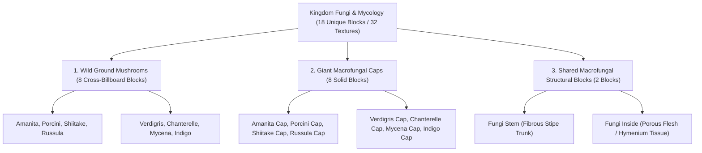

# Worldbuilding Architecture & Catalog: Mushrooms (Fungi)

All active textures for wild cross-billboard mushrooms, giant mushroom caps, and macrofungal stems (`fungi_`) are organized in the folder:
📂 **`docs/worldbuilding/blocks/mushrooms`** *(32 active PNG textures on disk)*

Generating **18 unique blocks** in the master catalog: 8 wild understory ground mushrooms (cross-billboards with procedural variations) + 8 giant macrofungal caps + 2 shared macrofungal structural blocks.

Shared surface overlays are located in:
📂 **`docs/worldbuilding/overlays`**

---

## 1. Mycological and Morphological Classification

In the world's mycological ecosystem, fungal species and macrostructures are classified into **3 morphological categories (18 Unique Blocks / 32 Textures)**:

---

## 2. Complete Texture Inventory in `worldbuilding/blocks/mushrooms/` (32 Active Textures)

All 32 textures strictly follow the unified prefix `fungi_`:

### A. Wild Understory Ground Mushrooms (22 Files)
* `fungi_amanita.png`, `fungi_amanita1.png`, `fungi_amanita2.png`, `fungi_amanita3.png`, `fungi_amanita4.png` *(5 procedural variations)*
* `fungi_porcini.png`, `fungi_porcini1.png`, `fungi_porcini2.png`, `fungi_porcini3.png`, `fungi_porcini4.png` *(5 procedural variations)*
* `fungi_shiitake.png`, `fungi_shiitake1.png` *(2 procedural variations)*
* `fungi_russula.png`, `fungi_russula1.png` *(2 procedural variations)*
* `fungi_verdigris.png`, `fungi_verdigris1.png` *(2 procedural variations)*
* `fungi_chanterelle.png`, `fungi_chanterelle1.png` *(2 procedural variations)*
* `fungi_mycena.png`, `fungi_mycena1.png` *(2 procedural variations)*
* `fungi_indigo.png`, `fungi_indigo1.png` *(2 procedural variations)*

### B. Giant Macrofungal Caps (`_cap`) (8 Files)
* `fungi_amanita_cap.png` *(Scarlet pileus dotted with white veil flecks)*
* `fungi_porcini_cap.png` *(Deep velvety earth-brown cap)*
* `fungi_shiitake_cap.png` *(Warm caramel-brown cap with natural fiber fissures)*
* `fungi_russula_cap.png` *(Deep velvety crimson cuticle)*
* `fungi_verdigris_cap.png` *(Petrol-teal surface flecked with golden-yellow scales)*
* `fungi_chanterelle_cap.png` *(Velvety apricot-ochre wavy cap)*
* `fungi_mycena_cap.png` *(Sage-green bioluminescent subterranean cap)*
* `fungi_indigo_cap.png` *(Deep indigo-slate cap with concentric denim rings)*

### C. Shared Macrofungal Structural Blocks (2 Files)
* `fungi_stem.png` *(Fibrous cream-ivory stipe column)*
* `fungi_inside.png` *(Porous hymenial interior flesh / underside gills)*

---

## 3. Complete Block Catalog (18 Unique Blocks)

### 3.1. Wild Understory Ground Mushrooms (8 Blocks)

| # | Block ID | Name | Category | Texture File(s) | Face Mapping |
| :-: | :--- | :--- | :--- | :--- | :--- |
| **01** | `fungi_amanita` | Amanita (Fly Agaric) | **Ground Mushroom** | `fungi_amanita.png` *(+ 4 variants: `fungi_amanita1.png` to `4`)* | Cross-billboard model (2 intersecting vertical planes) |
| **02** | `fungi_porcini` | Porcini (King Bolete) | **Ground Mushroom** | `fungi_porcini.png` *(+ 4 variants: `fungi_porcini1.png` to `4`)* | Cross-billboard model (2 intersecting vertical planes) |
| **03** | `fungi_shiitake` | Shiitake | **Ground Mushroom** | `fungi_shiitake.png`, `fungi_shiitake1.png` *(2 variants)* | Cross-billboard model (2 intersecting vertical planes) |
| **04** | `fungi_russula` | Russula (Sickener) | **Ground Mushroom** | `fungi_russula.png`, `fungi_russula1.png` *(2 variants)* | Cross-billboard model (2 intersecting vertical planes) |
| **05** | `fungi_verdigris` | Verdigris Agaric | **Ground Mushroom** | `fungi_verdigris.png`, `fungi_verdigris1.png` *(2 variants)* | Cross-billboard model (2 intersecting vertical planes) |
| **06** | `fungi_chanterelle` | Golden Chanterelle | **Ground Mushroom** | `fungi_chanterelle.png`, `fungi_chanterelle1.png` *(2 variants)* | Cross-billboard model (2 intersecting vertical planes) |
| **07** | `fungi_mycena` | Mycena (Bioluminescent) | **Ground Mushroom** | `fungi_mycena.png`, `fungi_mycena1.png` *(2 variants)* | Cross-billboard model (2 intersecting vertical planes) |
| **08** | `fungi_indigo` | Indigo Milk Cap | **Ground Mushroom** | `fungi_indigo.png`, `fungi_indigo1.png` *(2 variants)* | Cross-billboard model (2 intersecting vertical planes) |

---

### 3.2. Giant Macrofungal Caps (8 Blocks)

| # | Block ID | Name | Category | Texture File(s) | Face Mapping |
| :-: | :--- | :--- | :--- | :--- | :--- |
| **09** | `fungi_amanita_cap` | Amanita Cap | **Giant Mushroom Cap** | Top & Sides: `fungi_amanita_cap.png` Bottom: `fungi_inside.png` | Top & 4 sides cap + Bottom `fungi_inside.png` |
| **10** | `fungi_porcini_cap` | Porcini Cap | **Giant Mushroom Cap** | Top & Sides: `fungi_porcini_cap.png` Bottom: `fungi_inside.png` | Top & 4 sides cap + Bottom `fungi_inside.png` |
| **11** | `fungi_shiitake_cap` | Shiitake Cap | **Giant Mushroom Cap** | Top & Sides: `fungi_shiitake_cap.png` Bottom: `fungi_inside.png` | Top & 4 sides cap + Bottom `fungi_inside.png` |
| **12** | `fungi_russula_cap` | Russula Cap | **Giant Mushroom Cap** | Top & Sides: `fungi_russula_cap.png` Bottom: `fungi_inside.png` | Top & 4 sides cap + Bottom `fungi_inside.png` |
| **13** | `fungi_verdigris_cap` | Verdigris Cap | **Giant Mushroom Cap** | Top & Sides: `fungi_verdigris_cap.png` Bottom: `fungi_inside.png` | Top & 4 sides cap + Bottom `fungi_inside.png` |
| **14** | `fungi_chanterelle_cap` | Chanterelle Cap | **Giant Mushroom Cap** | Top & Sides: `fungi_chanterelle_cap.png` Bottom: `fungi_inside.png` | Top & 4 sides cap + Bottom `fungi_inside.png` |
| **15** | `fungi_mycena_cap` | Mycena Cap | **Giant Mushroom Cap** | Top & Sides: `fungi_mycena_cap.png` Bottom: `fungi_inside.png` | Top & 4 sides cap + Bottom `fungi_inside.png` |
| **16** | `fungi_indigo_cap` | Indigo Cap | **Giant Mushroom Cap** | Top & Sides: `fungi_indigo_cap.png` Bottom: `fungi_inside.png` | Top & 4 sides cap + Bottom `fungi_inside.png` |

---

### 3.3. Shared Macrofungal Structural Blocks (2 Blocks)

| # | Block ID | Name | Category | Texture File(s) | Face Mapping |
| :-: | :--- | :--- | :--- | :--- | :--- |
| **17** | `fungi_stem` | Fungi Stem | **Macrofungal Structure** | `fungi_stem.png` | 6 uniform faces |
| **18** | `fungi_inside` | Fungi Inside Flesh | **Macrofungal Structure** | `fungi_inside.png` | 6 uniform faces |
