# Worldbuilding Architecture & Catalog: Soils and Terrains

All active textures for soils and terrain surfaces (`soil_`) are organized in the folder:
📂 **`docs/worldbuilding/blocks/soils`** *(66 active PNG textures on disk)*

Generating **58 unique blocks** in the master catalog: 24 Biological soils + 12 climatic soils + 4 clays + 6 sands + 4 gravels + 2 volcanic ashes + 4 ground mosses + 4 snows & grass tops (the grass top is a grayscale image that can be colored with a shader).

Shared surface overlays are located in:
📂 **`docs/worldbuilding/overlays`**

---

## 1. Pedological and Edaphological Classification

In the planetary pedology system, soils and surface covers are classified into **4 major pedogenetic domains**:

```mermaid
graph TD
    A["Pedology: Soil Classification"] --> B["1. Biological / Zonal Temperate Soils"]
    A --> C["2. Extreme Zonal Climatic Soils"]
    A --> D["3. Granular Sediments & Mineral Matrices"]
    A --> E["4. Pyroclastic Deposits, Cryosphere & Biological Covers"]

    B --> B1["Loam: Balanced temperate soil (Clay + Silt + Sand)"]
    B --> B2["Silt: Fine alluvial sediment from floodplains and deltas"]
    B --> B3["Peat: Acidic histosol and saturated fossil organic matter"]

    C --> C1["Permafrost: Polar cryosphere with frozen matrix and solid ice wedges"]
    C --> C2["Caliche: Arid alkaline calcium-carbonate desert crust"]
    C --> C3["Laterite: Leached iron-rich tropical duricrust (Terra Roxa / Ferricrete)"]

    D --> D1["Clays (4 Colors): Plastic impermeable clays (Blue, Red, White, Yellow)"]
    D --> D2["Sands (6 Colors): Granular aeolian and marine sands (Common, Red, Dune, White, Pink, Black)"]
    D --> D3["Gravels (Matrix System): Fluvial, loamy, volcanic, and glacial gravels"]

    E --> E1["Volcanic Ashes: Tephra deposits (Dark basaltic, Light pumice)"]
    E --> E2["Snows & Cryosphere: Consolidated snow block and soft powder snow"]
    E --> E3["Ground Mosses (4 Biomes): Forest, Crimson (Tundra), Amber (Swamp), Cave (Bioluminescent)"]
```

---

## 2. Complete Texture Inventory in `worldbuilding/blocks/soils/` (66 Active Textures)

### A. Primary Biological Soils (10 variants each = 30 textures)
For each biological soil type (**Loam**, **Silt**, **Peat**):
* `dirt`: Pure foundational soil block (`soil_<type>_dirt.png`)
* `coarse`: Rugged soil packed with embedded pebbles (`soil_<type>_coarse.png`)
* `grass_side`: Lateral face with hanging grass vegetation sod (`soil_<type>_grass_side.png`)
* `mud`: Water-saturated, soft muddy soil (`soil_<type>_mud.png`)
* `mulch`: Top surface coated with organic leaf litter (`soil_<type>_mulch.png`)
* `mulch_side`: Lateral face displaying trailing mulch litter (`soil_<type>_mulch_side.png`)
* `rooted`: Soil densely webbed with exposed tree roots (`soil_<type>_rooted.png`)
* `snow_side`: Lateral face displaying a top snow crust (`soil_<type>_snow_side.png`)
* `tilled_top`: Top face plowed and hoed into agricultural furrows (`soil_<type>_tilled_top.png`)
* `tilled_side`: Lateral face showing agricultural furrow cutouts (`soil_<type>_tilled_side.png`)

### B. Climatic Soils (4 variants each = 12 textures)
* **Permafrost**: `soil_permafrost_dirt.png`, `soil_permafrost_coarse.png`, `soil_permafrost_grass_side.png`, `soil_permafrost_icy.png`
* **Caliche**: `soil_caliche_dirt.png`, `soil_caliche_coarse.png`, `soil_caliche_grass_side.png`, `soil_caliche_cracked.png`
* **Laterite**: `soil_laterite_dirt.png`, `soil_laterite_coarse.png`, `soil_laterite_grass_side.png`, `soil_laterite_hardpan.png`

### C. Clays (4 textures)
* `soil_clay_blue.png` *(Plastic alluvial blue-gray pottery clay)*
* `soil_clay_red.png` *(Deep terracotta clay rich in iron oxides)*
* `soil_clay_white.png` *(Pure kaolin porcelain clay)*
* `soil_clay_yellow.png` *(Ochre clay rich in limonite)*

### D. Sands (6 textures)
* `soil_sand_common.png` *(Standard quartzose beach/river sand)*
* `soil_sand_red.png` *(Desert hematite-coated sand)*
* `soil_sand_dune.png` *(Fine golden aeolian dune sand)*
* `soil_sand_white.png` *(Coral/gypsum pure white sand)*
* `soil_sand_pink.png` *(Foraminifera pink tropical sand)*
* `soil_sand_black.png` *(Heavy basaltic volcanic sand)*

### E. Matrix Gravels (4 textures)
* `soil_gravel_dirty.png` *(Loam organic soil matrix)*
* `soil_gravel_sandy.png` *(Fluvial sand matrix)*
* `soil_gravel_ashy.png` *(Dark volcanic ash matrix)*
* `soil_gravel_snowy.png` *(Frozen glacial ice/snow matrix)*

### F. Volcanic Ashes (2 textures)
* `soil_ash_vulcanic.png` *(Dark mafic/basaltic tephra ash)*
* `soil_ash_pumice.png` *(Light porous felsic pumice dust)*

### G. Ground Mosses (4 textures)
* `soil_moss_forest.png` *(Temperate forest green velvet moss)*
* `soil_moss_crimson.png` *(Boreal peatland crimson sphagnum moss)*
* `soil_moss_amber.png` *(Fen wetland golden amber moss)*
* `soil_moss_cave.png` *(Subterranean luminous goblin gold moss)*

### H. Snows & Grass Tops (4 textures)
* `soil_snow.png` *(Solid snow block & snow cap top)*
* `soil_snow_powder.png` *(Aerated fluffy powder snow)*
* `soil_grass.png` *(Grayscale top grass face for biome color tinting)*
* `soil_grass_colored.png` *(Pre-colored standalone grass top)*

---

## 3. Complete Block Catalog (58 Unique Blocks)

### 3.1. Biological Soils (24 Blocks)

| # | Block ID | Name | Category | Texture File(s) | Face Mapping |
| :-: | :--- | :--- | :--- | :--- | :--- |
| **01** | `loam_dirt` | Loam Dirt | **Biological** | `soil_loam_dirt.png` | 6 uniform faces |
| **02** | `loam_coarse` | Loam Coarse | **Biological** | `soil_loam_coarse.png` | 6 uniform faces |
| **03** | `loam_mud` | Loam Mud | **Biological** | `soil_loam_mud.png` | 6 uniform faces |
| **04** | `loam_rooted` | Loam Rooted | **Biological** | `soil_loam_rooted.png` | 6 uniform faces |
| **05** | `loam_grass` | Loam Grass | **Biological** | Top: `soil_grass.png` Bottom: `soil_loam_dirt.png` Sides: `soil_loam_grass_side.png` | Top (biome tint) + Bottom + 4 sides (overlay `overlays/soil_grass_side_overlay.png`) |
| **06** | `loam_snow` | Loam Snow | **Biological** | Top: `soil_snow.png` Bottom: `soil_loam_dirt.png` Sides: `soil_loam_snow_side.png` | Top + Bottom + 4 sides |
| **07** | `loam_mulch` | Loam Mulch | **Biological** | Top: `soil_loam_mulch.png` Bottom: `soil_loam_dirt.png` Sides: `soil_loam_mulch_side.png` | Top + Bottom + 4 sides |
| **08** | `loam_tilled` | Loam Tilled | **Biological** | Top: `soil_loam_tilled_top.png` Bottom: `soil_loam_dirt.png` Sides: `soil_loam_tilled_side.png` | Top + Bottom + 4 sides |
| **09** | `silt_dirt` | Silt Dirt | **Biological** | `soil_silt_dirt.png` | 6 uniform faces |
| **10** | `silt_coarse` | Silt Coarse | **Biological** | `soil_silt_coarse.png` | 6 uniform faces |
| **11** | `silt_mud` | Silt Mud | **Biological** | `soil_silt_mud.png` | 6 uniform faces |
| **12** | `silt_rooted` | Silt Rooted | **Biological** | `soil_silt_rooted.png` | 6 uniform faces |
| **13** | `silt_grass` | Silt Grass | **Biological** | Top: `soil_grass.png` Bottom: `soil_silt_dirt.png` Sides: `soil_silt_grass_side.png` | Top (biome tint) + Bottom + 4 sides (overlay `overlays/soil_grass_side_overlay.png`) |
| **14** | `silt_snow` | Silt Snow | **Biological** | Top: `soil_snow.png` Bottom: `soil_silt_dirt.png` Sides: `soil_silt_snow_side.png` | Top + Bottom + 4 sides |
| **15** | `silt_mulch` | Silt Mulch | **Biological** | Top: `soil_silt_mulch.png` Bottom: `soil_silt_dirt.png` Sides: `soil_silt_mulch_side.png` | Top + Bottom + 4 sides |
| **16** | `silt_tilled` | Silt Tilled | **Biological** | Top: `soil_silt_tilled_top.png` Bottom: `soil_silt_dirt.png` Sides: `soil_silt_tilled_side.png` | Top + Bottom + 4 sides |
| **17** | `peat_dirt` | Peat Dirt | **Biological** | `soil_peat_dirt.png` | 6 uniform faces |
| **18** | `peat_coarse` | Peat Coarse | **Biological** | `soil_peat_coarse.png` | 6 uniform faces |
| **19** | `peat_mud` | Peat Mud | **Biological** | `soil_peat_mud.png` | 6 uniform faces |
| **20** | `peat_rooted` | Peat Rooted | **Biological** | `soil_peat_rooted.png` | 6 uniform faces |
| **21** | `peat_grass` | Peat Grass | **Biological** | Top: `soil_grass.png` Bottom: `soil_peat_dirt.png` Sides: `soil_peat_grass_side.png` | Top (biome tint) + Bottom + 4 sides (overlay `overlays/soil_grass_side_overlay.png`) |
| **22** | `peat_snow` | Peat Snow | **Biological** | Top: `soil_snow.png` Bottom: `soil_peat_dirt.png` Sides: `soil_peat_snow_side.png` | Top + Bottom + 4 sides |
| **23** | `peat_mulch` | Peat Mulch | **Biological** | Top: `soil_peat_mulch.png` Bottom: `soil_peat_dirt.png` Sides: `soil_peat_mulch_side.png` | Top + Bottom + 4 sides |
| **24** | `peat_tilled` | Peat Tilled | **Biological** | Top: `soil_peat_tilled_top.png` Bottom: `soil_peat_dirt.png` Sides: `soil_peat_tilled_side.png` | Top + Bottom + 4 sides |

---

### 3.2. Climatic Soils (12 Blocks)

| # | Block ID | Name | Category | Texture File(s) | Face Mapping |
| :-: | :--- | :--- | :--- | :--- | :--- |
| **25** | `permafrost_dirt` | Permafrost Dirt | **Climatic** | `soil_permafrost_dirt.png` | 6 uniform faces |
| **26** | `permafrost_coarse` | Permafrost Coarse | **Climatic** | `soil_permafrost_coarse.png` | 6 uniform faces |
| **27** | `permafrost_grass` | Permafrost Grass | **Climatic** | Top: `soil_grass.png` Bottom: `soil_permafrost_dirt.png` Sides: `soil_permafrost_grass_side.png` | Top (biome tint) + Bottom + 4 sides (overlay `overlays/soil_grass_side_overlay.png`) |
| **28** | `permafrost_icy` | Permafrost Icy | **Climatic** | `soil_permafrost_icy.png` | 6 uniform faces |
| **29** | `caliche_dirt` | Caliche Dirt | **Climatic** | `soil_caliche_dirt.png` | 6 uniform faces |
| **30** | `caliche_coarse` | Caliche Coarse | **Climatic** | `soil_caliche_coarse.png` | 6 uniform faces |
| **31** | `caliche_cracked` | Caliche Cracked | **Climatic** | `soil_caliche_cracked.png` | 6 uniform faces |
| **32** | `caliche_grass` | Caliche Grass | **Climatic** | Top: `soil_grass.png` Bottom: `soil_caliche_dirt.png` Sides: `soil_caliche_grass_side.png` | Top (biome tint) + Bottom + 4 sides (overlay `overlays/soil_grass_side_overlay.png`) |
| **33** | `laterite_dirt` | Laterite Dirt | **Climatic** | `soil_laterite_dirt.png` | 6 uniform faces |
| **34** | `laterite_coarse` | Laterite Coarse | **Climatic** | `soil_laterite_coarse.png` | 6 uniform faces |
| **35** | `laterite_hardpan` | Laterite Hardpan | **Climatic** | `soil_laterite_hardpan.png` | 6 uniform faces |
| **36** | `laterite_grass` | Laterite Grass | **Climatic** | Top: `soil_grass.png` Bottom: `soil_laterite_dirt.png` Sides: `soil_laterite_grass_side.png` | Top (biome tint) + Bottom + 4 sides (overlay `overlays/soil_grass_side_overlay.png`) |

---

### 3.3. Ground Mosses (4 Blocks)

| # | Block ID | Name | Category | Texture File(s) | Face Mapping |
| :-: | :--- | :--- | :--- | :--- | :--- |
| **37** | `moss_forest` | Forest Moss | **Ground Moss** | `soil_moss_forest.png` | 6 uniform faces *(Overlay: `overlays/moss_forest_side_overlay.png`)* |
| **38** | `moss_crimson` | Crimson Moss | **Ground Moss** | `soil_moss_crimson.png` | 6 uniform faces *(Overlay: `overlays/moss_crimson_side_overlay.png`)* |
| **39** | `moss_amber` | Amber Moss | **Ground Moss** | `soil_moss_amber.png` | 6 uniform faces *(Overlay: `overlays/moss_amber_side_overlay.png`)* |
| **40** | `moss_cave` | Cave Moss | **Ground Moss** | `soil_moss_cave.png` | 6 uniform faces *(Overlay: `overlays/moss_cave_side_overlay.png`)* |

---

### 3.4. Clays (4 Blocks)

| # | Block ID | Name | Category | Texture File(s) | Face Mapping |
| :-: | :--- | :--- | :--- | :--- | :--- |
| **41** | `clay_blue` | Blue Clay | **Clay** | `soil_clay_blue.png` | 6 uniform faces |
| **42** | `clay_red` | Red Clay | **Clay** | `soil_clay_red.png` | 6 uniform faces |
| **43** | `clay_white` | White Clay | **Clay** | `soil_clay_white.png` | 6 uniform faces |
| **44** | `clay_yellow` | Yellow Clay | **Clay** | `soil_clay_yellow.png` | 6 uniform faces |

---

### 3.5. Sands (6 Blocks)

| # | Block ID | Name | Category | Texture File(s) | Face Mapping |
| :-: | :--- | :--- | :--- | :--- | :--- |
| **45** | `sand_common` | Common Sand | **Sand** | `soil_sand_common.png` | 6 uniform faces |
| **46** | `sand_red` | Red Sand | **Sand** | `soil_sand_red.png` | 6 uniform faces |
| **47** | `sand_dune` | Dune Sand | **Sand** | `soil_sand_dune.png` | 6 uniform faces |
| **48** | `sand_white` | White Sand | **Sand** | `soil_sand_white.png` | 6 uniform faces |
| **49** | `sand_pink` | Pink Sand | **Sand** | `soil_sand_pink.png` | 6 uniform faces |
| **50** | `sand_black` | Black Sand | **Sand** | `soil_sand_black.png` | 6 uniform faces |

---

### 3.6. Matrix Gravels (4 Blocks)

| # | Block ID | Name | Category | Texture File(s) | Face Mapping |
| :-: | :--- | :--- | :--- | :--- | :--- |
| **51** | `gravel_dirty` | Dirty Gravel | **Gravel** | `soil_gravel_dirty.png` | 6 uniform faces |
| **52** | `gravel_sandy` | Sandy Gravel | **Gravel** | `soil_gravel_sandy.png` | 6 uniform faces |
| **53** | `gravel_ashy` | Ashy Gravel | **Gravel** | `soil_gravel_ashy.png` | 6 uniform faces |
| **54** | `gravel_snowy` | Snowy Gravel | **Gravel** | `soil_gravel_snowy.png` | 6 uniform faces |

---

### 3.7. Volcanic Ashes (2 Blocks)

| # | Block ID | Name | Category | Texture File(s) | Face Mapping |
| :-: | :--- | :--- | :--- | :--- | :--- |
| **55** | `ash_volcanic` | Volcanic Ash | **Pyroclastic** | `soil_ash_vulcanic.png` | 6 uniform faces |
| **56** | `ash_pumice` | Pumice Ash | **Pyroclastic** | `soil_ash_pumice.png` | 6 uniform faces |

---

### 3.8. Snows (2 Blocks)

| # | Block ID | Name | Category | Texture File(s) | Face Mapping |
| :-: | :--- | :--- | :--- | :--- | :--- |
| **57** | `snow_block` | Snow Block | **Cryosphere** | `soil_snow.png` | 6 uniform faces |
| **58** | `powder_snow` | Powder Snow | **Cryosphere** | `soil_snow_powder.png` | 6 uniform faces |
