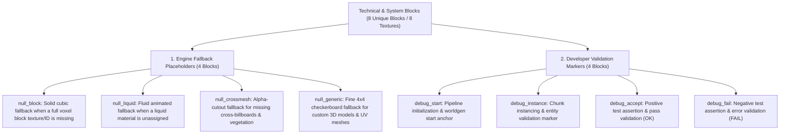

# Worldbuilding Architecture & Catalog: Technical & System Blocks (Systems)

All active textures for engine fallback placeholders (`null_`) and development pipeline markers (`debug_`) are organized in the folder:
📂 **`docs/worldbuilding/blocks/systems`** *(8 active PNG textures on disk)*

Generating **8 unique technical blocks** in the master catalog: 4 engine fallback placeholders (solid cube, fluid, cross-billboard cutout, and generic 3D model) + 4 developer validation markers.

Shared surface overlays are located in:
📂 **`docs/worldbuilding/overlays`**

---

## 1. Technical Classification & Engine Pipeline

The engine's internal technical and debugging infrastructure is organized into **2 Functional Domains (8 Unique Blocks / 8 Textures)**:

---

## 2. Complete Texture Inventory in `worldbuilding/blocks/systems/` (8 Active Textures)

All 8 textures are technical assets:

### A. Engine Fallback Placeholders (4 Files)
* `null_block.png` *(Full solid cubic block fallback with 8×8 px checkerboard, 16×16 px)*
* `null_liquid.png` *(Dynamic fluid scrolling fallback strip, 16×144 px)*
* `null_crossmesh.png` *(Alpha-cutout flora/prop silhouette fallback for cross-billboards, 16×16 px)*
* `null_generic.png` *(High-resolution 4×4 px checkerboard fallback for complex 3D meshes & UV models, 16×16 px)*

### B. Developer Validation Markers (4 Files)
* `debug_start.png` *(Pipeline initialization anchor marker, 16×16 px)*
* `debug_instance.png` *(Structure and chunk instance marker, 16×16 px)*
* `debug_accept.png` *(Visual feedback for successful assertion / OK, 16×16 px)*
* `debug_fail.png` *(Visual feedback for failed assertion / Error, 16×16 px)*

---

## 3. Complete Block Catalog (8 Unique Blocks)

### 3.1. Engine Fallback Placeholders (4 Blocks)

| # | Block ID | Name | Category | Texture File(s) | Face Mapping |
| :-: | :--- | :--- | :--- | :--- | :--- |
| **01** | `null_block` | Null Block | **Engine Fallback** | `null_block.png` | 6 uniform faces *(Rendered when full block texture or ID is missing)* |
| **02** | `null_liquid` | Null Liquid | **Engine Fallback** | `null_liquid.png` | Animated vertical scrolling strip *(Rendered when liquid texture is unassigned)* |
| **03** | `null_crossmesh` | Null Crossmesh | **Engine Fallback** | `null_crossmesh.png` | Cross-billboard model *(Rendered when cross-billboard or flora texture is missing)* |
| **04** | `null_generic` | Null Generic | **Engine Fallback** | `null_generic.png` | UV face mapping *(Rendered when custom 3D model, prop, or entity texture is missing)* |

---

### 3.2. Developer Validation Markers (4 Blocks)

| # | Block ID | Name | Category | Texture File(s) | Face Mapping |
| :-: | :--- | :--- | :--- | :--- | :--- |
| **05** | `debug_start` | Debug Start Marker | **Development** | `debug_start.png` | 6 uniform faces *(Pipeline initialization validation)* |
| **06** | `debug_instance` | Debug Instance Marker | **Development** | `debug_instance.png` | 6 uniform faces *(Chunk / structure instance validation)* |
| **07** | `debug_accept` | Debug Accept Marker | **Development** | `debug_accept.png` | 6 uniform faces *(Visual indicator of passing assertion / OK)* |
| **08** | `debug_fail` | Debug Fail Marker | **Development** | `debug_fail.png` | 6 uniform faces *(Visual indicator of failed assertion / Error)* |
