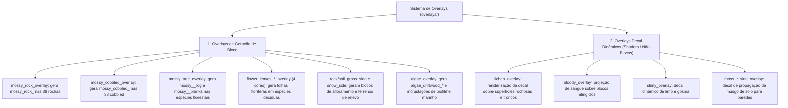

# Catálogo Mestre de Blocos da Voxel Engine (Blocks Design)

Este documento centraliza e cataloga **todos os blocos implementados na Voxel Engine**, organizados pelas pastas de worldbuilding em `docs/worldbuilding/`. 

> [!IMPORTANT]
> **Total Geral de Blocos do Projeto: 963 Blocos Catalogados**  
> Somando todas as 13 categorias mães do ecossistema de blocos da engine:  
> **186** (rocks) + **58** (soils) + **161** (trees) + **218** (ores) + **36** (organics) + **142** (decorations) + **32** (flowers) + **26** (vegetation) + **18** (fungi) + **18** (fluids) + **38** (oceans) + **24** (caverns) + **6** (debug) = **963 Blocos Totais**.

Para cada bloco, estão especificados:
1. **Identificador único (`ID do Bloco`)**.
2. **Nome e papel funcional**.
3. **Mapeamento de texturas por face** (`top`, `bottom` / `bot`, `sides`, `front`).
4. **Composição de camadas e aplicação de overlays**.

> [!NOTE]
> De acordo com as diretrizes do projeto:
> - **Variações estocásticas/aleatórias** de texturas (ex.: sufixos `1`, `2`, `3`) são gerenciadas proceduralmente pela engine e não são enumeradas como blocos separados.
> - **Overlays decal/cosméticos não-autônomos** (como `lichen`, `bloody`, `slimy` e `moss_*_side`) permanecem como camadas dinâmicas de renderização de shader e **não geram blocos únicos no catálogo** neste momento.
> - **Overlays composicionais integrados** (como `mossy_rock`, `mossy_cobbled`, `mossy_tree`, `algae_overlay`, coberturas de neve e flores) geram variantes registradas catalogadas abaixo.

---

## Sumário Geral & Censo de Blocos

| Categoria | Pasta / Domínio | Contagem de Blocos | Link de Navegação |
| :---: | :--- | :---: | :--- |
| **01** | Geologia & Rochas (`rocks`) | **186 blocos** | [Acessar Seção 01](#01-geologia--rochas-rocks--186-blocos) |
| **02** | Edafologia & Solos (`soils`) | **58 blocos** | [Acessar Seção 02](#02-edafologia--solos-soils--58-blocos) |
| **03** | Dendrologia & Madeiras (`trees`) | **161 blocos** | [Acessar Seção 03](#03-dendrologia--madeiras-trees--161-blocos) |
| **04** | Metalogenia & Minérios (`ores`) | **218 blocos** | [Acessar Seção 04](#04-metalogenia--minérios-ores--218-blocos) |
| **05** | Biomateriais & Organics (`organics`) | **36 blocos** | [Acessar Seção 05](#05-biomateriais--organics-organics--36-blocos) |
| **06** | Decorações, Iluminação & Arquitetura (`decorations`) | **142 blocos** | [Acessar Seção 06](#06-decorações-iluminação--arquitetura-decorations--142-blocos) |
| **07** | Botânica: Flores (`flowers`) | **32 blocos** | [Acessar Seção 07](#07-botânica-flores-flowers--32-blocos) |
| **08** | Botânica: Vegetação Rasteira (`vegetation`) | **26 blocos** | [Acessar Seção 08](#08-botânica-vegetação-rasteira-vegetation--26-blocos) |
| **09** | Micologia: Fungos (`fungi`) | **18 blocos** | [Acessar Seção 09](#09-micologia-fungos-fungi--18-blocos) |
| **10** | Hidrosfera & Criologia (`fluids`) | **18 blocos** | [Acessar Seção 10](#10-hidrosfera--criologia-fluids--18-blocos) |
| **11** | Ecossistemas Oceânicos (`oceans`) | **38 blocos** | [Acessar Seção 11](#11-ecossistemas-oceânicos-oceans--38-blocos) |
| **12** | Espeleologia & Cristais (`caverns`) | **24 blocos** | [Acessar Seção 12](#12-espeleologia--cristais-caverns--24-blocos) |
| **13** | Blocos Técnicos & Debug (`debug`) | **6 blocos** | [Acessar Seção 13](#13-blocos-técnicos--debug-debug--6-blocos) |
| **TOTAL** | **Todas as Categorias Somadas** | **963 blocos** | — |

01. [Geologia & Rochas (`rocks`) — 186 Blocos](#01-geologia--rochas-rocks--186-blocos)
02. [Edafologia & Solos (`soils`) — 58 Blocos](#02-edafologia--solos-soils--58-blocos)
03. [Dendrologia & Madeiras (`trees`) — 161 Blocos](#03-dendrologia--madeiras-trees--161-blocos)
04. [Metalogenia & Minérios (`ores`) — 218 Blocos](#04-metalogenia--minérios-ores--218-blocos)
05. [Biomateriais & Organics (`organics`) — 36 Blocos](#05-biomateriais--organics-organics--36-blocos)
06. [Decorações, Iluminação & Arquitetura (`decorations`) — 142 Blocos](#06-decorações-iluminação--arquitetura-decorations--142-blocos)
07. [Botânica: Flores (`flowers`) — 32 Blocos](#07-botânica-flores-flowers--32-blocos)
08. [Botânica: Vegetação Rasteira (`vegetation`) — 26 Blocos](#08-botânica-vegetação-rasteira-vegetation--26-blocos)
09. [Micologia: Fungos (`fungi`) — 18 Blocos](#09-micologia-fungos-fungi--18-blocos)
10. [Hidrosfera & Criologia (`fluids`) — 18 Blocos](#10-hidrosfera--criologia-fluids--18-blocos)
11. [Ecossistemas Oceânicos (`oceans`) — 38 Blocos](#11-ecossistemas-oceânicos-oceans--38-blocos)
12. [Espeleologia & Cristais (`caverns`) — 24 Blocos](#12-espeleologia--cristais-caverns--24-blocos)
13. [Blocos Técnicos & Debug (`debug`) — 6 Blocos](#13-blocos-técnicos--debug-debug--6-blocos)
14. [Roadmap Futuro: Agricultura & Alimentos (`crops` / `foods`)](#14-roadmap--planejamento-futuro-agricultura-cultivos--alimentos-crops--foods)

---: | :--- | :---: | :--- |
| **01** | Geologia & Rochas (`rocks`) | **186 blocos** | [Acessar Seção 01](#01-geologia--rochas-rocks--186-blocos) |
| **02** | Edafologia & Solos (`soils`) | **58 blocos** | [Acessar Seção 02](#02-edafologia--solos-soils--58-blocos) |
| **03** | Dendrologia & Madeiras (`trees`) | **161 blocos** | [Acessar Seção 03](#03-dendrologia--madeiras-trees--161-blocos) |
| **04** | Metalogenia & Minérios (`ores`) | **218 blocos** | [Acessar Seção 04](#04-metalogenia--minérios-ores--218-blocos) |
| **05** | Biomateriais & Organics (`organics`) | **36 blocos** | [Acessar Seção 05](#05-biomateriais--organics-organics--36-blocos) |
| **06** | Decorações, Iluminação & Arquitetura (`decorations`) | **142 blocos** | [Acessar Seção 06](#06-decorações-iluminação--arquitetura-decorations--142-blocos) |
| **07** | Botânica: Flores (`flowers`) | **32 blocos** | [Acessar Seção 07](#07-botânica-flores-flowers--32-blocos) |
| **08** | Botânica: Vegetação Rasteira (`vegetation`) | **26 blocos** | [Acessar Seção 08](#08-botânica-vegetação-rasteira-vegetation--26-blocos) |
| **09** | Micologia: Fungos (`fungi`) | **18 blocos** | [Acessar Seção 09](#09-micologia-fungos-fungi--18-blocos) |
| **10** | Hidrosfera & Criologia (`fluids`) | **18 blocos** | [Acessar Seção 10](#10-hidrosfera--criologia-fluids--18-blocos) |
| **11** | Ecossistemas Oceânicos (`oceans`) | **38 blocos** | [Acessar Seção 11](#11-ecossistemas-oceânicos-oceans--38-blocos) |
| **12** | Espeleologia & Cristais (`caverns`) | **24 blocos** | [Acessar Seção 12](#12-espeleologia--cristais-caverns--24-blocos) |
| **13** | Blocos Técnicos & Debug (`debug`) | **6 blocos** | [Acessar Seção 13](#13-blocos-técnicos--debug-debug--6-blocos) |
| **TOTAL** | **Todas as Categorias Somadas** | **963 blocos** | — |

01. [Geologia & Rochas (`rocks`) — 186 Blocos](#01-geologia--rochas-rocks--186-blocos)
02. [Edafologia & Solos (`soils`) — 58 Blocos](#02-edafologia--solos-soils--58-blocos)
03. [Dendrologia & Madeiras (`trees`) — 161 Blocos](#03-dendrologia--madeiras-trees--161-blocos)
04. [Metalogenia & Minérios (`ores`) — 218 Blocos](#04-metalogenia--minérios-ores--218-blocos)
05. [Biomateriais & Organics (`organics`) — 36 Blocos](#05-biomateriais--organics-organics--36-blocos)
06. [Decorações, Iluminação & Arquitetura (`decorations`) — 142 Blocos](#06-decorações-iluminação--arquitetura-decorations--142-blocos)
07. [Botânica: Flores (`flowers`) — 32 Blocos](#07-botânica-flores-flowers--32-blocos)
08. [Botânica: Vegetação Rasteira (`vegetation`) — 26 Blocos](#08-botânica-vegetação-rasteira-vegetation--26-blocos)
09. [Micologia: Fungos (`fungi`) — 18 Blocos](#09-micologia-fungos-fungi--18-blocos)
10. [Hidrosfera & Criologia (`fluids`) — 18 Blocos](#10-hidrosfera--criologia-fluids--18-blocos)
11. [Ecossistemas Oceânicos (`oceans`) — 38 Blocos](#11-ecossistemas-oceânicos-oceans--38-blocos)
12. [Espeleologia & Cristais (`caverns`) — 24 Blocos](#12-espeleologia--cristais-caverns--24-blocos)
13. [Blocos Técnicos & Debug (`debug`) — 6 Blocos](#13-blocos-técnicos--debug-debug--6-blocos)
14. [Roadmap Futuro: Agricultura & Alimentos (`crops` / `foods`)](#14-roadmap--planejamento-futuro-agricultura-cultivos--alimentos-crops--foods)

---: | :--- | :---: | :--- |
| **01** | Geologia & Rochas (`rocks`) | **186 blocos** | [Acessar Seção 01](#01-geologia--rochas-rocks--186-blocos) |
| **02** | Edafologia & Solos (`soils`) | **58 blocos** | [Acessar Seção 02](#02-edafologia--solos-soils--58-blocos) |
| **03** | Dendrologia & Madeiras (`trees`) | **161 blocos** | [Acessar Seção 03](#03-dendrologia--madeiras-trees--161-blocos) |
| **04** | Metalogenia & Minérios (`ores`) | **218 blocos** | [Acessar Seção 04](#04-metalogenia--minérios-ores--218-blocos) |
| **05** | Biomateriais & Organics (`organics`) | **34 blocos** | [Acessar Seção 05](#05-biomateriais--organics-organics--34-blocos) |
| **06** | Decorações & Arquitetura (`decorations`) | **134 blocos** | [Acessar Seção 06](#06-decorações--arquitetura-decorations--134-blocos) |
| **07** | Botânica: Flores (`flowers`) | **32 blocos** | [Acessar Seção 07](#07-botânica-flores-flowers--32-blocos) |
| **08** | Botânica: Vegetação Rasteira (`vegetation`) | **26 blocos** | [Acessar Seção 08](#08-botânica-vegetação-rasteira-vegetation--26-blocos) |
| **09** | Micologia: Fungos (`fungi`) | **18 blocos** | [Acessar Seção 09](#09-micologia-fungos-fungi--18-blocos) |
| **10** | Hidrosfera & Criologia (`fluids`) | **18 blocos** | [Acessar Seção 10](#10-hidrosfera--criologia-fluids--18-blocos) |
| **11** | Ecossistemas Oceânicos (`oceans`) | **38 blocos** | [Acessar Seção 11](#11-ecossistemas-oceânicos-oceans--38-blocos) |
| **12** | Espeleologia & Cristais (`caverns`) | **24 blocos** | [Acessar Seção 12](#12-espeleologia--cristais-caverns--24-blocos) |
| **13** | Iluminação & Emissores (`lights`) | **9 blocos** | [Acessar Seção 13](#13-iluminação--emissores-lights--9-blocos) |
| **14** | Blocos Técnicos & Debug (`debug`) | **6 blocos** | [Acessar Seção 14](#14-blocos-técnicos--debug-debug--6-blocos) |
| **TOTAL** | **Todas as Categorias Somadas** | **962 blocos** | — |

01. [Geologia & Rochas (`rocks`) — 186 Blocos](#01-geologia--rochas-rocks--186-blocos)
02. [Edafologia & Solos (`soils`) — 58 Blocos](#02-edafologia--solos-soils--58-blocos)
03. [Dendrologia & Madeiras (`trees`) — 161 Blocos](#03-dendrologia--madeiras-trees--161-blocos)
04. [Metalogenia & Minérios (`ores`) — 218 Blocos](#04-metalogenia--minérios-ores--218-blocos)
05. [Biomateriais & Organics (`organics`) — 34 Blocos](#05-biomateriais--organics-organics--34-blocos)
06. [Decorações & Arquitetura (`decorations`) — 134 Blocos](#06-decorações--arquitetura-decorations--134-blocos)
07. [Botânica: Flores (`flowers`) — 32 Blocos](#07-botânica-flores-flowers--32-blocos)
08. [Botânica: Vegetação Rasteira (`vegetation`) — 26 Blocos](#08-botânica-vegetação-rasteira-vegetation--26-blocos)
09. [Micologia: Fungos (`fungi`) — 18 Blocos](#09-micologia-fungos-fungi--18-blocos)
10. [Hidrosfera & Criologia (`fluids`) — 18 Blocos](#10-hidrosfera--criologia-fluids--18-blocos)
11. [Ecossistemas Oceânicos (`oceans`) — 38 Blocos](#11-ecossistemas-oceânicos-oceans--38-blocos)
12. [Espeleologia & Cristais (`caverns`) — 24 Blocos](#12-espeleologia--cristais-caverns--24-blocos)
13. [Iluminação & Emissores (`lights`) — 9 Blocos](#13-iluminação--emissores-lights--9-blocos)
14. [Blocos Técnicos & Debug (`debug`) — 6 Blocos](#14-blocos-técnicos--debug-debug--6-blocos)
15. [Roadmap Futuro: Agricultura & Alimentos (`crops` / `foods`)](#15-roadmap--planejamento-futuro-agricultura-cultivos--alimentos-crops--foods)

---

## 01. Geologia & Rochas (`rocks`) — 186 Blocos

O sistema geológico compreende **38 famílias de rochas mineráveis** (cada uma gerando 4 tipos de blocos = 152 blocos), **12 famílias de rochas de relevo montanhoso** (com 2 tipos de afloramento: grass e snow = 24 blocos), **2 blocos primordiais do manto** e **8 seixos de superfície (pebbles)** para sobrevivência e lascamento inicial, totalizando **186 blocos geológicos**:
- **16 Famílias Sedimentares × 4 Tipos = 64 Blocos** (IDs 01 a 64)
- **16 Famílias Ígneas & Vulcânicas × 4 Tipos = 64 Blocos** (IDs 65 a 128)
- **6 Famílias Metamórficas × 4 Tipos = 24 Blocos** (IDs 129 a 152)
- **12 Famílias de Afloramento de Superfície × 2 Tipos = 24 Blocos** (IDs 153 a 176)
- **2 Blocos do Manto Primordial (Bedrock)** (IDs 177 e 178)
- **8 Seixos de Superfície (Pebbles)** (IDs 179 a 186)

As 4 variantes de cada família de rocha minerável são compostas por:
- **Rock Normal**: Bloco da matriz rochosa sólida nativa (6 faces idênticas: `rocks/rock_<id>.png`).
- **Mossy Rock**: Matriz rochosa coberta por musgo superficial (base da rocha + overlay `overlays/mossy_rock_overlay.png`).
- **Cobbled Rock**: Pedra britada/esfarelada obtida por mineração (6 faces `rocks/cobbled_<id>.png`).
- **Mossy Cobbled**: Variante britada com musgo (base cobbled + overlay `overlays/mossy_cobbled_overlay.png`).

As **12 rochas de relevo montanhoso** possuem adicionalmente as variantes de afloramento:
- **Grass Outcrop**: Topo de solo com grama (`soils/soil_grass.png`), base inferior da rocha (`rocks/rock_<id>.png`) e laterais compostas pela base rochosa de transição (`rocks/rock_<id>_grass_side.png`) **composta por cima com o overlay lateral `overlays/soil_grass_side_overlay.png`**.
  - *Regra de Biome Tinting*: O shader de Biome Tint incide sobre o topo (`soil_grass.png`) e **exclusivamente sobre o trecho vegetal do overlay lateral** (`soil_grass_side_overlay.png`). A textura lateral rochosa base (`rock_<id>_grass_side.png`) **não recebe tint**, preservando a paleta mineral pura da rocha sem tingir a pedra de verde.
- **Snow Outcrop**: Topo de neve sólida (`soils/soil_snow.png`), base inferior da rocha (`rocks/rock_<id>.png`) e laterais diretas com manto de neve (`rocks/rock_<id>_snow_side.png`).
  - *Regra de Neve*: **Não utiliza overlay lateral de neve**, pois a neve possui coloração sólida branca estática e não recebe biome tinting.

O **Manto Primordial** (*Bedrock*) é composto por 2 blocos inquebráveis que não possuem variantes cobbled ou musgosas.

### 1.1. Rochas Sedimentares (16 Famílias x 4 Tipos = 64 Blocos Totais)

| # | ID do Bloco | Nome / Descrição | Top (`top`) | Bottom (`bottom`) | Lados (`sides`) | Composição / Overlays |
| :-: | :--- | :--- | :--- | :--- | :--- | :--- |
| **01** | `rock_argillite` | Argillite Sólido | `rocks/rock_argillite.png` | `rocks/rock_argillite.png` | `rocks/rock_argillite.png` | 6 faces uniformes |
| **02** | `mossy_rock_argillite` | Argillite Musgoso | `rocks/rock_argillite.png` | `rocks/rock_argillite.png` | `rocks/rock_argillite.png` | Base + `overlays/mossy_rock_overlay.png` |
| **03** | `cobbled_argillite` | Argillite Britado | `rocks/cobbled_argillite.png` | `rocks/cobbled_argillite.png` | `rocks/cobbled_argillite.png` | 6 faces uniformes |
| **04** | `mossy_cobbled_argillite`| Argillite Britado Musgoso | `rocks/cobbled_argillite.png` | `rocks/cobbled_argillite.png` | `rocks/cobbled_argillite.png` | Base + `overlays/mossy_cobbled_overlay.png` |
| **05** | `rock_chalk` | Chalk Sólido | `rocks/rock_chalk.png` | `rocks/rock_chalk.png` | `rocks/rock_chalk.png` | 6 faces uniformes |
| **06** | `mossy_rock_chalk` | Chalk Musgoso | `rocks/rock_chalk.png` | `rocks/rock_chalk.png` | `rocks/rock_chalk.png` | Base + `overlays/mossy_rock_overlay.png` |
| **07** | `cobbled_chalk` | Chalk Britado | `rocks/cobbled_chalk.png` | `rocks/cobbled_chalk.png` | `rocks/cobbled_chalk.png` | 6 faces uniformes |
| **08** | `mossy_cobbled_chalk` | Chalk Britado Musgoso | `rocks/cobbled_chalk.png` | `rocks/cobbled_chalk.png` | `rocks/cobbled_chalk.png` | Base + `overlays/mossy_cobbled_overlay.png` |
| **09** | `rock_dolomite` | Dolomite Sólido | `rocks/rock_dolomite.png` | `rocks/rock_dolomite.png` | `rocks/rock_dolomite.png` | 6 faces uniformes |
| **10** | `mossy_rock_dolomite` | Dolomite Musgoso | `rocks/rock_dolomite.png` | `rocks/rock_dolomite.png` | `rocks/rock_dolomite.png` | Base + `overlays/mossy_rock_overlay.png` |
| **11** | `cobbled_dolomite` | Dolomite Britado | `rocks/cobbled_dolomite.png` | `rocks/cobbled_dolomite.png` | `rocks/cobbled_dolomite.png` | 6 faces uniformes |
| **12** | `mossy_cobbled_dolomite`| Dolomite Britado Musgoso | `rocks/cobbled_dolomite.png` | `rocks/cobbled_dolomite.png` | `rocks/cobbled_dolomite.png` | Base + `overlays/mossy_cobbled_overlay.png` |
| **13** | `rock_karst` | Karst Sólido | `rocks/rock_karst.png` | `rocks/rock_karst.png` | `rocks/rock_karst.png` | 6 faces uniformes |
| **14** | `mossy_rock_karst` | Karst Musgoso | `rocks/rock_karst.png` | `rocks/rock_karst.png` | `rocks/rock_karst.png` | Base + `overlays/mossy_rock_overlay.png` |
| **15** | `cobbled_karst` | Karst Britado | `rocks/cobbled_karst.png` | `rocks/cobbled_karst.png` | `rocks/cobbled_karst.png` | 6 faces uniformes |
| **16** | `mossy_cobbled_karst` | Karst Britado Musgoso | `rocks/cobbled_karst.png` | `rocks/cobbled_karst.png` | `rocks/cobbled_karst.png` | Base + `overlays/mossy_cobbled_overlay.png` |
| **17** | `rock_calcite` | Calcite Sólido | `rocks/rock_calcite.png` | `rocks/rock_calcite.png` | `rocks/rock_calcite.png` | 6 faces uniformes |
| **18** | `mossy_rock_calcite` | Calcite Musgoso | `rocks/rock_calcite.png` | `rocks/rock_calcite.png` | `rocks/rock_calcite.png` | Base + `overlays/mossy_rock_overlay.png` |
| **19** | `cobbled_calcite` | Calcite Britado | `rocks/cobbled_calcite.png` | `rocks/cobbled_calcite.png` | `rocks/cobbled_calcite.png` | 6 faces uniformes |
| **20** | `mossy_cobbled_calcite`| Calcite Britado Musgoso | `rocks/cobbled_calcite.png` | `rocks/cobbled_calcite.png` | `rocks/cobbled_calcite.png` | Base + `overlays/mossy_cobbled_overlay.png` |
| **21** | `rock_chert` | Chert Sólido | `rocks/rock_chert.png` | `rocks/rock_chert.png` | `rocks/rock_chert.png` | 6 faces uniformes |
| **22** | `mossy_rock_chert` | Chert Musgoso | `rocks/rock_chert.png` | `rocks/rock_chert.png` | `rocks/rock_chert.png` | Base + `overlays/mossy_rock_overlay.png` |
| **23** | `cobbled_chert` | Chert Britado | `rocks/cobbled_chert.png` | `rocks/cobbled_chert.png` | `rocks/cobbled_chert.png` | 6 faces uniformes |
| **24** | `mossy_cobbled_chert` | Chert Britado Musgoso | `rocks/cobbled_chert.png` | `rocks/cobbled_chert.png` | `rocks/cobbled_chert.png` | Base + `overlays/mossy_cobbled_overlay.png` |
| **25** | `rock_travertine` | Travertine Sólido | `rocks/rock_travertine.png` | `rocks/rock_travertine.png` | `rocks/rock_travertine.png` | 6 faces uniformes |
| **26** | `mossy_rock_travertine` | Travertine Musgoso | `rocks/rock_travertine.png` | `rocks/rock_travertine.png` | `rocks/rock_travertine.png` | Base + `overlays/mossy_rock_overlay.png` |
| **27** | `cobbled_travertine` | Travertine Britado | `rocks/cobbled_travertine.png`| `rocks/cobbled_travertine.png`| `rocks/cobbled_travertine.png`| 6 faces uniformes |
| **28** | `mossy_cobbled_travertine`| Travertine Britado Musgoso| `rocks/cobbled_travertine.png`| `rocks/cobbled_travertine.png`| `rocks/cobbled_travertine.png`| Base + `overlays/mossy_cobbled_overlay.png` |
| **29** | `rock_limestone` | Limestone Sólido | `rocks/rock_limestone.png` | `rocks/rock_limestone.png` | `rocks/rock_limestone.png` | 6 faces uniformes |
| **30** | `mossy_rock_limestone` | Limestone Musgoso | `rocks/rock_limestone.png` | `rocks/rock_limestone.png` | `rocks/rock_limestone.png` | Base + `overlays/mossy_rock_overlay.png` |
| **31** | `cobbled_limestone` | Limestone Britado | `rocks/cobbled_limestone.png` | `rocks/cobbled_limestone.png` | `rocks/cobbled_limestone.png` | 6 faces uniformes |
| **32** | `mossy_cobbled_limestone`| Limestone Britado Musgoso| `rocks/cobbled_limestone.png`| `rocks/cobbled_limestone.png`| `rocks/cobbled_limestone.png`| Base + `overlays/mossy_cobbled_overlay.png` |
| **33** | `rock_flint` | Flint Sólido | `rocks/rock_flint.png` | `rocks/rock_flint.png` | `rocks/rock_flint.png` | 6 faces uniformes |
| **34** | `mossy_rock_flint` | Flint Musgoso | `rocks/rock_flint.png` | `rocks/rock_flint.png` | `rocks/rock_flint.png` | Base + `overlays/mossy_rock_overlay.png` |
| **35** | `cobbled_flint` | Flint Britado | `rocks/cobbled_flint.png` | `rocks/cobbled_flint.png` | `rocks/cobbled_flint.png` | 6 faces uniformes |
| **36** | `mossy_cobbled_flint` | Flint Britado Musgoso | `rocks/cobbled_flint.png` | `rocks/cobbled_flint.png` | `rocks/cobbled_flint.png` | Base + `overlays/mossy_cobbled_overlay.png` |
| **37** | `rock_alabaster` | Alabaster Sólido | `rocks/rock_alabaster.png` | `rocks/rock_alabaster.png` | `rocks/rock_alabaster.png` | 6 faces uniformes |
| **38** | `mossy_rock_alabaster` | Alabaster Musgoso | `rocks/rock_alabaster.png` | `rocks/rock_alabaster.png` | `rocks/rock_alabaster.png` | Base + `overlays/mossy_rock_overlay.png` |
| **39** | `cobbled_alabaster` | Alabaster Britado | `rocks/cobbled_alabaster.png`| `rocks/cobbled_alabaster.png`| `rocks/cobbled_alabaster.png`| 6 faces uniformes |
| **40** | `mossy_cobbled_alabaster`| Alabaster Britado Musgoso| `rocks/cobbled_alabaster.png`| `rocks/cobbled_alabaster.png`| `rocks/cobbled_alabaster.png`| Base + `overlays/mossy_cobbled_overlay.png` |
| **41** | `rock_sandstone_common` | Sandstone Comum Sólido | `rocks/rock_sandstone_common.png` | `rocks/rock_sandstone_common.png` | `rocks/rock_sandstone_common.png` | 6 faces uniformes |
| **42** | `mossy_rock_sandstone_common`| Sandstone Comum Musgoso | `rocks/rock_sandstone_common.png` | `rocks/rock_sandstone_common.png` | `rocks/rock_sandstone_common.png` | Base + `overlays/mossy_rock_overlay.png` |
| **43** | `cobbled_sandstone_common`| Sandstone Comum Britado | `rocks/cobbled_sandstone_common.png`| `rocks/cobbled_sandstone_common.png`| `rocks/cobbled_sandstone_common.png`| 6 faces uniformes |
| **44** | `mossy_cobbled_sandstone_common`| Sandstone Comum Britado Musgoso| `rocks/cobbled_sandstone_common.png`| `rocks/cobbled_sandstone_common.png`| `rocks/cobbled_sandstone_common.png`| Base + `overlays/mossy_cobbled_overlay.png` |
| **45** | `rock_sandstone_red` | Red Sandstone Sólido | `rocks/rock_sandstone_red.png`| `rocks/rock_sandstone_red.png`| `rocks/rock_sandstone_red.png`| 6 faces uniformes |
| **46** | `mossy_rock_sandstone_red`| Red Sandstone Musgoso | `rocks/rock_sandstone_red.png`| `rocks/rock_sandstone_red.png`| `rocks/rock_sandstone_red.png`| Base + `overlays/mossy_rock_overlay.png` |
| **47** | `cobbled_sandstone_red`| Red Sandstone Britado | `rocks/cobbled_sandstone_red.png`| `rocks/cobbled_sandstone_red.png`| `rocks/cobbled_sandstone_red.png`| 6 faces uniformes |
| **48** | `mossy_cobbled_sandstone_red`| Red Sandstone Musgoso Brit.| `rocks/cobbled_sandstone_red.png`| `rocks/cobbled_sandstone_red.png`| `rocks/cobbled_sandstone_red.png`| Base + `overlays/mossy_cobbled_overlay.png` |
| **49** | `rock_sandstone_dune` | Dune Sandstone Sólido | `rocks/rock_sandstone_dune.png`| `rocks/rock_sandstone_dune.png`| `rocks/rock_sandstone_dune.png`| 6 faces uniformes |
| **50** | `mossy_rock_sandstone_dune`| Dune Sandstone Musgoso | `rocks/rock_sandstone_dune.png`| `rocks/rock_sandstone_dune.png`| `rocks/rock_sandstone_dune.png`| Base + `overlays/mossy_rock_overlay.png` |
| **51** | `cobbled_sandstone_dune`| Dune Sandstone Britado | `rocks/cobbled_sandstone_dune.png`| `rocks/cobbled_sandstone_dune.png`| `rocks/cobbled_sandstone_dune.png`| 6 faces uniformes |
| **52** | `mossy_cobbled_sandstone_dune`| Dune Sandstone Musg. Brit.| `rocks/cobbled_sandstone_dune.png`| `rocks/cobbled_sandstone_dune.png`| `rocks/cobbled_sandstone_dune.png`| Base + `overlays/mossy_cobbled_overlay.png` |
| **53** | `rock_sandstone_white`| White Sandstone Sólido | `rocks/rock_sandstone_white.png`| `rocks/rock_sandstone_white.png`| `rocks/rock_sandstone_white.png`| 6 faces uniformes |
| **54** | `mossy_rock_sandstone_white`| White Sandstone Musgoso | `rocks/rock_sandstone_white.png`| `rocks/rock_sandstone_white.png`| `rocks/rock_sandstone_white.png`| Base + `overlays/mossy_rock_overlay.png` |
| **55** | `cobbled_sandstone_white`| White Sandstone Britado | `rocks/cobbled_sandstone_white.png`| `rocks/cobbled_sandstone_white.png`| `rocks/cobbled_sandstone_white.png`| 6 faces uniformes |
| **56** | `mossy_cobbled_sandstone_white`| White Sandstone Musg. Brit.| `rocks/cobbled_sandstone_white.png`| `rocks/cobbled_sandstone_white.png`| `rocks/cobbled_sandstone_white.png`| Base + `overlays/mossy_cobbled_overlay.png` |
| **57** | `rock_sandstone_pink` | Pink Sandstone Sólido | `rocks/rock_sandstone_pink.png`| `rocks/rock_sandstone_pink.png`| `rocks/rock_sandstone_pink.png`| 6 faces uniformes |
| **58** | `mossy_rock_sandstone_pink`| Pink Sandstone Musgoso | `rocks/rock_sandstone_pink.png`| `rocks/rock_sandstone_pink.png`| `rocks/rock_sandstone_pink.png`| Base + `overlays/mossy_rock_overlay.png` |
| **59** | `cobbled_sandstone_pink`| Pink Sandstone Britado | `rocks/cobbled_sandstone_pink.png`| `rocks/cobbled_sandstone_pink.png`| `rocks/cobbled_sandstone_pink.png`| 6 faces uniformes |
| **60** | `mossy_cobbled_sandstone_pink`| Pink Sandstone Musg. Brit.| `rocks/cobbled_sandstone_pink.png`| `rocks/cobbled_sandstone_pink.png`| `rocks/cobbled_sandstone_pink.png`| Base + `overlays/mossy_cobbled_overlay.png` |
| **61** | `rock_sandstone_black`| Black Sandstone Sólido | `rocks/rock_sandstone_black.png`| `rocks/rock_sandstone_black.png`| `rocks/rock_sandstone_black.png`| 6 faces uniformes |
| **62** | `mossy_rock_sandstone_black`| Black Sandstone Musgoso | `rocks/rock_sandstone_black.png`| `rocks/rock_sandstone_black.png`| `rocks/rock_sandstone_black.png`| Base + `overlays/mossy_rock_overlay.png` |
| **63** | `cobbled_sandstone_black`| Black Sandstone Britado | `rocks/cobbled_sandstone_black.png`| `rocks/cobbled_sandstone_black.png`| `rocks/cobbled_sandstone_black.png`| 6 faces uniformes |
| **64** | `mossy_cobbled_sandstone_black`| Black Sandstone Musg. Brit.| `rocks/cobbled_sandstone_black.png`| `rocks/cobbled_sandstone_black.png`| `rocks/cobbled_sandstone_black.png`| Base + `overlays/mossy_cobbled_overlay.png` |
---

### 1.2. Rochas Ígneas & Vulcânicas (16 Famílias x 4 Tipos = 64 Blocos Totais)

| # | ID do Bloco | Nome / Descrição | Top (`top`) | Bottom (`bottom`) | Lados (`sides`) | Composição / Overlays |
| :-: | :--- | :--- | :--- | :--- | :--- | :--- |
| **65** | `rock_basalt` | Basalt Sólido | `rocks/rock_basalt.png` | `rocks/rock_basalt.png` | `rocks/rock_basalt.png` | 6 faces uniformes |
| **66** | `mossy_rock_basalt` | Basalt Musgoso | `rocks/rock_basalt.png` | `rocks/rock_basalt.png` | `rocks/rock_basalt.png` | Base + `overlays/mossy_rock_overlay.png` |
| **67** | `cobbled_basalt` | Basalt Britado | `rocks/cobbled_basalt.png` | `rocks/cobbled_basalt.png` | `rocks/cobbled_basalt.png` | 6 faces uniformes |
| **68** | `mossy_cobbled_basalt` | Basalt Britado Musgoso | `rocks/cobbled_basalt.png` | `rocks/cobbled_basalt.png` | `rocks/cobbled_basalt.png` | Base + `overlays/mossy_cobbled_overlay.png` |
| **69** | `rock_gabbro` | Gabbro Sólido | `rocks/rock_gabbro.png` | `rocks/rock_gabbro.png` | `rocks/rock_gabbro.png` | 6 faces uniformes |
| **70** | `mossy_rock_gabbro` | Gabbro Musgoso | `rocks/rock_gabbro.png` | `rocks/rock_gabbro.png` | `rocks/rock_gabbro.png` | Base + `overlays/mossy_rock_overlay.png` |
| **71** | `cobbled_gabbro` | Gabbro Britado | `rocks/cobbled_gabbro.png` | `rocks/cobbled_gabbro.png` | `rocks/cobbled_gabbro.png` | 6 faces uniformes |
| **72** | `mossy_cobbled_gabbro` | Gabbro Britado Musgoso | `rocks/cobbled_gabbro.png` | `rocks/cobbled_gabbro.png` | `rocks/cobbled_gabbro.png` | Base + `overlays/mossy_cobbled_overlay.png` |
| **73** | `rock_peridotite` | Peridotite Sólido | `rocks/rock_peridotite.png` | `rocks/rock_peridotite.png` | `rocks/rock_peridotite.png` | 6 faces uniformes |
| **74** | `mossy_rock_peridotite`| Peridotite Musgoso | `rocks/rock_peridotite.png` | `rocks/rock_peridotite.png` | `rocks/rock_peridotite.png` | Base + `overlays/mossy_rock_overlay.png` |
| **75** | `cobbled_peridotite` | Peridotite Britado | `rocks/cobbled_peridotite.png`| `rocks/cobbled_peridotite.png`| `rocks/cobbled_peridotite.png`| 6 faces uniformes |
| **76** | `mossy_cobbled_peridotite`| Peridotite Britado Musgoso| `rocks/cobbled_peridotite.png`| `rocks/cobbled_peridotite.png`| `rocks/cobbled_peridotite.png`| Base + `overlays/mossy_cobbled_overlay.png` |
| **77** | `rock_cryolite` | Cryolite Sólido | `rocks/rock_cryolite.png` | `rocks/rock_cryolite.png` | `rocks/rock_cryolite.png` | 6 faces uniformes |
| **78** | `mossy_rock_cryolite` | Cryolite Musgoso | `rocks/rock_cryolite.png` | `rocks/rock_cryolite.png` | `rocks/rock_cryolite.png` | Base + `overlays/mossy_rock_overlay.png` |
| **79** | `cobbled_cryolite` | Cryolite Britado | `rocks/cobbled_cryolite.png` | `rocks/cobbled_cryolite.png` | `rocks/cobbled_cryolite.png` | 6 faces uniformes |
| **80** | `mossy_cobbled_cryolite`| Cryolite Britado Musgoso | `rocks/cobbled_cryolite.png` | `rocks/cobbled_cryolite.png` | `rocks/cobbled_cryolite.png` | Base + `overlays/mossy_cobbled_overlay.png` |
| **81** | `rock_granite` | Granite Sólido | `rocks/rock_granite.png` | `rocks/rock_granite.png` | `rocks/rock_granite.png` | 6 faces uniformes |
| **82** | `mossy_rock_granite` | Granite Musgoso | `rocks/rock_granite.png` | `rocks/rock_granite.png` | `rocks/rock_granite.png` | Base + `overlays/mossy_rock_overlay.png` |
| **83** | `cobbled_granite` | Granite Britado | `rocks/cobbled_granite.png` | `rocks/cobbled_granite.png` | `rocks/cobbled_granite.png` | 6 faces uniformes |
| **84** | `mossy_cobbled_granite`| Granite Britado Musgoso | `rocks/cobbled_granite.png` | `rocks/cobbled_granite.png` | `rocks/cobbled_granite.png` | Base + `overlays/mossy_cobbled_overlay.png` |
| **85** | `rock_diorite` | Diorite Sólido | `rocks/rock_diorite.png` | `rocks/rock_diorite.png` | `rocks/rock_diorite.png` | 6 faces uniformes |
| **86** | `mossy_rock_diorite` | Diorite Musgoso | `rocks/rock_diorite.png` | `rocks/rock_diorite.png` | `rocks/rock_diorite.png` | Base + `overlays/mossy_rock_overlay.png` |
| **87** | `cobbled_diorite` | Diorite Britado | `rocks/cobbled_diorite.png` | `rocks/cobbled_diorite.png` | `rocks/cobbled_diorite.png` | 6 faces uniformes |
| **88** | `mossy_cobbled_diorite`| Diorite Britado Musgoso | `rocks/cobbled_diorite.png` | `rocks/cobbled_diorite.png` | `rocks/cobbled_diorite.png` | Base + `overlays/mossy_cobbled_overlay.png` |
| **89** | `rock_andesite` | Andesite Sólido | `rocks/rock_andesite.png` | `rocks/rock_andesite.png` | `rocks/rock_andesite.png` | 6 faces uniformes |
| **90** | `mossy_rock_andesite` | Andesite Musgoso | `rocks/rock_andesite.png` | `rocks/rock_andesite.png` | `rocks/rock_andesite.png` | Base + `overlays/mossy_rock_overlay.png` |
| **91** | `cobbled_andesite` | Andesite Britado | `rocks/cobbled_andesite.png` | `rocks/cobbled_andesite.png` | `rocks/cobbled_andesite.png` | 6 faces uniformes |
| **92** | `mossy_cobbled_andesite`| Andesite Britado Musgoso| `rocks/cobbled_andesite.png` | `rocks/cobbled_andesite.png` | `rocks/cobbled_andesite.png` | Base + `overlays/mossy_cobbled_overlay.png` |
| **93** | `rock_tuff` | Tuff Sólido | `rocks/rock_tuff.png` | `rocks/rock_tuff.png` | `rocks/rock_tuff.png` | 6 faces uniformes |
| **94** | `mossy_rock_tuff` | Tuff Musgoso | `rocks/rock_tuff.png` | `rocks/rock_tuff.png` | `rocks/rock_tuff.png` | Base + `overlays/mossy_rock_overlay.png` |
| **95** | `cobbled_tuff` | Tuff Britado | `rocks/cobbled_tuff.png` | `rocks/cobbled_tuff.png` | `rocks/cobbled_tuff.png` | 6 faces uniformes |
| **96** | `mossy_cobbled_tuff` | Tuff Britado Musgoso | `rocks/cobbled_tuff.png` | `rocks/cobbled_tuff.png` | `rocks/cobbled_tuff.png` | Base + `overlays/mossy_cobbled_overlay.png` |
| **97** | `rock_pumice` | Pumice Sólido | `rocks/rock_pumice.png` | `rocks/rock_pumice.png` | `rocks/rock_pumice.png` | 6 faces uniformes |
| **98** | `mossy_rock_pumice` | Pumice Musgoso | `rocks/rock_pumice.png` | `rocks/rock_pumice.png` | `rocks/rock_pumice.png` | Base + `overlays/mossy_rock_overlay.png` |
| **99** | `cobbled_pumice` | Pumice Britado | `rocks/cobbled_pumice.png` | `rocks/cobbled_pumice.png` | `rocks/cobbled_pumice.png` | 6 faces uniformes |
| **100**| `mossy_cobbled_pumice` | Pumice Britado Musgoso | `rocks/cobbled_pumice.png` | `rocks/cobbled_pumice.png` | `rocks/cobbled_pumice.png` | Base + `overlays/mossy_cobbled_overlay.png` |
| **101**| `rock_scoria` | Scoria Sólido | `rocks/rock_scoria.png` | `rocks/rock_scoria.png` | `rocks/rock_scoria.png` | 6 faces uniformes |
| **102**| `mossy_rock_scoria` | Scoria Musgoso | `rocks/rock_scoria.png` | `rocks/rock_scoria.png` | `rocks/rock_scoria.png` | Base + `overlays/mossy_rock_overlay.png` |
| **103**| `cobbled_scoria` | Scoria Britado | `rocks/cobbled_scoria.png` | `rocks/cobbled_scoria.png` | `rocks/cobbled_scoria.png` | 6 faces uniformes |
| **104**| `mossy_cobbled_scoria` | Scoria Britado Musgoso | `rocks/cobbled_scoria.png` | `rocks/cobbled_scoria.png` | `rocks/cobbled_scoria.png` | Base + `overlays/mossy_cobbled_overlay.png` |
| **105**| `rock_obsidian` | Obsidian Sólido | `rocks/rock_obsidian.png` | `rocks/rock_obsidian.png` | `rocks/rock_obsidian.png` | 6 faces uniformes |
| **106**| `mossy_rock_obsidian` | Obsidian Musgoso | `rocks/rock_obsidian.png` | `rocks/rock_obsidian.png` | `rocks/rock_obsidian.png` | Base + `overlays/mossy_rock_overlay.png` |
| **107**| `cobbled_obsidian` | Obsidian Britado | `rocks/cobbled_obsidian.png` | `rocks/cobbled_obsidian.png` | `rocks/cobbled_obsidian.png` | 6 faces uniformes |
| **108**| `mossy_cobbled_obsidian`| Obsidian Britado Musgoso| `rocks/cobbled_obsidian.png`| `rocks/cobbled_obsidian.png`| `rocks/cobbled_obsidian.png`| Base + `overlays/mossy_cobbled_overlay.png` |
| **109**| `rock_pitchstone` | Pitchstone Sólido | `rocks/rock_pitchstone.png` | `rocks/rock_pitchstone.png` | `rocks/rock_pitchstone.png` | 6 faces uniformes |
| **110**| `mossy_rock_pitchstone`| Pitchstone Musgoso | `rocks/rock_pitchstone.png` | `rocks/rock_pitchstone.png` | `rocks/rock_pitchstone.png` | Base + `overlays/mossy_rock_overlay.png` |
| **111**| `cobbled_pitchstone` | Pitchstone Britado | `rocks/cobbled_pitchstone.png`| `rocks/cobbled_pitchstone.png`| `rocks/cobbled_pitchstone.png`| 6 faces uniformes |
| **112**| `mossy_cobbled_pitchstone`| Pitchstone Britado Musgoso| `rocks/cobbled_pitchstone.png`| `rocks/cobbled_pitchstone.png`| `rocks/cobbled_pitchstone.png`| Base + `overlays/mossy_cobbled_overlay.png` |
| **113**| `rock_porphyry` | Porphyry Sólido | `rocks/rock_porphyry.png` | `rocks/rock_porphyry.png` | `rocks/rock_porphyry.png` | 6 faces uniformes |
| **114**| `mossy_rock_porphyry` | Porphyry Musgoso | `rocks/rock_porphyry.png` | `rocks/rock_porphyry.png` | `rocks/rock_porphyry.png` | Base + `overlays/mossy_rock_overlay.png` |
| **115**| `cobbled_porphyry` | Porphyry Britado | `rocks/cobbled_porphyry.png` | `rocks/cobbled_porphyry.png` | `rocks/cobbled_porphyry.png` | 6 faces uniformes |
| **116**| `mossy_cobbled_porphyry`| Porphyry Britado Musgoso| `rocks/cobbled_porphyry.png` | `rocks/cobbled_porphyry.png` | `rocks/cobbled_porphyry.png` | Base + `overlays/mossy_cobbled_overlay.png` |
| **117**| `rock_brimstone` | Brimstone Sólido | `rocks/rock_brimstone.png` | `rocks/rock_brimstone.png` | `rocks/rock_brimstone.png` | 6 faces uniformes |
| **118**| `mossy_rock_brimstone` | Brimstone Musgoso | `rocks/rock_brimstone.png` | `rocks/rock_brimstone.png` | `rocks/rock_brimstone.png` | Base + `overlays/mossy_rock_overlay.png` |
| **119**| `cobbled_brimstone` | Brimstone Britado | `rocks/cobbled_brimstone.png`| `rocks/cobbled_brimstone.png`| `rocks/cobbled_brimstone.png`| 6 faces uniformes |
| **120**| `mossy_cobbled_brimstone`| Brimstone Britado Musgoso| `rocks/cobbled_brimstone.png`| `rocks/cobbled_brimstone.png`| `rocks/cobbled_brimstone.png`| Base + `overlays/mossy_cobbled_overlay.png` |
| **121**| `rock_jasper` | Jasper Sólido | `rocks/rock_jasper.png` | `rocks/rock_jasper.png` | `rocks/rock_jasper.png` | 6 faces uniformes |
| **122**| `mossy_rock_jasper` | Jasper Musgoso | `rocks/rock_jasper.png` | `rocks/rock_jasper.png` | `rocks/rock_jasper.png` | Base + `overlays/mossy_rock_overlay.png` |
| **123**| `cobbled_jasper` | Jasper Britado | `rocks/cobbled_jasper.png` | `rocks/cobbled_jasper.png` | `rocks/cobbled_jasper.png` | 6 faces uniformes |
| **124**| `mossy_cobbled_jasper` | Jasper Britado Musgoso | `rocks/cobbled_jasper.png` | `rocks/cobbled_jasper.png` | `rocks/cobbled_jasper.png` | Base + `overlays/mossy_cobbled_overlay.png` |
| **125**| `rock_magma` | Magma Sólido Incandescente | `rocks/rock_magma.png` | `rocks/rock_magma.png` | `rocks/rock_magma.png` | 6 faces uniformes (Emissivo) |
| **126**| `mossy_rock_magma` | Magma com Crosta Musgosa | `rocks/rock_magma.png` | `rocks/rock_magma.png` | `rocks/rock_magma.png` | Base + `overlays/mossy_rock_overlay.png` |
| **127**| `cobbled_magma` | Magma Britado | `rocks/cobbled_magma.png` | `rocks/cobbled_magma.png` | `rocks/cobbled_magma.png` | 6 faces uniformes |
| **128**| `mossy_cobbled_magma` | Magma Britado Musgoso | `rocks/cobbled_magma.png` | `rocks/cobbled_magma.png` | `rocks/cobbled_magma.png` | Base + `overlays/mossy_cobbled_overlay.png` |

---

### 1.3. Rochas Metamórficas (6 Famílias x 4 Tipos = 24 Blocos Totais)

| # | ID do Bloco | Nome / Descrição | Top (`top`) | Bottom (`bottom`) | Lados (`sides`) | Composição / Overlays |
| :-: | :--- | :--- | :--- | :--- | :--- | :--- |
| **129**| `rock_slate` | Slate Sólido | `rocks/rock_slate.png` | `rocks/rock_slate.png` | `rocks/rock_slate.png` | 6 faces uniformes |
| **130**| `mossy_rock_slate` | Slate Musgoso | `rocks/rock_slate.png` | `rocks/rock_slate.png` | `rocks/rock_slate.png` | Base + `overlays/mossy_rock_overlay.png` |
| **131**| `cobbled_slate` | Slate Britado | `rocks/cobbled_slate.png` | `rocks/cobbled_slate.png` | `rocks/cobbled_slate.png` | 6 faces uniformes |
| **132**| `mossy_cobbled_slate` | Slate Britado Musgoso | `rocks/cobbled_slate.png` | `rocks/cobbled_slate.png` | `rocks/cobbled_slate.png` | Base + `overlays/mossy_cobbled_overlay.png` |
| **133**| `rock_gneiss` | Gneiss Sólido | `rocks/rock_gneiss.png` | `rocks/rock_gneiss.png` | `rocks/rock_gneiss.png` | 6 faces uniformes |
| **134**| `mossy_rock_gneiss` | Gneiss Musgoso | `rocks/rock_gneiss.png` | `rocks/rock_gneiss.png` | `rocks/rock_gneiss.png` | Base + `overlays/mossy_rock_overlay.png` |
| **135**| `cobbled_gneiss` | Gneiss Britado | `rocks/cobbled_gneiss.png` | `rocks/cobbled_gneiss.png` | `rocks/cobbled_gneiss.png` | 6 faces uniformes |
| **136**| `mossy_cobbled_gneiss` | Gneiss Britado Musgoso | `rocks/cobbled_gneiss.png` | `rocks/cobbled_gneiss.png` | `rocks/cobbled_gneiss.png` | Base + `overlays/mossy_cobbled_overlay.png` |
| **137**| `rock_marble` | Marble Sólido | `rocks/rock_marble.png` | `rocks/rock_marble.png` | `rocks/rock_marble.png` | 6 faces uniformes |
| **138**| `mossy_rock_marble` | Marble Musgoso | `rocks/rock_marble.png` | `rocks/rock_marble.png` | `rocks/rock_marble.png` | Base + `overlays/mossy_rock_overlay.png` |
| **139**| `cobbled_marble` | Marble Britado | `rocks/cobbled_marble.png` | `rocks/cobbled_marble.png` | `rocks/cobbled_marble.png` | 6 faces uniformes |
| **140**| `mossy_cobbled_marble` | Marble Britado Musgoso | `rocks/cobbled_marble.png` | `rocks/cobbled_marble.png` | `rocks/cobbled_marble.png` | Base + `overlays/mossy_cobbled_overlay.png` |
| **141**| `rock_serpentinite` | Serpentinite Sólido | `rocks/rock_serpentinite.png`| `rocks/rock_serpentinite.png`| `rocks/rock_serpentinite.png`| 6 faces uniformes |
| **142**| `mossy_rock_serpentinite`| Serpentinite Musgoso | `rocks/rock_serpentinite.png`| `rocks/rock_serpentinite.png`| `rocks/rock_serpentinite.png`| Base + `overlays/mossy_rock_overlay.png` |
| **143**| `cobbled_serpentinite` | Serpentinite Britado | `rocks/cobbled_serpentinite.png`| `rocks/cobbled_serpentinite.png`| `rocks/cobbled_serpentinite.png`| 6 faces uniformes |
| **144**| `mossy_cobbled_serpentinite`| Serpentinite Britado Musg.| `rocks/cobbled_serpentinite.png`| `rocks/cobbled_serpentinite.png`| `rocks/cobbled_serpentinite.png`| Base + `overlays/mossy_cobbled_overlay.png` |
| **145**| `rock_azurite` | Azurite Sólido | `rocks/rock_azurite.png` | `rocks/rock_azurite.png` | `rocks/rock_azurite.png` | 6 faces uniformes |
| **146**| `mossy_rock_azurite` | Azurite Musgoso | `rocks/rock_azurite.png` | `rocks/rock_azurite.png` | `rocks/rock_azurite.png` | Base + `overlays/mossy_rock_overlay.png` |
| **147**| `cobbled_azurite` | Azurite Britado | `rocks/cobbled_azurite.png` | `rocks/cobbled_azurite.png` | `rocks/cobbled_azurite.png` | 6 faces uniformes |
| **148**| `mossy_cobbled_azurite`| Azurite Britado Musgoso | `rocks/cobbled_azurite.png` | `rocks/cobbled_azurite.png` | `rocks/cobbled_azurite.png` | Base + `overlays/mossy_cobbled_overlay.png` |
| **149**| `rock_quartzite` | Quartzite Sólido | `rocks/rock_quartzite.png` | `rocks/rock_quartzite.png` | `rocks/rock_quartzite.png` | 6 faces uniformes |
| **150**| `mossy_rock_quartzite` | Quartzite Musgoso | `rocks/rock_quartzite.png` | `rocks/rock_quartzite.png` | `rocks/rock_quartzite.png` | Base + `overlays/mossy_rock_overlay.png` |
| **151**| `cobbled_quartzite` | Quartzite Britado | `rocks/cobbled_quartzite.png`| `rocks/cobbled_quartzite.png`| `rocks/cobbled_quartzite.png`| 6 faces uniformes |
| **152**| `mossy_cobbled_quartzite`| Quartzite Britado Musgoso| `rocks/cobbled_quartzite.png`| `rocks/cobbled_quartzite.png`| `rocks/cobbled_quartzite.png`| Base + `overlays/mossy_cobbled_overlay.png` |

---

### 1.4. Afloramentos de Superfície (12 Famílias de Relevo x 2 Tipos = 24 Blocos Totais)

| # | ID do Bloco | Nome / Descrição | Top (`top`) | Bottom (`bottom`) | Lados (`sides`) | Composição / Overlays |
| :-: | :--- | :--- | :--- | :--- | :--- | :--- |
| **153**| `rock_argillite_grass` | Afloramento Argillite Grama | `soils/soil_grass.png` | `rocks/rock_argillite.png` | `rocks/rock_argillite_grass_side.png` + `overlays/soil_grass_side_overlay.png` | Biome Tint no topo e no overlay lateral da grama (base rochosa sem tint) |
| **154**| `rock_argillite_snow` | Afloramento Argillite Neve | `soils/soil_snow.png` | `rocks/rock_argillite.png` | `rocks/rock_argillite_snow_side.png` | Manto de neve direto na lateral (sem overlay; neve sólida fixa sem tint) |
| **155**| `rock_chalk_grass` | Afloramento Chalk Grama | `soils/soil_grass.png` | `rocks/rock_chalk.png` | `rocks/rock_chalk_grass_side.png` + `overlays/soil_grass_side_overlay.png` | Biome Tint no topo e no overlay lateral da grama (base rochosa sem tint) |
| **156**| `rock_chalk_snow` | Afloramento Chalk Neve | `soils/soil_snow.png` | `rocks/rock_chalk.png` | `rocks/rock_chalk_snow_side.png` | Manto de neve direto na lateral (sem overlay; neve sólida fixa sem tint) |
| **157**| `rock_dolomite_grass` | Afloramento Dolomite Grama | `soils/soil_grass.png` | `rocks/rock_dolomite.png` | `rocks/rock_dolomite_grass_side.png` + `overlays/soil_grass_side_overlay.png` | Biome Tint no topo e no overlay lateral da grama (base rochosa sem tint) |
| **158**| `rock_dolomite_snow` | Afloramento Dolomite Neve | `soils/soil_snow.png` | `rocks/rock_dolomite.png` | `rocks/rock_dolomite_snow_side.png` | Manto de neve direto na lateral (sem overlay; neve sólida fixa sem tint) |
| **159**| `rock_slate_grass` | Afloramento Slate Grama | `soils/soil_grass.png` | `rocks/rock_slate.png` | `rocks/rock_slate_grass_side.png` + `overlays/soil_grass_side_overlay.png` | Biome Tint no topo e no overlay lateral da grama (base rochosa sem tint) |
| **160**| `rock_slate_snow` | Afloramento Slate Neve | `soils/soil_snow.png` | `rocks/rock_slate.png` | `rocks/rock_slate_snow_side.png` | Manto de neve direto na lateral (sem overlay; neve sólida fixa sem tint) |
| **161**| `rock_granite_grass` | Afloramento Granite Grama | `soils/soil_grass.png` | `rocks/rock_granite.png` | `rocks/rock_granite_grass_side.png` + `overlays/soil_grass_side_overlay.png` | Biome Tint no topo e no overlay lateral da grama (base rochosa sem tint) |
| **162**| `rock_granite_snow` | Afloramento Granite Neve | `soils/soil_snow.png` | `rocks/rock_granite.png` | `rocks/rock_granite_snow_side.png` | Manto de neve direto na lateral (sem overlay; neve sólida fixa sem tint) |
| **163**| `rock_andesite_grass` | Afloramento Andesite Grama | `soils/soil_grass.png` | `rocks/rock_andesite.png` | `rocks/rock_andesite_grass_side.png` + `overlays/soil_grass_side_overlay.png` | Biome Tint no topo e no overlay lateral da grama (base rochosa sem tint) |
| **164**| `rock_andesite_snow` | Afloramento Andesite Neve | `soils/soil_snow.png` | `rocks/rock_andesite.png` | `rocks/rock_andesite_snow_side.png` | Manto de neve direto na lateral (sem overlay; neve sólida fixa sem tint) |
| **165**| `rock_basalt_grass` | Afloramento Basalt Grama | `soils/soil_grass.png` | `rocks/rock_basalt.png` | `rocks/rock_basalt_grass_side.png` + `overlays/soil_grass_side_overlay.png` | Biome Tint no topo e no overlay lateral da grama (base rochosa sem tint) |
| **166**| `rock_basalt_snow` | Afloramento Basalt Neve | `soils/soil_snow.png` | `rocks/rock_basalt.png` | `rocks/rock_basalt_snow_side.png` | Manto de neve direto na lateral (sem overlay; neve sólida fixa sem tint) |
| **167**| `rock_karst_grass` | Afloramento Karst Grama | `soils/soil_grass.png` | `rocks/rock_karst.png` | `rocks/rock_karst_grass_side.png` + `overlays/soil_grass_side_overlay.png` | Biome Tint no topo e no overlay lateral da grama (base rochosa sem tint) |
| **168**| `rock_karst_snow` | Afloramento Karst Neve | `soils/soil_snow.png` | `rocks/rock_karst.png` | `rocks/rock_karst_snow_side.png` | Manto de neve direto na lateral (sem overlay; neve sólida fixa sem tint) |
| **169**| `rock_travertine_grass`| Afloramento Travertine Grama| `soils/soil_grass.png` | `rocks/rock_travertine.png`| `rocks/rock_travertine_grass_side.png` + `overlays/soil_grass_side_overlay.png`| Biome Tint no topo e no overlay lateral da grama (base rochosa sem tint) |
| **170**| `rock_travertine_snow` | Afloramento Travertine Neve | `soils/soil_snow.png` | `rocks/rock_travertine.png`| `rocks/rock_travertine_snow_side.png` | Manto de neve direto na lateral (sem overlay; neve sólida fixa sem tint) |
| **171**| `rock_gneiss_grass` | Afloramento Gneiss Grama | `soils/soil_grass.png` | `rocks/rock_gneiss.png` | `rocks/rock_gneiss_grass_side.png` + `overlays/soil_grass_side_overlay.png` | Biome Tint no topo e no overlay lateral da grama (base rochosa sem tint) |
| **172**| `rock_gneiss_snow` | Afloramento Gneiss Neve | `soils/soil_snow.png` | `rocks/rock_gneiss.png` | `rocks/rock_gneiss_snow_side.png` | Manto de neve direto na lateral (sem overlay; neve sólida fixa sem tint) |
| **173**| `rock_limestone_grass` | Afloramento Limestone Grama | `soils/soil_grass.png` | `rocks/rock_limestone.png` | `rocks/rock_limestone_grass_side.png` + `overlays/soil_grass_side_overlay.png` | Biome Tint no topo e no overlay lateral da grama (base rochosa sem tint) |
| **174**| `rock_limestone_snow` | Afloramento Limestone Neve | `soils/soil_snow.png` | `rocks/rock_limestone.png` | `rocks/rock_limestone_snow_side.png` | Manto de neve direto na lateral (sem overlay; neve sólida fixa sem tint) |
| **175**| `rock_quartzite_grass` | Afloramento Quartzite Grama | `soils/soil_grass.png` | `rocks/rock_quartzite.png` | `rocks/rock_quartzite_grass_side.png` + `overlays/soil_grass_side_overlay.png` | Biome Tint no topo e no overlay lateral da grama (base rochosa sem tint) |
| **176**| `rock_quartzite_snow` | Afloramento Quartzite Neve | `soils/soil_snow.png` | `rocks/rock_quartzite.png` | `rocks/rock_quartzite_snow_side.png` | Manto de neve direto na lateral (sem overlay; neve sólida fixa sem tint) |

---

### 1.5. Manto Primordial (2 Blocos Inquebráveis / Bedrock)

| # | ID do Bloco | Nome / Descrição | Top (`top`) | Bottom (`bottom`) | Lados (`sides`) | Composição / Overlays |
| :-: | :--- | :--- | :--- | :--- | :--- | :--- |
| **177**| `mantle` | Manto Primordial Sólido | `rocks/rock_mantle.png` | `rocks/rock_mantle.png` | `rocks/rock_mantle.png` | 6 faces inquebráveis |
| **178**| `mantle_plume` | Manto de Pluma Térmica | `rocks/rock_mantle_plume.png`| `rocks/rock_mantle_plume.png`| `rocks/rock_mantle_plume.png`| 6 faces inquebráveis com calor |

---

### 1.6. Seixos de Superfície / Pebbles (8 Blocos Funcionais de Solo)

Blocos utilitários rasteiros de chão (micro-modelo 3D de pedrinhas espalhadas de 1-2 pixels de altura), coletáveis com a mão vazia para sobrevivência e lascamento primitivo (*knapping*):

| # | ID do Bloco | Nome / Descrição | Textura Aplicada | Geometria / Comportamento |
| :-: | :--- | :--- | :--- | :--- |
| **179**| `pebble_flint` | Seixo de Sílex | `rocks/pebble_flint.png` | Micro-modelo 3D rasteiro de chão (coleta manual / ferramentas iniciais e fogo) |
| **180**| `pebble_chert` | Seixo de Pederneira (Quirto) | `rocks/pebble_chert.png` | Micro-modelo 3D rasteiro de chão (coleta manual / ferramentas cortantes) |
| **181**| `pebble_obsidian`| Seixo de Obsidiana | `rocks/pebble_obsidian.png` | Micro-modelo 3D rasteiro de chão (coleta manual / lâminas de alto corte) |
| **182**| `pebble_dolomite`| Seixo de Dolomita (Pedra Comum)| `rocks/pebble_dolomite.png`| Micro-modelo 3D rasteiro de chão (coleta manual / fogueiras, fornos e projéteis) |
| **183**| `pebble_quartz` | Seixo de Quartzo Leitoso | `rocks/pebble_quartz.png` | Micro-modelo 3D rasteiro de chão (coleta manual / percutor de lascamento) |
| **184**| `pebble_sandstone`| Seixo de Arenito Abrasivo | `rocks/pebble_sandstone.png`| Micro-modelo 3D rasteiro de chão (coleta manual / pedra de afiar natural) |
| **185**| `pebble_basalt` | Seixo de Basalto Tenaz | `rocks/pebble_basalt.png` | Micro-modelo 3D rasteiro de chão (coleta manual / martelos pesados e machados) |
| **186**| `pebble_granite`| Seixo de Granito Áspero | `rocks/pebble_granite.png` | Micro-modelo 3D rasteiro de chão (coleta manual / pilões e moagem) |

---

## 02. Edafologia & Solos (`soils`) — 58 Blocos

O catálogo edafológico é composto por **58 blocos**, abrangendo solos biológicos em diferentes horizontes agrícolas e naturais, solos climáticos zonais extremos, sedimentos plásticos e granulares, cascalhos de matriz e criosfera.
Assim como nos afloramentos geológicos, **todos os blocos com faces de grama lateral** (`*_grass_side`) recebem a camada `overlays/soil_grass_side_overlay.png` sobreposta à textura base de solo. O shader de Biome Tint colore o topo e unicamente a franja vegetal do overlay lateral, preservando a tonalidade natural da terra sem tingimento. As variantes com manto de neve (`*_snow_side`) dispensam overlay lateral por possuírem albedo branco estático sem variação climática de bioma.

### 2.1. Solos Biológicos Principais (24 Blocos: 8 Loam + 8 Silt + 8 Peat)

| # | ID do Bloco | Nome / Descrição | Top (`top`) | Bottom (`bottom`) | Lados (`sides`) | Composição / Overlays |
| :-: | :--- | :--- | :--- | :--- | :--- | :--- |
| **01** | `loam_dirt` | Solo Franco Puro | `soils/soil_loam_dirt.png` | `soils/soil_loam_dirt.png` | `soils/soil_loam_dirt.png` | 6 faces uniformes |
| **02** | `loam_coarse` | Solo Franco Áspero | `soils/soil_loam_coarse.png` | `soils/soil_loam_coarse.png` | `soils/soil_loam_coarse.png` | 6 faces uniformes |
| **03** | `loam_mud` | Solo Franco Lamoso | `soils/soil_loam_mud.png` | `soils/soil_loam_mud.png` | `soils/soil_loam_mud.png` | 6 faces uniformes |
| **04** | `loam_rooted` | Solo Franco Enraizado | `soils/soil_loam_rooted.png` | `soils/soil_loam_rooted.png` | `soils/soil_loam_rooted.png` | 6 faces uniformes |
| **05** | `loam_grass` | Solo Franco com Grama | `soils/soil_grass.png` | `soils/soil_loam_dirt.png` | `soils/soil_loam_grass_side.png` + `overlays/soil_grass_side_overlay.png` | Biome Tint no topo e no overlay lateral (terra base sem tint) |
| **06** | `loam_snow` | Solo Franco com Neve | `soils/soil_snow.png` | `soils/soil_loam_dirt.png` | `soils/soil_loam_snow_side.png` | Manto de neve direto na lateral (sem overlay; neve sólida fixa sem tint) |
| **07** | `loam_mulch` | Solo Franco com Serapilheira| `soils/soil_loam_mulch.png` | `soils/soil_loam_dirt.png` | `soils/soil_loam_mulch_side.png`| Topo mulch + Fundo dirt + 4 lados mulch_side |
| **08** | `loam_tilled` | Solo Franco Arado Agrícola | `soils/soil_loam_tilled_top.png` | `soils/soil_loam_dirt.png` | `soils/soil_loam_tilled_side.png`| Topo tilled + Fundo dirt + 4 lados tilled_side |
| **09** | `silt_dirt` | Silte Aluvial Puro | `soils/soil_silt_dirt.png` | `soils/soil_silt_dirt.png` | `soils/soil_silt_dirt.png` | 6 faces uniformes |
| **10** | `silt_coarse` | Silte Áspero | `soils/soil_silt_coarse.png` | `soils/soil_silt_coarse.png` | `soils/soil_silt_coarse.png` | 6 faces uniformes |
| **11** | `silt_mud` | Silte Lamoso | `soils/soil_silt_mud.png` | `soils/soil_silt_mud.png` | `soils/soil_silt_mud.png` | 6 faces uniformes |
| **12** | `silt_rooted` | Silte Enraizado | `soils/soil_silt_rooted.png` | `soils/soil_silt_rooted.png` | `soils/soil_silt_rooted.png` | 6 faces uniformes |
| **13** | `silt_grass` | Silte com Grama | `soils/soil_grass.png` | `soils/soil_silt_dirt.png` | `soils/soil_silt_grass_side.png` + `overlays/soil_grass_side_overlay.png` | Biome Tint no topo e no overlay lateral (terra base sem tint) |
| **14** | `silt_snow` | Silte com Neve | `soils/soil_snow.png` | `soils/soil_silt_dirt.png` | `soils/soil_silt_snow_side.png` | Manto de neve direto na lateral (sem overlay; neve sólida fixa sem tint) |
| **15** | `silt_mulch` | Silte com Serapilheira | `soils/soil_silt_mulch.png` | `soils/soil_silt_dirt.png` | `soils/soil_silt_mulch_side.png`| Topo mulch + Fundo dirt + 4 lados mulch_side |
| **16** | `silt_tilled` | Silte Arado Agrícola | `soils/soil_silt_tilled_top.png` | `soils/soil_silt_dirt.png` | `soils/soil_silt_tilled_side.png`| Topo tilled + Fundo dirt + 4 lados tilled_side |
| **17** | `peat_dirt` | Turfa Pura de Pântano | `soils/soil_peat_dirt.png` | `soils/soil_peat_dirt.png` | `soils/soil_peat_dirt.png` | 6 faces uniformes |
| **18** | `peat_coarse` | Turfa Áspera | `soils/soil_peat_coarse.png` | `soils/soil_peat_coarse.png` | `soils/soil_peat_coarse.png` | 6 faces uniformes |
| **19** | `peat_mud` | Turfa Lamosa Encharcada | `soils/soil_peat_mud.png` | `soils/soil_peat_mud.png` | `soils/soil_peat_mud.png` | 6 faces uniformes |
| **20** | `peat_rooted` | Turfa com Raízes | `soils/soil_peat_rooted.png` | `soils/soil_peat_rooted.png` | `soils/soil_peat_rooted.png` | 6 faces uniformes |
| **21** | `peat_grass` | Turfa com Grama | `soils/soil_grass.png` | `soils/soil_peat_dirt.png` | `soils/soil_peat_grass_side.png` + `overlays/soil_grass_side_overlay.png` | Biome Tint no topo e no overlay lateral (terra base sem tint) |
| **22** | `peat_snow` | Turfa com Neve | `soils/soil_snow.png` | `soils/soil_peat_dirt.png` | `soils/soil_peat_snow_side.png` | Manto de neve direto na lateral (sem overlay; neve sólida fixa sem tint) |
| **23** | `peat_mulch` | Turfa com Serapilheira | `soils/soil_peat_mulch.png` | `soils/soil_peat_dirt.png` | `soils/soil_peat_mulch_side.png`| Topo mulch + Fundo dirt + 4 lados mulch_side |
| **24** | `peat_tilled` | Turfa Arada Agrícola | `soils/soil_peat_tilled_top.png` | `soils/soil_peat_dirt.png` | `soils/soil_peat_tilled_side.png`| Topo tilled + Fundo dirt + 4 lados tilled_side |

---

### 2.2. Solos Climáticos Zonais (12 Blocos: 4 Permafrost + 4 Caliche + 4 Laterite)

| # | ID do Bloco | Nome / Descrição | Top (`top`) | Bottom (`bottom`) | Lados (`sides`) | Composição / Overlays |
| :-: | :--- | :--- | :--- | :--- | :--- | :--- |
| **25** | `permafrost_dirt` | Permafrost Puro | `soils/soil_permafrost_dirt.png` | `soils/soil_permafrost_dirt.png` | `soils/soil_permafrost_dirt.png` | 6 faces uniformes |
| **26** | `permafrost_coarse` | Permafrost Áspero | `soils/soil_permafrost_coarse.png`| `soils/soil_permafrost_coarse.png`| `soils/soil_permafrost_coarse.png`| 6 faces uniformes |
| **27** | `permafrost_grass` | Permafrost com Grama | `soils/soil_grass.png` | `soils/soil_permafrost_dirt.png` | `soils/soil_permafrost_grass_side.png` + `overlays/soil_grass_side_overlay.png`| Biome Tint polar no topo e no overlay lateral (terra base sem tint) |
| **28** | `permafrost_icy` | Permafrost Gelado | `soils/soil_permafrost_icy.png` | `soils/soil_permafrost_icy.png` | `soils/soil_permafrost_icy.png` | 6 faces uniformes |
| **29** | `caliche_dirt` | Caliche Árido Puro | `soils/soil_caliche_dirt.png` | `soils/soil_caliche_dirt.png` | `soils/soil_caliche_dirt.png` | 6 faces uniformes |
| **30** | `caliche_coarse` | Caliche Áspero | `soils/soil_caliche_coarse.png` | `soils/soil_caliche_coarse.png` | `soils/soil_caliche_coarse.png` | 6 faces uniformes |
| **31** | `caliche_cracked` | Caliche Ressecado Fendido | `soils/soil_caliche_cracked.png`| `soils/soil_caliche_cracked.png`| `soils/soil_caliche_cracked.png`| 6 faces uniformes |
| **32** | `caliche_grass` | Caliche com Grama | `soils/soil_grass.png` | `soils/soil_caliche_dirt.png` | `soils/soil_caliche_grass_side.png` + `overlays/soil_grass_side_overlay.png` | Biome Tint árido no topo e no overlay lateral (terra base sem tint) |
| **33** | `laterite_dirt` | Laterita Tropical Pura | `soils/soil_laterite_dirt.png` | `soils/soil_laterite_dirt.png` | `soils/soil_laterite_dirt.png` | 6 faces uniformes |
| **34** | `laterite_coarse` | Laterita Áspera | `soils/soil_laterite_coarse.png`| `soils/soil_laterite_coarse.png`| `soils/soil_laterite_coarse.png`| 6 faces uniformes |
| **35** | `laterite_hardpan` | Laterita Couraça de Ferro | `soils/soil_laterite_hardpan.png`| `soils/soil_laterite_hardpan.png`| `soils/soil_laterite_hardpan.png`| 6 faces uniformes |
| **36** | `laterite_grass` | Laterita com Grama | `soils/soil_grass.png` | `soils/soil_laterite_dirt.png` | `soils/soil_laterite_grass_side.png` + `overlays/soil_grass_side_overlay.png` | Biome Tint tropical no topo e no overlay lateral (terra base sem tint) |

---

### 2.3. Argilas, Areias, Cascalhos, Cinzas e Neves (22 Blocos)

| # | ID do Bloco | Nome / Descrição | Top (`top`) | Bottom (`bottom`) | Lados (`sides`) | Composição / Overlays |
| :-: | :--- | :--- | :--- | :--- | :--- | :--- |
| **37** | `forest_moss` | Bloco de Musgo Florestal | `soils/soil_moss_forest.png` | `soils/soil_moss_forest.png` | `soils/soil_moss_forest.png` | 6 faces uniformes |
| **38** | `crimson_moss` | Bloco de Esfagno Carmesim| `soils/soil_moss_crimson.png` | `soils/soil_moss_crimson.png` | `soils/soil_moss_crimson.png` | 6 faces uniformes |
| **39** | `amber_moss` | Bloco de Musgo Dourado | `soils/soil_moss_amber.png` | `soils/soil_moss_amber.png` | `soils/soil_moss_amber.png` | 6 faces uniformes |
| **40** | `cave_moss` | Musgo de Gruta Bioluminesc.| `soils/soil_moss_cave.png` | `soils/soil_moss_cave.png` | `soils/soil_moss_cave.png` | 6 faces uniformes |
| **41** | `gray_clay` | Argila Cinza Aluvial | `soils/soil_clay_gray.png` | `soils/soil_clay_gray.png` | `soils/soil_clay_gray.png` | 6 faces uniformes |
| **42** | `red_clay` | Argila Vermelha Terracota | `soils/soil_clay_red.png` | `soils/soil_clay_red.png` | `soils/soil_clay_red.png` | 6 faces uniformes |
| **43** | `white_clay` | Caulim / Argila Branca | `soils/soil_clay_white.png` | `soils/soil_clay_white.png` | `soils/soil_clay_white.png` | 6 faces uniformes |
| **44** | `yellow_clay` | Argila Amarela Ocre | `soils/soil_clay_yellow.png` | `soils/soil_clay_yellow.png` | `soils/soil_clay_yellow.png` | 6 faces uniformes |
| **45** | `common_sand` | Areia Comum Quartzosa | `soils/soil_sand_common.png` | `soils/soil_sand_common.png` | `soils/soil_sand_common.png` | 6 faces uniformes |
| **46** | `red_sand` | Areia Vermelha Desértica | `soils/soil_sand_red.png` | `soils/soil_sand_red.png` | `soils/soil_sand_red.png` | 6 faces uniformes |
| **47** | `dune_sand` | Areia Dourada de Duna | `soils/soil_sand_dune.png` | `soils/soil_sand_dune.png` | `soils/soil_sand_dune.png` | 6 faces uniformes |
| **48** | `white_sand` | Areia Branca Bioclástica | `soils/soil_sand_white.png` | `soils/soil_sand_white.png` | `soils/soil_sand_white.png` | 6 faces uniformes |
| **49** | `pink_sand` | Areia Rosa Litorânea | `soils/soil_sand_pink.png` | `soils/soil_sand_pink.png` | `soils/soil_sand_pink.png` | 6 faces uniformes |
| **50** | `black_sand` | Areia Negra Basáltica | `soils/soil_sand_black.png` | `soils/soil_sand_black.png` | `soils/soil_sand_black.png` | 6 faces uniformes |
| **51** | `dirty_gravel` | Cascalho em Matriz Loam | `soils/soil_gravel_dirty.png`| `soils/soil_gravel_dirty.png`| `soils/soil_gravel_dirty.png`| 6 faces uniformes |
| **52** | `sandy_gravel` | Cascalho em Matriz Arenosa| `soils/soil_gravel_sandy.png`| `soils/soil_gravel_sandy.png`| `soils/soil_gravel_sandy.png`| 6 faces uniformes |
| **53** | `ashy_gravel` | Cascalho Piroclástico Vulc.| `soils/soil_gravel_ashy.png` | `soils/soil_gravel_ashy.png` | `soils/soil_gravel_ashy.png` | 6 faces uniformes |
| **54** | `snowy_gravel` | Cascalho Criogênico Gelado| `soils/soil_gravel_snowy.png`| `soils/soil_gravel_snowy.png`| `soils/soil_gravel_snowy.png`| 6 faces uniformes |
| **55** | `volcanic_ash` | Cinza Vulcânica Escura | `soils/soil_ash_vulcanic.png`| `soils/soil_ash_vulcanic.png`| `soils/soil_ash_vulcanic.png`| 6 faces uniformes |
| **56** | `pumice_ash` | Pó de Pedra-Pomes Clara | `soils/soil_ash_pumice.png` | `soils/soil_ash_pumice.png` | `soils/soil_ash_pumice.png` | 6 faces uniformes |
| **57** | `snow_block` | Bloco de Neve Compactada | `soils/soil_snow.png` | `soils/soil_snow.png` | `soils/soil_snow.png` | 6 faces uniformes |
| **58** | `powder_snow` | Neve Fofa em Pó | `soils/soil_snow_powder.png`| `soils/soil_snow_powder.png`| `soils/soil_snow_powder.png`| 6 faces uniformes |

---

## 03. Dendrologia & Madeiras (`trees`) — 161 Blocos

O sistema florestal compreende **22 espécies botânicas**, totalizando **161 blocos florestais**:
- **108 Blocos Estruturais Madeireiros**: Troncos nativos (`log`), troncos com musgo (`mossy_log`) ou algas (`algae_driftwood_log`), madeira integral com casca em 6 faces (`wood`), tábuas aparelhadas (`planks`) e tábuas com musgo (`mossy_planks`) ou algas (`algae_driftwood_planks`) distribuídos pelas 22 espécies (incluindo variações de colmo/bambu e raízes aéreas de mangue).
- **53 Blocos de Folhagens & Copas**: Folhagens vivas em alpha cutout (`leaves`), folhagens secas desidratadas (`leaves_dead`), folhagens sazonais/exuberantes (`lush`, outonais), copas nevadas (`snowy`) e folhagens floríferas sobrepostas com overlays botânicos (`flower_*`).

As regras de mapeamento de texturas e composição de faces para blocos florestais são:
- **Log**: Topo e fundo com anéis lenhosos concêntricos (`trees/tree_<sp>_log.png`) e 4 faces laterais com casca (`trees/tree_<sp>_bark.png`).
- **Mossy / Algae Log**: Topo e fundo com anéis lenhosos (`trees/tree_<sp>_log.png`), laterais com casca sobrepostas pelo overlay `overlays/mossy_tree_overlay.png` (ou `overlays/algae_overlay.png` no caso de Driftwood).
- **Wood**: 6 faces uniformes cobertas integralmente por casca (`trees/tree_<sp>_bark.png`).
- **Planks**: 6 faces uniformes de tábuas aparelhadas (`trees/tree_<sp>_planks.png`).
- **Mossy / Algae Planks**: 6 faces de tábuas aparelhadas sobrepostas pelo overlay `overlays/mossy_tree_overlay.png` (ou `overlays/algae_overlay.png` no caso de Driftwood).
- **Leaves / Dead Leaves / Lush**: 6 faces recortadas em alpha cutout (`trees/tree_<sp>_leaves*.png`).
- **Flower Leaves**: 6 faces de folhagem base recortada sobrepostas pelo respectivo overlay floral (`overlays/flower_leaves_<cor>_overlay.png`).
- **Snowy Leaves**: Folhagens com manto de neve conforme o bioma (topo nevado com laterais em overlay ou faces integralmente recobertas de neve).

### 3.1. Espécies Florestais e Mapeamento de Faces (22 Espécies = 161 Blocos Totais)

| # | ID do Bloco | Nome / Descrição | Top (`top`) | Bottom (`bottom`) | Lados (`sides`) | Composição / Overlays |
| :-: | :--- | :--- | :--- | :--- | :--- | :--- |
| — | **Oak (Carvalho)** | *(13 blocos)* | | | | |
| **01** | `oak_log` | Tronco de Carvalho | `trees/tree_oak_log.png` | `trees/tree_oak_log.png` | `trees/tree_oak_bark.png` | Topo e Fundo log + 4 lados casca |
| **02** | `mossy_oak_log` | Tronco de Carvalho Musgoso | `trees/tree_oak_log.png` | `trees/tree_oak_log.png` | `trees/tree_oak_bark.png` | Topo e Fundo log + 4 lados casca com overlay `overlays/mossy_tree_overlay.png` |
| **03** | `oak_wood` | Madeira Integral de Carvalho | `trees/tree_oak_bark.png` | `trees/tree_oak_bark.png` | `trees/tree_oak_bark.png` | 6 faces uniformes (casca integral) |
| **04** | `oak_planks` | Tábuas de Carvalho | `trees/tree_oak_planks.png` | `trees/tree_oak_planks.png` | `trees/tree_oak_planks.png` | 6 faces uniformes |
| **05** | `mossy_oak_planks` | Tábuas de Carvalho Musgosas | `trees/tree_oak_planks.png` | `trees/tree_oak_planks.png` | `trees/tree_oak_planks.png` | Base planks + overlay `overlays/mossy_tree_overlay.png` |
| **06** | `oak_leaves` | Folhas de Carvalho | `trees/tree_oak_leaves.png` | `trees/tree_oak_leaves.png` | `trees/tree_oak_leaves.png` | 6 faces recortadas (cutout) |
| **07** | `oak_leaves_lush_flowering` | Folhas Exuberantes com Flores| `trees/tree_oak_leaves_flowering.png`| `trees/tree_oak_leaves_flowering.png`| `trees/tree_oak_leaves_flowering.png`| 6 faces recortadas (cutout) |
| **08** | `oak_leaves_flower_white` | Folhas com Flores Brancas | `trees/tree_oak_leaves.png` | `trees/tree_oak_leaves.png` | `trees/tree_oak_leaves.png` | Base folhagem + overlay `overlays/flower_leaves_white_overlay.png` |
| **09** | `oak_leaves_flower_magenta`| Folhas com Flores Magenta | `trees/tree_oak_leaves.png` | `trees/tree_oak_leaves.png` | `trees/tree_oak_leaves.png` | Base folhagem + overlay `overlays/flower_leaves_magenta_overlay.png` |
| **10** | `oak_leaves_flower_yellow` | Folhas com Flores Amarelas | `trees/tree_oak_leaves.png` | `trees/tree_oak_leaves.png` | `trees/tree_oak_leaves.png` | Base folhagem + overlay `overlays/flower_leaves_yellow_overlay.png` |
| **11** | `oak_leaves_flower_blue` | Folhas com Flores Azuis | `trees/tree_oak_leaves.png` | `trees/tree_oak_leaves.png` | `trees/tree_oak_leaves.png` | Base folhagem + overlay `overlays/flower_leaves_blue_overlay.png` |
| **12** | `oak_leaves_lush` | Folhas de Carvalho Exuberantes| `trees/tree_oak_leaves_lush.png`| `trees/tree_oak_leaves_lush.png`| `trees/tree_oak_leaves_lush.png`| 6 faces recortadas (cutout) |
| **13** | `oak_leaves_dead` | Folhas de Carvalho Secas | `trees/tree_oak_leaves_dead.png`| `trees/tree_oak_leaves_dead.png`| `trees/tree_oak_leaves_dead.png`| 6 faces recortadas (cutout) |
| — | **Birch (Bétula)** | *(9 blocos)* | | | | |
| **14** | `birch_log` | Tronco de Bétula | `trees/tree_birch_log.png` | `trees/tree_birch_log.png` | `trees/tree_birch_bark.png` | Topo e Fundo log + 4 lados casca |
| **15** | `mossy_birch_log` | Tronco de Bétula Musgoso | `trees/tree_birch_log.png` | `trees/tree_birch_log.png` | `trees/tree_birch_bark.png` | Topo e Fundo log + 4 lados casca com overlay `overlays/mossy_tree_overlay.png` |
| **16** | `birch_wood` | Madeira Integral de Bétula | `trees/tree_birch_bark.png` | `trees/tree_birch_bark.png` | `trees/tree_birch_bark.png` | 6 faces uniformes (casca integral) |
| **17** | `birch_planks` | Tábuas de Bétula | `trees/tree_birch_planks.png`| `trees/tree_birch_planks.png`| `trees/tree_birch_planks.png`| 6 faces uniformes |
| **18** | `mossy_birch_planks` | Tábuas de Bétula Musgosas | `trees/tree_birch_planks.png`| `trees/tree_birch_planks.png`| `trees/tree_birch_planks.png`| Base planks + overlay `overlays/mossy_tree_overlay.png` |
| **19** | `birch_leaves` | Folhas de Bétula | `trees/tree_birch_leaves.png`| `trees/tree_birch_leaves.png`| `trees/tree_birch_leaves.png`| 6 faces recortadas (cutout) |
| **20** | `birch_leaves_flower_white`| Folhas com Flores Brancas | `trees/tree_birch_leaves.png`| `trees/tree_birch_leaves.png`| `trees/tree_birch_leaves.png`| Base folhagem + overlay `overlays/flower_leaves_white_overlay.png` |
| **21** | `birch_leaves_flower_yellow`| Folhas com Flores Amarelas | `trees/tree_birch_leaves.png`| `trees/tree_birch_leaves.png`| `trees/tree_birch_leaves.png`| Base folhagem + overlay `overlays/flower_leaves_yellow_overlay.png` |
| **22** | `birch_leaves_dead` | Folhas de Bétula Secas | `trees/tree_birch_leaves_dead.png`| `trees/tree_birch_leaves_dead.png`| `trees/tree_birch_leaves_dead.png`| 6 faces recortadas (cutout) |
| — | **Maple (Bordo)** | *(9 blocos)* | | | | |
| **23** | `maple_log` | Tronco de Bordo | `trees/tree_maple_log.png` | `trees/tree_maple_log.png` | `trees/tree_maple_bark.png` | Topo e Fundo log + 4 lados casca |
| **24** | `mossy_maple_log` | Tronco de Bordo Musgoso | `trees/tree_maple_log.png` | `trees/tree_maple_log.png` | `trees/tree_maple_bark.png` | Topo e Fundo log + 4 lados casca com overlay `overlays/mossy_tree_overlay.png` |
| **25** | `maple_wood` | Madeira Integral de Bordo | `trees/tree_maple_bark.png` | `trees/tree_maple_bark.png` | `trees/tree_maple_bark.png` | 6 faces uniformes (casca integral) |
| **26** | `maple_planks` | Tábuas de Bordo | `trees/tree_maple_planks.png`| `trees/tree_maple_planks.png`| `trees/tree_maple_planks.png`| 6 faces uniformes |
| **27** | `mossy_maple_planks` | Tábuas de Bordo Musgosas | `trees/tree_maple_planks.png`| `trees/tree_maple_planks.png`| `trees/tree_maple_planks.png`| Base planks + overlay `overlays/mossy_tree_overlay.png` |
| **28** | `maple_leaves_orange` | Folhas de Bordo Laranja | `trees/tree_maple_leaves_orange.png`| `trees/tree_maple_leaves_orange.png`| `trees/tree_maple_leaves_orange.png`| 6 faces recortadas (cutout) |
| **29** | `maple_leaves_red` | Folhas de Bordo Vermelhas | `trees/tree_maple_leaves_red.png`| `trees/tree_maple_leaves_red.png`| `trees/tree_maple_leaves_red.png`| 6 faces recortadas (cutout) |
| **30** | `maple_leaves_yellow` | Folhas de Bordo Amarelas | `trees/tree_maple_leaves_yellow.png`| `trees/tree_maple_leaves_yellow.png`| `trees/tree_maple_leaves_yellow.png`| 6 faces recortadas (cutout) |
| **31** | `maple_leaves_dead` | Folhas de Bordo Secas | `trees/tree_maple_leaves_dead.png`| `trees/tree_maple_leaves_dead.png`| `trees/tree_maple_leaves_dead.png`| 6 faces recortadas (cutout) |
| — | **Cherry (Cerejeira)** | *(8 blocos)* | | | | |
| **32** | `cherry_log` | Tronco de Cerejeira | `trees/tree_cherry_log.png` | `trees/tree_cherry_log.png` | `trees/tree_cherry_bark.png` | Topo e Fundo log + 4 lados casca |
| **33** | `mossy_cherry_log` | Tronco de Cerejeira Musgoso | `trees/tree_cherry_log.png` | `trees/tree_cherry_log.png` | `trees/tree_cherry_bark.png` | Topo e Fundo log + 4 lados casca com overlay `overlays/mossy_tree_overlay.png` |
| **34** | `cherry_wood` | Madeira Integral de Cerejeira| `trees/tree_cherry_bark.png`| `trees/tree_cherry_bark.png`| `trees/tree_cherry_bark.png`| 6 faces uniformes (casca integral) |
| **35** | `cherry_planks` | Tábuas de Cerejeira | `trees/tree_cherry_planks.png`| `trees/tree_cherry_planks.png`| `trees/tree_cherry_planks.png`| 6 faces uniformes |
| **36** | `mossy_cherry_planks` | Tábuas de Cerejeira Musgosas | `trees/tree_cherry_planks.png`| `trees/tree_cherry_planks.png`| `trees/tree_cherry_planks.png`| Base planks + overlay `overlays/mossy_tree_overlay.png` |
| **37** | `cherry_leaves` | Folhas de Sakura com Flores | `trees/tree_cherry_leaves.png`| `trees/tree_cherry_leaves.png`| `trees/tree_cherry_leaves.png`| 6 faces recortadas (cutout) |
| **38** | `cherry_leaves_flower_white`| Folhas com Flores Brancas | `trees/tree_cherry_leaves.png`| `trees/tree_cherry_leaves.png`| `trees/tree_cherry_leaves.png`| Base folhagem + overlay `overlays/flower_leaves_white_overlay.png` |
| **39** | `cherry_leaves_dead` | Folhas de Cerejeira Secas | `trees/tree_cherry_leaves_dead.png`| `trees/tree_cherry_leaves_dead.png`| `trees/tree_cherry_leaves_dead.png`| 6 faces recortadas (cutout) |
| — | **Aspen (Álamo)** | *(8 blocos)* | | | | |
| **40** | `aspen_log` | Tronco de Álamo | `trees/tree_aspen_log.png` | `trees/tree_aspen_log.png` | `trees/tree_aspen_bark.png` | Topo e Fundo log + 4 lados casca |
| **41** | `mossy_aspen_log` | Tronco de Álamo Musgoso | `trees/tree_aspen_log.png` | `trees/tree_aspen_log.png` | `trees/tree_aspen_bark.png` | Topo e Fundo log + 4 lados casca com overlay `overlays/mossy_tree_overlay.png` |
| **42** | `aspen_wood` | Madeira Integral de Álamo | `trees/tree_aspen_bark.png` | `trees/tree_aspen_bark.png` | `trees/tree_aspen_bark.png` | 6 faces uniformes (casca integral) |
| **43** | `aspen_planks` | Tábuas de Álamo | `trees/tree_aspen_planks.png` | `trees/tree_aspen_planks.png` | `trees/tree_aspen_planks.png` | 6 faces uniformes |
| **44** | `mossy_aspen_planks` | Tábuas de Álamo Musgosas | `trees/tree_aspen_planks.png` | `trees/tree_aspen_planks.png` | `trees/tree_aspen_planks.png` | Base planks + overlay `overlays/mossy_tree_overlay.png` |
| **45** | `aspen_leaves` | Folhas Douradas de Álamo | `trees/tree_aspen_leaves.png` | `trees/tree_aspen_leaves.png` | `trees/tree_aspen_leaves.png` | 6 faces recortadas (cutout) |
| **46** | `aspen_leaves_snowy` | Folhas de Álamo Nevadas | `trees/tree_aspen_leaves_snowy_top.png`| `trees/tree_aspen_leaves.png`| `trees/tree_aspen_leaves_snowy_side.png`| Topo com neve + Fundo folhagem + 4 lados com neve lateral |
| **47** | `aspen_leaves_dead` | Folhas de Álamo Secas | `trees/tree_aspen_leaves_dead.png`| `trees/tree_aspen_leaves_dead.png`| `trees/tree_aspen_leaves_dead.png`| 6 faces recortadas (cutout) |
| — | **Willow (Salgueiro)** | *(8 blocos)* | | | | |
| **48** | `willow_log` | Tronco de Salgueiro | `trees/tree_willow_log.png` | `trees/tree_willow_log.png` | `trees/tree_willow_bark.png` | Topo e Fundo log + 4 lados casca |
| **49** | `mossy_willow_log` | Tronco de Salgueiro Musgoso | `trees/tree_willow_log.png` | `trees/tree_willow_log.png` | `trees/tree_willow_bark.png` | Topo e Fundo log + 4 lados casca com overlay `overlays/mossy_tree_overlay.png` |
| **50** | `willow_wood` | Madeira Integral de Salgueiro| `trees/tree_willow_bark.png`| `trees/tree_willow_bark.png`| `trees/tree_willow_bark.png`| 6 faces uniformes (casca integral) |
| **51** | `willow_planks` | Tábuas de Salgueiro | `trees/tree_willow_planks.png`| `trees/tree_willow_planks.png`| `trees/tree_willow_planks.png`| 6 faces uniformes |
| **52** | `mossy_willow_planks` | Tábuas de Salgueiro Musgosas | `trees/tree_willow_planks.png`| `trees/tree_willow_planks.png`| `trees/tree_willow_planks.png`| Base planks + overlay `overlays/mossy_tree_overlay.png` |
| **53** | `willow_leaves` | Folhagem Pendente de Salgueiro| `trees/tree_willow_leaves.png`| `trees/tree_willow_leaves.png`| `trees/tree_willow_leaves.png`| 6 faces recortadas (cutout) |
| **54** | `willow_leaves_flower_blue`| Folhas com Flores Azuis | `trees/tree_willow_leaves.png`| `trees/tree_willow_leaves.png`| `trees/tree_willow_leaves.png`| Base folhagem + overlay `overlays/flower_leaves_blue_overlay.png` |
| **55** | `willow_leaves_dead` | Folhas de Salgueiro Secas | `trees/tree_willow_leaves_dead.png`| `trees/tree_willow_leaves_dead.png`| `trees/tree_willow_leaves_dead.png`| 6 faces recortadas (cutout) |
| — | **Pine (Pinheiro)** | *(8 blocos)* | | | | |
| **56** | `pine_log` | Tronco de Pinheiro | `trees/tree_pine_log.png` | `trees/tree_pine_log.png` | `trees/tree_pine_bark.png` | Topo e Fundo log + 4 lados casca |
| **57** | `mossy_pine_log` | Tronco de Pinheiro Musgoso | `trees/tree_pine_log.png` | `trees/tree_pine_log.png` | `trees/tree_pine_bark.png` | Topo e Fundo log + 4 lados casca com overlay `overlays/mossy_tree_overlay.png` |
| **58** | `pine_wood` | Madeira Integral de Pinheiro | `trees/tree_pine_bark.png` | `trees/tree_pine_bark.png` | `trees/tree_pine_bark.png` | 6 faces uniformes (casca integral) |
| **59** | `pine_planks` | Tábuas de Pinheiro | `trees/tree_pine_planks.png` | `trees/tree_pine_planks.png` | `trees/tree_pine_planks.png` | 6 faces uniformes |
| **60** | `mossy_pine_planks` | Tábuas de Pinheiro Musgosas | `trees/tree_pine_planks.png` | `trees/tree_pine_planks.png` | `trees/tree_pine_planks.png` | Base planks + overlay `overlays/mossy_tree_overlay.png` |
| **61** | `pine_leaves` | Agulhas de Pinheiro | `trees/tree_pine_leaves.png` | `trees/tree_pine_leaves.png` | `trees/tree_pine_leaves.png` | 6 faces recortadas (cutout) |
| **62** | `pine_leaves_snowy` | Agulhas de Pinheiro Nevadas | `trees/tree_pine_leaves_snowy_top.png`| `trees/tree_pine_leaves.png`| `trees/tree_pine_leaves.png` | Topo com neve + Fundo folhagem + 4 lados com overlay `overlays/leaves_snowy_pine_side_overlay.png` |
| **63** | `pine_leaves_dead` | Agulhas de Pinheiro Secas | `trees/tree_pine_leaves_dead.png`| `trees/tree_pine_leaves_dead.png`| `trees/tree_pine_leaves_dead.png`| 6 faces recortadas (cutout) |
| — | **Fir (Abeto)** | *(8 blocos)* | | | | |
| **64** | `fir_log` | Tronco de Abeto | `trees/tree_fir_log.png` | `trees/tree_fir_log.png` | `trees/tree_fir_bark.png` | Topo e Fundo log + 4 lados casca |
| **65** | `mossy_fir_log` | Tronco de Abeto Musgoso | `trees/tree_fir_log.png` | `trees/tree_fir_log.png` | `trees/tree_fir_bark.png` | Topo e Fundo log + 4 lados casca com overlay `overlays/mossy_tree_overlay.png` |
| **66** | `fir_wood` | Madeira Integral de Abeto | `trees/tree_fir_bark.png` | `trees/tree_fir_bark.png` | `trees/tree_fir_bark.png` | 6 faces uniformes (casca integral) |
| **67** | `fir_planks` | Tábuas de Abeto | `trees/tree_fir_planks.png` | `trees/tree_fir_planks.png` | `trees/tree_fir_planks.png` | 6 faces uniformes |
| **68** | `mossy_fir_planks` | Tábuas de Abeto Musgosas | `trees/tree_fir_planks.png` | `trees/tree_fir_planks.png` | `trees/tree_fir_planks.png` | Base planks + overlay `overlays/mossy_tree_overlay.png` |
| **69** | `fir_leaves` | Folhas de Abeto | `trees/tree_fir_leaves.png` | `trees/tree_fir_leaves.png` | `trees/tree_fir_leaves.png` | 6 faces recortadas (cutout) |
| **70** | `fir_leaves_snowy` | Folhas de Abeto Nevadas | `trees/tree_fir_leaves_snowy.png`| `trees/tree_fir_leaves_snowy.png`| `trees/tree_fir_leaves_snowy.png`| 6 faces recortadas (cutout) |
| **71** | `fir_leaves_dead` | Folhas de Abeto Secas | `trees/tree_fir_leaves_dead.png` | `trees/tree_fir_leaves_dead.png` | `trees/tree_fir_leaves_dead.png` | 6 faces recortadas (cutout) |
| — | **Redwood (Sequóia)** | *(7 blocos)* | | | | |
| **72** | `redwood_log` | Tronco de Sequóia | `trees/tree_redwood_log.png`| `trees/tree_redwood_log.png`| `trees/tree_redwood_bark.png`| Topo e Fundo log + 4 lados casca |
| **73** | `mossy_redwood_log` | Tronco de Sequóia Musgoso | `trees/tree_redwood_log.png`| `trees/tree_redwood_log.png`| `trees/tree_redwood_bark.png`| Topo e Fundo log + 4 lados casca com overlay `overlays/mossy_tree_overlay.png` |
| **74** | `redwood_wood` | Madeira Integral de Sequóia | `trees/tree_redwood_bark.png`| `trees/tree_redwood_bark.png`| `trees/tree_redwood_bark.png`| 6 faces uniformes (casca integral) |
| **75** | `redwood_planks` | Tábuas de Sequóia | `trees/tree_redwood_planks.png`| `trees/tree_redwood_planks.png`| `trees/tree_redwood_planks.png`| 6 faces uniformes |
| **76** | `mossy_redwood_planks` | Tábuas de Sequóia Musgosas | `trees/tree_redwood_planks.png`| `trees/tree_redwood_planks.png`| `trees/tree_redwood_planks.png`| Base planks + overlay `overlays/mossy_tree_overlay.png` |
| **77** | `redwood_leaves` | Folhas de Sequóia | `trees/tree_redwood_leaves.png`| `trees/tree_redwood_leaves.png`| `trees/tree_redwood_leaves.png`| 6 faces recortadas (cutout) |
| **78** | `redwood_leaves_dead` | Folhas de Sequóia Secas | `trees/tree_redwood_leaves_dead.png`| `trees/tree_redwood_leaves_dead.png`| `trees/tree_redwood_leaves_dead.png`| 6 faces recortadas (cutout) |
| — | **Yew (Teixo)** | *(8 blocos)* | | | | |
| **79** | `yew_log` | Tronco de Teixo | `trees/tree_yew_log.png` | `trees/tree_yew_log.png` | `trees/tree_yew_bark.png` | Topo e Fundo log + 4 lados casca |
| **80** | `mossy_yew_log` | Tronco de Teixo Musgoso | `trees/tree_yew_log.png` | `trees/tree_yew_log.png` | `trees/tree_yew_bark.png` | Topo e Fundo log + 4 lados casca com overlay `overlays/mossy_tree_overlay.png` |
| **81** | `yew_wood` | Madeira Integral de Teixo | `trees/tree_yew_bark.png` | `trees/tree_yew_bark.png` | `trees/tree_yew_bark.png` | 6 faces uniformes (casca integral) |
| **82** | `yew_planks` | Tábuas de Teixo | `trees/tree_yew_planks.png` | `trees/tree_yew_planks.png` | `trees/tree_yew_planks.png` | 6 faces uniformes |
| **83** | `mossy_yew_planks` | Tábuas de Teixo Musgosas | `trees/tree_yew_planks.png` | `trees/tree_yew_planks.png` | `trees/tree_yew_planks.png` | Base planks + overlay `overlays/mossy_tree_overlay.png` |
| **84** | `yew_leaves` | Folhas Sombrias de Teixo | `trees/tree_yew_leaves.png` | `trees/tree_yew_leaves.png` | `trees/tree_yew_leaves.png` | 6 faces recortadas (cutout) |
| **85** | `yew_leaves_snowy` | Folhas de Teixo Nevadas | `trees/tree_yew_leaves_snowy_top.png`| `trees/tree_yew_leaves.png`| `trees/tree_yew_leaves.png` | Topo com neve + Fundo folhagem + 4 lados com overlay `overlays/leaves_snowy_yew_side_overlay.png` |
| **86** | `yew_leaves_dead` | Folhas de Teixo Secas | `trees/tree_yew_leaves_dead.png`| `trees/tree_yew_leaves_dead.png`| `trees/tree_yew_leaves_dead.png`| 6 faces recortadas (cutout) |
| — | **Mahogany (Mogno)** | *(8 blocos)* | | | | |
| **87** | `mahogany_log` | Tronco de Mogno | `trees/tree_mahogany_log.png`| `trees/tree_mahogany_log.png`| `trees/tree_mahogany_bark.png`| Topo e Fundo log + 4 lados casca |
| **88** | `mossy_mahogany_log` | Tronco de Mogno Musgoso | `trees/tree_mahogany_log.png`| `trees/tree_mahogany_log.png`| `trees/tree_mahogany_bark.png`| Topo e Fundo log + 4 lados casca com overlay `overlays/mossy_tree_overlay.png` |
| **89** | `mahogany_wood` | Madeira Integral de Mogno | `trees/tree_mahogany_bark.png`| `trees/tree_mahogany_bark.png`| `trees/tree_mahogany_bark.png`| 6 faces uniformes (casca integral) |
| **90** | `mahogany_planks` | Tábuas de Mogno | `trees/tree_mahogany_planks.png`| `trees/tree_mahogany_planks.png`| `trees/tree_mahogany_planks.png`| 6 faces uniformes |
| **91** | `mossy_mahogany_planks`| Tábuas de Mogno Musgosas | `trees/tree_mahogany_planks.png`| `trees/tree_mahogany_planks.png`| `trees/tree_mahogany_planks.png`| Base planks + overlay `overlays/mossy_tree_overlay.png` |
| **92** | `mahogany_leaves` | Folhas de Mogno | `trees/tree_mahogany_leaves.png`| `trees/tree_mahogany_leaves.png`| `trees/tree_mahogany_leaves.png`| 6 faces recortadas (cutout) |
| **93** | `mahogany_leaves_flower_magenta`| Folhas com Flores Magenta | `trees/tree_mahogany_leaves.png`| `trees/tree_mahogany_leaves.png`| `trees/tree_mahogany_leaves.png`| Base folhagem + overlay `overlays/flower_leaves_magenta_overlay.png` |
| **94** | `mahogany_leaves_dead` | Folhas de Mogno Secas | `trees/tree_mahogany_leaves_dead.png`| `trees/tree_mahogany_leaves_dead.png`| `trees/tree_mahogany_leaves_dead.png`| 6 faces recortadas (cutout) |
| — | **Bamboo (Bambu)** | *(5 blocos)* | | | | |
| **95** | `bamboo_stalk` | Colmo de Bambu | `trees/tree_bamboo_stalk.png`| `trees/tree_bamboo_stalk.png`| `trees/tree_bamboo_stalk.png`| 6 faces uniformes |
| **96** | `bamboo_planks` | Tábuas Trançadas de Bambu | `trees/tree_bamboo_planks.png`| `trees/tree_bamboo_planks.png`| `trees/tree_bamboo_planks.png`| 6 faces uniformes |
| **97** | `mossy_bamboo_planks` | Tábuas de Bambu Musgosas | `trees/tree_bamboo_planks.png`| `trees/tree_bamboo_planks.png`| `trees/tree_bamboo_planks.png`| Base planks + overlay `overlays/mossy_tree_overlay.png` |
| **98** | `bamboo_large_leaves` | Folhas Largas de Bambu | `trees/tree_bamboo_large_leaves.png`| `trees/tree_bamboo_large_leaves.png`| `trees/tree_bamboo_large_leaves.png`| 6 faces recortadas (cutout) |
| **99** | `bamboo_small_leaves` | Folhas Pequenas de Bambu | `trees/tree_bamboo_small_leaves.png`| `trees/tree_bamboo_small_leaves.png`| `trees/tree_bamboo_small_leaves.png`| 6 faces recortadas (cutout) |
| — | **Mangrove (Mangue)** | *(8 blocos)* | | | | |
| **100** | `mangrove_log` | Tronco de Mangue | `trees/tree_mangrove_log.png`| `trees/tree_mangrove_log.png`| `trees/tree_mangrove_bark.png`| Topo e Fundo log + 4 lados casca |
| **101** | `mossy_mangrove_log` | Tronco de Mangue Musgoso | `trees/tree_mangrove_log.png`| `trees/tree_mangrove_log.png`| `trees/tree_mangrove_bark.png`| Topo e Fundo log + 4 lados casca com overlay `overlays/mossy_tree_overlay.png` |
| **102** | `mangrove_wood` | Madeira Integral de Mangue | `trees/tree_mangrove_bark.png`| `trees/tree_mangrove_bark.png`| `trees/tree_mangrove_bark.png`| 6 faces uniformes (casca integral) |
| **103** | `mangrove_planks` | Tábuas de Mangue | `trees/tree_mangrove_planks.png`| `trees/tree_mangrove_planks.png`| `trees/tree_mangrove_planks.png`| 6 faces uniformes |
| **104** | `mossy_mangrove_planks`| Tábuas de Mangue Musgosas | `trees/tree_mangrove_planks.png`| `trees/tree_mangrove_planks.png`| `trees/tree_mangrove_planks.png`| Base planks + overlay `overlays/mossy_tree_overlay.png` |
| **105** | `mangrove_leaves` | Folhas de Mangue | `trees/tree_mangrove_leaves.png`| `trees/tree_mangrove_leaves.png`| `trees/tree_mangrove_leaves.png`| 6 faces recortadas (cutout) |
| **106** | `mangrove_roots` | Raízes Aéreas de Mangue | `trees/tree_mangrove_roots_top.png`| `trees/tree_mangrove_roots_top.png`| `trees/tree_mangrove_roots.png`| Topo e Fundo raiz + 4 lados raiz aérea |
| **107** | `mangrove_leaves_dead` | Folhas de Mangue Secas | `trees/tree_mangrove_leaves_dead.png`| `trees/tree_mangrove_leaves_dead.png`| `trees/tree_mangrove_leaves_dead.png`| 6 faces recortadas (cutout) |
| — | **Kapok (Sumaúma)** | *(9 blocos)* | | | | |
| **108** | `kapok_log` | Tronco de Sumaúma | `trees/tree_kapok_log.png` | `trees/tree_kapok_log.png` | `trees/tree_kapok_bark.png` | Topo e Fundo log + 4 lados casca |
| **109** | `mossy_kapok_log` | Tronco de Sumaúma Musgoso | `trees/tree_kapok_log.png` | `trees/tree_kapok_log.png` | `trees/tree_kapok_bark.png` | Topo e Fundo log + 4 lados casca com overlay `overlays/mossy_tree_overlay.png` |
| **110** | `kapok_wood` | Madeira Integral de Sumaúma | `trees/tree_kapok_bark.png` | `trees/tree_kapok_bark.png` | `trees/tree_kapok_bark.png` | 6 faces uniformes (casca integral) |
| **111** | `kapok_planks` | Tábuas de Sumaúma | `trees/tree_kapok_planks.png`| `trees/tree_kapok_planks.png`| `trees/tree_kapok_planks.png`| 6 faces uniformes |
| **112** | `mossy_kapok_planks` | Tábuas de Sumaúma Musgosas | `trees/tree_kapok_planks.png`| `trees/tree_kapok_planks.png`| `trees/tree_kapok_planks.png`| Base planks + overlay `overlays/mossy_tree_overlay.png` |
| **113** | `kapok_leaves` | Folhas Digitadas de Sumaúma | `trees/tree_kapok_leaves.png`| `trees/tree_kapok_leaves.png`| `trees/tree_kapok_leaves.png`| 6 faces recortadas (cutout) |
| **114** | `kapok_leaves_flower_magenta`| Folhas com Flores Magenta | `trees/tree_kapok_leaves.png`| `trees/tree_kapok_leaves.png`| `trees/tree_kapok_leaves.png`| Base folhagem + overlay `overlays/flower_leaves_magenta_overlay.png` |
| **115** | `kapok_leaves_flower_yellow` | Folhas com Flores Amarelas | `trees/tree_kapok_leaves.png`| `trees/tree_kapok_leaves.png`| `trees/tree_kapok_leaves.png`| Base folhagem + overlay `overlays/flower_leaves_yellow_overlay.png` |
| **116** | `kapok_leaves_dead` | Folhas de Sumaúma Secas | `trees/tree_kapok_leaves_dead.png`| `trees/tree_kapok_leaves_dead.png`| `trees/tree_kapok_leaves_dead.png`| 6 faces recortadas (cutout) |
| — | **Acacia (Acácia)** | *(8 blocos)* | | | | |
| **117** | `acacia_log` | Tronco de Acácia | `trees/tree_acacia_log.png` | `trees/tree_acacia_log.png` | `trees/tree_acacia_bark.png` | Topo e Fundo log + 4 lados casca |
| **118** | `mossy_acacia_log` | Tronco de Acácia Musgoso | `trees/tree_acacia_log.png` | `trees/tree_acacia_log.png` | `trees/tree_acacia_bark.png` | Topo e Fundo log + 4 lados casca com overlay `overlays/mossy_tree_overlay.png` |
| **119** | `acacia_wood` | Madeira Integral de Acácia | `trees/tree_acacia_bark.png`| `trees/tree_acacia_bark.png`| `trees/tree_acacia_bark.png`| 6 faces uniformes (casca integral) |
| **120** | `acacia_planks` | Tábuas de Acácia | `trees/tree_acacia_planks.png`| `trees/tree_acacia_planks.png`| `trees/tree_acacia_planks.png`| 6 faces uniformes |
| **121** | `mossy_acacia_planks` | Tábuas de Acácia Musgosas | `trees/tree_acacia_planks.png`| `trees/tree_acacia_planks.png`| `trees/tree_acacia_planks.png`| Base planks + overlay `overlays/mossy_tree_overlay.png` |
| **122** | `acacia_leaves` | Folhas Esparsas de Acácia | `trees/tree_acacia_leaves.png`| `trees/tree_acacia_leaves.png`| `trees/tree_acacia_leaves.png`| 6 faces recortadas (cutout) |
| **123** | `acacia_leaves_flower_yellow`| Folhas com Flores Douradas | `trees/tree_acacia_leaves.png`| `trees/tree_acacia_leaves.png`| `trees/tree_acacia_leaves.png`| Base folhagem + overlay `overlays/flower_leaves_yellow_overlay.png` |
| **124** | `acacia_leaves_dead` | Folhas de Acácia Secas | `trees/tree_acacia_leaves_dead.png`| `trees/tree_acacia_leaves_dead.png`| `trees/tree_acacia_leaves_dead.png`| 6 faces recortadas (cutout) |
| — | **Baobab (Baobá)** | *(7 blocos)* | | | | |
| **125** | `baobab_log` | Tronco Dilatado de Baobá | `trees/tree_baobab_log.png` | `trees/tree_baobab_log.png` | `trees/tree_baobab_bark.png` | Topo e Fundo log + 4 lados casca |
| **126** | `mossy_baobab_log` | Tronco de Baobá Musgoso | `trees/tree_baobab_log.png` | `trees/tree_baobab_log.png` | `trees/tree_baobab_bark.png` | Topo e Fundo log + 4 lados casca com overlay `overlays/mossy_tree_overlay.png` |
| **127** | `baobab_wood` | Madeira Integral de Baobá | `trees/tree_baobab_bark.png`| `trees/tree_baobab_bark.png`| `trees/tree_baobab_bark.png`| 6 faces uniformes (casca integral) |
| **128** | `baobab_planks` | Tábuas de Baobá | `trees/tree_baobab_planks.png`| `trees/tree_baobab_planks.png`| `trees/tree_baobab_planks.png`| 6 faces uniformes |
| **129** | `mossy_baobab_planks` | Tábuas de Baobá Musgosas | `trees/tree_baobab_planks.png`| `trees/tree_baobab_planks.png`| `trees/tree_baobab_planks.png`| Base planks + overlay `overlays/mossy_tree_overlay.png` |
| **130** | `baobab_leaves` | Folhas em Tufos de Baobá | `trees/tree_baobab_leaves.png`| `trees/tree_baobab_leaves.png`| `trees/tree_baobab_leaves.png`| 6 faces recortadas (cutout) |
| **131** | `baobab_leaves_dead` | Folhas de Baobá Secas | `trees/tree_baobab_leaves_dead.png`| `trees/tree_baobab_leaves_dead.png`| `trees/tree_baobab_leaves_dead.png`| 6 faces recortadas (cutout) |
| — | **Joshua (Árvore-de-Josué)**| *(7 blocos)* | | | | |
| **132** | `joshua_log` | Tronco de Joshua | `trees/tree_joshua_log.png` | `trees/tree_joshua_log.png` | `trees/tree_joshua_bark.png` | Topo e Fundo log + 4 lados casca |
| **133** | `mossy_joshua_log` | Tronco de Joshua Musgoso | `trees/tree_joshua_log.png` | `trees/tree_joshua_log.png` | `trees/tree_joshua_bark.png` | Topo e Fundo log + 4 lados casca com overlay `overlays/mossy_tree_overlay.png` |
| **134** | `joshua_wood` | Madeira Integral de Joshua | `trees/tree_joshua_bark.png`| `trees/tree_joshua_bark.png`| `trees/tree_joshua_bark.png`| 6 faces uniformes (casca integral) |
| **135** | `joshua_planks` | Tábuas de Joshua | `trees/tree_joshua_planks.png`| `trees/tree_joshua_planks.png`| `trees/tree_joshua_planks.png`| 6 faces uniformes |
| **136** | `mossy_joshua_planks` | Tábuas de Joshua Musgosas | `trees/tree_joshua_planks.png`| `trees/tree_joshua_planks.png`| `trees/tree_joshua_planks.png`| Base planks + overlay `overlays/mossy_tree_overlay.png` |
| **137** | `joshua_leaves` | Rosetas Pontiagudas de Joshua| `trees/tree_joshua_leaves.png`| `trees/tree_joshua_leaves.png`| `trees/tree_joshua_leaves.png`| 6 faces recortadas (cutout) |
| **138** | `joshua_leaves_dead` | Folhas de Joshua Secas | `trees/tree_joshua_leaves_dead.png`| `trees/tree_joshua_leaves_dead.png`| `trees/tree_joshua_leaves_dead.png`| 6 faces recortadas (cutout) |
| — | **Cactus (Cacto)** | *(1 bloco)* | | | | |
| **139** | `cactus` | Caule Colunar de Cacto | `trees/tree_cactus_top.png` | `trees/tree_cactus_bot.png` | `trees/tree_cactus_side.png` | Topo top + Fundo bot + 4 lados side |
| — | **Palm (Palmeira)** | *(7 blocos)* | | | | |
| **140** | `palm_log` | Estípite Anelado de Palmeira | `trees/tree_palm_log.png` | `trees/tree_palm_log.png` | `trees/tree_palm_bark.png` | Topo e Fundo log + 4 lados casca |
| **141** | `mossy_palm_log` | Estípite de Palmeira Musgoso | `trees/tree_palm_log.png` | `trees/tree_palm_log.png` | `trees/tree_palm_bark.png` | Topo e Fundo log + 4 lados casca com overlay `overlays/mossy_tree_overlay.png` |
| **142** | `palm_wood` | Madeira Integral de Palmeira | `trees/tree_palm_bark.png` | `trees/tree_palm_bark.png` | `trees/tree_palm_bark.png` | 6 faces uniformes (casca integral) |
| **143** | `palm_planks` | Tábuas de Palmeira | `trees/tree_palm_planks.png` | `trees/tree_palm_planks.png` | `trees/tree_palm_planks.png` | 6 faces uniformes |
| **144** | `mossy_palm_planks` | Tábuas de Palmeira Musgosas | `trees/tree_palm_planks.png` | `trees/tree_palm_planks.png` | `trees/tree_palm_planks.png` | Base planks + overlay `overlays/mossy_tree_overlay.png` |
| **145** | `palm_leaves` | Frondes Verdes de Palmeira | `trees/tree_palm_leaves.png` | `trees/tree_palm_leaves.png` | `trees/tree_palm_leaves.png` | 6 faces recortadas (cutout) |
| **146** | `palm_leaves_dead` | Frondes de Palmeira Secas | `trees/tree_palm_leaves_dead.png`| `trees/tree_palm_leaves_dead.png`| `trees/tree_palm_leaves_dead.png`| 6 faces recortadas (cutout) |
| — | **Cypress (Cipreste)** | *(7 blocos)* | | | | |
| **147** | `cypress_log` | Tronco de Cipreste | `trees/tree_cypress_log.png` | `trees/tree_cypress_log.png` | `trees/tree_cypress_bark.png` | Topo e Fundo log + 4 lados casca |
| **148** | `mossy_cypress_log` | Tronco de Cipreste Musgoso | `trees/tree_cypress_log.png` | `trees/tree_cypress_log.png` | `trees/tree_cypress_bark.png` | Topo e Fundo log + 4 lados casca com overlay `overlays/mossy_tree_overlay.png` |
| **149** | `cypress_wood` | Madeira Integral de Cipreste | `trees/tree_cypress_bark.png`| `trees/tree_cypress_bark.png`| `trees/tree_cypress_bark.png`| 6 faces uniformes (casca integral) |
| **150** | `cypress_planks` | Tábuas de Cipreste | `trees/tree_cypress_planks.png`| `trees/tree_cypress_planks.png`| `trees/tree_cypress_planks.png`| 6 faces uniformes |
| **151** | `mossy_cypress_planks` | Tábuas de Cipreste Musgosas | `trees/tree_cypress_planks.png`| `trees/tree_cypress_planks.png`| `trees/tree_cypress_planks.png`| Base planks + overlay `overlays/mossy_tree_overlay.png` |
| **152** | `cypress_leaves` | Folhas de Cipreste | `trees/tree_cypress_leaves.png`| `trees/tree_cypress_leaves.png`| `trees/tree_cypress_leaves.png`| 6 faces recortadas (cutout) |
| **153** | `cypress_leaves_dead` | Folhas de Cipreste Secas | `trees/tree_cypress_leaves_dead.png`| `trees/tree_cypress_leaves_dead.png`| `trees/tree_cypress_leaves_dead.png`| 6 faces recortadas (cutout) |
| — | **Driftwood (Madeira Flutuante)**| *(5 blocos)* | | | | |
| **154** | `driftwood_log` | Tronco de Madeira Flutuante | `trees/tree_driftwood_log.png`| `trees/tree_driftwood_log.png`| `trees/tree_driftwood_bark.png`| Topo e Fundo log + 4 lados casca |
| **155** | `algae_driftwood_log` | Tronco Flutuante com Algas | `trees/tree_driftwood_log.png`| `trees/tree_driftwood_log.png`| `trees/tree_driftwood_bark.png`| Topo e Fundo log + 4 lados casca com overlay `overlays/algae_overlay.png` |
| **156** | `driftwood_wood` | Madeira Integral Lavada | `trees/tree_driftwood_bark.png`| `trees/tree_driftwood_bark.png`| `trees/tree_driftwood_bark.png`| 6 faces uniformes (casca integral) |
| **157** | `driftwood_planks` | Tábuas Pálidas de Naufrágio | `trees/tree_driftwood_planks.png`| `trees/tree_driftwood_planks.png`| `trees/tree_driftwood_planks.png`| 6 faces uniformes |
| **158** | `algae_driftwood_planks`| Tábuas Lavadas com Algas | `trees/tree_driftwood_planks.png`| `trees/tree_driftwood_planks.png`| `trees/tree_driftwood_planks.png`| Base planks + overlay `overlays/algae_overlay.png` |
| — | **Charred (Madeira Carbonizada)**| *(3 blocos)* | | | | |
| **159** | `charred_log` | Tronco Carbonizado | `trees/tree_charred_log.png` | `trees/tree_charred_log.png` | `trees/tree_charred_bark.png` | Topo e Fundo log + 4 lados casca |
| **160** | `charred_wood` | Madeira Integral Carbonizada | `trees/tree_charred_bark.png`| `trees/tree_charred_bark.png`| `trees/tree_charred_bark.png`| 6 faces uniformes (casca integral) |
| **161** | `charred_planks` | Tábuas Queimadas Negras | `trees/tree_charred_planks.png`| `trees/tree_charred_planks.png`| `trees/tree_charred_planks.png`| 6 faces uniformes |

---

## 04. Metalogenia & Minérios (`ores`) — 218 Blocos

O domínio mineralógico compreende **218 blocos** divididos em:
1. **Blocos Maciços Brutos / Raw Blocks (28 Blocos Puros)** (IDs 01 a 28):
   - 6 faces idênticas com `ores/raw_<minerio>.png` representando 100% de concentração mineral consolidada.
2. **Quarteto Fóssil Independente (4 Blocos)** (IDs 29 a 32):
   - Estruturas paleontológicas autônomas com leito sedimentar próprio.
3. **Indicadores de Superfície / Ore Nuggets (6 Blocos)** (IDs 33 a 38):
   - Micro-modelos rasteiros de pepitas e nódulos soltos de chão para prospecção visual de veios e fundição primitiva.
4. **Minérios em Veio Padrão Incrustados em Rocha (90 Blocos)** (IDs 39 a 128):
   - Matriz rochosa hospedeira sobreposta pelo overlay do minério (`ores/ore_<minerio>_overlay.png`).
5. **Minérios em Veio Denso Incrustados em Rocha (90 Blocos)** (IDs 129 a 218):
   - Matriz rochosa hospedeira sobreposta pelo overlay denso concentrado (`ores/dense_ore_<minerio>_overlay.png`).

### 4.1. Blocos Maciços Puros / Raw Mineral Blocks (28 Blocos)

| # | ID do Bloco | Nome / Descrição | Top (`top`) | Bottom (`bottom`) | Lados (`sides`) | Composição / Overlays |
| :-: | :--- | :--- | :--- | :--- | :--- | :--- |
| **01** | `raw_coal` | Bloco Maciço de Carvão Bruto | `ores/raw_coal.png` | `ores/raw_coal.png` | `ores/raw_coal.png` | 6 faces uniformes |
| **02** | `raw_copper` | Bloco Maciço de Cobre Bruto | `ores/raw_copper.png` | `ores/raw_copper.png` | `ores/raw_copper.png` | 6 faces uniformes |
| **03** | `raw_tin` | Bloco Maciço de Estanho Bruto| `ores/raw_tin.png` | `ores/raw_tin.png` | `ores/raw_tin.png` | 6 faces uniformes |
| **04** | `raw_iron` | Bloco Maciço de Ferro Bruto | `ores/raw_iron.png` | `ores/raw_iron.png` | `ores/raw_iron.png` | 6 faces uniformes |
| **05** | `raw_zinc` | Bloco Maciço de Zinco Bruto | `ores/raw_zinc.png` | `ores/raw_zinc.png` | `ores/raw_zinc.png` | 6 faces uniformes |
| **06** | `raw_gold` | Bloco Maciço de Ouro Bruto | `ores/raw_gold.png` | `ores/raw_gold.png` | `ores/raw_gold.png` | 6 faces uniformes |
| **07** | `raw_silver` | Bloco Maciço de Prata Bruta | `ores/raw_silver.png` | `ores/raw_silver.png` | `ores/raw_silver.png` | 6 faces uniformes |
| **08** | `raw_platinum` | Bloco Maciço de Platina Bruta| `ores/raw_platinum.png` | `ores/raw_platinum.png` | `ores/raw_platinum.png` | 6 faces uniformes |
| **09** | `raw_aluminum` | Bloco Maciço de Alumínio (Bauxita)| `ores/raw_aluminum.png` | `ores/raw_aluminum.png` | `ores/raw_aluminum.png` | 6 faces uniformes |
| **10** | `raw_lead` | Bloco Maciço de Chumbo Bruto| `ores/raw_lead.png` | `ores/raw_lead.png` | `ores/raw_lead.png` | 6 faces uniformes |
| **11** | `raw_nickel` | Bloco Maciço de Níquel Bruto | `ores/raw_nickel.png` | `ores/raw_nickel.png` | `ores/raw_nickel.png` | 6 faces uniformes |
| **12** | `raw_rhodochrosite`| Bloco Maciço de Rodocrosita | `ores/raw_rhodochrosite.png`| `ores/raw_rhodochrosite.png`| `ores/raw_rhodochrosite.png`| 6 faces uniformes |
| **13** | `raw_diamond` | Agregado Maciço de Diamante | `ores/raw_diamond.png` | `ores/raw_diamond.png` | `ores/raw_diamond.png` | 6 faces uniformes |
| **14** | `raw_ruby` | Agregado Maciço de Rubi | `ores/raw_ruby.png` | `ores/raw_ruby.png` | `ores/raw_ruby.png` | 6 faces uniformes |
| **15** | `raw_sapphire` | Agregado Maciço de Safira | `ores/raw_sapphire.png` | `ores/raw_sapphire.png` | `ores/raw_sapphire.png` | 6 faces uniformes |
| **16** | `raw_topaz` | Agregado Maciço de Topázio | `ores/raw_topaz.png` | `ores/raw_topaz.png` | `ores/raw_topaz.png` | 6 faces uniformes |
| **17** | `raw_emerald` | Agregado Maciço de Esmeralda| `ores/raw_emerald.png` | `ores/raw_emerald.png` | `ores/raw_emerald.png` | 6 faces uniformes |
| **18** | `raw_peridot` | Bloco Maciço de Peridoto | `ores/raw_peridot.png` | `ores/raw_peridot.png` | `ores/raw_peridot.png` | 6 faces uniformes |
| **19** | `raw_jade` | Bloco Maciço de Jade | `ores/raw_jade.png` | `ores/raw_jade.png` | `ores/raw_jade.png` | 6 faces uniformes |
| **20** | `raw_opal` | Bloco Maciço de Opala | `ores/raw_opal.png` | `ores/raw_opal.png` | `ores/raw_opal.png` | 6 faces uniformes (textura animada 16x64) |
| **21** | `raw_purpurite` | Bloco Maciço de Purpurita | `ores/raw_purpurite.png` | `ores/raw_purpurite.png` | `ores/raw_purpurite.png` | 6 faces uniformes |
| **22** | `raw_cinnabar` | Bloco Maciço de Cinábrio | `ores/raw_cinnabar.png` | `ores/raw_cinnabar.png` | `ores/raw_cinnabar.png` | 6 faces uniformes |
| **23** | `raw_sulfur` | Bloco Maciço de Enxofre | `ores/raw_sulfur.png` | `ores/raw_sulfur.png` | `ores/raw_sulfur.png` | 6 faces uniformes |
| **24** | `raw_salt` | Bloco Maciço de Sal-Gema (Halita)| `ores/raw_salt.png` | `ores/raw_salt.png` | `ores/raw_salt.png` | 6 faces uniformes |
| **25** | `raw_saltpeter`| Bloco Maciço de Salitre (Nitro)| `ores/raw_saltpeter.png`| `ores/raw_saltpeter.png`| `ores/raw_saltpeter.png`| 6 faces uniformes |
| **26** | `raw_quartz` | Bloco Maciço de Quartzo Puro | `ores/raw_quartz.png` | `ores/raw_quartz.png` | `ores/raw_quartz.png` | 6 faces uniformes |
| **27** | `raw_lazurite` | Bloco Maciço de Lazurita | `ores/raw_lazurite.png` | `ores/raw_lazurite.png` | `ores/raw_lazurite.png` | 6 faces uniformes |
| **28** | `raw_uranium` | Bloco Maciço de Urânio Puro | `ores/raw_uranium.png` | `ores/raw_uranium.png` | `ores/raw_uranium.png` | 6 faces uniformes |

---

### 4.2. Quarteto Fóssil e Paleontológico (4 Blocos Independentes)

| # | ID do Bloco | Nome / Descrição | Top (`top`) | Bottom (`bottom`) | Lados (`sides`) | Composição / Overlays |
| :-: | :--- | :--- | :--- | :--- | :--- | :--- |
| **29** | `fossil_bones` | Leito Fóssil com Ossadas | `ores/fossil_bones.png` | `ores/fossil_bones.png` | `ores/fossil_bones.png` | 6 faces uniformes |
| **30** | `fossil_bitumen` | Leito Fóssil com Betume Negro| `ores/fossil_bitumen.png`| `ores/fossil_bitumen.png`| `ores/fossil_bitumen.png`| 6 faces uniformes |
| **31** | `fossil_amber` | Leito Fóssil com Nódulos de Âmbar| `ores/fossil_amber.png`| `ores/fossil_amber.png`| `ores/fossil_amber.png`| 6 faces uniformes |
| **32** | `fossil_matrix` | Matriz Sedimentar Fóssil Estéril| `ores/fossil_matrix.png`| `ores/fossil_matrix.png`| `ores/fossil_matrix.png`| 6 faces uniformes |

---

### 4.3. Indicadores de Superfície / Ore Nuggets (6 Blocos)

| # | ID do Bloco | Nome / Descrição | Textura Aplicada | Geometria / Comportamento |
| :-: | :--- | :--- | :--- | :--- |
| **33** | `nugget_copper` | Pepita de Cobre Nativo / Malaquita | `ores/nugget_copper.png` | Micro-modelo 3D rasteiro de chão (coleta manual / indica veio cuprífero) |
| **34** | `nugget_tin` | Pepita de Estanho / Cassiterita | `ores/nugget_tin.png` | Micro-modelo 3D rasteiro de chão (coleta manual / liga para bronze) |
| **35** | `nugget_iron` | Pepita de Ferro / Hematita | `ores/nugget_iron.png` | Micro-modelo 3D rasteiro de chão (coleta manual / indica veio de ferro) |
| **36** | `nugget_gold` | Pepita de Ouro Nativo | `ores/nugget_gold.png` | Micro-modelo 3D rasteiro de chão (coleta manual / aluvião e metal precioso) |
| **37** | `nugget_silver` | Pepita de Prata Nativa | `ores/nugget_silver.png` | Micro-modelo 3D rasteiro de chão (coleta manual / aluvião e metal nobre) |
| **38** | `nugget_platinum` | Pepita de Platina Imperial | `ores/nugget_platinum.png` | Micro-modelo 3D rasteiro de chão (coleta manual / aluvião ultramáfico nobre) |

---

### 4.4. Minérios em Veio Padrão Incrustados em Rocha (90 Blocos)

Compostos por 6 faces idênticas: matriz sólida da rocha hospedeira (`rocks/rock_<rocha>.png`) sobreposta pelo overlay do minério (`ores/ore_<minerio>_overlay.png`).

| # | ID do Bloco | Nome / Descrição | Top / Bottom / Sides | Composição / Overlays |
| :-: | :--- | :--- | :--- | :--- |
| **39** | `ore_coal_dolomite` | Minério de Carvão em Dolomita | `rocks/rock_dolomite.png` | Base rock + overlay `ores/ore_coal_overlay.png` |
| **40** | `ore_coal_limestone` | Minério de Carvão em Calcário | `rocks/rock_limestone.png` | Base rock + overlay `ores/ore_coal_overlay.png` |
| **41** | `ore_coal_argillite` | Minério de Carvão em Argilito | `rocks/rock_argillite.png` | Base rock + overlay `ores/ore_coal_overlay.png` |
| **42** | `ore_coal_sandstone` | Minério de Carvão em Arenito Amarelo | `rocks/rock_sandstone_common.png` | Base rock + overlay `ores/ore_coal_overlay.png` |
| **43** | `ore_coal_slate` | Minério de Carvão em Ardósia | `rocks/rock_slate.png` | Base rock + overlay `ores/ore_coal_overlay.png` |
| **44** | `ore_copper_basalt` | Minério de Cobre em Basalto | `rocks/rock_basalt.png` | Base rock + overlay `ores/ore_copper_overlay.png` |
| **45** | `ore_copper_diorite` | Minério de Cobre em Diorito | `rocks/rock_diorite.png` | Base rock + overlay `ores/ore_copper_overlay.png` |
| **46** | `ore_copper_andesite` | Minério de Cobre em Andesito | `rocks/rock_andesite.png` | Base rock + overlay `ores/ore_copper_overlay.png` |
| **47** | `ore_copper_sandstone_red` | Minério de Cobre em Arenito Vermelho | `rocks/rock_sandstone_red.png` | Base rock + overlay `ores/ore_copper_overlay.png` |
| **48** | `ore_copper_azurite` | Minério de Cobre em Azurita | `rocks/rock_azurite.png` | Base rock + overlay `ores/ore_copper_overlay.png` |
| **49** | `ore_copper_dolomite` | Minério de Cobre em Dolomita | `rocks/rock_dolomite.png` | Base rock + overlay `ores/ore_copper_overlay.png` |
| **50** | `ore_tin_granite` | Minério de Estanho em Granito | `rocks/rock_granite.png` | Base rock + overlay `ores/ore_tin_overlay.png` |
| **51** | `ore_tin_slate` | Minério de Estanho em Ardósia | `rocks/rock_slate.png` | Base rock + overlay `ores/ore_tin_overlay.png` |
| **52** | `ore_tin_cryolite` | Minério de Estanho em Criolita | `rocks/rock_cryolite.png` | Base rock + overlay `ores/ore_tin_overlay.png` |
| **53** | `ore_iron_dolomite` | Minério de Ferro em Dolomita | `rocks/rock_dolomite.png` | Base rock + overlay `ores/ore_iron_overlay.png` |
| **54** | `ore_iron_limestone` | Minério de Ferro em Calcário | `rocks/rock_limestone.png` | Base rock + overlay `ores/ore_iron_overlay.png` |
| **55** | `ore_iron_chert` | Minério de Ferro em Pederneira | `rocks/rock_chert.png` | Base rock + overlay `ores/ore_iron_overlay.png` |
| **56** | `ore_iron_basalt` | Minério de Ferro em Basalto | `rocks/rock_basalt.png` | Base rock + overlay `ores/ore_iron_overlay.png` |
| **57** | `ore_iron_scoria` | Minério de Ferro em Escória Vulcânica | `rocks/rock_scoria.png` | Base rock + overlay `ores/ore_iron_overlay.png` |
| **58** | `ore_iron_sandstone_black` | Minério de Ferro em Arenito Negro | `rocks/rock_sandstone_black.png` | Base rock + overlay `ores/ore_iron_overlay.png` |
| **59** | `ore_zinc_dolomite` | Minério de Zinco em Dolomita | `rocks/rock_dolomite.png` | Base rock + overlay `ores/ore_zinc_overlay.png` |
| **60** | `ore_zinc_limestone` | Minério de Zinco em Calcário | `rocks/rock_limestone.png` | Base rock + overlay `ores/ore_zinc_overlay.png` |
| **61** | `ore_zinc_karst` | Minério de Zinco em Calcário Cárstico | `rocks/rock_karst.png` | Base rock + overlay `ores/ore_zinc_overlay.png` |
| **62** | `ore_gold_granite` | Minério de Ouro em Granito | `rocks/rock_granite.png` | Base rock + overlay `ores/ore_gold_overlay.png` |
| **63** | `ore_gold_quartzite` | Minério de Ouro em Quartzito | `rocks/rock_quartzite.png` | Base rock + overlay `ores/ore_gold_overlay.png` |
| **64** | `ore_gold_andesite` | Minério de Ouro em Andesito | `rocks/rock_andesite.png` | Base rock + overlay `ores/ore_gold_overlay.png` |
| **65** | `ore_gold_gneiss` | Minério de Ouro em Gnaisse | `rocks/rock_gneiss.png` | Base rock + overlay `ores/ore_gold_overlay.png` |
| **66** | `ore_gold_slate` | Minério de Ouro em Ardósia | `rocks/rock_slate.png` | Base rock + overlay `ores/ore_gold_overlay.png` |
| **67** | `ore_silver_diorite` | Minério de Prata em Diorito | `rocks/rock_diorite.png` | Base rock + overlay `ores/ore_silver_overlay.png` |
| **68** | `ore_silver_andesite` | Minério de Prata em Andesito | `rocks/rock_andesite.png` | Base rock + overlay `ores/ore_silver_overlay.png` |
| **69** | `ore_silver_jasper` | Minério de Prata em Jaspe Vermelho | `rocks/rock_jasper.png` | Base rock + overlay `ores/ore_silver_overlay.png` |
| **70** | `ore_platinum_gabbro` | Minério de Platina em Gabro | `rocks/rock_gabbro.png` | Base rock + overlay `ores/ore_platinum_overlay.png` |
| **71** | `ore_platinum_peridotite` | Minério de Platina em Peridotito | `rocks/rock_peridotite.png` | Base rock + overlay `ores/ore_platinum_overlay.png` |
| **72** | `ore_platinum_serpentinite` | Minério de Platina em Serpentinito | `rocks/rock_serpentinite.png` | Base rock + overlay `ores/ore_platinum_overlay.png` |
| **73** | `ore_aluminum_argillite` | Minério de Alumínio em Argilito | `rocks/rock_argillite.png` | Base rock + overlay `ores/ore_aluminum_overlay.png` |
| **74** | `ore_aluminum_karst` | Minério de Alumínio em Calcário Cárstico | `rocks/rock_karst.png` | Base rock + overlay `ores/ore_aluminum_overlay.png` |
| **75** | `ore_aluminum_cryolite` | Minério de Alumínio em Criolita | `rocks/rock_cryolite.png` | Base rock + overlay `ores/ore_aluminum_overlay.png` |
| **76** | `ore_lead_limestone` | Minério de Chumbo em Calcário | `rocks/rock_limestone.png` | Base rock + overlay `ores/ore_lead_overlay.png` |
| **77** | `ore_lead_dolomite` | Minério de Chumbo em Dolomita | `rocks/rock_dolomite.png` | Base rock + overlay `ores/ore_lead_overlay.png` |
| **78** | `ore_lead_karst` | Minério de Chumbo em Calcário Cárstico | `rocks/rock_karst.png` | Base rock + overlay `ores/ore_lead_overlay.png` |
| **79** | `ore_nickel_gabbro` | Minério de Níquel em Gabro | `rocks/rock_gabbro.png` | Base rock + overlay `ores/ore_nickel_overlay.png` |
| **80** | `ore_nickel_peridotite` | Minério de Níquel em Peridotito | `rocks/rock_peridotite.png` | Base rock + overlay `ores/ore_nickel_overlay.png` |
| **81** | `ore_nickel_basalt` | Minério de Níquel em Basalto | `rocks/rock_basalt.png` | Base rock + overlay `ores/ore_nickel_overlay.png` |
| **82** | `ore_nickel_serpentinite` | Minério de Níquel em Serpentinito | `rocks/rock_serpentinite.png` | Base rock + overlay `ores/ore_nickel_overlay.png` |
| **83** | `ore_rhodochrosite_calcite` | Minério de Rodocrosita em Calcita | `rocks/rock_calcite.png` | Base rock + overlay `ores/ore_rhodochrosite_overlay.png` |
| **84** | `ore_rhodochrosite_marble` | Minério de Rodocrosita em Mármore | `rocks/rock_marble.png` | Base rock + overlay `ores/ore_rhodochrosite_overlay.png` |
| **85** | `ore_rhodochrosite_porphyry` | Minério de Rodocrosita em Pórfiro | `rocks/rock_porphyry.png` | Base rock + overlay `ores/ore_rhodochrosite_overlay.png` |
| **86** | `ore_diamond_peridotite` | Minério de Diamante em Peridotito | `rocks/rock_peridotite.png` | Base rock + overlay `ores/ore_diamond_overlay.png` |
| **87** | `ore_diamond_gneiss` | Minério de Diamante em Gnaisse | `rocks/rock_gneiss.png` | Base rock + overlay `ores/ore_diamond_overlay.png` |
| **88** | `ore_ruby_marble` | Minério de Rubi em Mármore | `rocks/rock_marble.png` | Base rock + overlay `ores/ore_ruby_overlay.png` |
| **89** | `ore_ruby_gneiss` | Minério de Rubi em Gnaisse | `rocks/rock_gneiss.png` | Base rock + overlay `ores/ore_ruby_overlay.png` |
| **90** | `ore_sapphire_marble` | Minério de Safira em Mármore | `rocks/rock_marble.png` | Base rock + overlay `ores/ore_sapphire_overlay.png` |
| **91** | `ore_sapphire_basalt` | Minério de Safira em Basalto | `rocks/rock_basalt.png` | Base rock + overlay `ores/ore_sapphire_overlay.png` |
| **92** | `ore_sapphire_gneiss` | Minério de Safira em Gnaisse | `rocks/rock_gneiss.png` | Base rock + overlay `ores/ore_sapphire_overlay.png` |
| **93** | `ore_topaz_granite` | Minério de Topázio em Granito | `rocks/rock_granite.png` | Base rock + overlay `ores/ore_topaz_overlay.png` |
| **94** | `ore_topaz_quartzite` | Minério de Topázio em Quartzito | `rocks/rock_quartzite.png` | Base rock + overlay `ores/ore_topaz_overlay.png` |
| **95** | `ore_emerald_quartzite` | Minério de Esmeralda em Quartzito | `rocks/rock_quartzite.png` | Base rock + overlay `ores/ore_emerald_overlay.png` |
| **96** | `ore_emerald_marble` | Minério de Esmeralda em Mármore | `rocks/rock_marble.png` | Base rock + overlay `ores/ore_emerald_overlay.png` |
| **97** | `ore_emerald_slate` | Minério de Esmeralda em Ardósia | `rocks/rock_slate.png` | Base rock + overlay `ores/ore_emerald_overlay.png` |
| **98** | `ore_peridot_peridotite` | Minério de Peridoto em Peridotito | `rocks/rock_peridotite.png` | Base rock + overlay `ores/ore_peridot_overlay.png` |
| **99** | `ore_peridot_basalt` | Minério de Peridoto em Basalto | `rocks/rock_basalt.png` | Base rock + overlay `ores/ore_peridot_overlay.png` |
| **100** | `ore_jade_serpentinite` | Minério de Jade em Serpentinito | `rocks/rock_serpentinite.png` | Base rock + overlay `ores/ore_jade_overlay.png` |
| **101** | `ore_jade_slate` | Minério de Jade em Ardósia | `rocks/rock_slate.png` | Base rock + overlay `ores/ore_jade_overlay.png` |
| **102** | `ore_opal_sandstone_white` | Minério de Opala em Arenito Branco | `rocks/rock_sandstone_white.png` | Base rock + overlay `ores/ore_opal_overlay.png` |
| **103** | `ore_opal_tuff` | Minério de Opala em Tufo Vulcânico | `rocks/rock_tuff.png` | Base rock + overlay `ores/ore_opal_overlay.png` |
| **104** | `ore_opal_pitchstone` | Minério de Opala em Pitchstone | `rocks/rock_pitchstone.png` | Base rock + overlay `ores/ore_opal_overlay.png` |
| **105** | `ore_purpurite_granite` | Minério de Purpurita em Granito | `rocks/rock_granite.png` | Base rock + overlay `ores/ore_purpurite_overlay.png` |
| **106** | `ore_purpurite_porphyry` | Minério de Purpurita em Pórfiro | `rocks/rock_porphyry.png` | Base rock + overlay `ores/ore_purpurite_overlay.png` |
| **107** | `ore_cinnabar_brimstone` | Minério de Cinábrio em Brimstone | `rocks/rock_brimstone.png` | Base rock + overlay `ores/ore_cinnabar_overlay.png` |
| **108** | `ore_cinnabar_travertine` | Minério de Cinábrio em Travertino | `rocks/rock_travertine.png` | Base rock + overlay `ores/ore_cinnabar_overlay.png` |
| **109** | `ore_cinnabar_tuff` | Minério de Cinábrio em Tufo Vulcânico | `rocks/rock_tuff.png` | Base rock + overlay `ores/ore_cinnabar_overlay.png` |
| **110** | `ore_cinnabar_karst` | Minério de Cinábrio em Calcário Cárstico | `rocks/rock_karst.png` | Base rock + overlay `ores/ore_cinnabar_overlay.png` |
| **111** | `ore_sulfur_brimstone` | Minério de Enxofre em Brimstone | `rocks/rock_brimstone.png` | Base rock + overlay `ores/ore_sulfur_overlay.png` |
| **112** | `ore_sulfur_basalt` | Minério de Enxofre em Basalto | `rocks/rock_basalt.png` | Base rock + overlay `ores/ore_sulfur_overlay.png` |
| **113** | `ore_sulfur_tuff` | Minério de Enxofre em Tufo Vulcânico | `rocks/rock_tuff.png` | Base rock + overlay `ores/ore_sulfur_overlay.png` |
| **114** | `ore_sulfur_scoria` | Minério de Enxofre em Escória Vulcânica | `rocks/rock_scoria.png` | Base rock + overlay `ores/ore_sulfur_overlay.png` |
| **115** | `ore_salt_alabaster` | Minério de Sal-Gema em Alabastro | `rocks/rock_alabaster.png` | Base rock + overlay `ores/ore_salt_overlay.png` |
| **116** | `ore_salt_chalk` | Minério de Sal-Gema em Giz | `rocks/rock_chalk.png` | Base rock + overlay `ores/ore_salt_overlay.png` |
| **117** | `ore_salt_sandstone_dune` | Minério de Sal-Gema em Arenito de Dunas | `rocks/rock_sandstone_dune.png` | Base rock + overlay `ores/ore_salt_overlay.png` |
| **118** | `ore_saltpeter_limestone` | Minério de Salitre em Calcário | `rocks/rock_limestone.png` | Base rock + overlay `ores/ore_saltpeter_overlay.png` |
| **119** | `ore_saltpeter_alabaster` | Minério de Salitre em Alabastro | `rocks/rock_alabaster.png` | Base rock + overlay `ores/ore_saltpeter_overlay.png` |
| **120** | `ore_saltpeter_sandstone_dune` | Minério de Salitre em Arenito de Dunas | `rocks/rock_sandstone_dune.png` | Base rock + overlay `ores/ore_saltpeter_overlay.png` |
| **121** | `ore_quartz_granite` | Minério de Quartzo em Granito | `rocks/rock_granite.png` | Base rock + overlay `ores/ore_quartz_overlay.png` |
| **122** | `ore_quartz_quartzite` | Minério de Quartzo em Quartzito | `rocks/rock_quartzite.png` | Base rock + overlay `ores/ore_quartz_overlay.png` |
| **123** | `ore_quartz_sandstone_white` | Minério de Quartzo em Arenito Branco | `rocks/rock_sandstone_white.png` | Base rock + overlay `ores/ore_quartz_overlay.png` |
| **124** | `ore_lazurite_marble` | Minério de Lazurita em Mármore | `rocks/rock_marble.png` | Base rock + overlay `ores/ore_lazurite_overlay.png` |
| **125** | `ore_lazurite_calcite` | Minério de Lazurita em Calcita | `rocks/rock_calcite.png` | Base rock + overlay `ores/ore_lazurite_overlay.png` |
| **126** | `ore_uranium_granite` | Minério de Urânio em Granito | `rocks/rock_granite.png` | Base rock + overlay `ores/ore_uranium_overlay.png` |
| **127** | `ore_uranium_sandstone_pink` | Minério de Urânio em Arenito Rosa | `rocks/rock_sandstone_pink.png` | Base rock + overlay `ores/ore_uranium_overlay.png` |
| **128** | `ore_uranium_pitchstone` | Minério de Urânio em Pitchstone | `rocks/rock_pitchstone.png` | Base rock + overlay `ores/ore_uranium_overlay.png` |

---

### 4.5. Minérios em Veio Denso Incrustados em Rocha (90 Blocos)

Compostos por 6 faces idênticas: matriz sólida da rocha hospedeira (`rocks/rock_<rocha>.png`) sobreposta pelo overlay denso de alta concentração mineral (`ores/dense_ore_<minerio>_overlay.png`).

| # | ID do Bloco | Nome / Descrição | Top / Bottom / Sides | Composição / Overlays |
| :-: | :--- | :--- | :--- | :--- |
| **129** | `dense_ore_coal_dolomite` | Minério Denso de Carvão em Dolomita | `rocks/rock_dolomite.png` | Base rock + overlay `ores/dense_ore_coal_overlay.png` |
| **130** | `dense_ore_coal_limestone` | Minério Denso de Carvão em Calcário | `rocks/rock_limestone.png` | Base rock + overlay `ores/dense_ore_coal_overlay.png` |
| **131** | `dense_ore_coal_argillite` | Minério Denso de Carvão em Argilito | `rocks/rock_argillite.png` | Base rock + overlay `ores/dense_ore_coal_overlay.png` |
| **132** | `dense_ore_coal_sandstone` | Minério Denso de Carvão em Arenito Amarelo | `rocks/rock_sandstone_common.png` | Base rock + overlay `ores/dense_ore_coal_overlay.png` |
| **133** | `dense_ore_coal_slate` | Minério Denso de Carvão em Ardósia | `rocks/rock_slate.png` | Base rock + overlay `ores/dense_ore_coal_overlay.png` |
| **134** | `dense_ore_copper_basalt` | Minério Denso de Cobre em Basalto | `rocks/rock_basalt.png` | Base rock + overlay `ores/dense_ore_copper_overlay.png` |
| **135** | `dense_ore_copper_diorite` | Minério Denso de Cobre em Diorito | `rocks/rock_diorite.png` | Base rock + overlay `ores/dense_ore_copper_overlay.png` |
| **136** | `dense_ore_copper_andesite` | Minério Denso de Cobre em Andesito | `rocks/rock_andesite.png` | Base rock + overlay `ores/dense_ore_copper_overlay.png` |
| **137** | `dense_ore_copper_sandstone_red` | Minério Denso de Cobre em Arenito Vermelho | `rocks/rock_sandstone_red.png` | Base rock + overlay `ores/dense_ore_copper_overlay.png` |
| **138** | `dense_ore_copper_azurite` | Minério Denso de Cobre em Azurita | `rocks/rock_azurite.png` | Base rock + overlay `ores/dense_ore_copper_overlay.png` |
| **139** | `dense_ore_copper_dolomite` | Minério Denso de Cobre em Dolomita | `rocks/rock_dolomite.png` | Base rock + overlay `ores/dense_ore_copper_overlay.png` |
| **140** | `dense_ore_tin_granite` | Minério Denso de Estanho em Granito | `rocks/rock_granite.png` | Base rock + overlay `ores/dense_ore_tin_overlay.png` |
| **141** | `dense_ore_tin_slate` | Minério Denso de Estanho em Ardósia | `rocks/rock_slate.png` | Base rock + overlay `ores/dense_ore_tin_overlay.png` |
| **142** | `dense_ore_tin_cryolite` | Minério Denso de Estanho em Criolita | `rocks/rock_cryolite.png` | Base rock + overlay `ores/dense_ore_tin_overlay.png` |
| **143** | `dense_ore_iron_dolomite` | Minério Denso de Ferro em Dolomita | `rocks/rock_dolomite.png` | Base rock + overlay `ores/dense_ore_iron_overlay.png` |
| **144** | `dense_ore_iron_limestone` | Minério Denso de Ferro em Calcário | `rocks/rock_limestone.png` | Base rock + overlay `ores/dense_ore_iron_overlay.png` |
| **145** | `dense_ore_iron_chert` | Minério Denso de Ferro em Pederneira | `rocks/rock_chert.png` | Base rock + overlay `ores/dense_ore_iron_overlay.png` |
| **146** | `dense_ore_iron_basalt` | Minério Denso de Ferro em Basalto | `rocks/rock_basalt.png` | Base rock + overlay `ores/dense_ore_iron_overlay.png` |
| **147** | `dense_ore_iron_scoria` | Minério Denso de Ferro em Escória Vulcânica | `rocks/rock_scoria.png` | Base rock + overlay `ores/dense_ore_iron_overlay.png` |
| **148** | `dense_ore_iron_sandstone_black` | Minério Denso de Ferro em Arenito Negro | `rocks/rock_sandstone_black.png` | Base rock + overlay `ores/dense_ore_iron_overlay.png` |
| **149** | `dense_ore_zinc_dolomite` | Minério Denso de Zinco em Dolomita | `rocks/rock_dolomite.png` | Base rock + overlay `ores/dense_ore_zinc_overlay.png` |
| **150** | `dense_ore_zinc_limestone` | Minério Denso de Zinco em Calcário | `rocks/rock_limestone.png` | Base rock + overlay `ores/dense_ore_zinc_overlay.png` |
| **151** | `dense_ore_zinc_karst` | Minério Denso de Zinco em Calcário Cárstico | `rocks/rock_karst.png` | Base rock + overlay `ores/dense_ore_zinc_overlay.png` |
| **152** | `dense_ore_gold_granite` | Minério Denso de Ouro em Granito | `rocks/rock_granite.png` | Base rock + overlay `ores/dense_ore_gold_overlay.png` |
| **153** | `dense_ore_gold_quartzite` | Minério Denso de Ouro em Quartzito | `rocks/rock_quartzite.png` | Base rock + overlay `ores/dense_ore_gold_overlay.png` |
| **154** | `dense_ore_gold_andesite` | Minério Denso de Ouro em Andesito | `rocks/rock_andesite.png` | Base rock + overlay `ores/dense_ore_gold_overlay.png` |
| **155** | `dense_ore_gold_gneiss` | Minério Denso de Ouro em Gnaisse | `rocks/rock_gneiss.png` | Base rock + overlay `ores/dense_ore_gold_overlay.png` |
| **156** | `dense_ore_gold_slate` | Minério Denso de Ouro em Ardósia | `rocks/rock_slate.png` | Base rock + overlay `ores/dense_ore_gold_overlay.png` |
| **157** | `dense_ore_silver_diorite` | Minério Denso de Prata em Diorito | `rocks/rock_diorite.png` | Base rock + overlay `ores/dense_ore_silver_overlay.png` |
| **158** | `dense_ore_silver_andesite` | Minério Denso de Prata em Andesito | `rocks/rock_andesite.png` | Base rock + overlay `ores/dense_ore_silver_overlay.png` |
| **159** | `dense_ore_silver_jasper` | Minério Denso de Prata em Jaspe Vermelho | `rocks/rock_jasper.png` | Base rock + overlay `ores/dense_ore_silver_overlay.png` |
| **160** | `dense_ore_platinum_gabbro` | Minério Denso de Platina em Gabro | `rocks/rock_gabbro.png` | Base rock + overlay `ores/dense_ore_platinum_overlay.png` |
| **161** | `dense_ore_platinum_peridotite` | Minério Denso de Platina em Peridotito | `rocks/rock_peridotite.png` | Base rock + overlay `ores/dense_ore_platinum_overlay.png` |
| **162** | `dense_ore_platinum_serpentinite` | Minério Denso de Platina em Serpentinito | `rocks/rock_serpentinite.png` | Base rock + overlay `ores/dense_ore_platinum_overlay.png` |
| **163** | `dense_ore_aluminum_argillite` | Minério Denso de Alumínio em Argilito | `rocks/rock_argillite.png` | Base rock + overlay `ores/dense_ore_aluminum_overlay.png` |
| **164** | `dense_ore_aluminum_karst` | Minério Denso de Alumínio em Calcário Cárstico | `rocks/rock_karst.png` | Base rock + overlay `ores/dense_ore_aluminum_overlay.png` |
| **165** | `dense_ore_aluminum_cryolite` | Minério Denso de Alumínio em Criolita | `rocks/rock_cryolite.png` | Base rock + overlay `ores/dense_ore_aluminum_overlay.png` |
| **166** | `dense_ore_lead_limestone` | Minério Denso de Chumbo em Calcário | `rocks/rock_limestone.png` | Base rock + overlay `ores/dense_ore_lead_overlay.png` |
| **167** | `dense_ore_lead_dolomite` | Minério Denso de Chumbo em Dolomita | `rocks/rock_dolomite.png` | Base rock + overlay `ores/dense_ore_lead_overlay.png` |
| **168** | `dense_ore_lead_karst` | Minério Denso de Chumbo em Calcário Cárstico | `rocks/rock_karst.png` | Base rock + overlay `ores/dense_ore_lead_overlay.png` |
| **169** | `dense_ore_nickel_gabbro` | Minério Denso de Níquel em Gabro | `rocks/rock_gabbro.png` | Base rock + overlay `ores/dense_ore_nickel_overlay.png` |
| **170** | `dense_ore_nickel_peridotite` | Minério Denso de Níquel em Peridotito | `rocks/rock_peridotite.png` | Base rock + overlay `ores/dense_ore_nickel_overlay.png` |
| **171** | `dense_ore_nickel_basalt` | Minério Denso de Níquel em Basalto | `rocks/rock_basalt.png` | Base rock + overlay `ores/dense_ore_nickel_overlay.png` |
| **172** | `dense_ore_nickel_serpentinite` | Minério Denso de Níquel em Serpentinito | `rocks/rock_serpentinite.png` | Base rock + overlay `ores/dense_ore_nickel_overlay.png` |
| **173** | `dense_ore_rhodochrosite_calcite` | Minério Denso de Rodocrosita em Calcita | `rocks/rock_calcite.png` | Base rock + overlay `ores/dense_ore_rhodochrosite_overlay.png` |
| **174** | `dense_ore_rhodochrosite_marble` | Minério Denso de Rodocrosita em Mármore | `rocks/rock_marble.png` | Base rock + overlay `ores/dense_ore_rhodochrosite_overlay.png` |
| **175** | `dense_ore_rhodochrosite_porphyry` | Minério Denso de Rodocrosita em Pórfiro | `rocks/rock_porphyry.png` | Base rock + overlay `ores/dense_ore_rhodochrosite_overlay.png` |
| **176** | `dense_ore_diamond_peridotite` | Minério Denso de Diamante em Peridotito | `rocks/rock_peridotite.png` | Base rock + overlay `ores/dense_ore_diamond_overlay.png` |
| **177** | `dense_ore_diamond_gneiss` | Minério Denso de Diamante em Gnaisse | `rocks/rock_gneiss.png` | Base rock + overlay `ores/dense_ore_diamond_overlay.png` |
| **178** | `dense_ore_ruby_marble` | Minério Denso de Rubi em Mármore | `rocks/rock_marble.png` | Base rock + overlay `ores/dense_ore_ruby_overlay.png` |
| **179** | `dense_ore_ruby_gneiss` | Minério Denso de Rubi em Gnaisse | `rocks/rock_gneiss.png` | Base rock + overlay `ores/dense_ore_ruby_overlay.png` |
| **180** | `dense_ore_sapphire_marble` | Minério Denso de Safira em Mármore | `rocks/rock_marble.png` | Base rock + overlay `ores/dense_ore_sapphire_overlay.png` |
| **181** | `dense_ore_sapphire_basalt` | Minério Denso de Safira em Basalto | `rocks/rock_basalt.png` | Base rock + overlay `ores/dense_ore_sapphire_overlay.png` |
| **182** | `dense_ore_sapphire_gneiss` | Minério Denso de Safira em Gnaisse | `rocks/rock_gneiss.png` | Base rock + overlay `ores/dense_ore_sapphire_overlay.png` |
| **183** | `dense_ore_topaz_granite` | Minério Denso de Topázio em Granito | `rocks/rock_granite.png` | Base rock + overlay `ores/dense_ore_topaz_overlay.png` |
| **184** | `dense_ore_topaz_quartzite` | Minério Denso de Topázio em Quartzito | `rocks/rock_quartzite.png` | Base rock + overlay `ores/dense_ore_topaz_overlay.png` |
| **185** | `dense_ore_emerald_quartzite` | Minério Denso de Esmeralda em Quartzito | `rocks/rock_quartzite.png` | Base rock + overlay `ores/dense_ore_emerald_overlay.png` |
| **186** | `dense_ore_emerald_marble` | Minério Denso de Esmeralda em Mármore | `rocks/rock_marble.png` | Base rock + overlay `ores/dense_ore_emerald_overlay.png` |
| **187** | `dense_ore_emerald_slate` | Minério Denso de Esmeralda em Ardósia | `rocks/rock_slate.png` | Base rock + overlay `ores/dense_ore_emerald_overlay.png` |
| **188** | `dense_ore_peridot_peridotite` | Minério Denso de Peridoto em Peridotito | `rocks/rock_peridotite.png` | Base rock + overlay `ores/dense_ore_peridot_overlay.png` |
| **189** | `dense_ore_peridot_basalt` | Minério Denso de Peridoto em Basalto | `rocks/rock_basalt.png` | Base rock + overlay `ores/dense_ore_peridot_overlay.png` |
| **190** | `dense_ore_jade_serpentinite` | Minério Denso de Jade em Serpentinito | `rocks/rock_serpentinite.png` | Base rock + overlay `ores/dense_ore_jade_overlay.png` |
| **191** | `dense_ore_jade_slate` | Minério Denso de Jade em Ardósia | `rocks/rock_slate.png` | Base rock + overlay `ores/dense_ore_jade_overlay.png` |
| **192** | `dense_ore_opal_sandstone_white` | Minério Denso de Opala em Arenito Branco | `rocks/rock_sandstone_white.png` | Base rock + overlay `ores/dense_ore_opal_overlay.png` |
| **193** | `dense_ore_opal_tuff` | Minério Denso de Opala em Tufo Vulcânico | `rocks/rock_tuff.png` | Base rock + overlay `ores/dense_ore_opal_overlay.png` |
| **194** | `dense_ore_opal_pitchstone` | Minério Denso de Opala em Pitchstone | `rocks/rock_pitchstone.png` | Base rock + overlay `ores/dense_ore_opal_overlay.png` |
| **195** | `dense_ore_purpurite_granite` | Minério Denso de Purpurita em Granito | `rocks/rock_granite.png` | Base rock + overlay `ores/dense_ore_purpurite_overlay.png` |
| **196** | `dense_ore_purpurite_porphyry` | Minério Denso de Purpurita em Pórfiro | `rocks/rock_porphyry.png` | Base rock + overlay `ores/dense_ore_purpurite_overlay.png` |
| **197** | `dense_ore_cinnabar_brimstone` | Minério Denso de Cinábrio em Brimstone | `rocks/rock_brimstone.png` | Base rock + overlay `ores/dense_ore_cinnabar_overlay.png` |
| **198** | `dense_ore_cinnabar_travertine` | Minério Denso de Cinábrio em Travertino | `rocks/rock_travertine.png` | Base rock + overlay `ores/dense_ore_cinnabar_overlay.png` |
| **199** | `dense_ore_cinnabar_tuff` | Minério Denso de Cinábrio em Tufo Vulcânico | `rocks/rock_tuff.png` | Base rock + overlay `ores/dense_ore_cinnabar_overlay.png` |
| **200** | `dense_ore_cinnabar_karst` | Minério Denso de Cinábrio em Calcário Cárstico | `rocks/rock_karst.png` | Base rock + overlay `ores/dense_ore_cinnabar_overlay.png` |
| **201** | `dense_ore_sulfur_brimstone` | Minério Denso de Enxofre em Brimstone | `rocks/rock_brimstone.png` | Base rock + overlay `ores/dense_ore_sulfur_overlay.png` |
| **202** | `dense_ore_sulfur_basalt` | Minério Denso de Enxofre em Basalto | `rocks/rock_basalt.png` | Base rock + overlay `ores/dense_ore_sulfur_overlay.png` |
| **203** | `dense_ore_sulfur_tuff` | Minério Denso de Enxofre em Tufo Vulcânico | `rocks/rock_tuff.png` | Base rock + overlay `ores/dense_ore_sulfur_overlay.png` |
| **204** | `dense_ore_sulfur_scoria` | Minério Denso de Enxofre em Escória Vulcânica | `rocks/rock_scoria.png` | Base rock + overlay `ores/dense_ore_sulfur_overlay.png` |
| **205** | `dense_ore_salt_alabaster` | Minério Denso de Sal-Gema em Alabastro | `rocks/rock_alabaster.png` | Base rock + overlay `ores/dense_ore_salt_overlay.png` |
| **206** | `dense_ore_salt_chalk` | Minério Denso de Sal-Gema em Giz | `rocks/rock_chalk.png` | Base rock + overlay `ores/dense_ore_salt_overlay.png` |
| **207** | `dense_ore_salt_sandstone_dune` | Minério Denso de Sal-Gema em Arenito de Dunas | `rocks/rock_sandstone_dune.png` | Base rock + overlay `ores/dense_ore_salt_overlay.png` |
| **208** | `dense_ore_saltpeter_limestone` | Minério Denso de Salitre em Calcário | `rocks/rock_limestone.png` | Base rock + overlay `ores/dense_ore_saltpeter_overlay.png` |
| **209** | `dense_ore_saltpeter_alabaster` | Minério Denso de Salitre em Alabastro | `rocks/rock_alabaster.png` | Base rock + overlay `ores/dense_ore_saltpeter_overlay.png` |
| **210** | `dense_ore_saltpeter_sandstone_dune` | Minério Denso de Salitre em Arenito de Dunas | `rocks/rock_sandstone_dune.png` | Base rock + overlay `ores/dense_ore_saltpeter_overlay.png` |
| **211** | `dense_ore_quartz_granite` | Minério Denso de Quartzo em Granito | `rocks/rock_granite.png` | Base rock + overlay `ores/dense_ore_quartz_overlay.png` |
| **212** | `dense_ore_quartz_quartzite` | Minério Denso de Quartzo em Quartzito | `rocks/rock_quartzite.png` | Base rock + overlay `ores/dense_ore_quartz_overlay.png` |
| **213** | `dense_ore_quartz_sandstone_white` | Minério Denso de Quartzo em Arenito Branco | `rocks/rock_sandstone_white.png` | Base rock + overlay `ores/dense_ore_quartz_overlay.png` |
| **214** | `dense_ore_lazurite_marble` | Minério Denso de Lazurita em Mármore | `rocks/rock_marble.png` | Base rock + overlay `ores/dense_ore_lazurite_overlay.png` |
| **215** | `dense_ore_lazurite_calcite` | Minério Denso de Lazurita em Calcita | `rocks/rock_calcite.png` | Base rock + overlay `ores/dense_ore_lazurite_overlay.png` |
| **216** | `dense_ore_uranium_granite` | Minério Denso de Urânio em Granito | `rocks/rock_granite.png` | Base rock + overlay `ores/dense_ore_uranium_overlay.png` |
| **217** | `dense_ore_uranium_sandstone_pink` | Minério Denso de Urânio em Arenito Rosa | `rocks/rock_sandstone_pink.png` | Base rock + overlay `ores/dense_ore_uranium_overlay.png` |
| **218** | `dense_ore_uranium_pitchstone` | Minério Denso de Urânio em Pitchstone | `rocks/rock_pitchstone.png` | Base rock + overlay `ores/dense_ore_uranium_overlay.png` |

---

## 05. Biomateriais & Organics (`organics`) — 36 Blocos

O ecossistema de biomateriais conta com **36 blocos únicos** divididos em 4 domínios ecológicos, respeitando o prefixo unificado `bio_` e mapeamento direcional estrito.

| # | ID do Bloco | Nome / Descrição | Top (`top`) | Bottom (`bottom`) | Lados (`sides`) | Frente / Detalhes |
| :-: | :--- | :--- | :--- | :--- | :--- | :--- |
| **01** | `ant_hill` | Formigueiro Silvestre | `organics/bio_ant_hill.png` | `organics/bio_ant_hill.png` | `organics/bio_ant_hill.png` | 6 faces uniformes |
| **02** | `ant_hill_open` | Formigueiro com Galeria Aberta | `organics/bio_ant_hill_open.png` | `organics/bio_ant_hill_open.png` | `organics/bio_ant_hill_open.png` | 6 faces uniformes |
| **03** | `bee_nest` | Colmeia Silvestre | `organics/bio_bee_nest_top.png` | `organics/bio_bee_nest_bot.png` | `organics/bio_bee_nest_side.png` | Topo top + Fundo bot + 3 lados side + 1 lado front (`bio_bee_nest_front.png`) |
| **04** | `bird_nest` | Ninho de Pássaro (Slab) | `organics/bio_bird_nest_top.png` | `organics/bio_bird_nest_bot.png` | `organics/bio_bird_nest_side.png`| Topo top + Fundo bot + 4 lados side (modelo slab) |
| **05** | `spider_egg` | Ooteca de Aranha | `organics/bio_spider_egg_top.png`| `organics/bio_spider_egg_bot.png`| `organics/bio_spider_egg_side.png`| Topo top + Fundo bot + 4 lados side |
| **06** | `cobweb` | Teia Volumétrica (Bloco 3D)| `organics/bio_cobweb.png` | `organics/bio_cobweb.png` | `organics/bio_cobweb.png` | 6 faces recortadas (cutout) |
| **07** | `cobweb_arch` | Teia em Arco de Canto | — | — | — | Face plana recortada (cutout em quina) |
| **08** | `cobweb_hanging` | Teia Suspensa / Véu | — | — | — | Face plana recortada (cutout pendente) |
| **09** | `cobweb_stretched`| Teia Tensionada de Fenda | — | — | — | Face plana recortada (cutout esticado) |
| **10** | `hay_nest` | Ninho de Feno e Palha (Slab)| `organics/bio_hay_nest_top.png` | `organics/bio_hay_nest_bot.png` | `organics/bio_hay_nest_side.png` | Topo top + Fundo bot + 4 lados side (modelo slab) |
| **11** | `termite_mound` | Cupinzeiro Monolítico | `organics/bio_termite_mound.png`| `organics/bio_termite_mound.png`| `organics/bio_termite_mound.png`| 6 faces uniformes |
| **12** | `termite_mound_open`| Cupinzeiro com Chaminés Abertas| `organics/bio_termite_mound_open.png`| `organics/bio_termite_mound_open.png`| `organics/bio_termite_mound_open.png`| 6 faces uniformes |
| **13** | `wasp_nest` | Vespário de Celulose | `organics/bio_wasp_nest_top.png` | `organics/bio_wasp_nest_bot.png` | `organics/bio_wasp_nest_side.png`| Topo top + Fundo bot + 4 lados side |
| **14** | `silk_cocoon` | Casulo Pupal de Seda | `organics/bio_silk_cocoon_top.png`| `organics/bio_silk_cocoon_bot.png`| `organics/bio_silk_cocoon_side.png`| Topo top + Fundo bot + 4 lados side |
| **15** | `honey_block` | Bloco de Mel Viscoso | `organics/bio_honey_block_top.png`| `organics/bio_honey_block_bot.png`| `organics/bio_honey_block_side.png`| Topo top + Fundo bot + 4 lados side (translúcido) |
| **16** | `honeycomb_block`| Bloco de Favos de Cera | `organics/bio_honeycomb_block.png`| `organics/bio_honeycomb_block.png`| `organics/bio_honeycomb_block.png`| 6 faces uniformes |
| **17** | `slime_block` | Bloco de Slime | `organics/bio_slime.png` | `organics/bio_slime.png` | `organics/bio_slime.png` | 6 faces uniformes (translúcido) |
| **18** | `pollen_block` | Bloco de Pólen Vegetal | `organics/bio_pollen.png` | `organics/bio_pollen.png` | `organics/bio_pollen.png` | 6 faces uniformes |
| **19** | `jelly_block` | Bloco de Geleia | `organics/bio_jelly.png` | `organics/bio_jelly.png` | `organics/bio_jelly.png` | 6 faces uniformes (translúcido) |
| **20** | `venom_block` | Bloco de Peçonha Cáustica | `organics/bio_venom.png` | `organics/bio_venom.png` | `organics/bio_venom.png` | 6 faces uniformes |
| **21** | `bone_block` | Bloco de Osso Compacto | `organics/bio_bone_top.png` | `organics/bio_bone_top.png` | `organics/bio_bone_side.png` | Topo e Fundo osso + 4 lados side |
| **22** | `dust_block` | Bloco de Poeira e Detritos | `organics/bio_dust.png` | `organics/bio_dust.png` | `organics/bio_dust.png` | 6 faces uniformes |
| **23** | `guano_block` | Depósito Fóssil de Guano | `organics/bio_guano.png` | `organics/bio_guano.png` | `organics/bio_guano.png` | 6 faces uniformes |
| **24** | `poop_block` | Bloco de Estrume / Esterco | `organics/bio_poop.png` | `organics/bio_poop.png` | `organics/bio_poop.png` | 6 faces uniformes |
| **25** | `calcined_shell`| Conchas Marinhas Calcinadas| `organics/bio_calcined_shell.png`| `organics/bio_calcined_shell.png`| `organics/bio_calcined_shell.png`| 6 faces uniformes |
| **26** | `coprolite_block`| Coprólito Fóssil Petrificado| `organics/bio_coprolite.png` | `organics/bio_coprolite.png` | `organics/bio_coprolite.png` | 6 faces uniformes |
| **27** | `seashell_block`| Aglomerado de Conchas Vivas| `organics/bio_seashell.png` | `organics/bio_seashell.png` | `organics/bio_seashell.png` | 6 faces uniformes |
| **28** | `calcined_bone` | Osso Calcinado Mineralizado | `organics/bio_calcined_bone_top.png`| `organics/bio_calcined_bone_top.png`| `organics/bio_calcined_bone_side.png`| Topo e Fundo osso + 4 lados side |
| **29** | `living_flesh` | Carne Viva Pulsante | `organics/bio_living_flesh.png`| `organics/bio_living_flesh.png`| `organics/bio_living_flesh.png`| 6 faces uniformes (textura animada 16x48) |
| **30** | `living_porous_flesh`| Carne Visceral Porosa | `organics/bio_living_porous_flesh.png`| `organics/bio_living_porous_flesh.png`| `organics/bio_living_porous_flesh.png`| 6 faces uniformes (textura animada 16x32) |
| **31** | `flesh_block` | Bloco de Carne Crua Estática| `organics/bio_flesh_top.png` | `organics/bio_flesh_top.png` | `organics/bio_flesh_side.png` | Topo e Fundo carne + 4 lados side |
| **32** | `blubber_block` | Bloco de Gordura / Banha | `organics/bio_blubber.png` | `organics/bio_blubber.png` | `organics/bio_blubber.png` | 6 faces uniformes |
| **33** | `brain_block` | Massa Encefálica Viva | `organics/bio_brain.png` | `organics/bio_brain.png` | `organics/bio_brain.png` | 6 faces uniformes |
| **34** | `fur_block` | Bloco de Pelagem e Couro | `organics/bio_fur_top.png` | `organics/bio_fur_top.png` | `organics/bio_fur_side.png` | Topo e Fundo couro + 4 lados pelagem |
| **35** | `beaver_dam` | Dique de Castor / Galhos e Lama | `organics/bio_beaver_dam.png` | `organics/bio_beaver_dam.png` | `organics/bio_beaver_dam.png` | 6 faces uniformes |
| **36** | `bug_hive` | Colmeia / Colônia de Insetos | `organics/bio_bug_hive_top.png` | `organics/bio_bug_hive_bot.png` | `organics/bio_bug_hive_side.png` | Topo top + Fundo bot + 4 lados side |

---

## 06. Decorações, Iluminação & Arquitetura (`decorations`) — 142 Blocos

O catálogo arquitetônico e de iluminação possui **142 blocos**, abrangendo móveis utilitários e de armazenamento (com o Caixote rústico `crate` e Saco de Estopa `bag`), materiais tradicionais de alvenaria, têxteis e vidraçaria pura (incluindo o Linho natural `linen`, Tecido pesado `fabric`, Vidro Fumê redutor de luz `tinted_glass` e o padrão geométrico em `glass`), as **16 variantes coloridas completas** para cada um dos 7 revestimentos mestres tingíveis via shader (`deco_<bloco>_painted.png`, totalizando $7 	imes 16 = 112$ blocos tingidos), 6 blocos de fibras agrícolas e calçamentos rurais (incluindo a Trilha de Neve `path_snowy`) e **12 emissores radiantes e tochas** (com a Luminária comutável `lamp`, 6 tochas e 5 blocos de luz colorida).

### 6.1. Recipientes & Mobiliário Estrutural (4 Blocos)

| # | ID do Bloco | Nome / Descrição | Top (`top`) | Bottom (`bottom`) | Lados (`sides`) | Composição / Faces |
| :-: | :--- | :--- | :--- | :--- | :--- | :--- |
| **01** | `barrel` | Barril de Carvalho com Aros | `decorations/deco_barrel_top.png` | `decorations/deco_barrel_bot.png` | `decorations/deco_barrel_side.png` | Topo top + Fundo bot + 4 lados side |
| **02** | `crate` | Caixote Rústico de Carga / Madeira | `decorations/deco_crate_top.png` | `decorations/deco_crate_bot.png` | `decorations/deco_crate_side.png` | Topo top + Fundo bot + 4 lados side |
| **03** | `bookshelf` | Estante de Livros | `decorations/deco_bookshelf_top.png` | `decorations/deco_bookshelf_top.png` | `decorations/deco_bookshelf_side.png` | Topo e Fundo top + 3 lados side + 1 frente `decorations/deco_bookshelf.png` |
| **04** | `bag` | Saco de Estopa / Linho com Nó | `decorations/deco_bag_top.png` | `decorations/deco_bag_bot.png` | `decorations/deco_bag_side.png` | Topo top + Fundo bot + 3 lados side + 1 frente knot `decorations/deco_bag_side_knot.png` (nova cor linho dourado) |

---

### 6.2. Alvenaria, Vidros e Tecidos Tradicionais Básicos (8 Blocos Puros Originais)

| # | ID do Bloco | Nome / Descrição | Top (`top`) | Bottom (`bottom`) | Lados (`sides`) | Composição / Faces |
| :-: | :--- | :--- | :--- | :--- | :--- | :--- |
| **05** | `bricks` | Tijolos Cerâmicos Vermelhos (Original) | `decorations/deco_bricks.png` | `decorations/deco_bricks.png` | `decorations/deco_bricks.png` | 6 faces uniformes |
| **06** | `linen` | Tecido de Linho Cru Natural (Original) | `decorations/deco_linen.png` | `decorations/deco_linen.png` | `decorations/deco_linen.png` | 6 faces uniformes (textura alinhada à nova cor de linho dourado da sacaria) |
| **07** | `fabric` | Tecido Rústico de Trama Pesada (Original) | `decorations/deco_fabric.png` | `decorations/deco_fabric.png` | `decorations/deco_fabric.png` | 6 faces uniformes (trama entrelaçada encorpada) |
| **08** | `glass` | Vidro Incolor Transparente (Original) | `decorations/deco_glass.png` | `decorations/deco_glass.png` | `decorations/deco_glass.png` | 6 faces uniformes (transparente com padrão de caixilhos geométricos e reflexos) |
| **09** | `tinted_glass` | Vidro Fumê / Vidro Escurecido | `decorations/deco_tinted_glass.png` | `decorations/deco_tinted_glass.png` | `decorations/deco_tinted_glass.png` | 6 faces uniformes (redutor óptico de passagem de luz com caixilhos escuros) |
| **10** | `plaster` | Reboco Rústico de Gesso e Cal (Original) | `decorations/deco_plaster.png` | `decorations/deco_plaster.png` | `decorations/deco_plaster.png` | 6 faces uniformes |
| **11** | `wool` | Lã Branca Natural de Ovelha (Original) | `decorations/deco_wool.png` | `decorations/deco_wool.png` | `decorations/deco_wool.png` | 6 faces uniformes |
| **12** | `shingles` | Telhas Cerâmicas Terracota (Original) | `decorations/deco_shingles.png` | `decorations/deco_shingles.png` | `decorations/deco_shingles.png` | 6 faces uniformes (design escamado atualizado) |

---

### 6.3. Revestimentos e Superfícies Tingíveis em 16 Cores (112 Blocos)

Gerados pela multiplicação de luminância das texturas mestres desaturadas `deco_<bloco>_painted.png` pela matriz de cor da paleta de 16 pigmentos minerais e vegetais do mundo.

#### 6.3.1. Tijolos Cerâmicos em Alvenaria (16 Variações Cromáticas)

| # | ID do Bloco | Nome / Descrição | Top (`top`) | Bottom (`bottom`) | Lados (`sides`) | Composição / Shader Tint |
| :-: | :--- | :--- | :--- | :--- | :--- | :--- |
| **13** | `brick_black` | Tijolos Cerâmicos Tingidos (Preto) | `decorations/deco_bricks_painted.png` | `decorations/deco_bricks_painted.png` | `decorations/deco_bricks_painted.png` | 6 faces uniformes (base painted + tint Preto / `Deco_Brick_Black`) |
| **14** | `brick_blue` | Tijolos Cerâmicos Tingidos (Azul) | `decorations/deco_bricks_painted.png` | `decorations/deco_bricks_painted.png` | `decorations/deco_bricks_painted.png` | 6 faces uniformes (base painted + tint Azul / `Deco_Brick_Blue`) |
| **15** | `brick_brown` | Tijolos Cerâmicos Tingidos (Marrom) | `decorations/deco_bricks_painted.png` | `decorations/deco_bricks_painted.png` | `decorations/deco_bricks_painted.png` | 6 faces uniformes (base painted + tint Marrom / `Deco_Brick_Brown`) |
| **16** | `brick_dark_blue` | Tijolos Cerâmicos Tingidos (Azul Escuro) | `decorations/deco_bricks_painted.png` | `decorations/deco_bricks_painted.png` | `decorations/deco_bricks_painted.png` | 6 faces uniformes (base painted + tint Azul Escuro / `Deco_Brick_Dark_Blue`) |
| **17** | `brick_dark_grey` | Tijolos Cerâmicos Tingidos (Cinza Escuro) | `decorations/deco_bricks_painted.png` | `decorations/deco_bricks_painted.png` | `decorations/deco_bricks_painted.png` | 6 faces uniformes (base painted + tint Cinza Escuro / `Deco_Brick_Dark_Grey`) |
| **18** | `brick_green` | Tijolos Cerâmicos Tingidos (Verde) | `decorations/deco_bricks_painted.png` | `decorations/deco_bricks_painted.png` | `decorations/deco_bricks_painted.png` | 6 faces uniformes (base painted + tint Verde / `Deco_Brick_Green`) |
| **19** | `brick_light_grey` | Tijolos Cerâmicos Tingidos (Cinza Claro) | `decorations/deco_bricks_painted.png` | `decorations/deco_bricks_painted.png` | `decorations/deco_bricks_painted.png` | 6 faces uniformes (base painted + tint Cinza Claro / `Deco_Brick_Light_Grey`) |
| **20** | `brick_light_pink` | Tijolos Cerâmicos Tingidos (Rosa Claro) | `decorations/deco_bricks_painted.png` | `decorations/deco_bricks_painted.png` | `decorations/deco_bricks_painted.png` | 6 faces uniformes (base painted + tint Rosa Claro / `Deco_Brick_Light_Pink`) |
| **21** | `brick_lime` | Tijolos Cerâmicos Tingidos (Verde Lima) | `decorations/deco_bricks_painted.png` | `decorations/deco_bricks_painted.png` | `decorations/deco_bricks_painted.png` | 6 faces uniformes (base painted + tint Verde Lima / `Deco_Brick_Lime`) |
| **22** | `brick_orange` | Tijolos Cerâmicos Tingidos (Laranja) | `decorations/deco_bricks_painted.png` | `decorations/deco_bricks_painted.png` | `decorations/deco_bricks_painted.png` | 6 faces uniformes (base painted + tint Laranja / `Deco_Brick_Orange`) |
| **23** | `brick_pink` | Tijolos Cerâmicos Tingidos (Rosa) | `decorations/deco_bricks_painted.png` | `decorations/deco_bricks_painted.png` | `decorations/deco_bricks_painted.png` | 6 faces uniformes (base painted + tint Rosa / `Deco_Brick_Pink`) |
| **24** | `brick_purple` | Tijolos Cerâmicos Tingidos (Púrpura / Roxo) | `decorations/deco_bricks_painted.png` | `decorations/deco_bricks_painted.png` | `decorations/deco_bricks_painted.png` | 6 faces uniformes (base painted + tint Púrpura / Roxo / `Deco_Brick_Purple`) |
| **25** | `brick_red` | Tijolos Cerâmicos Tingidos (Vermelho) | `decorations/deco_bricks_painted.png` | `decorations/deco_bricks_painted.png` | `decorations/deco_bricks_painted.png` | 6 faces uniformes (base painted + tint Vermelho / `Deco_Brick_Red`) |
| **26** | `brick_turquoise` | Tijolos Cerâmicos Tingidos (Turquesa) | `decorations/deco_bricks_painted.png` | `decorations/deco_bricks_painted.png` | `decorations/deco_bricks_painted.png` | 6 faces uniformes (base painted + tint Turquesa / `Deco_Brick_Turquoise`) |
| **27** | `brick_white` | Tijolos Cerâmicos Tingidos (Branco) | `decorations/deco_bricks_painted.png` | `decorations/deco_bricks_painted.png` | `decorations/deco_bricks_painted.png` | 6 faces uniformes (base painted + tint Branco / `Deco_Brick_White`) |
| **28** | `brick_yellow` | Tijolos Cerâmicos Tingidos (Amarelo) | `decorations/deco_bricks_painted.png` | `decorations/deco_bricks_painted.png` | `decorations/deco_bricks_painted.png` | 6 faces uniformes (base painted + tint Amarelo / `Deco_Brick_Yellow`) |

#### 6.3.2. Tecido de Linho Têxtil (16 Variações Cromáticas)

| # | ID do Bloco | Nome / Descrição | Top (`top`) | Bottom (`bottom`) | Lados (`sides`) | Composição / Shader Tint |
| :-: | :--- | :--- | :--- | :--- | :--- | :--- |
| **29** | `linen_black` | Tecido de Linho Tingido (Preto) | `decorations/deco_linen_painted.png` | `decorations/deco_linen_painted.png` | `decorations/deco_linen_painted.png` | 6 faces uniformes (base painted + tint Preto / `Deco_Linen_Black`) |
| **30** | `linen_blue` | Tecido de Linho Tingido (Azul) | `decorations/deco_linen_painted.png` | `decorations/deco_linen_painted.png` | `decorations/deco_linen_painted.png` | 6 faces uniformes (base painted + tint Azul / `Deco_Linen_Blue`) |
| **31** | `linen_brown` | Tecido de Linho Tingido (Marrom) | `decorations/deco_linen_painted.png` | `decorations/deco_linen_painted.png` | `decorations/deco_linen_painted.png` | 6 faces uniformes (base painted + tint Marrom / `Deco_Linen_Brown`) |
| **32** | `linen_dark_blue` | Tecido de Linho Tingido (Azul Escuro) | `decorations/deco_linen_painted.png` | `decorations/deco_linen_painted.png` | `decorations/deco_linen_painted.png` | 6 faces uniformes (base painted + tint Azul Escuro / `Deco_Linen_Dark_Blue`) |
| **33** | `linen_dark_grey` | Tecido de Linho Tingido (Cinza Escuro) | `decorations/deco_linen_painted.png` | `decorations/deco_linen_painted.png` | `decorations/deco_linen_painted.png` | 6 faces uniformes (base painted + tint Cinza Escuro / `Deco_Linen_Dark_Grey`) |
| **34** | `linen_green` | Tecido de Linho Tingido (Verde) | `decorations/deco_linen_painted.png` | `decorations/deco_linen_painted.png` | `decorations/deco_linen_painted.png` | 6 faces uniformes (base painted + tint Verde / `Deco_Linen_Green`) |
| **35** | `linen_light_grey` | Tecido de Linho Tingido (Cinza Claro) | `decorations/deco_linen_painted.png` | `decorations/deco_linen_painted.png` | `decorations/deco_linen_painted.png` | 6 faces uniformes (base painted + tint Cinza Claro / `Deco_Linen_Light_Grey`) |
| **36** | `linen_light_pink` | Tecido de Linho Tingido (Rosa Claro) | `decorations/deco_linen_painted.png` | `decorations/deco_linen_painted.png` | `decorations/deco_linen_painted.png` | 6 faces uniformes (base painted + tint Rosa Claro / `Deco_Linen_Light_Pink`) |
| **37** | `linen_lime` | Tecido de Linho Tingido (Verde Lima) | `decorations/deco_linen_painted.png` | `decorations/deco_linen_painted.png` | `decorations/deco_linen_painted.png` | 6 faces uniformes (base painted + tint Verde Lima / `Deco_Linen_Lime`) |
| **38** | `linen_orange` | Tecido de Linho Tingido (Laranja) | `decorations/deco_linen_painted.png` | `decorations/deco_linen_painted.png` | `decorations/deco_linen_painted.png` | 6 faces uniformes (base painted + tint Laranja / `Deco_Linen_Orange`) |
| **39** | `linen_pink` | Tecido de Linho Tingido (Rosa) | `decorations/deco_linen_painted.png` | `decorations/deco_linen_painted.png` | `decorations/deco_linen_painted.png` | 6 faces uniformes (base painted + tint Rosa / `Deco_Linen_Pink`) |
| **40** | `linen_purple` | Tecido de Linho Tingido (Púrpura / Roxo) | `decorations/deco_linen_painted.png` | `decorations/deco_linen_painted.png` | `decorations/deco_linen_painted.png` | 6 faces uniformes (base painted + tint Púrpura / Roxo / `Deco_Linen_Purple`) |
| **41** | `linen_red` | Tecido de Linho Tingido (Vermelho) | `decorations/deco_linen_painted.png` | `decorations/deco_linen_painted.png` | `decorations/deco_linen_painted.png` | 6 faces uniformes (base painted + tint Vermelho / `Deco_Linen_Red`) |
| **42** | `linen_turquoise` | Tecido de Linho Tingido (Turquesa) | `decorations/deco_linen_painted.png` | `decorations/deco_linen_painted.png` | `decorations/deco_linen_painted.png` | 6 faces uniformes (base painted + tint Turquesa / `Deco_Linen_Turquoise`) |
| **43** | `linen_white` | Tecido de Linho Tingido (Branco) | `decorations/deco_linen_painted.png` | `decorations/deco_linen_painted.png` | `decorations/deco_linen_painted.png` | 6 faces uniformes (base painted + tint Branco / `Deco_Linen_White`) |
| **44** | `linen_yellow` | Tecido de Linho Tingido (Amarelo) | `decorations/deco_linen_painted.png` | `decorations/deco_linen_painted.png` | `decorations/deco_linen_painted.png` | 6 faces uniformes (base painted + tint Amarelo / `Deco_Linen_Yellow`) |

#### 6.3.3. Tecido Rústico Entrelaçado (16 Variações Cromáticas)

| # | ID do Bloco | Nome / Descrição | Top (`top`) | Bottom (`bottom`) | Lados (`sides`) | Composição / Shader Tint |
| :-: | :--- | :--- | :--- | :--- | :--- | :--- |
| **45** | `fabric_black` | Tecido Rústico Tingido (Preto) | `decorations/deco_fabric_painted.png` | `decorations/deco_fabric_painted.png` | `decorations/deco_fabric_painted.png` | 6 faces uniformes (base painted + tint Preto / `Deco_Fabric_Black`) |
| **46** | `fabric_blue` | Tecido Rústico Tingido (Azul) | `decorations/deco_fabric_painted.png` | `decorations/deco_fabric_painted.png` | `decorations/deco_fabric_painted.png` | 6 faces uniformes (base painted + tint Azul / `Deco_Fabric_Blue`) |
| **47** | `fabric_brown` | Tecido Rústico Tingido (Marrom) | `decorations/deco_fabric_painted.png` | `decorations/deco_fabric_painted.png` | `decorations/deco_fabric_painted.png` | 6 faces uniformes (base painted + tint Marrom / `Deco_Fabric_Brown`) |
| **48** | `fabric_dark_blue` | Tecido Rústico Tingido (Azul Escuro) | `decorations/deco_fabric_painted.png` | `decorations/deco_fabric_painted.png` | `decorations/deco_fabric_painted.png` | 6 faces uniformes (base painted + tint Azul Escuro / `Deco_Fabric_Dark_Blue`) |
| **49** | `fabric_dark_grey` | Tecido Rústico Tingido (Cinza Escuro) | `decorations/deco_fabric_painted.png` | `decorations/deco_fabric_painted.png` | `decorations/deco_fabric_painted.png` | 6 faces uniformes (base painted + tint Cinza Escuro / `Deco_Fabric_Dark_Grey`) |
| **50** | `fabric_green` | Tecido Rústico Tingido (Verde) | `decorations/deco_fabric_painted.png` | `decorations/deco_fabric_painted.png` | `decorations/deco_fabric_painted.png` | 6 faces uniformes (base painted + tint Verde / `Deco_Fabric_Green`) |
| **51** | `fabric_light_grey` | Tecido Rústico Tingido (Cinza Claro) | `decorations/deco_fabric_painted.png` | `decorations/deco_fabric_painted.png` | `decorations/deco_fabric_painted.png` | 6 faces uniformes (base painted + tint Cinza Claro / `Deco_Fabric_Light_Grey`) |
| **52** | `fabric_light_pink` | Tecido Rústico Tingido (Rosa Claro) | `decorations/deco_fabric_painted.png` | `decorations/deco_fabric_painted.png` | `decorations/deco_fabric_painted.png` | 6 faces uniformes (base painted + tint Rosa Claro / `Deco_Fabric_Light_Pink`) |
| **53** | `fabric_lime` | Tecido Rústico Tingido (Verde Lima) | `decorations/deco_fabric_painted.png` | `decorations/deco_fabric_painted.png` | `decorations/deco_fabric_painted.png` | 6 faces uniformes (base painted + tint Verde Lima / `Deco_Fabric_Lime`) |
| **54** | `fabric_orange` | Tecido Rústico Tingido (Laranja) | `decorations/deco_fabric_painted.png` | `decorations/deco_fabric_painted.png` | `decorations/deco_fabric_painted.png` | 6 faces uniformes (base painted + tint Laranja / `Deco_Fabric_Orange`) |
| **55** | `fabric_pink` | Tecido Rústico Tingido (Rosa) | `decorations/deco_fabric_painted.png` | `decorations/deco_fabric_painted.png` | `decorations/deco_fabric_painted.png` | 6 faces uniformes (base painted + tint Rosa / `Deco_Fabric_Pink`) |
| **56** | `fabric_purple` | Tecido Rústico Tingido (Púrpura / Roxo) | `decorations/deco_fabric_painted.png` | `decorations/deco_fabric_painted.png` | `decorations/deco_fabric_painted.png` | 6 faces uniformes (base painted + tint Púrpura / Roxo / `Deco_Fabric_Purple`) |
| **57** | `fabric_red` | Tecido Rústico Tingido (Vermelho) | `decorations/deco_fabric_painted.png` | `decorations/deco_fabric_painted.png` | `decorations/deco_fabric_painted.png` | 6 faces uniformes (base painted + tint Vermelho / `Deco_Fabric_Red`) |
| **58** | `fabric_turquoise` | Tecido Rústico Tingido (Turquesa) | `decorations/deco_fabric_painted.png` | `decorations/deco_fabric_painted.png` | `decorations/deco_fabric_painted.png` | 6 faces uniformes (base painted + tint Turquesa / `Deco_Fabric_Turquoise`) |
| **59** | `fabric_white` | Tecido Rústico Tingido (Branco) | `decorations/deco_fabric_painted.png` | `decorations/deco_fabric_painted.png` | `decorations/deco_fabric_painted.png` | 6 faces uniformes (base painted + tint Branco / `Deco_Fabric_White`) |
| **60** | `fabric_yellow` | Tecido Rústico Tingido (Amarelo) | `decorations/deco_fabric_painted.png` | `decorations/deco_fabric_painted.png` | `decorations/deco_fabric_painted.png` | 6 faces uniformes (base painted + tint Amarelo / `Deco_Fabric_Yellow`) |

#### 6.3.4. Vidro Translúcido / Vitrais Geométricos (16 Variações Cromáticas)

| # | ID do Bloco | Nome / Descrição | Top (`top`) | Bottom (`bottom`) | Lados (`sides`) | Composição / Shader Tint |
| :-: | :--- | :--- | :--- | :--- | :--- | :--- |
| **61** | `glass_black` | Vidro Tingido / Vitral (Preto) | `decorations/deco_glass_painted.png` | `decorations/deco_glass_painted.png` | `decorations/deco_glass_painted.png` | 6 faces uniformes (base painted + tint Preto / `Deco_Glass_Black`) |
| **62** | `glass_blue` | Vidro Tingido / Vitral (Azul) | `decorations/deco_glass_painted.png` | `decorations/deco_glass_painted.png` | `decorations/deco_glass_painted.png` | 6 faces uniformes (base painted + tint Azul / `Deco_Glass_Blue`) |
| **63** | `glass_brown` | Vidro Tingido / Vitral (Marrom) | `decorations/deco_glass_painted.png` | `decorations/deco_glass_painted.png` | `decorations/deco_glass_painted.png` | 6 faces uniformes (base painted + tint Marrom / `Deco_Glass_Brown`) |
| **64** | `glass_dark_blue` | Vidro Tingido / Vitral (Azul Escuro) | `decorations/deco_glass_painted.png` | `decorations/deco_glass_painted.png` | `decorations/deco_glass_painted.png` | 6 faces uniformes (base painted + tint Azul Escuro / `Deco_Glass_Dark_Blue`) |
| **65** | `glass_dark_grey` | Vidro Tingido / Vitral (Cinza Escuro) | `decorations/deco_glass_painted.png` | `decorations/deco_glass_painted.png` | `decorations/deco_glass_painted.png` | 6 faces uniformes (base painted + tint Cinza Escuro / `Deco_Glass_Dark_Grey`) |
| **66** | `glass_green` | Vidro Tingido / Vitral (Verde) | `decorations/deco_glass_painted.png` | `decorations/deco_glass_painted.png` | `decorations/deco_glass_painted.png` | 6 faces uniformes (base painted + tint Verde / `Deco_Glass_Green`) |
| **67** | `glass_light_grey` | Vidro Tingido / Vitral (Cinza Claro) | `decorations/deco_glass_painted.png` | `decorations/deco_glass_painted.png` | `decorations/deco_glass_painted.png` | 6 faces uniformes (base painted + tint Cinza Claro / `Deco_Glass_Light_Grey`) |
| **68** | `glass_light_pink` | Vidro Tingido / Vitral (Rosa Claro) | `decorations/deco_glass_painted.png` | `decorations/deco_glass_painted.png` | `decorations/deco_glass_painted.png` | 6 faces uniformes (base painted + tint Rosa Claro / `Deco_Glass_Light_Pink`) |
| **69** | `glass_lime` | Vidro Tingido / Vitral (Verde Lima) | `decorations/deco_glass_painted.png` | `decorations/deco_glass_painted.png` | `decorations/deco_glass_painted.png` | 6 faces uniformes (base painted + tint Verde Lima / `Deco_Glass_Lime`) |
| **70** | `glass_orange` | Vidro Tingido / Vitral (Laranja) | `decorations/deco_glass_painted.png` | `decorations/deco_glass_painted.png` | `decorations/deco_glass_painted.png` | 6 faces uniformes (base painted + tint Laranja / `Deco_Glass_Orange`) |
| **71** | `glass_pink` | Vidro Tingido / Vitral (Rosa) | `decorations/deco_glass_painted.png` | `decorations/deco_glass_painted.png` | `decorations/deco_glass_painted.png` | 6 faces uniformes (base painted + tint Rosa / `Deco_Glass_Pink`) |
| **72** | `glass_purple` | Vidro Tingido / Vitral (Púrpura / Roxo) | `decorations/deco_glass_painted.png` | `decorations/deco_glass_painted.png` | `decorations/deco_glass_painted.png` | 6 faces uniformes (base painted + tint Púrpura / Roxo / `Deco_Glass_Purple`) |
| **73** | `glass_red` | Vidro Tingido / Vitral (Vermelho) | `decorations/deco_glass_painted.png` | `decorations/deco_glass_painted.png` | `decorations/deco_glass_painted.png` | 6 faces uniformes (base painted + tint Vermelho / `Deco_Glass_Red`) |
| **74** | `glass_turquoise` | Vidro Tingido / Vitral (Turquesa) | `decorations/deco_glass_painted.png` | `decorations/deco_glass_painted.png` | `decorations/deco_glass_painted.png` | 6 faces uniformes (base painted + tint Turquesa / `Deco_Glass_Turquoise`) |
| **75** | `glass_white` | Vidro Tingido / Vitral (Branco) | `decorations/deco_glass_painted.png` | `decorations/deco_glass_painted.png` | `decorations/deco_glass_painted.png` | 6 faces uniformes (base painted + tint Branco / `Deco_Glass_White`) |
| **76** | `glass_yellow` | Vidro Tingido / Vitral (Amarelo) | `decorations/deco_glass_painted.png` | `decorations/deco_glass_painted.png` | `decorations/deco_glass_painted.png` | 6 faces uniformes (base painted + tint Amarelo / `Deco_Glass_Yellow`) |

#### 6.3.5. Reboco e Estuque Residencial (16 Variações Cromáticas)

| # | ID do Bloco | Nome / Descrição | Top (`top`) | Bottom (`bottom`) | Lados (`sides`) | Composição / Shader Tint |
| :-: | :--- | :--- | :--- | :--- | :--- | :--- |
| **77** | `plaster_black` | Estuque de Gesso Tingido (Preto) | `decorations/deco_plaster_painted.png` | `decorations/deco_plaster_painted.png` | `decorations/deco_plaster_painted.png` | 6 faces uniformes (base painted + tint Preto / `Deco_Plaster_Black`) |
| **78** | `plaster_blue` | Estuque de Gesso Tingido (Azul) | `decorations/deco_plaster_painted.png` | `decorations/deco_plaster_painted.png` | `decorations/deco_plaster_painted.png` | 6 faces uniformes (base painted + tint Azul / `Deco_Plaster_Blue`) |
| **79** | `plaster_brown` | Estuque de Gesso Tingido (Marrom) | `decorations/deco_plaster_painted.png` | `decorations/deco_plaster_painted.png` | `decorations/deco_plaster_painted.png` | 6 faces uniformes (base painted + tint Marrom / `Deco_Plaster_Brown`) |
| **80** | `plaster_dark_blue` | Estuque de Gesso Tingido (Azul Escuro) | `decorations/deco_plaster_painted.png` | `decorations/deco_plaster_painted.png` | `decorations/deco_plaster_painted.png` | 6 faces uniformes (base painted + tint Azul Escuro / `Deco_Plaster_Dark_Blue`) |
| **81** | `plaster_dark_grey` | Estuque de Gesso Tingido (Cinza Escuro) | `decorations/deco_plaster_painted.png` | `decorations/deco_plaster_painted.png` | `decorations/deco_plaster_painted.png` | 6 faces uniformes (base painted + tint Cinza Escuro / `Deco_Plaster_Dark_Grey`) |
| **82** | `plaster_green` | Estuque de Gesso Tingido (Verde) | `decorations/deco_plaster_painted.png` | `decorations/deco_plaster_painted.png` | `decorations/deco_plaster_painted.png` | 6 faces uniformes (base painted + tint Verde / `Deco_Plaster_Green`) |
| **83** | `plaster_light_grey` | Estuque de Gesso Tingido (Cinza Claro) | `decorations/deco_plaster_painted.png` | `decorations/deco_plaster_painted.png` | `decorations/deco_plaster_painted.png` | 6 faces uniformes (base painted + tint Cinza Claro / `Deco_Plaster_Light_Grey`) |
| **84** | `plaster_light_pink` | Estuque de Gesso Tingido (Rosa Claro) | `decorations/deco_plaster_painted.png` | `decorations/deco_plaster_painted.png` | `decorations/deco_plaster_painted.png` | 6 faces uniformes (base painted + tint Rosa Claro / `Deco_Plaster_Light_Pink`) |
| **85** | `plaster_lime` | Estuque de Gesso Tingido (Verde Lima) | `decorations/deco_plaster_painted.png` | `decorations/deco_plaster_painted.png` | `decorations/deco_plaster_painted.png` | 6 faces uniformes (base painted + tint Verde Lima / `Deco_Plaster_Lime`) |
| **86** | `plaster_orange` | Estuque de Gesso Tingido (Laranja) | `decorations/deco_plaster_painted.png` | `decorations/deco_plaster_painted.png` | `decorations/deco_plaster_painted.png` | 6 faces uniformes (base painted + tint Laranja / `Deco_Plaster_Orange`) |
| **87** | `plaster_pink` | Estuque de Gesso Tingido (Rosa) | `decorations/deco_plaster_painted.png` | `decorations/deco_plaster_painted.png` | `decorations/deco_plaster_painted.png` | 6 faces uniformes (base painted + tint Rosa / `Deco_Plaster_Pink`) |
| **88** | `plaster_purple` | Estuque de Gesso Tingido (Púrpura / Roxo) | `decorations/deco_plaster_painted.png` | `decorations/deco_plaster_painted.png` | `decorations/deco_plaster_painted.png` | 6 faces uniformes (base painted + tint Púrpura / Roxo / `Deco_Plaster_Purple`) |
| **89** | `plaster_red` | Estuque de Gesso Tingido (Vermelho) | `decorations/deco_plaster_painted.png` | `decorations/deco_plaster_painted.png` | `decorations/deco_plaster_painted.png` | 6 faces uniformes (base painted + tint Vermelho / `Deco_Plaster_Red`) |
| **90** | `plaster_turquoise` | Estuque de Gesso Tingido (Turquesa) | `decorations/deco_plaster_painted.png` | `decorations/deco_plaster_painted.png` | `decorations/deco_plaster_painted.png` | 6 faces uniformes (base painted + tint Turquesa / `Deco_Plaster_Turquoise`) |
| **91** | `plaster_white` | Estuque de Gesso Tingido (Branco) | `decorations/deco_plaster_painted.png` | `decorations/deco_plaster_painted.png` | `decorations/deco_plaster_painted.png` | 6 faces uniformes (base painted + tint Branco / `Deco_Plaster_White`) |
| **92** | `plaster_yellow` | Estuque de Gesso Tingido (Amarelo) | `decorations/deco_plaster_painted.png` | `decorations/deco_plaster_painted.png` | `decorations/deco_plaster_painted.png` | 6 faces uniformes (base painted + tint Amarelo / `Deco_Plaster_Yellow`) |

#### 6.3.6. Lã Fofa Processada e Tingida (16 Variações Cromáticas)

| # | ID do Bloco | Nome / Descrição | Top (`top`) | Bottom (`bottom`) | Lados (`sides`) | Composição / Shader Tint |
| :-: | :--- | :--- | :--- | :--- | :--- | :--- |
| **93** | `wool_black` | Lã de Ovelha Tingida (Preto) | `decorations/deco_wool_painted.png` | `decorations/deco_wool_painted.png` | `decorations/deco_wool_painted.png` | 6 faces uniformes (base painted + tint Preto / `Deco_Wool_Black`) |
| **94** | `wool_blue` | Lã de Ovelha Tingida (Azul) | `decorations/deco_wool_painted.png` | `decorations/deco_wool_painted.png` | `decorations/deco_wool_painted.png` | 6 faces uniformes (base painted + tint Azul / `Deco_Wool_Blue`) |
| **95** | `wool_brown` | Lã de Ovelha Tingida (Marrom) | `decorations/deco_wool_painted.png` | `decorations/deco_wool_painted.png` | `decorations/deco_wool_painted.png` | 6 faces uniformes (base painted + tint Marrom / `Deco_Wool_Brown`) |
| **96** | `wool_dark_blue` | Lã de Ovelha Tingida (Azul Escuro) | `decorations/deco_wool_painted.png` | `decorations/deco_wool_painted.png` | `decorations/deco_wool_painted.png` | 6 faces uniformes (base painted + tint Azul Escuro / `Deco_Wool_Dark_Blue`) |
| **97** | `wool_dark_grey` | Lã de Ovelha Tingida (Cinza Escuro) | `decorations/deco_wool_painted.png` | `decorations/deco_wool_painted.png` | `decorations/deco_wool_painted.png` | 6 faces uniformes (base painted + tint Cinza Escuro / `Deco_Wool_Dark_Grey`) |
| **98** | `wool_green` | Lã de Ovelha Tingida (Verde) | `decorations/deco_wool_painted.png` | `decorations/deco_wool_painted.png` | `decorations/deco_wool_painted.png` | 6 faces uniformes (base painted + tint Verde / `Deco_Wool_Green`) |
| **99** | `wool_light_grey` | Lã de Ovelha Tingida (Cinza Claro) | `decorations/deco_wool_painted.png` | `decorations/deco_wool_painted.png` | `decorations/deco_wool_painted.png` | 6 faces uniformes (base painted + tint Cinza Claro / `Deco_Wool_Light_Grey`) |
| **100** | `wool_light_pink` | Lã de Ovelha Tingida (Rosa Claro) | `decorations/deco_wool_painted.png` | `decorations/deco_wool_painted.png` | `decorations/deco_wool_painted.png` | 6 faces uniformes (base painted + tint Rosa Claro / `Deco_Wool_Light_Pink`) |
| **101** | `wool_lime` | Lã de Ovelha Tingida (Verde Lima) | `decorations/deco_wool_painted.png` | `decorations/deco_wool_painted.png` | `decorations/deco_wool_painted.png` | 6 faces uniformes (base painted + tint Verde Lima / `Deco_Wool_Lime`) |
| **102** | `wool_orange` | Lã de Ovelha Tingida (Laranja) | `decorations/deco_wool_painted.png` | `decorations/deco_wool_painted.png` | `decorations/deco_wool_painted.png` | 6 faces uniformes (base painted + tint Laranja / `Deco_Wool_Orange`) |
| **103** | `wool_pink` | Lã de Ovelha Tingida (Rosa) | `decorations/deco_wool_painted.png` | `decorations/deco_wool_painted.png` | `decorations/deco_wool_painted.png` | 6 faces uniformes (base painted + tint Rosa / `Deco_Wool_Pink`) |
| **104** | `wool_purple` | Lã de Ovelha Tingida (Púrpura / Roxo) | `decorations/deco_wool_painted.png` | `decorations/deco_wool_painted.png` | `decorations/deco_wool_painted.png` | 6 faces uniformes (base painted + tint Púrpura / Roxo / `Deco_Wool_Purple`) |
| **105** | `wool_red` | Lã de Ovelha Tingida (Vermelho) | `decorations/deco_wool_painted.png` | `decorations/deco_wool_painted.png` | `decorations/deco_wool_painted.png` | 6 faces uniformes (base painted + tint Vermelho / `Deco_Wool_Red`) |
| **106** | `wool_turquoise` | Lã de Ovelha Tingida (Turquesa) | `decorations/deco_wool_painted.png` | `decorations/deco_wool_painted.png` | `decorations/deco_wool_painted.png` | 6 faces uniformes (base painted + tint Turquesa / `Deco_Wool_Turquoise`) |
| **107** | `wool_white` | Lã de Ovelha Tingida (Branco) | `decorations/deco_wool_painted.png` | `decorations/deco_wool_painted.png` | `decorations/deco_wool_painted.png` | 6 faces uniformes (base painted + tint Branco / `Deco_Wool_White`) |
| **108** | `wool_yellow` | Lã de Ovelha Tingida (Amarelo) | `decorations/deco_wool_painted.png` | `decorations/deco_wool_painted.png` | `decorations/deco_wool_painted.png` | 6 faces uniformes (base painted + tint Amarelo / `Deco_Wool_Yellow`) |

#### 6.3.7. Telhas Cerâmicas Semicirculares (16 Variações Cromáticas)

| # | ID do Bloco | Nome / Descrição | Top (`top`) | Bottom (`bottom`) | Lados (`sides`) | Composição / Shader Tint |
| :-: | :--- | :--- | :--- | :--- | :--- | :--- |
| **109** | `shingles_black` | Telhas Escamadas Esmaltadas (Preto) | `decorations/deco_shingles_painted.png` | `decorations/deco_shingles_painted.png` | `decorations/deco_shingles_painted.png` | 6 faces uniformes (base painted + tint Preto / `Deco_Shingles_Black`) |
| **110** | `shingles_blue` | Telhas Escamadas Esmaltadas (Azul) | `decorations/deco_shingles_painted.png` | `decorations/deco_shingles_painted.png` | `decorations/deco_shingles_painted.png` | 6 faces uniformes (base painted + tint Azul / `Deco_Shingles_Blue`) |
| **111** | `shingles_brown` | Telhas Escamadas Esmaltadas (Marrom) | `decorations/deco_shingles_painted.png` | `decorations/deco_shingles_painted.png` | `decorations/deco_shingles_painted.png` | 6 faces uniformes (base painted + tint Marrom / `Deco_Shingles_Brown`) |
| **112** | `shingles_dark_blue` | Telhas Escamadas Esmaltadas (Azul Escuro) | `decorations/deco_shingles_painted.png` | `decorations/deco_shingles_painted.png` | `decorations/deco_shingles_painted.png` | 6 faces uniformes (base painted + tint Azul Escuro / `Deco_Shingles_Dark_Blue`) |
| **113** | `shingles_dark_grey` | Telhas Escamadas Esmaltadas (Cinza Escuro) | `decorations/deco_shingles_painted.png` | `decorations/deco_shingles_painted.png` | `decorations/deco_shingles_painted.png` | 6 faces uniformes (base painted + tint Cinza Escuro / `Deco_Shingles_Dark_Grey`) |
| **114** | `shingles_green` | Telhas Escamadas Esmaltadas (Verde) | `decorations/deco_shingles_painted.png` | `decorations/deco_shingles_painted.png` | `decorations/deco_shingles_painted.png` | 6 faces uniformes (base painted + tint Verde / `Deco_Shingles_Green`) |
| **115** | `shingles_light_grey` | Telhas Escamadas Esmaltadas (Cinza Claro) | `decorations/deco_shingles_painted.png` | `decorations/deco_shingles_painted.png` | `decorations/deco_shingles_painted.png` | 6 faces uniformes (base painted + tint Cinza Claro / `Deco_Shingles_Light_Grey`) |
| **116** | `shingles_light_pink` | Telhas Escamadas Esmaltadas (Rosa Claro) | `decorations/deco_shingles_painted.png` | `decorations/deco_shingles_painted.png` | `decorations/deco_shingles_painted.png` | 6 faces uniformes (base painted + tint Rosa Claro / `Deco_Shingles_Light_Pink`) |
| **117** | `shingles_lime` | Telhas Escamadas Esmaltadas (Verde Lima) | `decorations/deco_shingles_painted.png` | `decorations/deco_shingles_painted.png` | `decorations/deco_shingles_painted.png` | 6 faces uniformes (base painted + tint Verde Lima / `Deco_Shingles_Lime`) |
| **118** | `shingles_orange` | Telhas Escamadas Esmaltadas (Laranja) | `decorations/deco_shingles_painted.png` | `decorations/deco_shingles_painted.png` | `decorations/deco_shingles_painted.png` | 6 faces uniformes (base painted + tint Laranja / `Deco_Shingles_Orange`) |
| **119** | `shingles_pink` | Telhas Escamadas Esmaltadas (Rosa) | `decorations/deco_shingles_painted.png` | `decorations/deco_shingles_painted.png` | `decorations/deco_shingles_painted.png` | 6 faces uniformes (base painted + tint Rosa / `Deco_Shingles_Pink`) |
| **120** | `shingles_purple` | Telhas Escamadas Esmaltadas (Púrpura / Roxo) | `decorations/deco_shingles_painted.png` | `decorations/deco_shingles_painted.png` | `decorations/deco_shingles_painted.png` | 6 faces uniformes (base painted + tint Púrpura / Roxo / `Deco_Shingles_Purple`) |
| **121** | `shingles_red` | Telhas Escamadas Esmaltadas (Vermelho) | `decorations/deco_shingles_painted.png` | `decorations/deco_shingles_painted.png` | `decorations/deco_shingles_painted.png` | 6 faces uniformes (base painted + tint Vermelho / `Deco_Shingles_Red`) |
| **122** | `shingles_turquoise` | Telhas Escamadas Esmaltadas (Turquesa) | `decorations/deco_shingles_painted.png` | `decorations/deco_shingles_painted.png` | `decorations/deco_shingles_painted.png` | 6 faces uniformes (base painted + tint Turquesa / `Deco_Shingles_Turquoise`) |
| **123** | `shingles_white` | Telhas Escamadas Esmaltadas (Branco) | `decorations/deco_shingles_painted.png` | `decorations/deco_shingles_painted.png` | `decorations/deco_shingles_painted.png` | 6 faces uniformes (base painted + tint Branco / `Deco_Shingles_White`) |
| **124** | `shingles_yellow` | Telhas Escamadas Esmaltadas (Amarelo) | `decorations/deco_shingles_painted.png` | `decorations/deco_shingles_painted.png` | `decorations/deco_shingles_painted.png` | 6 faces uniformes (base painted + tint Amarelo / `Deco_Shingles_Yellow`) |

### 6.4. Fibras Agrícolas & Calçamentos Rurais (6 Blocos)

| # | ID do Bloco | Nome / Descrição | Top (`top`) | Bottom (`bottom`) | Lados (`sides`) | Composição / Faces |
| :-: | :--- | :--- | :--- | :--- | :--- | :--- |
| **125** | `hay_bale` | Fardo de Feno Prensado | `decorations/deco_hay_top.png` | `decorations/deco_hay_top.png` | `decorations/deco_hay_side.png` | Topo e Fundo top + 4 lados side |
| **126** | `wax_block` | Bloco Maciço de Cera | `decorations/deco_wax.png` | `decorations/deco_wax.png` | `decorations/deco_wax.png` | 6 faces uniformes (semitranslúcido) |
| **127** | `path_stone` | Calçamento Rústico de Pedra | `decorations/deco_path_stone.png` | `decorations/deco_path_stone.png` | `decorations/deco_path_stone.png` | 6 faces uniformes |
| **128** | `path_dirty` | Trilha de Terra Batida | `decorations/deco_path_dirty.png` | `decorations/deco_path_dirty.png` | `decorations/deco_path_dirty.png` | 6 faces uniformes |
| **129** | `path_sandy` | Caminho de Areia Compactada | `decorations/deco_path_sandy.png` | `decorations/deco_path_sandy.png` | `decorations/deco_path_sandy.png` | 6 faces uniformes |
| **130** | `path_snowy` | Trilha de Neve Compactada | `decorations/deco_path_snowy.png` | `decorations/deco_path_snowy.png` | `decorations/deco_path_snowy.png` | 6 faces uniformes |

---

### 6.5. Iluminação Decorativa & Emissores Radiantes (12 Blocos)

| # | ID do Bloco | Nome / Descrição | Top (`top`) | Bottom (`bottom`) | Lados (`sides`) | Composição / Geometria |
| :-: | :--- | :--- | :--- | :--- | :--- | :--- |
| **131** | `lamp` | Luminária / Lâmpada de Teto | `decorations/deco_lamp_top.png` | `decorations/deco_lamp.png` | `decorations/deco_lamp.png` | 1 bloco funcional comutável (Normal: `deco_lamp*` apagada; On: `deco_lamp*_on` acesa emissiva) |
| **132** | `emit_torch` | Tocha Padrão de Fogo | — | — | — | Modelo haste vertical / parede (`decorations/emit_torch.png`, animada com chama crepitante) |
| **133** | `emit_torch_cold` | Tocha LED de Luz Fria | — | — | — | Modelo haste vertical / parede (`decorations/emit_torch_cold.png`, emissor frio 6500K) |
| **134** | `emit_torch_warm` | Tocha LED de Luz Quente | — | — | — | Modelo haste vertical / parede (`decorations/emit_torch_warm.png`, emissor âmbar quente 2700K) |
| **135** | `emit_torch_red` | Tocha LED Vermelha | — | — | — | Modelo haste vertical / parede (`decorations/emit_torch_red.png`, emissor rubi) |
| **136** | `emit_torch_green` | Tocha LED Verde | — | — | — | Modelo haste vertical / parede (`decorations/emit_torch_green.png`, emissor esmeralda) |
| **137** | `emit_torch_blue` | Tocha LED Azul | — | — | — | Modelo haste vertical / parede (`decorations/emit_torch_blue.png`, emissor safira) |
| **138** | `emit_light_cold` | Bloco Emissor de Luz Fria | `decorations/emit_light_cold.png` | `decorations/emit_light_cold.png` | `decorations/emit_light_cold.png` | 6 faces uniformes (emissivo radiante) |
| **139** | `emit_light_warm` | Bloco Emissor de Luz Quente | `decorations/emit_light_warm.png` | `decorations/emit_light_warm.png` | `decorations/emit_light_warm.png` | 6 faces uniformes (emissivo radiante) |
| **140** | `emit_light_red` | Bloco Emissor de Luz Vermelha | `decorations/emit_light_red.png` | `decorations/emit_light_red.png` | `decorations/emit_light_red.png` | 6 faces uniformes (emissivo radiante) |
| **141** | `emit_light_green` | Bloco Emissor de Luz Verde | `decorations/emit_light_green.png` | `decorations/emit_light_green.png` | `decorations/emit_light_green.png` | 6 faces uniformes (emissivo radiante) |
| **142** | `emit_light_blue` | Bloco Emissor de Luz Azul | `decorations/emit_light_blue.png` | `decorations/emit_light_blue.png` | `decorations/emit_light_blue.png` | 6 faces uniformes (emissivo radiante) |

---

## 07. Botânica: Flores (`flowers`) — 32 Blocos

O acervo de flora florífera possui **32 blocos únicos**.
- Flores de 1 bloco utilizam o modelo vertical em cruz (*cross-billboard*).
- Flores altas de 2 blocos dividem-se em segmento inferior (`flower_*_bottom.png`) e segmento apical florido (`flower_*_top.png`).
- O Girassol (*Sunflower*) possui orientação heliotrópica azimutal via faces `front` e `back`.

| # | ID do Bloco | Espécie / Nome | Categoria | Top (`top`) / Segmento Superior | Base (`bottom`) / Segmento Inferior | Modelo / Renderização |
| :-: | :--- | :--- | :--- | :--- | :--- | :--- |
| **01** | `allium` | Allium | Silvestre Campestre | — | `flowers/flower_allium.png` | Cross-billboard 1 bloco |
| **02** | `azure_bluet` | Azure Bluet | Silvestre Campestre | — | `flowers/flower_azure_bluet.png` | Cross-billboard 1 bloco |
| **03** | `blue_orchid` | Orquídea Azul | Silvestre Campestre | — | `flowers/flower_blue_orchid.png` | Cross-billboard 1 bloco |
| **04** | `cornflower` | Centáurea Azul | Silvestre Campestre | — | `flowers/flower_cornflower.png` | Cross-billboard 1 bloco |
| **05** | `dandelion` | Dente-de-Leão | Silvestre Campestre | — | `flowers/flower_dandelion.png` | Cross-billboard 1 bloco |
| **06** | `hibiscus` | Hibisco Escarlate | Silvestre Campestre | — | `flowers/flower_hibiscus.png` | Cross-billboard 1 bloco |
| **07** | `iris` | Íris Violeta | Silvestre Campestre | — | `flowers/flower_iris.png` | Cross-billboard 1 bloco |
| **08** | `lavender` | Lavanda | Silvestre Campestre | — | `flowers/flower_lavender.png` | Cross-billboard 1 bloco |
| **09** | `lily_of_the_valley`| Lírio-do-Vale | Silvestre Campestre | — | `flowers/flower_lily_of_the_valley.png` | Cross-billboard 1 bloco |
| **10** | `marigold` | Cravo-de-Defunto / Tagete| Silvestre Campestre | — | `flowers/flower_marigold.png` | Cross-billboard 1 bloco |
| **11** | `oxeye_daisy` | Margarida | Silvestre Campestre | — | `flowers/flower_oxeye_daisy.png` | Cross-billboard 1 bloco |
| **12** | `poppy` | Papoula Escarlate | Silvestre Campestre | — | `flowers/flower_poppy.png` | Cross-billboard 1 bloco |
| **13** | `red_tulip` | Tulipa Vermelha | Cultivar de Tulipa | — | `flowers/flower_red_tulip.png` | Cross-billboard 1 bloco |
| **14** | `orange_tulip` | Tulipa Laranja | Cultivar de Tulipa | — | `flowers/flower_orange_tulip.png` | Cross-billboard 1 bloco |
| **15** | `white_tulip` | Tulipa Branca | Cultivar de Tulipa | — | `flowers/flower_white_tulip.png` | Cross-billboard 1 bloco |
| **16** | `pink_tulip` | Tulipa Rosa | Cultivar de Tulipa | — | `flowers/flower_pink_tulip.png` | Cross-billboard 1 bloco |
| **17** | `sunflower` | Girassol Heliotrópico | Flor Alta (2 Blocos) | `flowers/flower_sunflower_top.png` | `flowers/flower_sunflower_bottom.png` | Direcional: `front` e `back` |
| **18** | `rose_bush` | Roseira Vermelha | Flor Alta (2 Blocos) | `flowers/flower_rose_bush_top.png` | `flowers/flower_rose_bush_bottom.png` | Modelo 2 blocos (base + topo) |
| **19** | `peony` | Peônia Rosa | Flor Alta (2 Blocos) | `flowers/flower_peony_top.png` | `flowers/flower_peony_bottom.png` | Modelo 2 blocos (base + topo) |
| **20** | `lilac` | Lilás | Flor Alta (2 Blocos) | `flowers/flower_lilac_top.png` | `flowers/flower_lilac_bottom.png` | Modelo 2 blocos (base + topo) |
| **21** | `begonia` | Begônia Tropical | Flor Alta (2 Blocos) | `flowers/flower_begonia_top.png` | `flowers/flower_begonia_bottom.png` | Modelo 2 blocos (base + topo) |
| **22** | `blue_hydrangea`| Hortênsia Azul | Flor Alta (2 Blocos) | `flowers/flower_blue_hydrangea_top.png`| `flowers/flower_blue_hydrangea_bottom.png`| Modelo 2 blocos (base + topo) |
| **23** | `goldenrod` | Vara-Dourada | Flor Alta (2 Blocos) | `flowers/flower_goldenrod_top.png` | `flowers/flower_goldenrod_bottom.png` | Modelo 2 blocos (base + topo) |
| **24** | `snapdragon` | Boca-de-Leão | Flor Alta (2 Blocos) | `flowers/flower_snapdragon_top.png` | `flowers/flower_snapdragon_bottom.png` | Modelo 2 blocos (base + topo) |
| **25** | `gardenia` | Gardênia Alva | Flor Alta (2 Blocos) | `flowers/flower_gardenia_top.png` | `flowers/flower_gardenia_bottom.png` | Modelo 2 blocos (base + topo) |
| **26** | `foxglove` | Dedaleira | Flor Alta (2 Blocos) | `flowers/flower_foxglove_top.png` | `flowers/flower_foxglove_bottom.png` | Modelo 2 blocos (base + topo) |
| **27** | `pink_petals` | Tapete de Pétalas Rosadas | Forração de Solo | `flowers/flower_pink_petals.png` | `flowers/flower_pink_petals_stem.png` | Face plana horizontal (offset inferior/tapete) |
| **28** | `white_petals`| Tapete de Pétalas Brancas | Forração de Solo | `flowers/flower_white_petals.png` | `flowers/flower_white_petals_stem.png`| Face plana horizontal (offset inferior/tapete) |
| **29** | `wildflowers` | Tapete de Flores Silvestres | Forração de Solo | `flowers/flower_wildflowers.png` | `flowers/flower_wildflowers_stem.png` | Face plana horizontal (offset inferior/tapete) |
| **30** | `clover` | Tapete de Trevo Rasteiro | Forração de Solo | `flowers/flower_clover.png` | `flowers/flower_clover_stem.png` | Face plana horizontal (offset inferior/tapete) |
| **31** | `cactus_flower`| Flor Amarela de Cacto | Flora Árida | — | `flowers/flower_cactus_flower.png` | Face plana superior (cutout no topo de cactos) |
| **32** | `imperial_succulent`| Suculenta Imperial | Flora Árida | — | `flowers/flower_imperial_succulent.png`| Cross-billboard 1 bloco |

---

## 08. Botânica: Vegetação Rasteira (`vegetation`) — 26 Blocos

A vegetação rasteira e arbustiva abrange **26 blocos únicos** divididos em gramíneas, samambaias, arbustos lenhosos, plantas de zonas úmidas, epífitas e flora de caverna.

| # | ID do Bloco | Nome / Descrição | Categoria | Top (`top`) / Segmento Superior | Base (`bottom`) / Segmento Inferior | Modelo / Renderização |
| :-: | :--- | :--- | :--- | :--- | :--- | :--- |
| **01** | `wildgrass` | Grama Silvestre Verde | Gramínea Rasteira | — | `vegetation/vege_wildgrass.png` | Cross-billboard 1 bloco |
| **02** | `drygrass` | Capim Seco de Savana | Gramínea Rasteira | — | `vegetation/vege_drygrass.png` | Cross-billboard 1 bloco |
| **03** | `frigid_grass` | Capim Glacial de Tundra | Gramínea Rasteira | — | `vegetation/vege_frigid_grass.png` | Cross-billboard 1 bloco |
| **04** | `tall_wildgrass` | Grama Alta das Planícies | Gramínea Alta (2B) | `vegetation/vege_tall_wildgrass_top.png` | `vegetation/vege_tall_wildgrass_bottom.png`| Modelo 2 blocos (base + topo) |
| **05** | `tall_prairie_grass`| Capim Alto de Pradaria | Gramínea Alta (2B) | `vegetation/vege_tall_prairie_grass_top.png`| `vegetation/vege_tall_prairie_grass_bottom.png`| Modelo 2 blocos (base + topo) |
| **06** | `tall_beach_grass`| Grama Psamófila de Duna | Gramínea Alta (2B) | `vegetation/vege_tall_beach_grass_top.png` | `vegetation/vege_tall_beach_grass_bottom.png` | Modelo 2 blocos (base + topo) |
| **07** | `sea_oats` | Aveia-do-Mar | Gramínea Alta (2B) | `vegetation/vege_sea_oats_top.png` | `vegetation/vege_sea_oats_bottom.png` | Modelo 2 blocos (base + topo) |
| **08** | `barley` | Cevada Selvagem Cerealífera | Gramínea Alta (2B) | `vegetation/vege_barley_top.png` | `vegetation/vege_barley_bottom.png` | Modelo 2 blocos (base + topo) |
| **09** | `fern` | Samambaia de Sub-bosque | Pteridófita | — | `vegetation/vege_fern.png` | Cross-billboard 1 bloco |
| **10** | `large_fern` | Samambaia Frondosa | Pteridófita | — | `vegetation/vege_fern_large.png` | Cross-billboard 1 bloco |
| **11** | `snowy_large_fern`| Samambaia Frondosa Nevada| Pteridófita | — | `vegetation/vege_fern_large_snowy.png` | Cross-billboard 1 bloco |
| **12** | `tall_fern` | Samambaia Arbórea (2B) | Pteridófita Alta | `vegetation/vege_tall_fern_top.png` | `vegetation/vege_tall_fern_bottom.png` | Modelo 2 blocos (base + topo) |
| **13** | `bush` | Arbusto Verde Temperado | Arbusto Lenhoso | — | `vegetation/vege_bush.png` | Cross-billboard 1 bloco |
| **14** | `red_shrub` | Arbusto Vermelho Outonal | Arbusto Lenhoso | — | `vegetation/vege_red_shrub.png` | Cross-billboard 1 bloco |
| **15** | `cactus_bush` | Arbusto Suculento Espinhoso| Suculenta Árida | — | `vegetation/vege_cactus_bush.png` | Cross-billboard 1 bloco |
| **16** | `dead_bush` | Arbusto Seco e Dessecado | Arbusto Seco | — | `vegetation/vege_dead_bush.png` | Cross-billboard 1 bloco |
| **17** | `sugar_cane` | Cana-de-Açúcar Ripária | Flora Palustre | — | `vegetation/vege_sugar_cane.png` | Cross-billboard 1 bloco |
| **18** | `cattail` | Taboa de Brejo (2 Blocos) | Flora Palustre | `vegetation/vege_cattail_top.png` | `vegetation/vege_cattail_bottom.png` | Modelo 2 blocos (base + topo) |
| **19** | `vines` | Lianas / Cipós Trepadores | Epífita Trepadeira | — | `vegetation/vege_vines.png` | Face plana vertical (cutout em parede) |
| **20** | `hanging_moss` | Barbas-de-Velho Pendentes | Briófita Pendente | — | `vegetation/vege_hanging_moss.png` | Face vertical pendente (cutout suspenso) |
| **21** | `hanging_roots` | Raízes Aéreas Expostas | Raízes Expostas | — | `vegetation/vege_hanging_roots.png` | Face vertical pendente (cutout suspenso) |
| **22** | `lichen` | Líquen Crostoso Cortical | Epífita Simbiótica | — | `vegetation/vege_lichen.png` | Face plana vertical (cutout em parede) |
| **23** | `cave_growths` | Talos Umbrófilos de Caverna| Flora Subterrânea | — | `vegetation/vege_cave_growths.png` | Cross-billboard 1 bloco |
| **24** | `grainy_cave_growths`| Incrustação Granular | Flora Subterrânea | — | `vegetation/vege_grainy_cave_growths.png`| Face plana vertical (cutout em parede) |
| **25** | `lurid_cave_growths`| Crescimento Espectral Pálido| Flora Subterrânea | — | `vegetation/vege_lurid_cave_growths.png` | Cross-billboard 1 bloco |
| **26** | `cave_hyssop` | Erva Florida de Caverna | Flora Subterrânea | — | `vegetation/vege_cave_hyssop.png` | Cross-billboard 1 bloco |

---

## 09. Micologia: Fungos (`fungi`) — 18 Blocos

O reino micológico conta com **18 blocos únicos** divididos entre espécies silvestres de sub-bosque em cruz e macrofungos gigantes com chapéus maciços.

| # | ID do Bloco | Nome / Espécie | Top (`top`) | Bottom (`bottom`) | Lados (`sides`) | Composição / Geometria |
| :-: | :--- | :--- | :--- | :--- | :--- | :--- |
| **01** | `amanita` | Amanita Muscaria | — | — | — | Cross-billboard 1 bloco (`fungi/fungi_amanita.png`) |
| **02** | `porcini` | Porcini (*Boletus edulis*) | — | — | — | Cross-billboard 1 bloco (`fungi/fungi_porcini.png`) |
| **03** | `shiitake` | Shiitake | — | — | — | Cross-billboard 1 bloco (`fungi/fungi_shiitake.png`) |
| **04** | `russula` | Rússula Carmesim | — | — | — | Cross-billboard 1 bloco (`fungi/fungi_russula.png`) |
| **05** | `verdigris` | Verdigris (*Stropharia*) | — | — | — | Cross-billboard 1 bloco (`fungi/fungi_verdigris.png`) |
| **06** | `chanterelle` | Cantarelo (*Cantharellus*) | — | — | — | Cross-billboard 1 bloco (`fungi/fungi_chanterelle.png`) |
| **07** | `mycena` | Micena Bioluminescente | — | — | — | Cross-billboard 1 bloco (`fungi/fungi_mycena.png`) |
| **08** | `indigo` | Lactário Índigo | — | — | — | Cross-billboard 1 bloco (`fungi/fungi_indigo.png`) |
| **09** | `amanita_cap` | Chapéu de Amanita Gigante | `fungi/fungi_amanita_cap.png` | `fungi/fungi_amanita_cap.png` | `fungi/fungi_amanita_cap.png` | 6 faces uniformes |
| **10** | `porcini_cap` | Chapéu de Porcini Gigante | `fungi/fungi_porcini_cap.png` | `fungi/fungi_porcini_cap.png` | `fungi/fungi_porcini_cap.png` | 6 faces uniformes |
| **11** | `shiitake_cap` | Chapéu de Shiitake Gigante | `fungi/fungi_shiitake_cap.png`| `fungi/fungi_shiitake_cap.png`| `fungi/fungi_shiitake_cap.png`| 6 faces uniformes |
| **12** | `russula_cap` | Chapéu de Rússula Gigante | `fungi/fungi_russula_cap.png` | `fungi/fungi_russula_cap.png` | `fungi/fungi_russula_cap.png` | 6 faces uniformes |
| **13** | `verdigris_cap` | Chapéu de Verdigris Gigante | `fungi/fungi_verdigris_cap.png`| `fungi/fungi_verdigris_cap.png`| `fungi/fungi_verdigris_cap.png`| 6 faces uniformes |
| **14** | `chanterelle_cap`| Chapéu de Cantarelo Gigante| `fungi/fungi_chanterelle_cap.png`| `fungi/fungi_chanterelle_cap.png`| `fungi/fungi_chanterelle_cap.png`| 6 faces uniformes |
| **15** | `mycena_cap` | Chapéu de Micena Gigante | `fungi/fungi_mycena_cap.png` | `fungi/fungi_mycena_cap.png` | `fungi/fungi_mycena_cap.png` | 6 faces uniformes |
| **16** | `indigo_cap` | Chapéu de Índigo Gigante | `fungi/fungi_indigo_cap.png` | `fungi/fungi_indigo_cap.png` | `fungi/fungi_indigo_cap.png` | 6 faces uniformes |
| **17** | `fungi_stem` | Tronco / Estipe de Macrofungo| `fungi/fungi_stem.png` | `fungi/fungi_stem.png` | `fungi/fungi_stem.png` | 6 faces uniformes |
| **18** | `fungi_inside` | Tecido Himenial Interno | `fungi/fungi_inside.png` | `fungi/fungi_inside.png` | `fungi/fungi_inside.png` | 6 faces uniformes |

---

## 10. Hidrosfera & Criologia (`fluids`) — 18 Blocos

Compreende **8 blocos de gelo/glaciares sólidos** e **10 fluidos líquidos** com física dinâmica de fonte e escorrimento.

### 10.1. Blocos de Gelo & Glaciares (8 Blocos)

| # | ID do Bloco | Nome / Descrição | Top (`top`) | Bottom (`bottom`) | Lados (`sides`) | Composição / Faces |
| :-: | :--- | :--- | :--- | :--- | :--- | :--- |
| **01** | `ice` | Gelo Límpido Superficial | `fluids/frost_ice.png` | `fluids/frost_ice.png` | `fluids/frost_ice.png` | 6 faces uniformes (translúcido, alpha=153) |
| **02** | `fragile_ice` | Gelo Fino Trincado | `fluids/frost_ice_fragile.png` | `fluids/frost_ice_fragile.png` | `fluids/frost_ice_fragile.png` | 6 faces uniformes (translúcido, alpha=153) |
| **03** | `packed_ice` | Gelo Compacto Firn | `fluids/frost_ice_packed.png` | `fluids/frost_ice_packed.png` | `fluids/frost_ice_packed.png` | 6 faces uniformes (opaco) |
| **04** | `black_ice` | Gelo Negro Abissal | `fluids/frost_ice_black.png` | `fluids/frost_ice_black.png` | `fluids/frost_ice_black.png` | 6 faces uniformes (translúcido, alpha=160) |
| **05** | `fragile_black_ice`| Gelo Negro Trincado | `fluids/frost_ice_black_fragile.png`| `fluids/frost_ice_black_fragile.png`| `fluids/frost_ice_black_fragile.png`| 6 faces uniformes (translúcido, alpha=160) |
| **06** | `packed_black_ice` | Gelo Negro Maciço | `fluids/frost_ice_black_packed.png` | `fluids/frost_ice_black_packed.png` | `fluids/frost_ice_black_packed.png` | 6 faces uniformes (opaco) |
| **07** | `blue_ice` | Gelo Azul Glacial Fóssil | `fluids/frost_blue_ice.png` | `fluids/frost_blue_ice.png` | `fluids/frost_blue_ice.png` | 6 faces uniformes (opaco) |
| **08** | `cracked_blue_ice` | Gelo Azul Glacial Fendido | `fluids/frost_blue_ice_cracked.png` | `fluids/frost_blue_ice_cracked.png` | `fluids/frost_blue_ice_cracked.png` | 6 faces uniformes (opaco) |

---

### 10.2. Fluidos & Líquidos (10 Fluidos)

Cada fluido é renderizado com a sua tríade de texturas:
- **Bloco Fonte Estático**: `fluids/liquid_<nome>.png` (16x16 pixels).
- **Superfície Estagnada (Still)**: `fluids/liquid_<nome>_still.png` (tira animada vertical de 16xN).
- **Fluxo em Queda / Cascata (Flow)**: `fluids/liquid_<nome>_flow.png` (tira animada vertical de 32xM).

| # | ID do Fluido | Nome / Descrição | Bloco Fonte (`liquid`) | Superfície Estagnada (`still`) | Fluxo em Cascata (`flow`) | Composição / Renderização |
| :-: | :--- | :--- | :--- | :--- | :--- | :--- |
| **01** | `water` | Água Padrão | `liquid_water.png` | `liquid_water_still.png` | `liquid_water_flow.png` | Fonte estática + still animado + flow animado (grayscale tintável por bioma) |
| **02** | `spring_water`| Água Termal Mineral | `liquid_spring_water.png` | `liquid_spring_water_still.png` | `liquid_spring_water_flow.png` | Fonte estática + still animado + flow animado |
| **03** | `lava` | Lava Basáltica de Superfície | `liquid_lava.png` | `liquid_lava_still.png` | `liquid_lava_flow.png` | Fonte estática + still animado + flow animado (emissivo) |
| **04** | `core_magma` | Magma do Núcleo Profundo | `liquid_core_magma.png` | `liquid_core_magma_still.png` | `liquid_core_magma_flow.png` | Fonte estática + still animado + flow animado (emissivo) |
| **05** | `molten` | Escória Metálica Fundida | `liquid_molten.png` | `liquid_molten_still.png` | `liquid_molten_flow.png` | Fonte estática + still animado + flow animado |
| **06** | `acid` | Solução Química Corrosiva | `liquid_acid.png` | `liquid_acid_still.png` | `liquid_acid_flow.png` | Fonte estática + still animado + flow animado |
| **07** | `blood` | Sangue Vital Visceral | `liquid_blood.png` | `liquid_blood_still.png` | `liquid_blood_flow.png` | Fonte estática + still animado + flow animado |
| **08** | `ooze` | Bio-Limo Gelatinoso | `liquid_ooze.png` | `liquid_ooze_still.png` | `liquid_ooze_flow.png` | Fonte estática + still animado + flow animado |
| **09** | `sludge` | Lamaçal / Lodo Pântanoso | `liquid_sludge.png` | `liquid_sludge_still.png` | `liquid_sludge_flow.png` | Fonte estática + still animado + flow animado |
| **10** | `tar` | Piche Fóssil / Betume Natural| `liquid_tar.png` | `liquid_tar_still.png` | `liquid_tar_flow.png` | Fonte estática + still animado + flow animado (translúcido, alpha=216) |

---

## 11. Ecossistemas Oceânicos (`oceans`) — 38 Blocos

Compreende **38 blocos únicos** marinhos, recifais e pelágicos.

| # | ID do Bloco | Nome / Descrição | Top (`top`) | Bottom (`bottom`) | Lados (`sides`) | Composição / Geometria |
| :-: | :--- | :--- | :--- | :--- | :--- | :--- |
| **01** | `tube_coral` | Coral Tubo Azul | `oceans/aqua_tube_coral.png` | `oceans/aqua_tube_coral.png` | `oceans/aqua_tube_coral.png` | 6 faces uniformes |
| **02** | `brain_coral` | Coral Cérebro Rosa | `oceans/aqua_brain_coral.png` | `oceans/aqua_brain_coral.png` | `oceans/aqua_brain_coral.png` | 6 faces uniformes |
| **03** | `bubble_coral` | Coral Bolha Púrpura | `oceans/aqua_bubble_coral.png` | `oceans/aqua_bubble_coral.png` | `oceans/aqua_bubble_coral.png` | 6 faces uniformes |
| **04** | `fire_coral` | Coral de Fogo Escarlate | `oceans/aqua_fire_coral.png` | `oceans/aqua_fire_coral.png` | `oceans/aqua_fire_coral.png` | 6 faces uniformes |
| **05** | `horn_coral` | Coral Chifre Amarelo | `oceans/aqua_horn_coral.png` | `oceans/aqua_horn_coral.png` | `oceans/aqua_horn_coral.png` | 6 faces uniformes |
| **06** | `staghorn_coral`| Coral Chifre-de-Veado Verde| `oceans/aqua_staghorn_coral.png`| `oceans/aqua_staghorn_coral.png`| `oceans/aqua_staghorn_coral.png`| 6 faces uniformes |
| **07** | `heart_coral` | Coral Coração Carmesim | `oceans/aqua_heart_coral.png` | `oceans/aqua_heart_coral.png` | `oceans/aqua_heart_coral.png` | 6 faces uniformes |
| **08** | `leaf_coral` | Coral Folha Oliva | `oceans/aqua_leaf_coral.png` | `oceans/aqua_leaf_coral.png` | `oceans/aqua_leaf_coral.png` | 6 faces uniformes |
| **09** | `reed_coral` | Coral Junco Violeta | `oceans/aqua_reed_coral.png` | `oceans/aqua_reed_coral.png` | `oceans/aqua_reed_coral.png` | 6 faces uniformes |
| **10** | `spike_coral` | Coral Espinho Turquesa | `oceans/aqua_spike_coral.png` | `oceans/aqua_spike_coral.png` | `oceans/aqua_spike_coral.png` | 6 faces uniformes |
| **11** | `thorn_coral` | Coral Negro de Espinhos | `oceans/aqua_thorn_coral.png` | `oceans/aqua_thorn_coral.png` | `oceans/aqua_thorn_coral.png` | 6 faces uniformes |
| **12** | `wax_coral` | Coral Ceráceo Marfim | `oceans/aqua_wax_coral.png` | `oceans/aqua_wax_coral.png` | `oceans/aqua_wax_coral.png` | 6 faces uniformes |
| **13** | `tube_coral_fan`| Leque de Coral Tubo | — | — | — | Cross-billboard 1 bloco (`oceans/vege_tube_coral_fan.png`) |
| **14** | `brain_coral_fan`| Leque de Coral Cérebro | — | — | — | Cross-billboard 1 bloco (`oceans/vege_brain_coral_fan.png`) |
| **15** | `bubble_coral_fan`| Leque de Coral Bolha | — | — | — | Cross-billboard 1 bloco (`oceans/vege_bubble_coral_fan.png`)|
| **16** | `fire_coral_fan`| Leque de Coral de Fogo | — | — | — | Cross-billboard 1 bloco (`oceans/vege_fire_coral_fan.png`) |
| **17** | `horn_coral_fan`| Leque de Coral Chifre | — | — | — | Cross-billboard 1 bloco (`oceans/vege_horn_coral_fan.png`) |
| **18** | `staghorn_coral_fan`| Leque Chifre-de-Veado | — | — | — | Cross-billboard 1 bloco (`oceans/vege_staghorn_coral_fan.png`)|
| **19** | `heart_coral_fan`| Leque de Coral Coração | — | — | — | Cross-billboard 1 bloco (`oceans/vege_heart_coral_fan.png`) |
| **20** | `leaf_coral_fan`| Leque de Coral Folha | — | — | — | Cross-billboard 1 bloco (`oceans/vege_leaf_coral_fan.png`) |
| **21** | `reed_coral_fan`| Leque de Coral Junco | — | — | — | Cross-billboard 1 bloco (`oceans/vege_reed_coral_fan.png`) |
| **22** | `spike_coral_fan`| Leque de Coral Espinho | — | — | — | Cross-billboard 1 bloco (`oceans/vege_spike_coral_fan.png`)|
| **23** | `thorn_coral_fan`| Leque de Coral Negro | — | — | — | Cross-billboard 1 bloco (`oceans/vege_thorn_coral_fan.png`)|
| **24** | `wax_coral_fan` | Leque de Coral Ceráceo | — | — | — | Cross-billboard 1 bloco (`oceans/vege_wax_coral_fan.png`) |
| **25** | `dead_coral` | Bloco de Coral Morto | `oceans/aqua_dead_coral.png` | `oceans/aqua_dead_coral.png` | `oceans/aqua_dead_coral.png` | 6 faces uniformes |
| **26** | `dead_coral_fan`| Leque de Coral Morto | — | — | — | Cross-billboard 1 bloco (`oceans/vege_dead_coral_fan.png`) |
| **27** | `sponge` | Esponja Natural Marinha | `oceans/aqua_sponge.png` | `oceans/aqua_sponge.png` | `oceans/aqua_sponge.png` | 6 faces uniformes |
| **28** | `algae_mat` | Tapete de Microalgas | `oceans/aqua_algae_mat_top.png` | `oceans/aqua_algae_mat_top.png` | `oceans/aqua_algae_mat_side.png` | Topo e Fundo top + 4 lados side |
| **29** | `geothermal_vent`| Chaminé Hidrotermal | `oceans/aqua_geothermal_vent_top.png`| `rocks/rock_basalt.png` | `oceans/aqua_geothermal_vent_side.png`| Topo vent_top + Fundo basalt + 4 lados vent_side |
| **30** | `sea_anemone` | Anêmona-do-Mar Carnosa | — | — | — | Cross-billboard 1 bloco (`oceans/aqua_sea_anemone.png`) |
| **31** | `coralstone` | Calcarenito de Coral Claro | `oceans/aqua_coralstone.png` | `oceans/aqua_coralstone.png` | `oceans/aqua_coralstone.png` | 6 faces uniformes |
| **32** | `reefstone` | Rocha Vulcânica de Recife | `oceans/aqua_reefstone.png` | `oceans/aqua_reefstone.png` | `oceans/aqua_reefstone.png` | 6 faces uniformes |
| **33** | `algae_reefstone`| Reefstone com Biofilme | `oceans/aqua_algae_reefstone.png`| `oceans/aqua_algae_reefstone.png`| `oceans/aqua_algae_reefstone.png`| 6 faces uniformes (base reefstone + overlay `overlays/algae_overlay.png`) |
| **34** | `barnacles` | Crosta de Cracas Marinhas | `oceans/aqua_barnacles.png` | `oceans/aqua_barnacles.png` | `oceans/aqua_barnacles.png` | 6 faces uniformes |
| **35** | `kelp_plant` | Kelp / Macroalga Laminar | — | — | — | Tira animada vertical 16x320 (20 frames) |
| **36** | `seagrass` | Grama-Marinha de Leito | — | — | — | Tira animada vertical 16x240 (15 frames) |
| **37** | `lily_pad` | Vitória-Régia / Ninfeia | `oceans/vege_lily_pad.png` | — | — | Face plana horizontal (cutout em superfície d'água) |
| **38** | `helvola_pad` | Ninfeia-Pigmeia Amarela | `oceans/aqua_helvola_pad.png` | — | — | Face plana horizontal (cutout em superfície d'água) |

---

## 12. Espeleologia & Cristais (`caverns`) — 24 Blocos

O domínio subterrâneo e geódico conta com **6 minerais cristalinos reais** (cada um gerando 3 blocos: bloco maciço sólido, cluster mineral e cluster glinted emissivo = **18 blocos totais**) e **6 blocos de espeleotemas modulares**, totalizando **24 blocos de cavernas**.

### 12.1. Cristais Minerais Reais (6 Cristais x 3 Tipos = 18 Blocos Totais)

| # | ID do Bloco | Nome / Descrição | Top (`top`) | Bottom (`bottom`) | Lados (`sides`) | Composição / Geometria |
| :-: | :--- | :--- | :--- | :--- | :--- | :--- |
| **01** | `amethyst` | Bloco Maciço de Ametista | `caverns/crystal_amethyst.png` | `caverns/crystal_amethyst.png` | `caverns/crystal_amethyst.png` | 6 faces uniformes |
| **02** | `amethyst_cluster` | Cluster de Ametista | — | — | — | Cross-billboard 1 bloco (`caverns/crystal_amethyst_cluster.png`) |
| **03** | `amethyst_cluster_glinted` | Cluster de Ametista Cintilante | — | — | — | Cross-billboard 1 bloco (`caverns/crystal_amethyst_cluster_glinted.png`, emissivo) |
| **04** | `aquamarine` | Bloco Maciço de Água-Marinha | `caverns/crystal_aquamarine.png` | `caverns/crystal_aquamarine.png` | `caverns/crystal_aquamarine.png` | 6 faces uniformes |
| **05** | `aquamarine_cluster` | Cluster de Água-Marinha | — | — | — | Cross-billboard 1 bloco (`caverns/crystal_aquamarine_cluster.png`) |
| **06** | `aquamarine_cluster_glinted` | Cluster de Água-Marinha Cintilante | — | — | — | Cross-billboard 1 bloco (`caverns/crystal_aquamarine_cluster_glinted.png`, emissivo) |
| **07** | `citrine` | Bloco Maciço de Citrino | `caverns/crystal_citrine.png` | `caverns/crystal_citrine.png` | `caverns/crystal_citrine.png` | 6 faces uniformes |
| **08** | `citrine_cluster` | Cluster de Citrino | — | — | — | Cross-billboard 1 bloco (`caverns/crystal_citrine_cluster.png`) |
| **09** | `citrine_cluster_glinted` | Cluster de Citrino Cintilante | — | — | — | Cross-billboard 1 bloco (`caverns/crystal_citrine_cluster_glinted.png`, emissivo) |
| **10** | `fluorite` | Bloco Maciço de Fluorita | `caverns/crystal_fluorite.png` | `caverns/crystal_fluorite.png` | `caverns/crystal_fluorite.png` | 6 faces uniformes |
| **11** | `fluorite_cluster` | Cluster de Fluorita | — | — | — | Cross-billboard 1 bloco (`caverns/crystal_fluorite_cluster.png`) |
| **12** | `fluorite_cluster_glinted` | Cluster de Fluorita Cintilante | — | — | — | Cross-billboard 1 bloco (`caverns/crystal_fluorite_cluster_glinted.png`, emissivo) |
| **13** | `pink_salt` | Bloco Maciço de Sal Rosa | `caverns/crystal_pink_salt.png` | `caverns/crystal_pink_salt.png` | `caverns/crystal_pink_salt.png` | 6 faces uniformes |
| **14** | `pink_salt_cluster` | Cluster de Sal Rosa | — | — | — | Cross-billboard 1 bloco (`caverns/crystal_pink_salt_cluster.png`) |
| **15** | `pink_salt_cluster_glinted` | Cluster de Sal Rosa Cintilante | — | — | — | Cross-billboard 1 bloco (`caverns/crystal_pink_salt_cluster_glinted.png`, emissivo) |
| **16** | `selenite` | Bloco Maciço de Selenita | `caverns/crystal_selenite.png` | `caverns/crystal_selenite.png` | `caverns/crystal_selenite.png` | 6 faces uniformes |
| **17** | `selenite_cluster` | Cluster de Selenita | — | — | — | Cross-billboard 1 bloco (`caverns/crystal_selenite_cluster.png`) |
| **18** | `selenite_cluster_glinted` | Cluster de Selenita Cintilante | — | — | — | Cross-billboard 1 bloco (`caverns/crystal_selenite_cluster_glinted.png`, emissivo) |

---

### 12.2. Sistema Modular de Espeleotemas (6 Blocos Modulares / 56 Peças de Montagem)

Cada espeleotema funciona no motor como um **bloco único registrado**, cuja geometria 3D monta estalactites (*down*, teto descendo) e estalagmites (*up*, chão subindo) de qualquer altura:
- **Peças Cônicas (10 por material)**: `_base` (encaixe largo), `_frustum` (cone), `_middle` (haste cilíndrica repetível), `_tip` (ponta afiada), `_tip_merge` (junção de coluna).
- **Peças Tubulares de Sal (6 peças)**: Canudos de soda straw ultrafinos com `_bottom`, `_middle`, `_top`.

| # | ID do Bloco | Nome / Descrição | Top (`top`) | Bottom (`bottom`) | Lados (`sides`) | Composição / Modelo |
| :-: | :--- | :--- | :--- | :--- | :--- | :--- |
| **19** | `dripstone` | Espeleotema Cárstico (Dripstone) | — | — | — | Modelo 3D cônico modular (10 peças em `caverns/speleothem_karst_*.png`) |
| **20** | `calcite_dripstone` | Espeleotema de Calcita (Flowstone) | — | — | — | Modelo 3D cônico modular (10 peças em `caverns/speleothem_calcite_*.png`) |
| **21** | `brimstone_spike` | Espinho Vulcânico de Enxofre | — | — | — | Modelo 3D cônico modular (10 peças em `caverns/speleothem_brimstone_*.png`) |
| **22** | `lava_icicle` | Estalactite de Tubo de Lava | — | — | — | Modelo 3D cônico modular (10 peças em `caverns/speleothem_basalt_*.png`) |
| **23** | `icicle` | Estalactite Glacial (Pingente de Gelo) | — | — | — | Modelo 3D cônico modular (10 peças em `caverns/speleothem_ice_*.png`) |
| **24** | `salt_straw` | Canudo Tubular de Sal Rosa | — | — | — | Modelo 3D tubular soda straw (6 peças em `caverns/speleothem_pink_salt_straw_*.png`) |

---

## 13. Blocos Técnicos & Debug (`debug`) — 6 Blocos

Utilizados internamente pela engine para fallback visual, carregamento de chunks e validação de pipelines:

| # | ID do Bloco | Descrição Técnica | Textura Aplicada | Função no Motor Gráfico |
| :-: | :--- | :--- | :--- | :--- |
| **01** | `null_block` | Bloco Nulo / Fallback | `debug/null_block.png` | Renderizado quando uma textura ou ID não é encontrado |
| **02** | `null_liquid` | Líquido Nulo / Fallback | `debug/null_liquid.png` | Renderizado para fluidos não carregados ou ausentes |
| **03** | `debug_start` | Marcador de Início | `debug/debug_start.png` | Validação de iniciação |
| **04** | `debug_instance` | Marcador de Instância | `debug/debug_instance.png` | Validação de instanciamento |
| **05** | `debug_accept` | Validação Aceita (OK) | `debug/debug_accept.png` | Feedback visual de validação positiva |
| **06** | `debug_fail` | Validação com Falha (Erro) | `debug/debug_fail.png` | Feedback visual de falha na validação |

---

## 14. Roadmap & Planejamento Futuro: Agricultura, Cultivos & Alimentos (`crops` / `foods`)

> [!NOTE]
> **Próxima Categoria em Desenvolvimento (Backlog de Worldbuilding & Gameplay):**  
> Com o fechamento das 14 categorias mães de blocos iniciais do jogo (totalizando **942 blocos**), o próximo domínio arquitetado para o ecossistema será **Agricultura, Cultivos e Alimentos** (`crops` / `foods`).  
> O catálogo de blocos e mecânicas será formalizado assim que os pacotes de texturas forem curados e organizados na pasta do projeto.

### 14.1. Espécimes de Cultivo e Alimentos Planejados
1. **Cebola** (*Onion* / `crop_onion`) — Cultivo de raiz com broto verde superficial em canteiros.
2. **Abóbora** (*Pumpkin* / `crop_pumpkin` e `block_pumpkin`) — Fruto pesado em bloco maciço 1x1 e ramas floríferas rasteiras.
3. **Alface** (*Lettuce* / `crop_lettuce`) — Folhagem em roseta rasteira para horticultura de vilas.
4. **Cacau** (*Cocoa Beans* / `crop_cocoa`) — Frutos pendentes em casca fixados no tronco de árvores de selva (*jungle*).
5. **Coco** (*Coconut* / `crop_coconut`) — Palmeiras litorâneas com cocos colhíveis em copas tropicais.
6. **Arroz** (*Rice* / `crop_rice`) — Plantação semi-aquática em várzeas e terraços inundados.
7. **Batata** (*Potato* / `crop_potato`) — Tubérculo subterrâneo com estágios vegetativos de floração.
8. **Trigo** (*Wheat*) / `crop_wheat` — Plantação básica de pão.
9. **Cenoura** (*Carrot*) / `crop_carrot` — Plantação de raiz.
10. **Tomate** (*Tomato*) / `crop_tomato` — Plantação de fruto.
11. **Cana-de-Açúcar** (*Sugar Cane*) / `crop_sugar_cane` — Plantação de caule.
12. **Milho** (*Corn*) / `crop_corn` — Plantação de espigas.
13. **Melão** (*Melon*) / `crop_melon` — Plantação de frutos.
14. **Couves** (*Cabbage*) / `crop_cabbage` — Plantação de folhas.
15. **Beterraba** (*Beetroot*) / `crop_beetroot` — Plantação de raiz.
16. **Cebola** (*Onion*) / `crop_onion` — Plantação de raiz.

### 14.2. Mecânica de Blocos e Renderização Prevista
- **Estágios de Crescimento**: Modelos de vegetação por estágio (`stage_0` a `stage_3`) renderizados como *cross-billboards* no topo de solo fértil.
- **Blocos Físicos de Armazenamento**: Fardos, caixotes de feira e blocos alimentares sólidos estruturais.
- **Interação de Edafologia**: Integração com solo agrícola arado e irrigado (`soil_farmland` / `soil_tilled`).

---

## 15. Regras de Integração de Overlays no Motor

Para referência de renderização, os overlays existentes em `docs/worldbuilding/overlays/` comportam-se sob dois paradigmas distintos:

