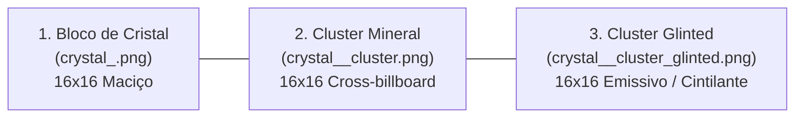

# Catálogo e Estrutura de Worldbuilding: Espeleologia, Cristais e Espeleotemas (Caverns)

Todas as texturas ativas de cristais minerais reais e espeleotemas subterrâneos estão organizadas na pasta:
📂 **`docs/worldbuilding/caverns`** *(74 texturas PNG ativas: 18 texturas de cristais minerais reais em tríades e 56 texturas modulares de espeleotemas)*

---

## 1. Classificação Estrutural do Mundo Subterrâneo

O domínio de formações de cavernas e espeleologia é dividido em **2 Grandes Ramos Morfológicos (6 Cristais e 6 Espeleotemas)**:

```mermaid
graph TD
    A["Cavernas & Espeleologia (74 Texturas)"] --> B["1. Cristalogênese & Geodos (6 Cristais Reais / 18 Texturas)"]
    A --> C["2. Espeleotemas & Dripstones (6 Materiais / 56 Texturas)"]

    B --> B1["Amethyst: Quartzo violeta prismático clássico de geodos de basalto"]
    B --> B2["Aquamarine: Berilo azul-ciano cristalino de pegmatitos e cavidades hidrotermais"]
    B --> B3["Citrine: Quartzo dourado solar translúcido de calor geotérmico"]
    B --> B4["Fluorite: Fluoreto de cálcio cúbico verde-menta com fluorescência natural"]
    B --> B5["Pink Salt: Halita fóssil evaporítica rosa-coral do Himalaia"]
    B --> B6["Selenite: Gipsita colunar translúcida prateada pura (estilo Naica)"]

    C --> C1["Karst: Estalactites e estalagmites de calcário cárstico fóssil (10 peças)"]
    C --> C2["Calcite: Espeleotemas de calcita carbonática pura gotejada (10 peças)"]
    C --> C3["Brimstone: Espinhos minerais de enxofre em fumarolas vulcânicas (10 peças)"]
    C --> C4["Basalt: Estalactites de tubos de lava com fraturas térmicas incandescentes (10 peças)"]
    C --> C5["Ice: Pingentes glaciais e agulhas de gelo permafrost (10 peças)"]
    C --> C6["Pink Salt Straw: Canudos tubulares de sal oco ultrafinos (6 peças)"]
```



---

## 2. A Tríade dos Cristais: Bloco, Cluster e Glinted

Para cada um dos 6 minerais cristalinos do jogo, existe um conjunto de 3 texturas interdependentes:



1. **Bloco de Cristal Maciço (`crystal_<nome>.png`)**:
   - `16x16` pixels opaco. Representa a rocha de cristal pura consolidada, obtida através da união de fragmentos minerais e prismas lapidados (6 faces sólidas).
2. **Cluster Mineral (`crystal_<nome>_cluster.png`)**:
   - `16x16` pixels com canal alfa (`RGBA`). Renderizado como **Cross-billboard** (planos cruzados em X, análogo a vegetações/flores), representando o agregado mineral em crescimento natural incrustado em tetos, pisos ou paredes rochosas de geodos.
3. **Cluster com Brilho / Glinted (`crystal_<nome>_cluster_glinted.png`)**:
   - `16x16` pixels com canal alfa (`RGBA`). Renderizado como **Cross-billboard** (planos cruzados em X) com propriedade emissiva e centelhas de refração de luz no ápice superior, simulando a dispersão prismática e reflexão cristalina natural.

---

## 3. Catálogo dos 6 Cristais Minerais Reais (18 Texturas)

Todos os cristais possuem base 100% real na mineralogia e geologia terrestre:

| Cristal | Mineralogia & Composição | Bloco Base (16x16) | Cluster (Cross-billboard) | Cluster Glinted (Cross-billboard Emissivo) | Cor Predominante | Origem & Propriedades Naturais |
| :--- | :--- | :--- | :--- | :--- | :--- | :--- |
| **Amethyst** | Quartzo violeta ($SiO_2$) | `crystal_amethyst.png` | `crystal_amethyst_cluster.png` | `crystal_amethyst_cluster_glinted.png` | Violeta / Lilás (`#7252b3` a `#eacef0`) | Variedade cristalina de quartzo que adquire cor púrpura por irradiação natural e impurezas de ferro; ocorre em geodos basálticos. |
| **Aquamarine** | Berilo azul-ciano ($Be_3Al_2Si_6O_{18}$) | `crystal_aquamarine.png` | `crystal_aquamarine_cluster.png` | `crystal_aquamarine_cluster_glinted.png` | Azul-Ciano / Marinho (`#24f6d8` a `#339599`) | Variedade nobre de berilo formada em veios pegmatíticos e cavidades hidrotermais sob pressão e fluidos ricos em berílio. |
| **Citrine** | Quartzo dourado ($SiO_2$) | `crystal_citrine.png` | `crystal_citrine_cluster.png` | `crystal_citrine_cluster_glinted.png` | Dourado / Âmbar solar (`#ac6531` a `#ffc559`) | Quartzo de coloração amarela a âmbar formado pelo aquecimento geotérmico natural de depósitos de quartzo e ametista. |
| **Fluorite** | Fluoreto de cálcio ($CaF_2$) | `crystal_fluorite.png` | `crystal_fluorite_cluster.png` | `crystal_fluorite_cluster_glinted.png` | Verde-Menta / Esmeralda (`#094730` a `#a8ffdb`) | Mineral hidrotermal de simetria cúbica conhecido por sua clivagem perfeita e forte fluorescência sob luz ultravioleta. |
| **Pink Salt** | Halita evaporítica ($NaCl$) | `crystal_pink_salt.png` | `crystal_pink_salt_cluster.png` | `crystal_pink_salt_cluster_glinted.png` | Rosa-Salmão / Coral (`#da8067` a `#f7d1c4`) | Sal fóssil de cloreto de sódio originário de paleolagos evaporados, com coloração coral devida a traços minerais de óxidos de ferro. |
| **Selenite** | Gipsita pura ($CaSO_4 \cdot 2H_2O$) | `crystal_selenite.png` | `crystal_selenite_cluster.png` | `crystal_selenite_cluster_glinted.png` | Branco / Prateado lunar (`#5a737d` a `#ffffff`) | Variedade translúcida incolor e prateada de gipsita colunar, célebre por formar megacristais prismáticos em cavernas como a de Naica. |

---

## 4. O Sistema Modular de Espeleotemas (56 Texturas)

O jogo utiliza um sistema modular de 10 peças cônicas (e 6 peças tubulares no caso do sal) para montar estalactites (teto descendo) e estalagmites (chão subindo) de qualquer altura:

```mermaid
graph TD
    subgraph Estalactite Cônica (10 Peças: Karst, Calcite, Brimstone, Basalt, Ice)
        D1["Teto da Caverna"] --> D2["down_base (Encaixe largo)"]
        D2 --> D3["down_frustum (Cone cônico)"]
        D3 --> D4["down_middle (Tronco cilíndrico repetível)"]
        D4 --> D5["down_tip (Ponta afiada) OU down_tip_merge (Junção)"]
    end

    subgraph Estalagmite Cônica
        U5["up_tip (Ponta afiada) OU up_tip_merge (Junção)"] --> U4["up_middle (Tronco cilíndrico repetível)"]
        U4 --> U3["up_frustum (Cone invertido)"]
        U3 --> U2["up_base (Base alargada de chão)"]
        U2 --> U1["Piso da Caverna"]
    end

    D5 -. "Encontro de Coluna (down_tip_merge + up_tip_merge)" .- U5
```

### 4.1 Catálogo dos 6 Blocos de Espeleotemas Modulares

| ID do Bloco | Material / Nome | Rocha-Mãe Conectada | Peças Modulares | Textura Base & Visual | Origem & Características Físicas |
| :--- | :--- | :--- | :---: | :--- | :--- |
| `dripstone` | **Karst** (Dripstone Cárstico) | `rocks/rock_karst.png` | 10 peças (5 Down + 5 Up) | Calcário cárstico fóssil clássico cinza com relevo rugoso | Depósitos minerais carbonáticos secundários formados pela precipitação lenta de bicarbonato de cálcio em cavernas de dissolução cárstica. |
| `calcite_dripstone` | **Calcite** (Flowstone) | `rocks/rock_calcite.png` | 10 peças (5 Down + 5 Up) | Calcita carbonática pura branco-creme perolada límpida | Espeleotemas de calcita de alta pureza química, com crescimento cristalino liso, estrias peroladas e coloração leitosa. |
| `brimstone_spike` | **Brimstone** (Espinho de Enxofre) | `rocks/rock_brimstone.png` | 10 peças (5 Down + 5 Up) | Espinhos afiados amarelo-enxofre vulcânico | Estruturas aciculares e pontiagudas originárias da sublimação direta de gases ricos em enxofre ao redor de fumarolas vulcânicas. |
| `lava_icicle` | **Basalt** (Goteira de Magma) | `rocks/rock_basalt.png` | 10 peças (5 Down + 5 Up) | Basalto negro com veios térmicos e gotas de lava incandescente | Estalactites vulcânicas originadas pelo escorrimento e gotejamento de lava fluida ao longo do teto de tubos de lava (*lava tubes*). |
| `icicle` | **Ice** (Pingente de Gelo Glacial) | `fluids/frost_ice_packed.png` | 10 peças (5 Down + 5 Up) | Pingentes cristalinos e estalagmites de gelo compacto | Formações de gelo compacto desenvolvidas pelo gotejamento e congelamento progressivo de água em cavernas glaciais e de permafrost. |
| `salt_straw` | **Pink Salt Straw** (Canudo de Sal) | `caverns/crystal_pink_salt.png` | 6 peças (3 Down + 3 Up) | Canudos tubulares de halita oca ultrafinos (`bottom`, `middle`, `top`) | Estruturas tubulares cilíndricas ocas de precipitação salina (*soda straws*), desenvolvidas a partir da borda de gotas de água salobra suspensas. |

---

## 5. Inventário Técnico Completo de Texturas em `caverns/` (74 Texturas Ativas)

### A. Cristais Minerais Reais (18 Arquivos 16x16)
* **Amethyst (Roxo)**: `crystal_amethyst.png`, `crystal_amethyst_cluster.png`, `crystal_amethyst_cluster_glinted.png`
* **Aquamarine (Azul-Ciano)**: `crystal_aquamarine.png`, `crystal_aquamarine_cluster.png`, `crystal_aquamarine_cluster_glinted.png`
* **Citrine (Amarelo-Dourado)**: `crystal_citrine.png`, `crystal_citrine_cluster.png`, `crystal_citrine_cluster_glinted.png`
* **Fluorite (Verde-Menta)**: `crystal_fluorite.png`, `crystal_fluorite_cluster.png`, `crystal_fluorite_cluster_glinted.png`
* **Pink Salt (Rosa-Coral)**: `crystal_pink_salt.png`, `crystal_pink_salt_cluster.png`, `crystal_pink_salt_cluster_glinted.png`
* **Selenite (Branco-Prateado)**: `crystal_selenite.png`, `crystal_selenite_cluster.png`, `crystal_selenite_cluster_glinted.png`

### B. Espeleotemas Modulares (56 Arquivos 16x16)
* **Karst (10)**:
  * Down: `speleothem_karst_down_base.png`, `_frustum`, `_middle`, `_tip`, `_tip_merge`
  * Up: `speleothem_karst_up_base.png`, `_frustum`, `_middle`, `_tip`, `_tip_merge`
* **Calcite (10)**:
  * Down: `speleothem_calcite_down_base.png`, `_frustum`, `_middle`, `_tip`, `_tip_merge`
  * Up: `speleothem_calcite_up_base.png`, `_frustum`, `_middle`, `_tip`, `_tip_merge`
* **Brimstone (10)**:
  * Down: `speleothem_brimstone_down_base.png`, `_frustum`, `_middle`, `_tip`, `_tip_merge`
  * Up: `speleothem_brimstone_up_base.png`, `_frustum`, `_middle`, `_tip`, `_tip_merge`
* **Basalt / Lava (10)**:
  * Down: `speleothem_basalt_down_base.png`, `_frustum`, `_middle`, `_tip`, `_tip_merge`
  * Up: `speleothem_basalt_up_base.png`, `_frustum`, `_middle`, `_tip`, `_tip_merge`
* **Ice / Icicle (10)**:
  * Down: `speleothem_ice_down_base.png`, `_frustum`, `_middle`, `_tip`, `_tip_merge`
  * Up: `speleothem_ice_up_base.png`, `_frustum`, `_middle`, `_tip`, `_tip_merge`
* **Pink Salt Straw (6)**:
  * Down: `speleothem_pink_salt_straw_down_top.png`, `_middle`, `_bottom`
  * Up: `speleothem_pink_salt_straw_up_top.png`, `_middle`, `_bottom`
