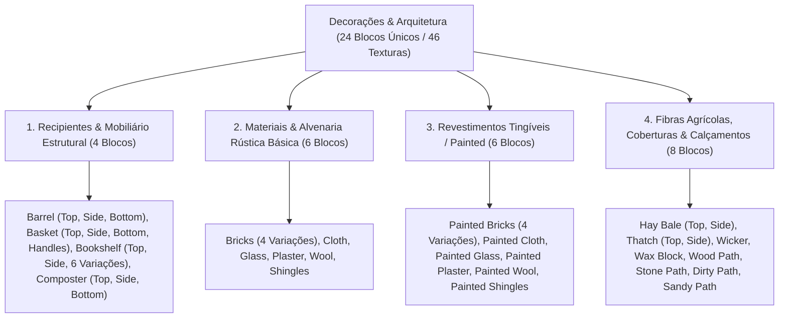

# Catálogo e Estrutura de Worldbuilding: Decorações, Alvenaria e Revestimentos (Decorations)

Todas as texturas ativas de elementos arquitetônicos, mobiliário, tecidos, vidraçaria, alvenaria e variantes tingíveis estão organizadas na 📂 **`docs/worldbuilding/decorations`** *(46 texturas PNG ativas, representando 24 blocos únicos divididos em 4 categorias funcionais)*

---

## 1. Classificação Estrutural e Arquitetônica

O acervo de decoração e construção do mundo é organizado em **4 Categorias Funcionais (24 Blocos Únicos / 46 Texturas)**:

---

## 2. Sistema de Tinturas e Shaders Dinâmicos (Grayscale Master Maps)

Para possibilitar o sistema de tingimento com as **16 cores adicionais da paleta de corantes (17 variações no total por material)**, a engine utiliza mapas mestres desaturados em escala de cinza com prefixo **`deco_painted_`**:

1. **Multiplicação Cromática por Vértice / Shader**:
   - As texturas mestres com prefixo `deco_painted_` contêm apenas informação de luminância neutra ($L = 0.299R + 0.587G + 0.114B$).
   - O shader aplica a cor da tintura selecionada multiplicando os canais RGB sem desbalanceamento ou saturação residual indesejada.
2. **Preservação de Transparência e Valências Ópticas**:
   - **`deco_painted_glass.png`**: Mantém 100% de transparência interna na vidraça central (`alpha = 0`) e canal alfa intacto nos reflexos e bordas de chumbo, permitindo a geração de 16 vitrais coloridos com refração límpida.
   - **`deco_painted_cloth.png` & `deco_painted_wool.png`**: Preservam altas faixas de luminância média (tons claros de cinza entre 180 e 240) para que cores primárias e secundárias fiquem vivas e vibrantes.
   - **`deco_painted_bricks.png` & `deco_painted_shingles.png`**: Mantêm o contraste estético entre ranhuras, juntas de sobreposição e faces dos blocos/telhas em todas as variações.

---

## 3. Catálogo dos 24 Blocos de Decoração Únicos (46 Texturas)

| # | Bloco / Espécime | Categoria | Arquivo(s) de Textura | Variações / Faces | Uso Construtivo & Estilo Arquitetônico | Características Visuais & Materiais |
| :-: | :--- | :--- | :--- | :--- | :---: | :--- |
| **01** | **Barrel** | **Recipientes & Mobiliário** | `deco_barrel_top.png` `deco_barrel_side.png` `deco_barrel_bot.png` | 3 faces | Adegas, Armazéns, Oficinas | Barril de ripas de carvalho arqueadas reforçado por aros metálicos escuros e tampo estanque. |
| **02** | **Basket** | **Recipientes & Mobiliário** | `deco_basket_top.png` `deco_basket_side.png` `deco_basket_side_handles.png` `deco_basket_bot.png` | 4 faces *(Topo vazado)* | Mercados, Vilas, Despensas | Cesto rústico trançado em talos de salgueiro flexíveis com alças laterais e abertura superior oca. |
| **03** | **Bookshelf** | **Recipientes & Mobiliário** | `deco_bookshelf.png` a `5` `deco_bookshelf_side.png` `deco_bookshelf_top.png` | 8 texturas *(6 variações + 2 faces)* | Bibliotecas, Câmaras Mágicas, Estudos | Estante de madeira nobre talhada contendo tomos, pergaminhos encadernados em couro e lombadas multicoloridas. |
| **04** | **Composter** | **Recipientes & Mobiliário** | `deco_composter_top.png` `deco_composter_side.png` `deco_composter_bot.png` | 3 faces *(Topo vazado)* | Hortas, Fazendas, Compostagem | Caixa de compostagem de ripas de madeira rústica com abertura superior oca para decomposição de matéria orgânica. |
| **05** | **Bricks** | **Alvenaria Básica** | `deco_bricks.png` `deco_bricks1.png` a `3` | 4 variações | Vilas Medievais, Muralhas, Lareiras | Alvenaria de tijolos de cerâmica vermelha cozida assentados com argamassa calcária em padrão de amarração. |
| **06** | **Cloth** | **Alvenaria Básica** | `deco_cloth.png` | 1 bloco | Tendas, Toldos, Cortinas | Tecido espesso de linho cru com trama entrelaçada visível em tom bege-linho natural. |
| **07** | **Glass** | **Alvenaria Básica** | `deco_glass.png` | 1 bloco *(Transparente)* | Janelas, Cúpulas, Faróis | Vidraça incolor transparente com chanfros de bisotê e reflexos sutis de luminosidade angular. |
| **08** | **Plaster** | **Alvenaria Básica** | `deco_plaster.png` | 1 bloco | Paredes Internas, Chalés, Fachadas | Reboco liso de gesso e cal hidratada com textura aveludada rústica levemente desgastada. |
| **09** | **Wool** | **Alvenaria Básica** | `deco_wool.png` | 1 bloco | Tapeçaria, Isolamento, Quartos | Bloco de lã de ovelha natural tosquiada não processada em tom branco-creme fofo e poroso. |
| **10** | **Shingles** | **Alvenaria Básica** | `deco_shingles.png` | 1 bloco | Telhados Coloniais, Chalés, Cúpulas | Cobertura de telhas cerâmicas terracota em padrão escamado (beaver-tail / fish scale) com arcos semicirculares convexos sobrepostos e sombra projetada. |
| **11** | **Painted Bricks** | **Revestimentos Tingíveis** | `deco_painted_bricks.png` `deco_painted_bricks1.png` a `3` | 4 variações *(Grayscale)* | Fachadas Urbanas, Residências Nobres | Versão em escala de cinza dos tijolos cerâmicos para tingimento shader com as 16 cores de tintura. |
| **12** | **Painted Cloth** | **Revestimentos Tingíveis** | `deco_painted_cloth.png` | 1 bloco *(Grayscale)* | Estandartes, Tendas Mercantis, Bandeiras | Tecido de linho neutro desaturado pronto para receber 16 variações cromáticas de corantes têxteis. |
| **13** | **Painted Glass** | **Revestimentos Tingíveis** | `deco_painted_glass.png` | 1 bloco *(Grayscale Transparente)* | Catedrais, Mansões, Vitrais | Base neutra para vitrais coloridos mantendo centro transparente límpido e reflexos tingidos. |
| **14** | **Painted Plaster** | **Revestimentos Tingíveis** | `deco_painted_plaster.png` | 1 bloco *(Grayscale)* | Interiores Modernos e Renascentistas | Estuque neutro de gesso para aplicação de tintas residenciais monocromáticas e afrescos. |
| **15** | **Painted Wool** | **Revestimentos Tingíveis** | `deco_painted_wool.png` | 1 bloco *(Grayscale)* | Tapetes, Mantas, Camas | Lã descolorida com alto valor de luminância mestre para 16 cores vivas de lã tingida. |
| **16** | **Painted Shingles** | **Revestimentos Tingíveis** | `deco_painted_shingles.png` | 1 bloco *(Grayscale)* | Telhados Nórdicos, Palácios, Vilas | Telhas escamadas semicirculares em escala de cinza para criação de telhados esmaltados curvos em 16 cores (azuis, ardósia, verdes, etc.). |
| **17** | **Hay Bale** | **Fibras & Calçamentos** | `deco_hay_side.png` `deco_hay_top.png` | 2 faces | Fazendas, Estábulos, Celeiros | Fardo retangular de palha e capim seco prensado amarrado por cordas rústicas de juta. |
| **18** | **Thatch** | **Fibras & Calçamentos** | `deco_thatch_side.png` `deco_thatch_top.png` | 2 faces | Cabanas Rurais, Telhados Rústicos | Cobertura tradicional de colmo trançado e juncos secos sobrepostos com corte em camadas. |
| **19** | **Wicker** | **Fibras & Calçamentos** | `deco_wicker.png` | 1 bloco | Biombos, Painéis, Varandas | Painel de vime entrelaçado em malha cruzada regular para divisórias rústicas leves e ventilação. |
| **20** | **Stone Path** | **Fibras & Calçamentos** | `deco_stone_path.png` | 1 bloco | Vias Rurais, Praças, Jardins | Calçamento empedrado irregular de seixos e lajes de pedra assentados diretamente no solo de terra. |
| **21** | **Wax Block** | **Fibras & Calçamentos** | `deco_wax.png` | 1 bloco | Candelabros, Fundição, Impermeabilização | Bloco maciço de cera natural de abelha/parafina endurecida semitranslúcida com brilho ceroso suave. |
| **22** | **Wood Path** | **Fibras & Calçamentos** | `deco_wood_path.png` | 1 bloco | Trilhas de Bosque, Passadiços, Pomares | Caminho rústico de tábuas e dormentes de madeira desgastada com cavilhas cravadas no solo de terra. |
| **23** | **Dirty Path** | **Fibras & Calçamentos** | `deco_dirty_path.png` | 1 bloco | Trilhas Rurais, Bosques, Hortas | Trilha de solo franco (*loam*) batido e compactado com pedriscos miúdos incrustados pelo tráfego contínuo de passos e carroças. |
| **24** | **Sandy Path** | **Fibras & Calçamentos** | `deco_sandy_path.png` | 1 bloco | Vilas Costeiras, Oásis, Dunas | Caminho firme de areia dourada compactada com pequenas inclusões de quartzo e conchas, ideal para vilas de praia e rotas desérticas. |

---

## 4. Inventário Técnico Completo em `worldbuilding/decorations/` (46 Texturas Ativas)

Todas as 46 texturas utilizam estritamente o prefixo `deco_`:

### A. Recipientes e Mobiliário Estrutural (18 Arquivos)
* `deco_barrel_top.png`, `deco_barrel_side.png`, `deco_barrel_bot.png`
* `deco_basket_top.png`, `deco_basket_side.png`, `deco_basket_side_handles.png`, `deco_basket_bot.png`
* `deco_bookshelf.png`, `deco_bookshelf1.png`, `deco_bookshelf2.png`, `deco_bookshelf3.png`, `deco_bookshelf4.png`, `deco_bookshelf5.png` *(6 variações de livros)*
* `deco_bookshelf_side.png`, `deco_bookshelf_top.png`
* `deco_composter_top.png`, `deco_composter_side.png`, `deco_composter_bot.png`

### B. Alvenaria, Vidros e Tecidos Tradicionais (9 Arquivos)
* `deco_bricks.png`, `deco_bricks1.png`, `deco_bricks2.png`, `deco_bricks3.png` *(Tijolos vermelhos clássicos)*
* `deco_cloth.png` *(Tecido de linho natural)*
* `deco_glass.png` *(Vidro incolor transparente)*
* `deco_plaster.png` *(Gesso rústico bege)*
* `deco_wool.png` *(Lã natural de ovelha)*
* `deco_shingles.png` *(Telhas cerâmicas terracota escamadas com bordas curvas semicirculares)*

### C. Revestimentos e Superfícies Tingíveis / Grayscale (9 Arquivos)
* `deco_painted_bricks.png`, `deco_painted_bricks1.png`, `deco_painted_bricks2.png`, `deco_painted_bricks3.png` *(4 variações de tijolos em escala de cinza)*
* `deco_painted_cloth.png` *(Linho neutro em escala de cinza)*
* `deco_painted_glass.png` *(Vidro com reflexos neutros e centro transparente)*
* `deco_painted_plaster.png` *(Gesso neutro em escala de cinza)*
* `deco_painted_wool.png` *(Lã neutra de alta luminância em escala de cinza)*
* `deco_painted_shingles.png` *(Telhas cerâmicas escamadas em escala de cinza para 16 cores)*

### D. Fibras Agrícolas, Coberturas e Calçamentos (10 Arquivos)
* `deco_dirty_path.png` *(Trilha rústica de terra batida com seixos)*
* `deco_hay_side.png`, `deco_hay_top.png` *(Fardo de feno orientável)*
* `deco_sandy_path.png` *(Caminho de areia compactada com quartzo)*
* `deco_stone_path.png` *(Calçamento de seixos e pedras)*
* `deco_thatch_side.png`, `deco_thatch_top.png` *(Telhado de colmo orientável)*
* `deco_wax.png` *(Bloco de cera maciça)*
* `deco_wicker.png` *(Painel trançado de vime)*
* `deco_wood_path.png` *(Passadiço e dormentes de madeira sobre terra)*
