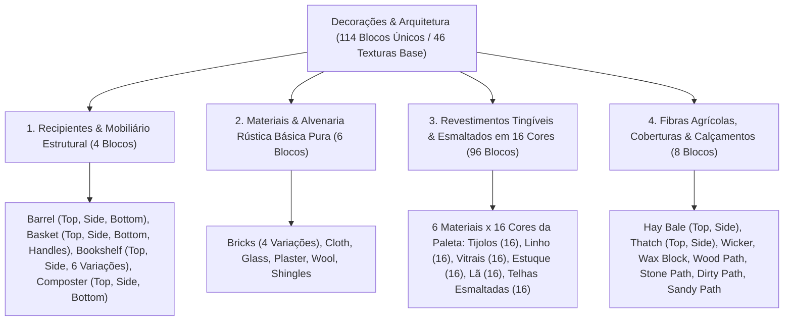

# Catálogo e Estrutura de Worldbuilding: Decorações, Alvenaria e Revestimentos (Decorations)

Todas as texturas ativas de elementos arquitetônicos, mobiliário, tecidos, vidraçaria, alvenaria e variantes tingíveis estão organizadas na 📂 **`docs/worldbuilding/decorations`** *(46 texturas PNG ativas de base, gerando **114 blocos únicos** no catálogo mestre: 4 recipientes/móveis + 6 alvenarias puras originais + 96 variantes coloridas em 16 cores via shader + 8 fibras agrícolas e calçamentos rurais)*.

---

## 1. Classificação Estrutural e Arquitetônica

O acervo de decoração e construção do mundo é organizado em **4 Categorias Funcionais (114 Blocos Únicos / 46 Texturas Base)**:

---

## 2. Sistema de Tinturas e Shaders Dinâmicos (Grayscale Master Maps & Paleta de 16 Cores)

Para possibilitar o sistema de tingimento com as **16 cores oficiais da paleta de corantes (totalizando o bloco original puro + 16 variações coloridas por material)**, a engine utiliza mapas mestres desaturados em escala de cinza com prefixo **`deco_painted_`**:

1. **Multiplicação Cromática por Vértice / Shader**:
   - As texturas mestres com prefixo `deco_painted_` contêm informação de luminância neutra ($L = 0.299R + 0.587G + 0.114B$).
   - O shader aplica a cor da tintura selecionada multiplicando os canais RGB sem desbalanceamento ou saturação residual indesejada.
2. **Preservação de Transparência e Valências Ópticas**:
   - **`deco_painted_glass.png`**: Mantém 100% de transparência interna na vidraça central (`alpha = 0`) e canal alfa intacto nos reflexos e chanfros, permitindo a geração de 16 vitrais coloridos com refração límpida.
   - **`deco_painted_cloth.png` & `deco_painted_wool.png`**: Preservam altas faixas de luminância média (tons claros entre 180 e 240) para cores têxteis vivas e limpas.
   - **`deco_painted_bricks.png` & `deco_painted_shingles.png`**: Mantêm alto contraste nas ranhuras de rejunte e sobreposição de telhas.

### 2.1. Matriz Oficial das 16 Cores de Tingimento

| # | Nome da Cor | Tradução (PT) | Hex Estimado | Exemplo de Tag (Bricks) | Origem / Fonte de Pigmento |
| :-: | :--- | :--- | :---: | :--- | :--- |
| **01** | **Black** | Preto | `#1A1A1A` | `Deco_Brick_Black` | Corante de Carvão / Tinta de Lula |
| **02** | **Blue** | Azul | `#25448C` | `Deco_Brick_Blue` | Lápis-lazúli / Centáurea |
| **03** | **Brown** | Marrom | `#5C381E` | `Deco_Brick_Brown` | Sementes de Cacau / Argila Ocre |
| **04** | **Dark Blue** | Azul Escuro | `#14234B` | `Deco_Brick_Dark_Blue` | Cobalto Mineral / Índigo Profundo |
| **05** | **Dark Grey** | Cinza Escuro | `#3F4448` | `Deco_Brick_Dark_Grey` | Grafite / Cinza Vulcânico |
| **06** | **Green** | Verde | `#3B6A26` | `Deco_Brick_Green` | Malaquita / Cacto Cozido |
| **07** | **Light Grey** | Cinza Claro | `#9AA1A6` | `Deco_Brick_Light_Grey` | Calcário Moído / Cinza Clara |
| **08** | **Light Pink** | Rosa Claro | `#F4B5C8` | `Deco_Brick_Light_Pink` | Pétalas de Peônia Pálida |
| **09** | **Lime** | Verde Lima | `#6ABE30` | `Deco_Brick_Lime` | Clorofila / Líquen Verde-Vivo |
| **10** | **Orange** | Laranja | `#D96E14` | `Deco_Brick_Orange` | Açafrão / Orquídea Laranja |
| **11** | **Pink** | Rosa | `#E86A92` | `Deco_Brick_Pink` | Pétalas de Rosa Silvestre |
| **12** | **Purple** | Púrpura / Roxo | `#74328E` | `Deco_Brick_Purple` | Lavanda / Extrato de Uva |
| **13** | **Red** | Vermelho | `#B22222` | `Deco_Brick_Red` | Óxido de Ferro / Papoula |
| **14** | **Turquoise** | Turquesa | `#28A0A0` | `Deco_Brick_Turquoise` | Crisocola / Algas Cianofíceas |
| **15** | **White** | Branco | `#F0F0F0` | `Deco_Brick_White` | Pó de Ossos / Cal Virgem |
| **16** | **Yellow** | Amarelo | `#E6B800` | `Deco_Brick_Yellow` | Dente-de-Leão / Flor de Enxofre |

---

## 3. Catálogo dos 114 Blocos de Decoração Únicos

### 3.1. Recipientes & Mobiliário Estrutural (4 Blocos)

| # | Bloco / ID | Categoria | Arquivo(s) de Textura | Variações / Faces | Uso Construtivo & Estilo Arquitetônico | Características Visuais & Materiais |
| :-: | :--- | :--- | :--- | :---: | :--- | :--- |
| **01** | `barrel` | **Mobiliário** | `deco_barrel_top.png` `deco_barrel_side.png` `deco_barrel_bot.png` | 3 faces | Adegas, Armazéns, Oficinas | Barril de ripas de carvalho arqueadas reforçado por aros metálicos escuros e tampo estanque. |
| **02** | `basket` | **Mobiliário** | `deco_basket_top.png` `deco_basket_side.png` `deco_basket_side_handles.png` `deco_basket_bot.png` | 4 faces *(Topo vazado)* | Mercados, Vilas, Despensas | Cesto rústico trançado em talos de salgueiro flexíveis com alças laterais e abertura superior oca. |
| **03** | `bookshelf` | **Mobiliário** | `deco_bookshelf.png` a `5` `deco_bookshelf_side.png` `deco_bookshelf_top.png` | 8 texturas *(6 variações + 2 faces)* | Bibliotecas, Câmaras Mágicas, Estudos | Estante de madeira nobre talhada contendo tomos, pergaminhos encadernados em couro e lombadas multicoloridas. |
| **04** | `composter` | **Mobiliário** | `deco_composter_top.png` `deco_composter_side.png` `deco_composter_bot.png` | 3 faces *(Topo vazado)* | Hortas, Fazendas, Compostagem | Caixa de compostagem de ripas de madeira rústica com abertura superior oca para decomposição de matéria orgânica. |

---

### 3.2. Materiais & Alvenaria Rústica Básica Pura (6 Blocos Originais)

| # | Bloco / ID | Categoria | Arquivo(s) de Textura | Variações / Faces | Uso Construtivo & Estilo Arquitetônico | Características Visuais & Materiais |
| :-: | :--- | :--- | :--- | :---: | :--- | :--- |
| **05** | `bricks` | **Alvenaria** | `deco_bricks.png` `deco_bricks1.png` a `3` | 4 variações | Vilas Medievais, Muralhas, Lareiras | Alvenaria de tijolos de cerâmica vermelha cozida assentados com argamassa calcária em padrão de amarração. |
| **06** | `cloth` | **Alvenaria / Têxtil** | `deco_cloth.png` | 1 bloco | Tendas, Toldos, Cortinas | Tecido espesso de linho cru com trama entrelaçada visível em tom bege-linho natural. |
| **07** | `glass` | **Vidraçaria** | `deco_glass.png` | 1 bloco *(Transparente)* | Janelas, Cúpulas, Faróis | Vidraça incolor transparente com chanfros de bisotê e reflexos sutis de luminosidade angular. |
| **08** | `plaster` | **Alvenaria** | `deco_plaster.png` | 1 bloco | Paredes Internas, Chalés, Fachadas | Reboco liso de gesso e cal hidratada com textura aveludada rústica levemente desgastada. |
| **09** | `wool` | **Têxtil** | `deco_wool.png` | 1 bloco | Tapeçaria, Isolamento, Quartos | Bloco de lã de ovelha natural tosquiada não processada em tom branco-creme fofo e poroso. |
| **10** | `shingles` | **Cobertura** | `deco_shingles.png` | 1 bloco | Telhados Coloniais, Chalés, Cúpulas | Cobertura de telhas cerâmicas terracota em padrão escamado (beaver-tail / fish scale) com arcos semicirculares convexos sobrepostos. |

---

### 3.3. Revestimentos Tingíveis e Esmaltados nas 16 Cores (96 Blocos)

#### 3.3.1. Tijolos Cerâmicos em Alvenaria (16 Variantes Coloridas)

| # | ID do Bloco | Tag / Nome | Textura Base | Shader Tint | Aplicação Arquitetônica |
| :-: | :--- | :--- | :--- | :---: | :--- |
| **11** | `brick_black` | `Deco_Brick_Black` Tijolos Cerâmicos Tingidos (Preto) | `decorations/deco_painted_bricks.png` | `#1A1A1A` (Preto) | Construção e acabamento arquitetônico em tom preto |
| **12** | `brick_blue` | `Deco_Brick_Blue` Tijolos Cerâmicos Tingidos (Azul) | `decorations/deco_painted_bricks.png` | `#25448C` (Azul) | Construção e acabamento arquitetônico em tom azul |
| **13** | `brick_brown` | `Deco_Brick_Brown` Tijolos Cerâmicos Tingidos (Marrom) | `decorations/deco_painted_bricks.png` | `#5C381E` (Marrom) | Construção e acabamento arquitetônico em tom marrom |
| **14** | `brick_dark_blue` | `Deco_Brick_Dark_Blue` Tijolos Cerâmicos Tingidos (Azul Escuro) | `decorations/deco_painted_bricks.png` | `#14234B` (Azul Escuro) | Construção e acabamento arquitetônico em tom azul escuro |
| **15** | `brick_dark_grey` | `Deco_Brick_Dark_Grey` Tijolos Cerâmicos Tingidos (Cinza Escuro) | `decorations/deco_painted_bricks.png` | `#3F4448` (Cinza Escuro) | Construção e acabamento arquitetônico em tom cinza escuro |
| **16** | `brick_green` | `Deco_Brick_Green` Tijolos Cerâmicos Tingidos (Verde) | `decorations/deco_painted_bricks.png` | `#3B6A26` (Verde) | Construção e acabamento arquitetônico em tom verde |
| **17** | `brick_light_grey` | `Deco_Brick_Light_Grey` Tijolos Cerâmicos Tingidos (Cinza Claro) | `decorations/deco_painted_bricks.png` | `#9AA1A6` (Cinza Claro) | Construção e acabamento arquitetônico em tom cinza claro |
| **18** | `brick_light_pink` | `Deco_Brick_Light_Pink` Tijolos Cerâmicos Tingidos (Rosa Claro) | `decorations/deco_painted_bricks.png` | `#F4B5C8` (Rosa Claro) | Construção e acabamento arquitetônico em tom rosa claro |
| **19** | `brick_lime` | `Deco_Brick_Lime` Tijolos Cerâmicos Tingidos (Verde Lima) | `decorations/deco_painted_bricks.png` | `#6ABE30` (Verde Lima) | Construção e acabamento arquitetônico em tom verde lima |
| **20** | `brick_orange` | `Deco_Brick_Orange` Tijolos Cerâmicos Tingidos (Laranja) | `decorations/deco_painted_bricks.png` | `#D96E14` (Laranja) | Construção e acabamento arquitetônico em tom laranja |
| **21** | `brick_pink` | `Deco_Brick_Pink` Tijolos Cerâmicos Tingidos (Rosa) | `decorations/deco_painted_bricks.png` | `#E86A92` (Rosa) | Construção e acabamento arquitetônico em tom rosa |
| **22** | `brick_purple` | `Deco_Brick_Purple` Tijolos Cerâmicos Tingidos (Púrpura / Roxo) | `decorations/deco_painted_bricks.png` | `#74328E` (Púrpura / Roxo) | Construção e acabamento arquitetônico em tom púrpura / roxo |
| **23** | `brick_red` | `Deco_Brick_Red` Tijolos Cerâmicos Tingidos (Vermelho) | `decorations/deco_painted_bricks.png` | `#B22222` (Vermelho) | Construção e acabamento arquitetônico em tom vermelho |
| **24** | `brick_turquoise` | `Deco_Brick_Turquoise` Tijolos Cerâmicos Tingidos (Turquesa) | `decorations/deco_painted_bricks.png` | `#28A0A0` (Turquesa) | Construção e acabamento arquitetônico em tom turquesa |
| **25** | `brick_white` | `Deco_Brick_White` Tijolos Cerâmicos Tingidos (Branco) | `decorations/deco_painted_bricks.png` | `#F0F0F0` (Branco) | Construção e acabamento arquitetônico em tom branco |
| **26** | `brick_yellow` | `Deco_Brick_Yellow` Tijolos Cerâmicos Tingidos (Amarelo) | `decorations/deco_painted_bricks.png` | `#E6B800` (Amarelo) | Construção e acabamento arquitetônico em tom amarelo |

#### 3.3.2. Tecido de Linho Têxtil (16 Variantes Coloridas)

| # | ID do Bloco | Tag / Nome | Textura Base | Shader Tint | Aplicação Arquitetônica |
| :-: | :--- | :--- | :--- | :---: | :--- |
| **27** | `cloth_black` | `Deco_Cloth_Black` Tecido de Linho Tingido (Preto) | `decorations/deco_painted_cloth.png` | `#1A1A1A` (Preto) | Construção e acabamento arquitetônico em tom preto |
| **28** | `cloth_blue` | `Deco_Cloth_Blue` Tecido de Linho Tingido (Azul) | `decorations/deco_painted_cloth.png` | `#25448C` (Azul) | Construção e acabamento arquitetônico em tom azul |
| **29** | `cloth_brown` | `Deco_Cloth_Brown` Tecido de Linho Tingido (Marrom) | `decorations/deco_painted_cloth.png` | `#5C381E` (Marrom) | Construção e acabamento arquitetônico em tom marrom |
| **30** | `cloth_dark_blue` | `Deco_Cloth_Dark_Blue` Tecido de Linho Tingido (Azul Escuro) | `decorations/deco_painted_cloth.png` | `#14234B` (Azul Escuro) | Construção e acabamento arquitetônico em tom azul escuro |
| **31** | `cloth_dark_grey` | `Deco_Cloth_Dark_Grey` Tecido de Linho Tingido (Cinza Escuro) | `decorations/deco_painted_cloth.png` | `#3F4448` (Cinza Escuro) | Construção e acabamento arquitetônico em tom cinza escuro |
| **32** | `cloth_green` | `Deco_Cloth_Green` Tecido de Linho Tingido (Verde) | `decorations/deco_painted_cloth.png` | `#3B6A26` (Verde) | Construção e acabamento arquitetônico em tom verde |
| **33** | `cloth_light_grey` | `Deco_Cloth_Light_Grey` Tecido de Linho Tingido (Cinza Claro) | `decorations/deco_painted_cloth.png` | `#9AA1A6` (Cinza Claro) | Construção e acabamento arquitetônico em tom cinza claro |
| **34** | `cloth_light_pink` | `Deco_Cloth_Light_Pink` Tecido de Linho Tingido (Rosa Claro) | `decorations/deco_painted_cloth.png` | `#F4B5C8` (Rosa Claro) | Construção e acabamento arquitetônico em tom rosa claro |
| **35** | `cloth_lime` | `Deco_Cloth_Lime` Tecido de Linho Tingido (Verde Lima) | `decorations/deco_painted_cloth.png` | `#6ABE30` (Verde Lima) | Construção e acabamento arquitetônico em tom verde lima |
| **36** | `cloth_orange` | `Deco_Cloth_Orange` Tecido de Linho Tingido (Laranja) | `decorations/deco_painted_cloth.png` | `#D96E14` (Laranja) | Construção e acabamento arquitetônico em tom laranja |
| **37** | `cloth_pink` | `Deco_Cloth_Pink` Tecido de Linho Tingido (Rosa) | `decorations/deco_painted_cloth.png` | `#E86A92` (Rosa) | Construção e acabamento arquitetônico em tom rosa |
| **38** | `cloth_purple` | `Deco_Cloth_Purple` Tecido de Linho Tingido (Púrpura / Roxo) | `decorations/deco_painted_cloth.png` | `#74328E` (Púrpura / Roxo) | Construção e acabamento arquitetônico em tom púrpura / roxo |
| **39** | `cloth_red` | `Deco_Cloth_Red` Tecido de Linho Tingido (Vermelho) | `decorations/deco_painted_cloth.png` | `#B22222` (Vermelho) | Construção e acabamento arquitetônico em tom vermelho |
| **40** | `cloth_turquoise` | `Deco_Cloth_Turquoise` Tecido de Linho Tingido (Turquesa) | `decorations/deco_painted_cloth.png` | `#28A0A0` (Turquesa) | Construção e acabamento arquitetônico em tom turquesa |
| **41** | `cloth_white` | `Deco_Cloth_White` Tecido de Linho Tingido (Branco) | `decorations/deco_painted_cloth.png` | `#F0F0F0` (Branco) | Construção e acabamento arquitetônico em tom branco |
| **42** | `cloth_yellow` | `Deco_Cloth_Yellow` Tecido de Linho Tingido (Amarelo) | `decorations/deco_painted_cloth.png` | `#E6B800` (Amarelo) | Construção e acabamento arquitetônico em tom amarelo |

#### 3.3.3. Vidro Translúcido Colorido (16 Variantes Coloridas)

| # | ID do Bloco | Tag / Nome | Textura Base | Shader Tint | Aplicação Arquitetônica |
| :-: | :--- | :--- | :--- | :---: | :--- |
| **43** | `glass_black` | `Deco_Glass_Black` Vidro Tingido / Vitral (Preto) | `decorations/deco_painted_glass.png` | `#1A1A1A` (Preto) | Construção e acabamento arquitetônico em tom preto |
| **44** | `glass_blue` | `Deco_Glass_Blue` Vidro Tingido / Vitral (Azul) | `decorations/deco_painted_glass.png` | `#25448C` (Azul) | Construção e acabamento arquitetônico em tom azul |
| **45** | `glass_brown` | `Deco_Glass_Brown` Vidro Tingido / Vitral (Marrom) | `decorations/deco_painted_glass.png` | `#5C381E` (Marrom) | Construção e acabamento arquitetônico em tom marrom |
| **46** | `glass_dark_blue` | `Deco_Glass_Dark_Blue` Vidro Tingido / Vitral (Azul Escuro) | `decorations/deco_painted_glass.png` | `#14234B` (Azul Escuro) | Construção e acabamento arquitetônico em tom azul escuro |
| **47** | `glass_dark_grey` | `Deco_Glass_Dark_Grey` Vidro Tingido / Vitral (Cinza Escuro) | `decorations/deco_painted_glass.png` | `#3F4448` (Cinza Escuro) | Construção e acabamento arquitetônico em tom cinza escuro |
| **48** | `glass_green` | `Deco_Glass_Green` Vidro Tingido / Vitral (Verde) | `decorations/deco_painted_glass.png` | `#3B6A26` (Verde) | Construção e acabamento arquitetônico em tom verde |
| **49** | `glass_light_grey` | `Deco_Glass_Light_Grey` Vidro Tingido / Vitral (Cinza Claro) | `decorations/deco_painted_glass.png` | `#9AA1A6` (Cinza Claro) | Construção e acabamento arquitetônico em tom cinza claro |
| **50** | `glass_light_pink` | `Deco_Glass_Light_Pink` Vidro Tingido / Vitral (Rosa Claro) | `decorations/deco_painted_glass.png` | `#F4B5C8` (Rosa Claro) | Construção e acabamento arquitetônico em tom rosa claro |
| **51** | `glass_lime` | `Deco_Glass_Lime` Vidro Tingido / Vitral (Verde Lima) | `decorations/deco_painted_glass.png` | `#6ABE30` (Verde Lima) | Construção e acabamento arquitetônico em tom verde lima |
| **52** | `glass_orange` | `Deco_Glass_Orange` Vidro Tingido / Vitral (Laranja) | `decorations/deco_painted_glass.png` | `#D96E14` (Laranja) | Construção e acabamento arquitetônico em tom laranja |
| **53** | `glass_pink` | `Deco_Glass_Pink` Vidro Tingido / Vitral (Rosa) | `decorations/deco_painted_glass.png` | `#E86A92` (Rosa) | Construção e acabamento arquitetônico em tom rosa |
| **54** | `glass_purple` | `Deco_Glass_Purple` Vidro Tingido / Vitral (Púrpura / Roxo) | `decorations/deco_painted_glass.png` | `#74328E` (Púrpura / Roxo) | Construção e acabamento arquitetônico em tom púrpura / roxo |
| **55** | `glass_red` | `Deco_Glass_Red` Vidro Tingido / Vitral (Vermelho) | `decorations/deco_painted_glass.png` | `#B22222` (Vermelho) | Construção e acabamento arquitetônico em tom vermelho |
| **56** | `glass_turquoise` | `Deco_Glass_Turquoise` Vidro Tingido / Vitral (Turquesa) | `decorations/deco_painted_glass.png` | `#28A0A0` (Turquesa) | Construção e acabamento arquitetônico em tom turquesa |
| **57** | `glass_white` | `Deco_Glass_White` Vidro Tingido / Vitral (Branco) | `decorations/deco_painted_glass.png` | `#F0F0F0` (Branco) | Construção e acabamento arquitetônico em tom branco |
| **58** | `glass_yellow` | `Deco_Glass_Yellow` Vidro Tingido / Vitral (Amarelo) | `decorations/deco_painted_glass.png` | `#E6B800` (Amarelo) | Construção e acabamento arquitetônico em tom amarelo |

#### 3.3.4. Reboco e Estuque Residencial (16 Variantes Coloridas)

| # | ID do Bloco | Tag / Nome | Textura Base | Shader Tint | Aplicação Arquitetônica |
| :-: | :--- | :--- | :--- | :---: | :--- |
| **59** | `plaster_black` | `Deco_Plaster_Black` Estuque de Gesso Tingido (Preto) | `decorations/deco_painted_plaster.png` | `#1A1A1A` (Preto) | Construção e acabamento arquitetônico em tom preto |
| **60** | `plaster_blue` | `Deco_Plaster_Blue` Estuque de Gesso Tingido (Azul) | `decorations/deco_painted_plaster.png` | `#25448C` (Azul) | Construção e acabamento arquitetônico em tom azul |
| **61** | `plaster_brown` | `Deco_Plaster_Brown` Estuque de Gesso Tingido (Marrom) | `decorations/deco_painted_plaster.png` | `#5C381E` (Marrom) | Construção e acabamento arquitetônico em tom marrom |
| **62** | `plaster_dark_blue` | `Deco_Plaster_Dark_Blue` Estuque de Gesso Tingido (Azul Escuro) | `decorations/deco_painted_plaster.png` | `#14234B` (Azul Escuro) | Construção e acabamento arquitetônico em tom azul escuro |
| **63** | `plaster_dark_grey` | `Deco_Plaster_Dark_Grey` Estuque de Gesso Tingido (Cinza Escuro) | `decorations/deco_painted_plaster.png` | `#3F4448` (Cinza Escuro) | Construção e acabamento arquitetônico em tom cinza escuro |
| **64** | `plaster_green` | `Deco_Plaster_Green` Estuque de Gesso Tingido (Verde) | `decorations/deco_painted_plaster.png` | `#3B6A26` (Verde) | Construção e acabamento arquitetônico em tom verde |
| **65** | `plaster_light_grey` | `Deco_Plaster_Light_Grey` Estuque de Gesso Tingido (Cinza Claro) | `decorations/deco_painted_plaster.png` | `#9AA1A6` (Cinza Claro) | Construção e acabamento arquitetônico em tom cinza claro |
| **66** | `plaster_light_pink` | `Deco_Plaster_Light_Pink` Estuque de Gesso Tingido (Rosa Claro) | `decorations/deco_painted_plaster.png` | `#F4B5C8` (Rosa Claro) | Construção e acabamento arquitetônico em tom rosa claro |
| **67** | `plaster_lime` | `Deco_Plaster_Lime` Estuque de Gesso Tingido (Verde Lima) | `decorations/deco_painted_plaster.png` | `#6ABE30` (Verde Lima) | Construção e acabamento arquitetônico em tom verde lima |
| **68** | `plaster_orange` | `Deco_Plaster_Orange` Estuque de Gesso Tingido (Laranja) | `decorations/deco_painted_plaster.png` | `#D96E14` (Laranja) | Construção e acabamento arquitetônico em tom laranja |
| **69** | `plaster_pink` | `Deco_Plaster_Pink` Estuque de Gesso Tingido (Rosa) | `decorations/deco_painted_plaster.png` | `#E86A92` (Rosa) | Construção e acabamento arquitetônico em tom rosa |
| **70** | `plaster_purple` | `Deco_Plaster_Purple` Estuque de Gesso Tingido (Púrpura / Roxo) | `decorations/deco_painted_plaster.png` | `#74328E` (Púrpura / Roxo) | Construção e acabamento arquitetônico em tom púrpura / roxo |
| **71** | `plaster_red` | `Deco_Plaster_Red` Estuque de Gesso Tingido (Vermelho) | `decorations/deco_painted_plaster.png` | `#B22222` (Vermelho) | Construção e acabamento arquitetônico em tom vermelho |
| **72** | `plaster_turquoise` | `Deco_Plaster_Turquoise` Estuque de Gesso Tingido (Turquesa) | `decorations/deco_painted_plaster.png` | `#28A0A0` (Turquesa) | Construção e acabamento arquitetônico em tom turquesa |
| **73** | `plaster_white` | `Deco_Plaster_White` Estuque de Gesso Tingido (Branco) | `decorations/deco_painted_plaster.png` | `#F0F0F0` (Branco) | Construção e acabamento arquitetônico em tom branco |
| **74** | `plaster_yellow` | `Deco_Plaster_Yellow` Estuque de Gesso Tingido (Amarelo) | `decorations/deco_painted_plaster.png` | `#E6B800` (Amarelo) | Construção e acabamento arquitetônico em tom amarelo |

#### 3.3.5. Lã Fofa Processada e Tingida (16 Variantes Coloridas)

| # | ID do Bloco | Tag / Nome | Textura Base | Shader Tint | Aplicação Arquitetônica |
| :-: | :--- | :--- | :--- | :---: | :--- |
| **75** | `wool_black` | `Deco_Wool_Black` Lã de Ovelha Tingida (Preto) | `decorations/deco_painted_wool.png` | `#1A1A1A` (Preto) | Construção e acabamento arquitetônico em tom preto |
| **76** | `wool_blue` | `Deco_Wool_Blue` Lã de Ovelha Tingida (Azul) | `decorations/deco_painted_wool.png` | `#25448C` (Azul) | Construção e acabamento arquitetônico em tom azul |
| **77** | `wool_brown` | `Deco_Wool_Brown` Lã de Ovelha Tingida (Marrom) | `decorations/deco_painted_wool.png` | `#5C381E` (Marrom) | Construção e acabamento arquitetônico em tom marrom |
| **78** | `wool_dark_blue` | `Deco_Wool_Dark_Blue` Lã de Ovelha Tingida (Azul Escuro) | `decorations/deco_painted_wool.png` | `#14234B` (Azul Escuro) | Construção e acabamento arquitetônico em tom azul escuro |
| **79** | `wool_dark_grey` | `Deco_Wool_Dark_Grey` Lã de Ovelha Tingida (Cinza Escuro) | `decorations/deco_painted_wool.png` | `#3F4448` (Cinza Escuro) | Construção e acabamento arquitetônico em tom cinza escuro |
| **80** | `wool_green` | `Deco_Wool_Green` Lã de Ovelha Tingida (Verde) | `decorations/deco_painted_wool.png` | `#3B6A26` (Verde) | Construção e acabamento arquitetônico em tom verde |
| **81** | `wool_light_grey` | `Deco_Wool_Light_Grey` Lã de Ovelha Tingida (Cinza Claro) | `decorations/deco_painted_wool.png` | `#9AA1A6` (Cinza Claro) | Construção e acabamento arquitetônico em tom cinza claro |
| **82** | `wool_light_pink` | `Deco_Wool_Light_Pink` Lã de Ovelha Tingida (Rosa Claro) | `decorations/deco_painted_wool.png` | `#F4B5C8` (Rosa Claro) | Construção e acabamento arquitetônico em tom rosa claro |
| **83** | `wool_lime` | `Deco_Wool_Lime` Lã de Ovelha Tingida (Verde Lima) | `decorations/deco_painted_wool.png` | `#6ABE30` (Verde Lima) | Construção e acabamento arquitetônico em tom verde lima |
| **84** | `wool_orange` | `Deco_Wool_Orange` Lã de Ovelha Tingida (Laranja) | `decorations/deco_painted_wool.png` | `#D96E14` (Laranja) | Construção e acabamento arquitetônico em tom laranja |
| **85** | `wool_pink` | `Deco_Wool_Pink` Lã de Ovelha Tingida (Rosa) | `decorations/deco_painted_wool.png` | `#E86A92` (Rosa) | Construção e acabamento arquitetônico em tom rosa |
| **86** | `wool_purple` | `Deco_Wool_Purple` Lã de Ovelha Tingida (Púrpura / Roxo) | `decorations/deco_painted_wool.png` | `#74328E` (Púrpura / Roxo) | Construção e acabamento arquitetônico em tom púrpura / roxo |
| **87** | `wool_red` | `Deco_Wool_Red` Lã de Ovelha Tingida (Vermelho) | `decorations/deco_painted_wool.png` | `#B22222` (Vermelho) | Construção e acabamento arquitetônico em tom vermelho |
| **88** | `wool_turquoise` | `Deco_Wool_Turquoise` Lã de Ovelha Tingida (Turquesa) | `decorations/deco_painted_wool.png` | `#28A0A0` (Turquesa) | Construção e acabamento arquitetônico em tom turquesa |
| **89** | `wool_white` | `Deco_Wool_White` Lã de Ovelha Tingida (Branco) | `decorations/deco_painted_wool.png` | `#F0F0F0` (Branco) | Construção e acabamento arquitetônico em tom branco |
| **90** | `wool_yellow` | `Deco_Wool_Yellow` Lã de Ovelha Tingida (Amarelo) | `decorations/deco_painted_wool.png` | `#E6B800` (Amarelo) | Construção e acabamento arquitetônico em tom amarelo |

#### 3.3.6. Telhas Cerâmicas Semicirculares (16 Variantes Coloridas)

| # | ID do Bloco | Tag / Nome | Textura Base | Shader Tint | Aplicação Arquitetônica |
| :-: | :--- | :--- | :--- | :---: | :--- |
| **91** | `shingles_black` | `Deco_Shingles_Black` Telhas Escamadas Esmaltadas (Preto) | `decorations/deco_painted_shingles.png` | `#1A1A1A` (Preto) | Construção e acabamento arquitetônico em tom preto |
| **92** | `shingles_blue` | `Deco_Shingles_Blue` Telhas Escamadas Esmaltadas (Azul) | `decorations/deco_painted_shingles.png` | `#25448C` (Azul) | Construção e acabamento arquitetônico em tom azul |
| **93** | `shingles_brown` | `Deco_Shingles_Brown` Telhas Escamadas Esmaltadas (Marrom) | `decorations/deco_painted_shingles.png` | `#5C381E` (Marrom) | Construção e acabamento arquitetônico em tom marrom |
| **94** | `shingles_dark_blue` | `Deco_Shingles_Dark_Blue` Telhas Escamadas Esmaltadas (Azul Escuro) | `decorations/deco_painted_shingles.png` | `#14234B` (Azul Escuro) | Construção e acabamento arquitetônico em tom azul escuro |
| **95** | `shingles_dark_grey` | `Deco_Shingles_Dark_Grey` Telhas Escamadas Esmaltadas (Cinza Escuro) | `decorations/deco_painted_shingles.png` | `#3F4448` (Cinza Escuro) | Construção e acabamento arquitetônico em tom cinza escuro |
| **96** | `shingles_green` | `Deco_Shingles_Green` Telhas Escamadas Esmaltadas (Verde) | `decorations/deco_painted_shingles.png` | `#3B6A26` (Verde) | Construção e acabamento arquitetônico em tom verde |
| **97** | `shingles_light_grey` | `Deco_Shingles_Light_Grey` Telhas Escamadas Esmaltadas (Cinza Claro) | `decorations/deco_painted_shingles.png` | `#9AA1A6` (Cinza Claro) | Construção e acabamento arquitetônico em tom cinza claro |
| **98** | `shingles_light_pink` | `Deco_Shingles_Light_Pink` Telhas Escamadas Esmaltadas (Rosa Claro) | `decorations/deco_painted_shingles.png` | `#F4B5C8` (Rosa Claro) | Construção e acabamento arquitetônico em tom rosa claro |
| **99** | `shingles_lime` | `Deco_Shingles_Lime` Telhas Escamadas Esmaltadas (Verde Lima) | `decorations/deco_painted_shingles.png` | `#6ABE30` (Verde Lima) | Construção e acabamento arquitetônico em tom verde lima |
| **100** | `shingles_orange` | `Deco_Shingles_Orange` Telhas Escamadas Esmaltadas (Laranja) | `decorations/deco_painted_shingles.png` | `#D96E14` (Laranja) | Construção e acabamento arquitetônico em tom laranja |
| **101** | `shingles_pink` | `Deco_Shingles_Pink` Telhas Escamadas Esmaltadas (Rosa) | `decorations/deco_painted_shingles.png` | `#E86A92` (Rosa) | Construção e acabamento arquitetônico em tom rosa |
| **102** | `shingles_purple` | `Deco_Shingles_Purple` Telhas Escamadas Esmaltadas (Púrpura / Roxo) | `decorations/deco_painted_shingles.png` | `#74328E` (Púrpura / Roxo) | Construção e acabamento arquitetônico em tom púrpura / roxo |
| **103** | `shingles_red` | `Deco_Shingles_Red` Telhas Escamadas Esmaltadas (Vermelho) | `decorations/deco_painted_shingles.png` | `#B22222` (Vermelho) | Construção e acabamento arquitetônico em tom vermelho |
| **104** | `shingles_turquoise` | `Deco_Shingles_Turquoise` Telhas Escamadas Esmaltadas (Turquesa) | `decorations/deco_painted_shingles.png` | `#28A0A0` (Turquesa) | Construção e acabamento arquitetônico em tom turquesa |
| **105** | `shingles_white` | `Deco_Shingles_White` Telhas Escamadas Esmaltadas (Branco) | `decorations/deco_painted_shingles.png` | `#F0F0F0` (Branco) | Construção e acabamento arquitetônico em tom branco |
| **106** | `shingles_yellow` | `Deco_Shingles_Yellow` Telhas Escamadas Esmaltadas (Amarelo) | `decorations/deco_painted_shingles.png` | `#E6B800` (Amarelo) | Construção e acabamento arquitetônico em tom amarelo |

---

### 3.4. Fibras Agrícolas, Coberturas & Calçamentos Rurais (8 Blocos)

| # | Bloco / ID | Categoria | Arquivo(s) de Textura | Variações / Faces | Uso Construtivo & Estilo Arquitetônico | Características Visuais & Materiais |
| :-: | :--- | :--- | :--- | :---: | :--- | :--- |
| **107** | `hay_bale` | **Fibras & Calçamentos** | `deco_hay_side.png deco_hay_top.png` | 2 faces | Fazendas, Estábulos, Celeiros | Fardo retangular de palha e capim seco prensado amarrado por cordas rústicas de juta. |
| **108** | `thatch` | **Fibras & Calçamentos** | `deco_thatch_side.png deco_thatch_top.png` | 2 faces | Cabanas Rurais, Telhados Rústicos | Cobertura tradicional de colmo trançado e juncos secos sobrepostos com corte em camadas. |
| **109** | `wicker` | **Fibras & Calçamentos** | `deco_wicker.png` | 1 bloco | Biombos, Painéis, Varandas | Painel de vime entrelaçado em malha cruzada regular para divisórias rústicas leves e ventilação. |
| **110** | `wax_block` | **Fibras & Calçamentos** | `deco_wax.png` | 1 bloco *(Semitranslúcido)* | Candelabros, Fundição, Impermeabilização | Bloco maciço de cera natural de abelha endurecida com brilho ceroso suave. |
| **111** | `wood_path` | **Fibras & Calçamentos** | `deco_wood_path.png` | 1 bloco | Trilhas de Bosque, Passadiços, Pomares | Caminho rústico de tábuas e dormentes de madeira desgastada com cavilhas cravadas no solo de terra. |
| **112** | `stone_path` | **Fibras & Calçamentos** | `deco_stone_path.png` | 1 bloco | Vias Rurais, Praças, Jardins | Calçamento empedrado irregular de seixos e lajes de pedra assentados diretamente no solo. |
| **113** | `dirty_path` | **Fibras & Calçamentos** | `deco_dirty_path.png` | 1 bloco | Trilhas Rurais, Bosques, Hortas | Trilha de solo franco batido e compactado com pedriscos miúdos incrustados pelo tráfego contínuo. |
| **114** | `sandy_path` | **Fibras & Calçamentos** | `deco_sandy_path.png` | 1 bloco | Vilas Costeiras, Oásis, Dunas | Caminho firme de areia dourada compactada com pequenas inclusões de quartzo e conchas. |

---

## 4. Inventário Técnico Completo em `worldbuilding/decorations/` (46 Texturas Ativas)

Todas as 46 texturas utilizam estritamente o prefixo `deco_`:

### A. Recipientes e Mobiliário Estrutural (18 Arquivos)
* `deco_barrel_top.png`, `deco_barrel_side.png`, `deco_barrel_bot.png`
* `deco_basket_top.png`, `deco_basket_side.png`, `deco_basket_side_handles.png`, `deco_basket_bot.png`
* `deco_bookshelf.png`, `deco_bookshelf1.png`, `deco_bookshelf2.png`, `deco_bookshelf3.png`, `deco_bookshelf4.png`, `deco_bookshelf5.png` *(6 variações de livros)*
* `deco_bookshelf_side.png`, `deco_bookshelf_top.png`
* `deco_composter_top.png`, `deco_composter_side.png`, `deco_composter_bot.png`

### B. Alvenaria, Vidros e Tecidos Tradicionais (9 Arquivos)
* `deco_bricks.png`, `deco_bricks1.png`, `deco_bricks2.png`, `deco_bricks3.png` *(Tijolos vermelhos clássicos)*
* `deco_cloth.png` *(Tecido de linho natural)*
* `deco_glass.png` *(Vidro incolor transparente)*
* `deco_plaster.png` *(Gesso rústico bege)*
* `deco_wool.png` *(Lã natural de ovelha)*
* `deco_shingles.png` *(Telhas cerâmicas terracota escamadas com bordas curvas semicirculares)*

### C. Revestimentos e Superfícies Tingíveis / Grayscale (9 Arquivos)
* `deco_painted_bricks.png`, `deco_painted_bricks1.png`, `deco_painted_bricks2.png`, `deco_painted_bricks3.png` *(4 variações de tijolos em escala de cinza)*
* `deco_painted_cloth.png` *(Linho neutro em escala de cinza)*
* `deco_painted_glass.png` *(Vidro com reflexos neutros e centro transparente)*
* `deco_painted_plaster.png` *(Gesso neutro em escala de cinza)*
* `deco_painted_wool.png` *(Lã neutra de alta luminância em escala de cinza)*
* `deco_painted_shingles.png` *(Telhas cerâmicas escamadas em escala de cinza para 16 cores)*

### D. Fibras Agrícolas, Coberturas e Calçamentos (10 Arquivos)
* `deco_dirty_path.png` *(Trilha rústica de terra batida com seixos)*
* `deco_hay_side.png`, `deco_hay_top.png` *(Fardo de feno orientável)*
* `deco_sandy_path.png` *(Caminho de areia compactada com quartzo)*
* `deco_stone_path.png` *(Calçamento de seixos e pedras)*
* `deco_thatch_side.png`, `deco_thatch_top.png` *(Telhado de colmo orientável)*
* `deco_wax.png` *(Bloco de cera maciça)*
* `deco_wicker.png` *(Painel trançado de vime)*
* `deco_wood_path.png` *(Passadiço e dormentes de madeira sobre terra)*
