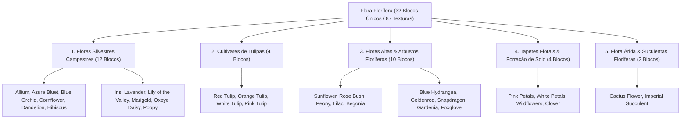

# Catálogo e Estrutura de Worldbuilding: Flora Floral e Herbácea Florífera (Flowers)

Todas as texturas ativas da flora com inflorescências vistosas, arbustos floríferos e tapetes de pétalas estão organizadas na pasta:
📂 **`docs/worldbuilding/flowers`** *(87 texturas PNG ativas, representando 32 blocos únicos divididos em 5 categorias estritamente pares)*

---

## 1. Classificação Ecológica e Estratos Florais

A flora com inflorescência do mundo é organizada em **5 Grandes Grupos Morfológicos (32 Blocos Únicos / 87 Texturas)**, atendendo rigorosamente à regra de paridade tanto no cômputo global quanto em cada subdivisão:

---

## 2. Padrões Estruturais e Variações Aleatórias

Na arquitetura da engine voxel, todas as texturas possuem resolução nativa de **16×16 pixels RGBA** e contam com o prefixo unificado `flower_`. Arquivos com sufixos numéricos (`1, 2, 3...`) representam variações visuais aleatórias do mesmo bloco inseridas pela geração procedural.

1. **Flores Simples em Cruz / Billboard (1 Bloco)**:
   - Renderizadas em planos verticais recortados em cruz (*cross-billboard*).
   - Possuem entre 1 e 5 variações estéticas que alteram a inclinação dos caules, densidade das pétalas e botões auxiliares.
2. **Flores Altas Compostas de Dois Blocos (Double-Tall Flora / 2 Blocos)**:
   - **Segmento Inferior (`flower_*_bottom.png`)**: Fixação radicular ao solo, folhagem basal e colmos robustos.
   - **Segmento Superior (`flower_*_top.png`)**: Espigas florais eretas, panículas, corolas abertas ou ápices cônicos.
   - **Caso Especial Heliotrópico (Sunflower)**: Conta com sprites direcionais (`flower_sunflower_front.png` e `back.png`) para alinhar o capítulo floral com o azimute solar.
3. **Tapetes Florais e Forração Rasteira (Ground Cover / Carpet)**:
   - Texturas horizontais rentes ao solo (`flower_*_petals.png`, `flower_clover.png`) complementadas por arquivos de ancoragem radicular (`flower_*_stem.png`).

---

## 3. Catálogo dos 32 Blocos Floríferos Únicos (87 Texturas)

| # | Bloco / Espécie | Categoria | Arquivo(s) de Textura | Variações | Biomas & Ocorrência Natural | Definição Botânica & Morfologia |
| :-: | :--- | :--- | :--- | :---: | :--- | :--- |
| **01** | **Allium** | **Silvestre Campestre** | `flower_allium.png` a `3` | 4 | Pradarias, Encostas Rochosas | Inflorescência esférica globosa de coloração magenta-violácea sobre escapo floral ereto e delgado. |
| **02** | **Azure Bluet** | **Silvestre Campestre** | `flower_azure_bluet.png` a `3` | 4 | Campos de Altitude, Bosques Claros | Pequena flor em tufo cespitoso com corola quadrilobada azul-celeste e centro amarelo suave. |
| **03** | **Blue Orchid** | **Silvestre Campestre** | `flower_blue_orchid.png`, `1` | 2 | Pântanos, Várzeas Úmidas | Orquídea herbácea de pétalas zigomorfas azul-anil brilhantes, adaptada a solos saturados de umidade. |
| **04** | **Cornflower** | **Silvestre Campestre** | `flower_cornflower.png` a `2` | 3 | Pradarias Abertas, Campos Agrícolas | Inflorescência radiada com lígulas azuis recortadas de tom azul-profundo, pioneira em solos ensolarados. |
| **05** | **Dandelion** | **Silvestre Campestre** | `flower_dandelion.png` a `3` | 4 | Prados Temperados, Clareiras | Capítulos florais amarelo-ouro brilhantes com roseta basal de folhas denteadas; pioneira cosmopolita. |
| **06** | **Hibiscus** | **Silvestre Campestre** | `flower_hibiscus.png` | 1 | Selvas Tropicais, Orlas Marítimas | Flor actinomorfa ampla com pétalas escarlates sedosas e coluna estaminal proeminente amarela. |
| **07** | **Iris** | **Silvestre Campestre** | `flower_iris.png` | 1 | Margens de Rios, Encostas Úmidas | Flores elegantes com sépalas caídas violeta-escuras e tépalas eretas com guias nectaríferos centrais. |
| **08** | **Lavender** | **Silvestre Campestre** | `flower_lavender.png` | 1 | Encostas Mediterrâneas, Colinas Secas | Espigas florais verticiladas de aroma resinoso com corolas tubulares em tons suaves de lilás. |
| **09** | **Lily of the Valley**| **Silvestre Campestre** | `flower_lily_of_the_valley.png` a `2` | 3 | Florestas Umbrófilas, Sub-bosques | Flores campânulas pendentes brancas alvas em racemo unilateral sobre folhagem elíptica verde-escura. |
| **10** | **Marigold** | **Silvestre Campestre** | `flower_marigold.png`, `1` | 2 | Vales Temperados, Jardins Selvagens | Capítulos dobrados em pompom com pétalas franzidas alaranjadas e douradas e folhagem pinada aromática. |
| **11** | **Oxeye Daisy** | **Silvestre Campestre** | `flower_oxeye_daisy.png` a `2` | 3 | Planícies Temperadas, Pastagens | Capítulos florais clássicos com disco central amarelo-ouro e lígulas brancas radiantes simétricas. |
| **12** | **Poppy** | **Silvestre Campestre** | `flower_poppy.png` a `4` | 5 | Estepes, Prados Secos, Colinas | Flores solitárias efêmeras com quatro pétalas vermelho-fogo escarlates onduladas e mácula escura central. |
| **13** | **Red Tulip** | **Cultivar de Tulipa** | `flower_red_tulip.png` a `2` | 3 | Vales Aluviais, Encostas Temperadas | Flor em forma de taça perfeita com tépalas vermelho-carmesim intensas e folhas basais glaucas. |
| **14** | **Orange Tulip** | **Cultivar de Tulipa** | `flower_orange_tulip.png` a `2` | 3 | Campos Ensolarados, Savanas Temperadas | Tépalas alaranjadas vibrantes com gradiente amarelado na base da corola e colmo verde-claro ereto. |
| **15** | **White Tulip** | **Cultivar de Tulipa** | `flower_white_tulip.png` a `2` | 3 | Pradarias Frias, Colinas Alpinas | Corola nívea imaculada de textura aveludada, refletindo a luz solar em campos abertos e frescos. |
| **16** | **Pink Tulip** | **Cultivar de Tulipa** | `flower_pink_tulip.png` a `2` | 3 | Bosques Claros, Prados Floridos | Tépalas rosadas suaves em degradê pastel delicado, conferindo suavidade aos vales temperados. |
| **17** | **Sunflower** | **Flor Alta (2 Blocos)** | `flower_sunflower_bottom.png`, `1` `flower_sunflower_top.png` `flower_sunflower_front.png`, `back.png` | 5 | Pradarias Altas, Planícies Quentes | Caule robusto cerdoso encimado por capítulo floral gigante dourado com heliotropismo orientado ao sol. |
| **18** | **Rose Bush** | **Flor Alta (2 Blocos)** | `flower_rose_bush_bottom.png`, `1` `flower_rose_bush_top.png` a `3` | 6 | Florestas Temperadas, Capoeiras | Arbusto denso ramificado com acúleos e grandes botões florais dobrados vermelho-escarlate. |
| **19** | **Peony** | **Flor Alta (2 Blocos)** | `flower_peony_bottom.png`, `1` `flower_peony_top.png`, `1` | 4 | Bosques Úmidos, Vales Abrigados | Moita lenhosa de folhagem recortada com densas flores globosas cor-de-rosa de múltiplas pétalas crespas. |
| **20** | **Lilac** | **Flor Alta (2 Blocos)** | `flower_lilac_bottom.png`, `1` `flower_lilac_top.png`, `1` | 4 | Encostas Pedregosas, Bordas de Floresta | Panículas cônicas densas de pequenas flores violáceas aromáticas sobre galhos lenhosos eretos. |
| **21** | **Begonia** | **Flor Alta (2 Blocos)** | `flower_begonia_bottom.png` `flower_begonia_top.png` | 2 | Selvas Tropicais Úmidas, Encostas | Planta semi-arbustiva de caules carnosos avermelhados, folhas assimétricas e cachos florais pendentes. |
| **22** | **Blue Hydrangea** | **Flor Alta (2 Blocos)** | `flower_blue_hydrangea_bottom.png` `flower_blue_hydrangea_top.png` | 2 | Solos Ácidos, Matas Nebulares | Corimbos esféricos compactos em tons de azul-hortênsia intenso, condicionados pela acidez natural do solo. |
| **23** | **Goldenrod** | **Flor Alta (2 Blocos)** | `flower_goldenrod_bottom.png` `flower_goldenrod_top.png` | 2 | Várzeas Secas, Campos Abertos | Caules compridos terminados em densas plumas amarelo-canário recurvadas que se agitam com o vento. |
| **24** | **Snapdragon** | **Flor Alta (2 Blocos)** | `flower_snapdragon_bottom.png` `flower_snapdragon_top.png` | 2 | Encostas Rochosas, Desfiladeiros | Espigas alongadas de flores bilabiadas fechadas em degradê rosa-magenta e amarelo no labelo. |
| **25** | **Gardenia** | **Flor Alta (2 Blocos)** | `flower_gardenia_bottom.png` `flower_gardenia_top.png` | 2 | Florestas Subtropicais, Capoeiras | Arbusto de folhas coriáceas verde-lustrosas com flores alvas cremosas de perfume denso e pétalas aveludadas. |
| **26** | **Foxglove** | **Flor Alta (2 Blocos)** | `flower_foxglove_bottom.png` `flower_foxglove_top.png` | 2 | Bosques Temperados, Clareiras | Espiga majestosa ereta com flores tubulosas pendentes em sino rosa-magenta com garganta creme salpicada. |
| **27** | **Pink Petals** | **Tapete / Forração** | `flower_pink_petals.png` `flower_pink_petals_stem.png` | 2 | Bosques de Cerejeira, Bosques Floridos | Lâminas soltas de pétalas rosadas caídas acumuladas em densidades variáveis sobre o leito florestal. |
| **28** | **White Petals** | **Tapete / Forração** | `flower_white_petals.png` `flower_white_petals_stem.png` | 2 | Bosques Decíduos Frios, Pomares | Tapete disperso de pétalas brancas finas que mimetizam uma suave precipitação floral primaveril. |
| **29** | **Wildflowers** | **Tapete / Forração** | `flower_wildflowers.png`, `1` `flower_wildflowers_stem.png` | 3 | Pradarias Alpinas, Vales Verdes | Manto contínuo de microflores policromáticas emaranhadas rasteiras que recobrem gramados abertos. |
| **30** | **Clover** | **Tapete / Forração** | `flower_clover.png` `flower_clover_stem.png` | 2 | Pastagens, Bosques Claros, Encostas | Forração densa de folhas trifolioladas rasteiras com ocasionais inflorescências globulares claras. |
| **31** | **Cactus Flower**| **Flora Árida / Suculenta** | `flower_cactus_flower.png` | 1 | Desertos, Platôs Áridos | Flor solitária de corola amarela brilhante com numerosas pétalas que brota nos vértices espinhosos de cactos. |
| **32** | **Imperial Succulent**| **Flora Árida / Suculenta**| `flower_imperial_succulent.png` | 1 | Chapadas Rochosas, Cânions | Roseta compacta simétrica de folhas carnosas glaucas acumuladoras de água com inflorescência ereta. |

---

## 4. Inventário Técnico Completo de Texturas em `worldbuilding/flowers/` (87 Texturas Ativas)

Todas as 87 texturas da pasta iniciam estritamente com o prefixo unificado `flower_`:

### A. Flores Silvestres Campestres (33 Arquivos)
* `flower_allium.png`, `flower_allium1.png`, `flower_allium2.png`, `flower_allium3.png`
* `flower_azure_bluet.png`, `flower_azure_bluet1.png`, `flower_azure_bluet2.png`, `flower_azure_bluet3.png`
* `flower_blue_orchid.png`, `flower_blue_orchid1.png`
* `flower_cornflower.png`, `flower_cornflower1.png`, `flower_cornflower2.png`
* `flower_dandelion.png`, `flower_dandelion1.png`, `flower_dandelion2.png`, `flower_dandelion3.png`
* `flower_hibiscus.png`
* `flower_iris.png`
* `flower_lavender.png`
* `flower_lily_of_the_valley.png`, `flower_lily_of_the_valley1.png`, `flower_lily_of_the_valley2.png`
* `flower_marigold.png`, `flower_marigold1.png`
* `flower_oxeye_daisy.png`, `flower_oxeye_daisy1.png`, `flower_oxeye_daisy2.png`
* `flower_poppy.png`, `flower_poppy1.png`, `flower_poppy2.png`, `flower_poppy3.png`, `flower_poppy4.png`

### B. Cultivares de Tulipas (12 Arquivos)
* `flower_red_tulip.png`, `flower_red_tulip1.png`, `flower_red_tulip2.png`
* `flower_orange_tulip.png`, `flower_orange_tulip1.png`, `flower_orange_tulip2.png`
* `flower_white_tulip.png`, `flower_white_tulip1.png`, `flower_white_tulip2.png`
* `flower_pink_tulip.png`, `flower_pink_tulip1.png`, `flower_pink_tulip2.png`

### C. Flores Altas e Arbustos Floríferos (31 Arquivos)
* `flower_sunflower_bottom.png`, `flower_sunflower_bottom1.png`, `flower_sunflower_top.png`, `flower_sunflower_front.png`, `flower_sunflower_back.png`
* `flower_rose_bush_bottom.png`, `flower_rose_bush_bottom1.png`, `flower_rose_bush_top.png`, `flower_rose_bush_top1.png`, `flower_rose_bush_top2.png`, `flower_rose_bush_top3.png`
* `flower_peony_bottom.png`, `flower_peony_bottom1.png`, `flower_peony_top.png`, `flower_peony_top1.png`
* `flower_lilac_bottom.png`, `flower_lilac_bottom1.png`, `flower_lilac_top.png`, `flower_lilac_top1.png`
* `flower_begonia_bottom.png`, `flower_begonia_top.png`
* `flower_blue_hydrangea_bottom.png`, `flower_blue_hydrangea_top.png`
* `flower_goldenrod_bottom.png`, `flower_goldenrod_top.png`
* `flower_snapdragon_bottom.png`, `flower_snapdragon_top.png`
* `flower_gardenia_bottom.png`, `flower_gardenia_top.png`
* `flower_foxglove_bottom.png`, `flower_foxglove_top.png`

### D. Tapetes Florais e Forração de Solo (9 Arquivos)
* `flower_pink_petals.png`, `flower_pink_petals_stem.png`
* `flower_white_petals.png`, `flower_white_petals_stem.png`
* `flower_wildflowers.png`, `flower_wildflowers1.png`, `flower_wildflowers_stem.png`
* `flower_clover.png`, `flower_clover_stem.png`

### E. Flora Árida e Suculentas Floríferas (2 Arquivos)
* `flower_cactus_flower.png`
* `flower_imperial_succulent.png`
