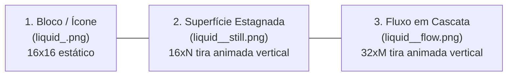

# Catálogo e Estrutura de Worldbuilding: Fluidos, Hidrosfera e Criologia (Fluidos & Gelo)

Todas as texturas ativas de fluidos, líquidos e gelos estão organizadas na pasta:
📂 **`docs/worldbuilding/fluids`** *(38 texturas PNG ativas: 8 blocos de gelo/criologia e 10 fluidos com tríades completas de bloco, still e flow)*

---

## 1. Classificação Termodinâmica e Reologia dos Fluidos

O sistema de fluidos e estados físicos do jogo organiza a matéria líquida e criogênica em **4 Grandes Domínios Reológicos**:

```mermaid
graph TD
    A["Fluidos & Criologia (38 Texturas)"] --> B["1. Criologia & Glaciares (8 Gelos)"]
    A --> C["2. Hidrosfera Aquática (2 Águas)"]
    A --> D["3. Magmatismo & Piroclásticos (3 Lavas)"]
    A --> E["4. Químicos, Biológicos & Betumes (5 Líquidos)"]

    B --> B1["Ice: Gelo de congelamento superficial límpido (Normal translúcido, Fragile trincado, Packed opaco denso)"]
    B --> B2["Black Ice: Gelo de profundidade abissal tipo Baikal (Normal translúcido, Fragile com fendas brancas, Packed opaco)"]
    B --> B3["Blue Ice: Gelo fóssil de geleiras milenares (Normal opaco de alta pureza, Cracked com células e bolhas)"]

    C --> C1["Water: Água padrão neutra em escala de cinza para Biome Tinting procedural dinâmico"]
    C --> C2["Spring Water: Água termal mineralizada cristalina azul-turquesa fumegante"]

    D --> D1["Lava: Lava basáltica padrão de vulcanismo superficial efusivo (1000°C - 1200°C)"]
    D --> D2["Core Magma: Magma ultra-incandescente do manto profundo e núcleo planetário"]
    D --> D3["Molten: Escória metálica e minerais liquefeitos sob temperaturas de fusão metalúrgica"]

    E --> E1["Acid: Solução aquosa corrosiva verde-neon de alta reatividade química"]
    E --> E2["Blood: Fluido biológico visceral arterial espesso carmesim de alta densidade celular"]
    E --> E3["Ooze: Secreção biológica gelatinosa e limo orgânico verde com vesículas e bolhas"]
    E --> E4["Sludge: Lamaçal e lodo denso de pântanos e solos alagadiços (muck terroso marrom)"]
    E --> E5["Tar: Hidrocarboneto fóssil negro pastoso e betume natural de alta viscosidade"]
```

---

## 2. A Tríade de Texturas dos Fluidos: Bloco, Still e Flow

Para cada um dos 10 fluidos do jogo, existem 3 níveis de representação visual:

1. **Textura Base / Bloco (`liquid_<nome>.png`)**:
   - `16x16` pixels. Utilizada para partículas, baldes, ícones e representações estáticas de blocos fontes.
2. **Superfície Estagnada / Still (`liquid_<nome>_still.png`)**:
   - `16` pixels de largura por `16*N` pixels de altura (tiras verticais de 8 a 36 frames).
   - Renderizada nas faces horizontais superiores de reservatórios e lagos parados, simulando ondulações suaves de superfície.
3. **Fluxo em Cascata / Flow (`liquid_<nome>_flow.png`)**:
   - `32` pixels de largura por `32*M` pixels de altura (tiras verticais de 8 a 32 frames de 32x32).
   - Renderizada nas faces verticais e declives de cachoeiras e correntes em queda, simulando o turbilhonamento e escorrimento gravitacional acelerado do líquido.

---

## 3. Catálogo dos Gelos e Glaciares (8 Variantes)

O gelo é modelado em 3 linhagens térmicas, cobrindo diferentes estados de compactação, profundidade e deformação estrutural:

| Bloco | Arquivo de Textura | Opacidade & Alfa | Propriedades Visuais | Origem & Características Físicas |
| :--- | :--- | :---: | :--- | :--- |
| **Ice** | `frost_ice.png` | Translúcido (`alpha=153`) | Gelo límpido cristalino azul-celeste | Camada de gelo de congelamento hídrico superficial, com baixo atrito de superfície e refração límpida. |
| **Fragile Ice** | `frost_ice_fragile.png` | Translúcido (`alpha=153`) | Base translúcida com **trincas capilares sutis** | Placa fina de gelo de congelamento recente, enfraquecida por micro-fissuras superficiais de tensão térmica. |
| **Packed Ice** | `frost_ice_packed.png` | **100% Opaco** (`RGB`) | Gelo prensado maciço sem bolhas internas | Gelo compactado sob acúmulo contínuo de neve (firn), denso, de alta resistência mecânica e opaco. |
| **Black Ice** | `frost_ice_black.png` | Translúcido (`alpha=160`) | Gelo negro de profundidade tipo Baikal (vidro de obsidiana escuro) | Formação límpida e isenta de bolhas sobre águas abissais profundas, agindo como um vidro escuro natural. |
| **Fragile Black Ice** | `frost_ice_black_fragile.png` | Translúcido (`alpha=160`) | Base negra com **fissuras geométricas brancas e ciano marcantes** | Placas de gelo negro de alta profundidade entrecortadas por grandes planos de clivagem e fraturas térmicas. |
| **Packed Black Ice** | `frost_ice_black_packed.png` | **100% Opaco** (`RGB`) | Gelo negro ultra-denso maciço de permafrost profundo | Rocha-gelo de permafrost milenar profundo com alta concentração de sedimentos finos e densidade máxima. |
| **Blue Ice** | `frost_blue_ice.png` | **100% Opaco** (`RGB`) | Gelo glacial fóssil comprimido de azul profundo saturado | Gelo milenar de geleiras continentais sob pressão colossal que expele todo ar retido, refratando luz em azul cobalto puro. |
| **Cracked Blue Ice** | `frost_blue_ice_cracked.png` | **100% Opaco** (`RGB`) | Câmaras de gelo azul com **rede celular de veios brancos e bolhas** | Gelo de geleira submetido a estresse tectônico de fluxo, com câmaras azuladas contornadas por veios de gelo fosco e bolhas de ar aprisionadas. |

---

## 4. Catálogo dos 10 Fluidos (30 Texturas)

| # | Fluido | Natureza & Viscosidade | Bloco (16x16) | Still (16xN) | Flow (32xM) | Origem & Características Físicas |
| :-: | :--- | :--- | :--- | :--- | :--- | :--- |
| **01** | **Water** | **Fluido Neutro (Baixa)** | `liquid_water.png` | `liquid_water_still.png` | `liquid_water_flow.png` | **Grayscale**: recebe *Biome Tinting* dinâmico por temperatura/umidade (azul-celeste em rios, verde-escuro em pântanos, azul-frio em oceanos). |
| **02** | **Spring Water** | **Água Termal (Baixa)** | `liquid_spring_water.png` | `liquid_spring_water_still.png` | `liquid_spring_water_flow.png` | Água aquecida geotermicamente rica em minerais dissolvidos (sílica, enxofre e carbonatos), com tom turquesa límpido fixo. |
| **03** | **Lava** | **Magma Ígneo (Alta)** | `liquid_lava.png` | `liquid_lava_still.png` | `liquid_lava_flow.png` | Silicato basáltico fundido expelido por vulcanismo efusivo superficial a temperaturas entre 1000°C e 1200°C. |
| **04** | **Core Magma** | **Superaquecido (Média-Alta)** | `liquid_core_magma.png` | `liquid_core_magma_still.png` | `liquid_core_magma_flow.png` | Magma ultra-incandescente do manto inferior, com coloração amarelo-solar e temperaturas extremas originárias do interior planetário. |
| **05** | **Molten** | **Metal Fundido (Alta)** | `liquid_molten.png` | `liquid_molten_still.png` | `liquid_molten_flow.png` | Mistura liquefeita de metais pesados e escória mineral silicatada em estado de fusão líquida incandescente. |
| **06** | **Acid** | **Solução Corrosiva (Baixa)** | `liquid_acid.png` | `liquid_acid_still.png` | `liquid_acid_flow.png` | Solução aquosa altamente concentrada em compostos químicos reativos, de coloração verde-esmeralda/neon brilhante. |
| **07** | **Blood** | **Fluido Vital (Média)** | `liquid_blood.png` | `liquid_blood_still.png` | `liquid_blood_flow.png` | Fluido biológico orgânico denso e viscoso, com hemoglobina arterial e elevada concentração de biomoléculas carmesins. |
| **08** | **Ooze** | **Bio-Limo (Alta)** | `liquid_ooze.png` | `liquid_ooze_still.png` | `liquid_ooze_flow.png` | Suspensão coloidal biológica espessa, rica em colônias de bactérias e mucilagem verde-oliva com vesículas de gás orgânico. |
| **09** | **Sludge** | **Lamaçal / Lodo (Alta)** | `liquid_sludge.png` | `liquid_sludge_still.png` | `liquid_sludge_flow.png` | Mistura coloidal marrom-escura de partículas de argila, silte fino e matéria orgânica em decomposição alagada. |
| **10** | **Tar** | **Hidrocarboneto (Muito Alta)** | `liquid_tar.png` | `liquid_tar_still.png` | `liquid_tar_flow.png` | Piche fóssil e asfalto natural líquido (`alpha=216`), produto da alteração e oxidação de depósitos profundos de petróleo em superfície. |

---

## 5. Notas de Design e Nomenclatura

### 5.1 Nomenclatura: Core Magma
- **Padronização**: O fluido substitui o termo anterior `primal_magma`. O termo **`Core Magma` (Magma do Núcleo)** comunica a distinção entre a lava basáltica de superfície e o fluido geotérmico do manto profundo.

### 5.2 Distinção Visual: Ooze vs Sludge vs Tar
- **`ooze`**: Gosma viva / limo biológico verde-oliva translúcido com bolhas orgânicas.
- **`sludge`**: Lamaçal espesso, água barrenta e atoleiro marrom-terroso de pântanos e planícies aluviais (`#261a11` a `#967350`).
- **`tar`**: Piche e hidrocarboneto negro betuminoso fóssil de alta densidade (`alpha=216`).

### 5.3 Padrão Estrutural dos Gelos
- **Black Ice**: Reproduz a transparência e as fraturas internas do Lago Baikal sobre águas abissais escuras.
- **Cracked Blue Ice**: Reproduz a morfologia de geleiras de alta pressão com câmaras poligonais de gelo azul saturado circundadas por teias de veios de gelo fosco e bolhas de ar presas em profundidade.

---

## 6. Inventário Técnico Completo de Texturas em `worldbuilding/fluids/` (38 Texturas Ativas)

### A. Criologia e Gelos (8 Texturas 16x16)
* `frost_ice.png` *(Translúcido)*
* `frost_ice_fragile.png` *(Translúcido com trincas)*
* `frost_ice_packed.png` *(Opaco RGB)*
* `frost_ice_black.png` *(Translúcido escuro)*
* `frost_ice_black_fragile.png` *(Translúcido com fraturas marcantes)*
* `frost_ice_black_packed.png` *(Opaco RGB escuro)*
* `frost_blue_ice.png` *(Opaco RGB glacial azul)*
* `frost_blue_ice_cracked.png` *(Opaco RGB com rede celular de fraturas e bolhas)*

### B. Blocos / Ícones Estáticos de Fluidos (10 Texturas 16x16)
* `liquid_water.png` *(Grayscale)*
* `liquid_spring_water.png`
* `liquid_lava.png`
* `liquid_core_magma.png`
* `liquid_molten.png`
* `liquid_acid.png`
* `liquid_blood.png`
* `liquid_ooze.png`
* `liquid_sludge.png`
* `liquid_tar.png`

### C. Tiras Animadas de Superfície / Still (10 Texturas 16xN)
* `liquid_water_still.png` *(16x576 - 36 frames)*
* `liquid_spring_water_still.png` *(16x512 - 32 frames)*
* `liquid_lava_still.png` *(16x512 - 32 frames)*
* `liquid_core_magma_still.png` *(16x320 - 20 frames)*
* `liquid_molten_still.png` *(16x480 - 30 frames)*
* `liquid_acid_still.png` *(16x256 - 16 frames)*
* `liquid_blood_still.png` *(16x480 - 30 frames)*
* `liquid_ooze_still.png` *(16x480 - 30 frames)*
* `liquid_sludge_still.png` *(16x480 - 30 frames)*
* `liquid_tar_still.png` *(16x480 - 30 frames)*

### D. Tiras Animadas de Fluxo em Cascata / Flow (10 Texturas 32xM)
* `liquid_water_flow.png` *(32x256 - 8 frames)*
* `liquid_spring_water_flow.png` *(32x1024 - 32 frames)*
* `liquid_lava_flow.png` *(32x512 - 16 frames)*
* `liquid_core_magma_flow.png` *(32x512 - 16 frames)*
* `liquid_molten_flow.png` *(32x512 - 16 frames)*
* `liquid_acid_flow.png` *(32x512 - 16 frames)*
* `liquid_blood_flow.png` *(32x512 - 16 frames)*
* `liquid_ooze_flow.png` *(32x512 - 16 frames)*
* `liquid_sludge_flow.png` *(32x512 - 16 frames)*
* `liquid_tar_flow.png` *(32x512 - 16 frames)*
