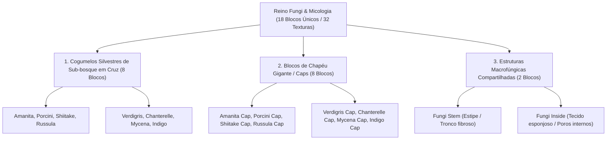

# Catálogo e Estrutura de Worldbuilding: Micologia, Macrofungos e Espécies Silvestres (Fungi)

Todas as texturas ativas do reino fungi (cogumelos de sub-bosque em cruz, blocos de chapéu gigante e estruturas macrofúngicas) estão organizadas na pasta:
📂 **`docs/worldbuilding/fungi`** *(32 texturas PNG ativas, representando 18 blocos únicos divididos em 3 categorias estritamente pares)*

---

## 1. Classificação Micológica e Estrutura de Macrofungos

O ecossistema micológico do mundo é estruturado em **3 Categorias Morfológicas (18 Blocos Únicos / 32 Texturas)**, atendendo rigorosamente à regra de paridade tanto no cômputo global quanto em cada subdivisão:

---

## 2. Padrões Anatômicos e Variações Aleatórias

Na arquitetura da engine voxel, todas as texturas possuem resolução de **16×16 pixels RGBA** e utilizam o prefixo unificado `fungi_`.

1. **Cogumelos Rasteiros Simples em Cruz / Billboard (`fungi_<espécie>.png`)**:
   - Renderizados em malhas verticais cruzadas (*cross-billboard*), ideais para forração de solo florestal úmido, cavernas e troncos em decomposição.
   - **Garantia de Variação Procedural**: Todas as 8 espécies possuem no mínimo 2 variações estéticas aleatórias (`.png` e `1.png`), com espécies amplamente dispersas como *Amanita* e *Porcini* contando com até 5 variações (`a 4`), quebrando a repetitividade visual na paisagem.
2. **Blocos de Chapéu Macrofúngico (`fungi_<espécie>_cap.png`)**:
   - Texturas cúbicas sólidas semitranslúcidas ou opacas que recobrem a cúpula dos cogumelos gigantes.
   - Utilizam a nomenclatura anatômica exata **`_cap`** (*pileus*), preservando uma única textura homogênea por espécie gigante.
   - Paletas recalibradas para refletir a pigmentação orgânica e natural de espécimes selvagens da vida real (tons terrosos de damasco, ocre, sálvia, ardósia e carmesim aveludado).
3. **Blocos Estruturais de Sustentação (`fungi_stem.png` e `fungi_inside.png`)**:
   - **`fungi_stem`**: Representa a coluna fibrosa de sustentação estipital.
   - **`fungi_inside`**: Representa a carne esponjosa e os túbulos himeniais internos.

---

## 3. Catálogo dos 18 Blocos Micológicos Únicos (32 Texturas)

| # | Bloco / Espécie | Categoria Micológica | Arquivo(s) de Textura | Variações | Biomas & Nicho Ecológico | Definição Biológica & Características |
| :-: | :--- | :--- | :--- | :---: | :--- | :--- |
| **01** | **Amanita** | **Cogumelo Rasteiro** | `fungi_amanita.png` a `4` | 5 | Florestas Temperadas, Taigas | *Amanita muscaria*: O icônico agárico com píleo escarlate brilhante pontilhado de remanescentes do véu universal esbranquiçados. |
| **02** | **Porcini** | **Cogumelo Rasteiro** | `fungi_porcini.png` a `4` | 5 | Bosques Decíduos, Carvalhais | *Boletus edulis*: Boleto nobre de píleo castanho-aveludado convexo, himênio poroso e estipe carnudo espesso e firme. |
| **03** | **Shiitake** | **Cogumelo Rasteiro** | `fungi_shiitake.png`, `1` | 2 | Matas Nebulares, Troncos Caídos | *Lentinula edodes*: Fungo lignícola de chapéu castanho-claro estriado e margem enrolada que decompõe madeira morta. |
| **04** | **Russula** | **Cogumelo Rasteiro** | `fungi_russula.png`, `1` | 2 | Bosques Úmidos, Clareiras | *Russula emetica*: Fungo silvestre de chapéu carmesim vívido com cutícula aveludada e lamelas alvas quebradiças. |
| **05** | **Verdigris** | **Cogumelo Rasteiro** | `fungi_verdigris.png`, `1` | 2 | Bosques Úmidos, Solos Musgosos | *Stropharia aeruginosa*: Fungo azul-petróleo/turquesa com viscosidade azulada e escamas amarelas/douradas esparsas. |
| **06** | **Chanterelle** | **Cogumelo Rasteiro** | `fungi_chanterelle.png`, `1` | 2 | Florestas Mistas, Encostas | *Cantharellus cibarius*: Cantarelo de coloração ocre-damasco a ouro suave em forma de trombeta com dobras decurrentes. |
| **07** | **Mycena** | **Cogumelo Rasteiro** | `fungi_mycena.png`, `1` | 2 | Cavernas Escuras, Selvas Tropicais | *Mycena chlorophos*: Pequeno cogumelo de estipe delgado e chapéu campanulado em tons verde-sálvia/musgo com bioluminescência suave. |
| **08** | **Indigo** | **Cogumelo Rasteiro** | `fungi_indigo.png`, `1` | 2 | Cavernas Profundas, Fendas Úmidas | *Lactarius indigo*: Agárico azul-índigo/ardósia com zonas concêntricas prateadas e látex azul anil escuro natural. |
| **09** | **Amanita Cap** | **Chapéu Macrofúngico** | `fungi_amanita_cap.png` | 1 | Megabosques, Vales Encantados | Epiderme superior escarlate com textura micelial densa salpicada de placas e verrugas esbranquiçadas convexas. |
| **10** | **Porcini Cap** | **Chapéu Macrofúngico** | `fungi_porcini_cap.png` | 1 | Megabosques Temperados | Tecido coriáceo marrom-terra escuro aveludado resistente à dessecação com sutil gradiente ocre nas bordas. |
| **11** | **Shiitake Cap** | **Chapéu Macrofúngico** | `fungi_shiitake_cap.png` | 1 | Vales Fluviais de Troncos Velhos | Superfície fúngica fibrosa em tons de castanho-caramelo com fissuras naturais e micro-ranhuras miceliares. |
| **12** | **Russula Cap** | **Chapéu Macrofúngico** | `fungi_russula_cap.png` | 1 | Bosques Temperados, Matas Úmidas | Bloco de epiderme carmesim profundo uniforme com textura sedosa e tonalidade carmim terrosa rica. |
| **13** | **Verdigris Cap** | **Chapéu Macrofúngico** | `fungi_verdigris_cap.png` | 1 | Pântanos Profundos, Várzeas Úmidas | Epiderme azul-petróleo profunda com escamas amarelas douradas salpicadas e película protetora natural. |
| **14** | **Chanterelle Cap**| **Chapéu Macrofúngico** | `fungi_chanterelle_cap.png` | 1 | Planaltos Floridos, Encostas Claras | Cúpula espessa amarelo-damasco a ocre aveludado com ondulações radiais decurrentes e textura fosca. |
| **15** | **Mycena Cap** | **Chapéu Macrofúngico** | `fungi_mycena_cap.png` | 1 | Salões Cavernosos, Grutas Úmidas | Chapéu gigante com tonalidade verde-musgo/sálvia orgânica emanando luminescência verde fosca e profunda. |
| **16** | **Indigo Cap** | **Chapéu Macrofúngico** | `fungi_indigo_cap.png` | 1 | Cavernas Abissais, Geodos Úmidos | Chapéu gigante azul-ardósia e denim com anéis zonados discretos de pigmentação azul-índigo terrosa. |
| **17** | **Fungi Stem** | **Estrutura de Sustentação** | `fungi_stem.png` | 1 | Troncos de Macrofungos | Coluna cilíndrica de hifas longitudinais compactadas de coloração marfim-creme que compõe o estipe do cogumelo gigante. |
| **18** | **Fungi Inside** | **Tecido Interno / Himenial**| `fungi_inside.png` | 1 | Interior & Base dos Chapéus | Carne esponjosa pálida rica em túbulos himeniais e poros férteis que reveste o interior das copas fúngicas. |

---

## 4. Inventário Técnico Completo de Texturas em `worldbuilding/fungi/` (32 Texturas Ativas)

Todas as 32 texturas da pasta utilizam estritamente o prefixo `fungi_`:

### A. Cogumelos Silvestres de Sub-bosque em Cruz (22 Arquivos)
* `fungi_amanita.png`, `fungi_amanita1.png`, `fungi_amanita2.png`, `fungi_amanita3.png`, `fungi_amanita4.png` *(5 variações)*
* `fungi_porcini.png`, `fungi_porcini1.png`, `fungi_porcini2.png`, `fungi_porcini3.png`, `fungi_porcini4.png` *(5 variações)*
* `fungi_shiitake.png`, `fungi_shiitake1.png` *(2 variações)*
* `fungi_russula.png`, `fungi_russula1.png` *(2 variações)*
* `fungi_verdigris.png`, `fungi_verdigris1.png` *(2 variações)*
* `fungi_chanterelle.png`, `fungi_chanterelle1.png` *(2 variações)*
* `fungi_mycena.png`, `fungi_mycena1.png` *(2 variações)*
* `fungi_indigo.png`, `fungi_indigo1.png` *(2 variações)*

### B. Blocos de Chapéu Macrofúngico / Caps (8 Arquivos)
* `fungi_amanita_cap.png`
* `fungi_porcini_cap.png`
* `fungi_shiitake_cap.png`
* `fungi_russula_cap.png`
* `fungi_verdigris_cap.png`
* `fungi_chanterelle_cap.png`
* `fungi_mycena_cap.png`
* `fungi_indigo_cap.png`

### C. Blocos Estruturais Macrofúngicos Compartilhados (2 Arquivos)
* `fungi_stem.png`
* `fungi_inside.png`
