# Catálogo e Estrutura de Worldbuilding: Ecossistemas Oceânicos e Bentônicos (Oceans)

Todas as texturas ativas de biomas marinhos, recifes de coral, bentos e hidrófitas estão organizadas na pasta:
📂 **`docs/worldbuilding/oceans`** *(61 texturas PNG ativas, representando 38 blocos únicos divididos em 6 categorias)*

---

## 1. Classificação Ecológica e Estratos Oceânicos

O domínio oceânico e aquático é organizado em **6 Grandes Categorias Fisionômicas (38 Blocos Únicos)**:

```mermaid
graph TD
    O["Ecossistemas Marinhos & Bentônicos (38 Blocos Únicos / 61 Texturas)"] --> A["1. Corais Vivos Maciços (12 Blocos)"]
    O --> B["2. Leques de Coral Vivos (12 Blocos)"]
    O --> C["3. Corais Calcificados Mortos (2 Blocos)"]
    O --> D["4. Estruturas Bentônicas & Fundo (8 Blocos)"]
    O --> E["5. Vegetação Subaquática (2 Blocos)"]
    O --> F["6. Hidrófitas Flutuantes (2 Blocos)"]

    A --> A1["Tube Coral (Azul), Brain Coral (Rosa), Bubble Coral (Púrpura)"]
    A --> A2["Fire Coral (Vermelho), Horn Coral (Amarelo), Staghorn Coral (Verde-Esmeralda)"]
    A --> A3["Heart Coral (Carmesim/Magenta), Leaf Coral (Oliva/Folhagem), Reed Coral (Índigo/Violeta)"]
    A --> A4["Spike Coral (Ciano/Turquesa), Thorn Coral (Obsidiana/Negro), Wax Coral (Marfim/Ceráceo)"]

    B --> B1["Tube, Brain, Bubble, Fire, Horn, Staghorn Fan (2 variações cada)"]
    B --> B2["Heart, Leaf, Reed, Spike, Thorn, Wax Fan (2 variações cada)"]

    C --> C1["Dead Coral Block: Bloco maciço de calcário esquelético cinza"]
    C --> C2["Dead Coral Fan: Leque de coral morto cinza ramificado (2 variações)"]

    D --> D1["Natural Sponge: Porífero biológico poroso tubular"]
    D --> D2["Algae Mat: Tapete microalgal costeiro (Top e Side)"]
    D --> D3["Geothermal Vent: Fissura vulcânica hidrotermal abissal (Top e Side)"]
    D --> D4["Sea Anemone: Cnidário bentônico de tentáculos carnosos (2 variações)"]
    D --> D5["Coralstone: Calcarenito biogênico de recife claro"]
    D --> D6["Reefstone: Rocha basáltica vulcânica escura de alicerce do recife"]
    D --> D7["Algae Reefstone: Reefstone incrustado com biofilme marinho esverdeado"]
    D --> D8["Barnacles: Crosta de cracas marinhas e cirrípedes calcários incrustados"]

    E --> E1["Kelp Plant: Macroalga parda laminar vertical (3 variações de tira animada)"]
    E --> E2["Seagrass: Grama marinha pelágica de fundo arenoso (2 variações de tira animada)"]

    F --> F1["Lily Pad: Folhas orbiculares de ninfeia verde (5 variações aleatórias)"]
    F --> F2["Helvola Pad: Ninfeia-pigmeia amarela com flor e corte angular"]
```

---

## 2. Padrões de Renderização e Nomenclatura Padrão

Todas as texturas seguem a divisão de prefixos do motor de voxels:
* **`aqua_`**: Blocos cúbicos sólidos, poríferos, rochas bentônicas, respiradouros geotérmicos e ninfeias aquáticas especiais.
* **`vege_`**: Cnidários ramificados em leque (*cross-quad billboards*), hidrófitas flutuantes e tiras animadas verticais.

1. **Blocos Cúbicos Sólidos (`16x16 pixels RGB / RGBA`)**:
   - Faces uniformes para montagem de recifes maciços e leito marinho (`aqua_*_coral.png`, `aqua_dead_coral.png`, `aqua_sponge.png`, `aqua_coralstone.png`, `aqua_reefstone.png`, `aqua_algae_reefstone.png`, `aqua_barnacles.png`).
2. **Cnidários Ramificados / Coral Fans em Cruz (`16x16 pixels RGBA`)**:
   - Renderizados no topo de blocos de coral ou rochas submarinas, com 2 variantes morfológicas de ramificação (`fan` e `fan1`).
3. **Plantas Altas Animadas de Coluna D'água (Strip Animations)**:
   - **Kelp (`16x320`)**: Tiras verticais de 20 frames de `16x16` que criam o movimento ondulante da macroalga com a correnteza marítima (3 variações: `vege_kelp_plant.png`, `1`, `2`).
   - **Seagrass (`16x240`)**: Tiras verticais de 15 frames de `16x16` simulando o capim-marinho oscilando no leito de areia (2 variações: `vege_seagrass.png`, `1`).
4. **Hidrófitas Flutuantes Horizontais (Surface Flats)**:
   - Texturas `16x16 RGBA` posicionadas rente à película da água (`vege_lily_pad` a `4`, `aqua_helvola_pad`).

---

## 3. Catálogo dos 38 Blocos Oceânicos Únicos (61 Texturas)

| # | Bloco / Espécie | Categoria Ecológica | Arquivo(s) de Textura | Variações | Bioma & Profundidade | Definição Biológica & Características |
| :-: | :--- | :--- | :--- | :---: | :--- | :--- |
| **01** | **Tube Coral** | **Coral Maciço Vivo** | `aqua_tube_coral.png` | 1 | Águas Tropicais Rasas | Colônia calcária de tubos coralíneos de coloração azulada vibrante. |
| **02** | **Brain Coral** | **Coral Maciço Vivo** | `aqua_brain_coral.png` | 1 | Águas Tropicais Rasas | Colônia massiva hemisférica com sulcos meandriformes em padrão cerebral rosa. |
| **03** | **Bubble Coral** | **Coral Maciço Vivo** | `aqua_bubble_coral.png` | 1 | Águas Tropicais Quentes | Estruturas vesiculares infladas de coloração púrpura rica em zooxantelas. |
| **04** | **Fire Coral** | **Coral Maciço Vivo** | `aqua_fire_coral.png` | 1 | Crista Externa de Recifes | Hidrocoral calcificado escarlate vivo com nematocistos irritantes na carapaça. |
| **05** | **Horn Coral** | **Coral Maciço Vivo** | `aqua_horn_coral.png` | 1 | Águas Tropicais Claras | Estrutura colunar dourada/amarela que cresce voltada para zonas de alta insolação. |
| **06** | **Staghorn Coral** | **Coral Maciço Vivo** | `aqua_staghorn_coral.png` | 1 | Recifes de Barreira | Coral acroporídeo verde-esmeralda vivo de crescimento rápido com ramos angulares. |
| **07** | **Heart Coral** | **Coral Maciço Vivo** | `aqua_heart_coral.png` | 1 | Paredões Oceânicos Tropicais | Colônia calcária massiva em tons carmesim-magenta vibrantes com pólipos densos. |
| **08** | **Leaf Coral** | **Coral Maciço Vivo** | `aqua_leaf_coral.png` | 1 | Zonas de Lagunas e Enseadas | Coral de lâminas foliáceas e cristas ondulantes verde-oliva com alto teor de zooxantelas. |
| **09** | **Reed Coral** | **Coral Maciço Vivo** | `aqua_reed_coral.png` | 1 | Recifes Intermediários | Hastes colunares verticais articuladas em tons de índigo e violeta profundo. |
| **10** | **Spike Coral** | **Coral Maciço Vivo** | `aqua_spike_coral.png` | 1 | Encostas de Arrecifes Profundos | Estrutura esquelética com espículas proeminentes em tons ciano e turquesa marinho. |
| **11** | **Thorn Coral** | **Coral Maciço Vivo** | `aqua_thorn_coral.png` | 1 | Fossas e Grutas Escuras | Coral-negro (*Antipatharia*) com esqueleto quitino-proteico duro marrom-obsidiana pontiagudo. |
| **12** | **Wax Coral** | **Coral Maciço Vivo** | `aqua_wax_coral.png` | 1 | Platôs Recifais Calcários | Colônia cerácea de coloração pérola/marfim pálida com textura lisa e aveludada. |
| **13** | **Tube Coral Fan** | **Leque de Coral Vivo** | `vege_tube_coral_fan.png`, `fan1.png` | 2 | Topo de Blocos de Coral | Leques em leque tubulares azulados fixados no topo dos blocos de recife. |
| **14** | **Brain Coral Fan** | **Leque de Coral Vivo** | `vege_brain_coral_fan.png`, `fan1.png` | 2 | Topo de Blocos de Coral | Ramificações foliáceas onduladas menores que brotam sobre recifes de coral cérebro. |
| **15** | **Bubble Coral Fan** | **Leque de Coral Vivo** | `vege_bubble_coral_fan.png`, `fan1.png` | 2 | Topo de Blocos de Coral | Aglomerados de pólipos vesiculares delicados que oscilam nas correntes de recife. |
| **16** | **Fire Coral Fan** | **Leque de Coral Vivo** | `vege_fire_coral_fan.png`, `fan1.png` | 2 | Topo de Blocos de Coral | Leques ramificados escarlates eretos em cristas de recife sujeitas a arrebentação. |
| **17** | **Horn Coral Fan** | **Leque de Coral Vivo** | `vege_horn_coral_fan.png`, `fan1.png` | 2 | Topo de Blocos de Coral | Chifres ramificados amarelos que se estendem verticalmente em busca de luminosidade. |
| **18** | **Staghorn Coral Fan**| **Leque de Coral Vivo** | `vege_staghorn_coral_fan.png`, `fan1.png` | 2 | Topo de Blocos de Coral | Ramificações verdes digitadas pontiagudas características do coral chifre-de-veado. |
| **19** | **Heart Coral Fan** | **Leque de Coral Vivo** | `vege_heart_coral_fan.png`, `fan1.png` | 2 | Topo de Blocos de Coral | Leque ramificado em forma de coração em leque carmesim carmim flutuante. |
| **20** | **Leaf Coral Fan** | **Leque de Coral Vivo** | `vege_leaf_coral_fan.png`, `fan1.png` | 2 | Topo de Blocos de Coral | Lâminas foliáceas ramificadas verde-oliva que ondulam suavemente com o fluxo da maré. |
| **21** | **Reed Coral Fan** | **Leque de Coral Vivo** | `vege_reed_coral_fan.png`, `fan1.png` | 2 | Topo de Blocos de Coral | Pequenos juncos e espigas coralíneas violetas eretas sobre blocos de recife. |
| **22** | **Spike Coral Fan** | **Leque de Coral Vivo** | `vege_spike_coral_fan.png`, `fan1.png` | 2 | Topo de Blocos de Coral | Ramificações de espinhos turquesa afilados com pontas brilhantes luminescentes. |
| **23** | **Thorn Coral Fan** | **Leque de Coral Vivo** | `vege_thorn_coral_fan.png`, `fan1.png` | 2 | Topo de Blocos de Coral | Espinhos e ganchos pretos/obsidiana delicados de coral-negro ramificado em cruz. |
| **24** | **Wax Coral Fan** | **Leque de Coral Vivo** | `vege_wax_coral_fan.png`, `fan1.png` | 2 | Topo de Blocos de Coral | Leques delicados esbranquiçados de textura cerosa translúcida marfim. |
| **25** | **Dead Coral** | **Coral Calcificado Morto** | `aqua_dead_coral.png` | 1 | Recifes Branqueados | Esqueleto de carbonato de cálcio mineralizado cinza após perda de pigmentos e zooxantelas. |
| **26** | **Dead Coral Fan** | **Coral Calcificado Morto** | `vege_dead_coral_fan.png`, `fan1.png` | 2 | Topo de Recifes Mortos | Leque ramificado mineral seco e quebradiço de coral fóssil descorado cinza. |
| **27** | **Natural Sponge** | **Estruturas Bentônicas** | `aqua_sponge.png` | 1 | Recifes Profundos | Organismo séssil multicelular poroso com rede interna de canais de filtração marinha. |
| **28** | **Algae Mat** | **Estruturas Bentônicas** | `aqua_algae_mat_top.png`, `side.png` | 1 *(Top/Side)* | Encostas Entremarés & Cais | Biofilme espesso de microalgas e briófitas que recobre pedras e substratos costeiros. |
| **29** | **Geothermal Vent** | **Estruturas Bentônicas** | `aqua_geothermal_vent_top.png`, `side.png` | 1 *(Top/Side)* | Fossas Abissais | Chaminé vulcânica submarina que emite plumas de água superaquecida rica em sulfetos. |
| **30** | **Sea Anemone** | **Estruturas Bentônicas** | `aqua_sea_anemone.png`, `anemone1.png` | 2 | Rochas Submarinas & Recifes | Pólipo marinho séssil com disco pedal aderido à rocha e coroa de tentáculos ondulantes. |
| **31** | **Coralstone** | **Estruturas Bentônicas** | `aqua_coralstone.png` | 1 | Leito de Recifes & Bancos de Areia | Rocha calcária biogênica clara formada pela consolidação de detritos coralíneos e conchas. |
| **32** | **Reefstone** | **Estruturas Bentônicas** | `aqua_reefstone.png` | 1 | Fundação Basáltica de Recifes | Rocha oceânica escura e densa de origem vulcânica que serve de fundação geológica dos recifes. |
| **33** | **Algae Reefstone**| **Estruturas Bentônicas** | `aqua_algae_reefstone.png` | 1 | Zonas Iluminadas de Encosta | Reefstone vulcânico recoberto por densas incrustações de microalgas pardas e vermelhas. |
| **34** | **Barnacles** | **Estruturas Bentônicas** | `aqua_barnacles.png` | 1 | Costões Rochosos, Cascos de Naufrágio | Aglomerado compacto de cracas e cirrípedes calcários com valvas cônicas côncavas. |
| **35** | **Kelp Plant** | **Macroalga Laminar** | `vege_kelp_plant.png`, `1.png`, `2.png` | 3 *(Animadas)* | Oceanos Frios & Temperados | Florestas gigantes de macroalgas pardas que crescem a partir do leito até a superfície. |
| **36** | **Seagrass** | **Grama Marinha Pelágica** | `vege_seagrass.png`, `1.png` | 2 *(Animadas)* | Enseadas & Leito Arenoso | Angiospermas marinhas que formam pradarias submarinas e ancoram sedimentos arenosos. |
| **37** | **Lily Pad** | **Hidrófita Flutuante** | `vege_lily_pad.png` a `vege_lily_pad4.png` | 5 | Pântanos, Mangues & Rios | Folhas orbiculares cerosas de ninfeia verde que flutuam na película de águas calmas. |
| **38** | **Helvola Pad** | **Hidrófita Flutuante** | `aqua_helvola_pad.png` | 1 | Lagos Claros & Remansos | Folha menor de ninfeia-pigmeia amarela (*Nymphaea helvola*) com reentrância apical. |

---

## 4. Inventário Técnico Completo de Texturas em `worldbuilding/oceans/` (61 Texturas Ativas)

### A. Blocos Maciços de Coral e Rochas Submarinas Cúbicas (18 Texturas 16x16)
* `aqua_tube_coral.png` *(Azul cobalto)*
* `aqua_brain_coral.png` *(Rosa)*
* `aqua_bubble_coral.png` *(Púrpura)*
* `aqua_fire_coral.png` *(Vermelho vivo)*
* `aqua_horn_coral.png` *(Amarelo dourado)*
* `aqua_staghorn_coral.png` *(Verde-esmeralda)*
* `aqua_heart_coral.png` *(Carmesim / Magenta)*
* `aqua_leaf_coral.png` *(Verde-oliva / Foliáceo)*
* `aqua_reed_coral.png` *(Índigo / Violeta)*
* `aqua_spike_coral.png` *(Ciano / Turquesa marinho)*
* `aqua_thorn_coral.png` *(Obsidiana / Coral-negro)*
* `aqua_wax_coral.png` *(Marfim ceráceo)*
* `aqua_dead_coral.png` *(Cinza esquelético)*
* `aqua_sponge.png` *(Porífero natural)*
* `aqua_coralstone.png` *(Calcário biogênico de coral claro)*
* `aqua_reefstone.png` *(Rocha vulcânica escura de recife)*
* `aqua_algae_reefstone.png` *(Reefstone com biofilme marinho)*
* `aqua_barnacles.png` *(Incrustações de cracas marinhas)*

### B. Blocos com Texturas Top / Side Diferenciadas (4 Texturas 16x16)
* `aqua_algae_mat_top.png`, `aqua_algae_mat_side.png`
* `aqua_geothermal_vent_top.png`, `aqua_geothermal_vent_side.png`

### C. Cnidários e Invertebrados Bentônicos em Cruz / Billboard (28 Texturas 16x16 RGBA)
* `vege_tube_coral_fan.png`, `vege_tube_coral_fan1.png`
* `vege_brain_coral_fan.png`, `vege_brain_coral_fan1.png`
* `vege_bubble_coral_fan.png`, `vege_bubble_coral_fan1.png`
* `vege_fire_coral_fan.png`, `vege_fire_coral_fan1.png`
* `vege_horn_coral_fan.png`, `vege_horn_coral_fan1.png`
* `vege_staghorn_coral_fan.png`, `vege_staghorn_coral_fan1.png`
* `vege_heart_coral_fan.png`, `vege_heart_coral_fan1.png`
* `vege_leaf_coral_fan.png`, `vege_leaf_coral_fan1.png`
* `vege_reed_coral_fan.png`, `vege_reed_coral_fan1.png`
* `vege_spike_coral_fan.png`, `vege_spike_coral_fan1.png`
* `vege_thorn_coral_fan.png`, `vege_thorn_coral_fan1.png`
* `vege_wax_coral_fan.png`, `vege_wax_coral_fan1.png`
* `vege_dead_coral_fan.png`, `vege_dead_coral_fan1.png`
* `aqua_sea_anemone.png`, `aqua_sea_anemone1.png`

### D. Tiras Animadas de Flora Pelágica Subaquática (5 Texturas Verticais)
* `vege_kelp_plant.png`, `vege_kelp_plant1.png`, `vege_kelp_plant2.png` *(16x320 pixels cada - 20 frames verticais)*
* `vege_seagrass.png`, `vege_seagrass1.png` *(16x240 pixels cada - 15 frames verticais)*

### E. Hidrófitas Flutuantes de Superfície (6 Texturas 16x16 RGBA)
* `vege_lily_pad.png`, `vege_lily_pad1.png`, `vege_lily_pad2.png`, `vege_lily_pad3.png`, `vege_lily_pad4.png` *(5 variações)*
* `aqua_helvola_pad.png` *(Ninfeia-pigmeia amarela)*
