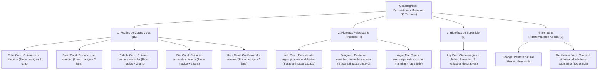

# Catálogo e Estrutura de Worldbuilding: Ecossistemas Oceânicos e Vida Marinha (Oceanografia & Recifes)

Todas as texturas ativas de ecossistemas oceânicos, corais e flora marinha estão organizadas na pasta:
📂 **`docs/worldbuilding/oceans`** *(30 texturas PNG ativas cobrindo recifes, flora pelágica, tapetes bentônicos e respiradouros termais)*

Texturas compartilhadas de rochas e solos costeiros/submarinos estão em:
📂 **`docs/worldbuilding/rocks`** e **`docs/worldbuilding/soils`** *(calcário, basalto oceânico, areia marinha, cascalho)*

---

## 1. Classificação Oceanográfica e Biomas Marinhos (As 4 Grandes Zonas)

Na biologia e relevo marinho do planeta, os ecossistemas aquáticos organizam-se em **4 Domínios Ecológicos**, cobrindo desde a lâmina superficial iluminada até as fossas oceânicas abissais:

---

## 2. Morfologia e Modelagem Técnica dos Blocos Marinhos

Os elementos oceânicos dividem-se em 4 comportamentos de renderização e física no motor de voxels:

1. **Blocos Sólidos Cúbicos (Solids / Blocks)**:
   - Texturas `16x16` mapeadas nas 6 faces cúbicas normais.
   - Exemplos: `aqua_tube_coral.png`, `aqua_brain_coral.png`, `aqua_bubble_coral.png`, `aqua_fire_coral.png`, `aqua_horn_coral.png`, `aqua_sponge.png`.
   - Podem ser orientados ou ter faces diferenciadas como `aqua_algae_mat` e `aqua_geothermal_vent` (`top` e `side`).
2. **Plantas e Cnidários em Cruz (Cross Models / Coral Fans)**:
   - Canal RGBA transparente em planos cruzados diagonais em X/Y no interior do voxel de água.
   - Cada coral possui 2 variantes visuais (`fan` e `fan1`) para quebrar repetição estética.
3. **Plantas Altas Animadas de Coluna D'água (Strip Animations / Multi-Tile)**:
   - **Kelp (`16x320`)**: Tiras verticais de 20 frames de `16x16` que criam o movimento contínuo do kelp flutuando com a correnteza marítima.
   - **Seagrass (`16x240`)**: Tiras verticais de 15 frames de `16x16` simulando o capim-marinho se curvando no leito de areia.
4. **Folhas Flutuantes Horizontais (Surface Flats)**:
   - Texturas RGBA `16x16` posicionadas no topo da superfície líquida (`vege_lily_pad.png` a `vege_lily_pad4.png`).

---

## 3. Catálogo dos Ecossistemas Oceânicos (30 Texturas)

| # | Elemento / Espécie | Categoria Ecológica | Arquivo(s) de Textura | Dimensões / Tipo | Bioma & Profundidade | Definição Ecológica & Características |
| :-: | :--- | :--- | :--- | :--- | :---: | :--- |
| **01** | **Tube Coral** | **Cnidário Maciço (Azul)** | `aqua_tube_coral.png` | 16x16 RGB | Águas Tropicais Rasas | Estrutura maciça do recife de corais azuis; colônias compactas de carbonato de cálcio. |
| **02** | **Tube Coral Fan** | **Cnidário Ramificado** | `vege_tube_coral_fan.png` `vege_tube_coral_fan1.png` | 16x16 RGBA (2x) | Topo de Blocos de Coral | Leque ramificado de coral tubo em leque; bioindicador de recifes vivos saudáveis. |
| **03** | **Brain Coral** | **Cnidário Maciço (Rosa)** | `aqua_brain_coral.png` | 16x16 RGB | Águas Tropicais Rasas | Colônias massivas com sulcos sinuosos de padrão cerebral e carapaça de alta densidade mineral. |
| **04** | **Brain Coral Fan** | **Cnidário Ramificado** | `vege_brain_coral_fan.png` `vege_brain_coral_fan1.png` | 16x16 RGBA (2x) | Topo de Blocos de Coral | Ramificações menores que crescem fixadas sobre recifes de coral cérebro. |
| **05** | **Bubble Coral** | **Cnidário Maciço (Púrpura)** | `aqua_bubble_coral.png` | 16x16 RGB | Águas Tropicais Quentes | Estruturas arredondadas roxas com bolsas vesiculares contendo microalgas simbióticas. |
| **06** | **Bubble Coral Fan** | **Cnidário Ramificado** | `vege_bubble_coral_fan.png` `vege_bubble_coral_fan1.png` | 16x16 RGBA (2x) | Topo de Blocos de Coral | Pólipos vesiculares delicados flutuando suavemente nas correntes marinhas. |
| **07** | **Fire Coral** | **Cnidário Maciço (Vermelho)** | `aqua_fire_coral.png` | 16x16 RGB | Barreira Externa de Recifes | Hidrocoral calcificado escarlate vivo com nematocistos irritantes na superfície do exoesqueleto. |
| **08** | **Fire Coral Fan** | **Cnidário Ramificado** | `vege_fire_coral_fan.png` `vege_fire_coral_fan1.png` | 16x16 RGBA (2x) | Topo de Blocos de Coral | Leques em chamas decorativos fixados na crista das barreiras externas de recife. |
| **09** | **Horn Coral** | **Cnidário Maciço (Amarelo)** | `aqua_horn_coral.png` | 16x16 RGB | Águas Tropicais Claras | Formações cônicas e colunares de coloração dourada intensa em recifes de águas transparentes. |
| **10** | **Horn Coral Fan** | **Cnidário Ramificado** | `vege_horn_coral_fan.png` `vege_horn_coral_fan1.png` | 16x16 RGBA (2x) | Topo de Blocos de Coral | Chifres ramificados amarelos que se estendem verticalmente em direção à luz solar. |
| **11** | **Kelp Plant** | **Macroalga Laminar** | `vege_kelp_plant.png` `vege_kelp_plant1.png` `vege_kelp_plant2.png` | **16x320 RGBA** *(3 tiras animadas de 20 frames)* | Oceanos Frios & Temperados | Florestas gigantes de macroalgas pardas que crescem a partir do leito até a superfície iluminada. |
| **12** | **Seagrass** | **Grama Marinha Pelágica** | `vege_seagrass.png` `vege_seagrass1.png` | **16x240 RGBA** *(2 tiras animadas de 15 frames)* | Leito Arenoso de Enseadas | Pradarias submarinas de angiospermas marinhas que ancoram a areia e oxigenam o fundo oceânico. |
| **13** | **Algae Mat** | **Tapete Microalgal** | `aqua_algae_mat_top.png` `aqua_algae_mat_side.png` | 16x16 RGB (Top/Side) | Encostas Úmidas & Entremarés | Tapetes densos de biofilme algal e musgo aquático que colonizam rochas e superfícies costeiras. |
| **14** | **Lily Pad** | **Hidrófita de Superfície** | `vege_lily_pad.png` a `vege_lily_pad4.png` | 16x16 RGBA *(5 variações)* | Pântanos, Mangues & Rios | Plantas aquáticas com folhas orbiculares e flores cerosas que flutuam na película superficial de águas calmas. |
| **15** | **Natural Sponge** | **Porífero Abissal** | `aqua_sponge.png` | 16x16 RGB | Recifes Profundos | Organismos sésseis multicelulares porosos com esqueleto de espongina e canais internos de filtração aquática. |
| **16** | **Geothermal Vent** | **Fissura Vulcânica Abissal** | `aqua_geothermal_vent_top.png` `aqua_geothermal_vent_side.png` | 16x16 (Top P, Side RGBA) | Fossas Abissais & Assoalho | Chaminés hidrotermais submarinas que emitem colunas de fluidos superaquecidos ricos em minerais sulfetados. |, Side RGBA) | Fossas Abissais & Assoalho | Chaminé hidrotermal sulfurosa; gera bolhas ascendentes, calor e minerais raros. |

---

## 4. Inventário Técnico Completo de Texturas em `worldbuilding/oceans/` (30 Texturas Ativas)

### A. Blocos Maciços de Coral e Submarinos (7 Texturas Cúbicas)
* `aqua_tube_coral.png`
* `aqua_brain_coral.png`
* `aqua_bubble_coral.png`
* `aqua_fire_coral.png`
* `aqua_horn_coral.png`
* `aqua_sponge.png`
* `aqua_algae_mat_side.png`

### B. Blocos com Texturas Top / Side Diferenciadas (3 Texturas)
* `aqua_algae_mat_top.png`
* `aqua_geothermal_vent_side.png`
* `aqua_geothermal_vent_top.png`

### C. Cnidários Ramificados / Coral Fans em Cruz (10 Texturas RGBA)
* `vege_tube_coral_fan.png`, `vege_tube_coral_fan1.png`
* `vege_brain_coral_fan.png`, `vege_brain_coral_fan1.png`
* `vege_bubble_coral_fan.png`, `vege_bubble_coral_fan1.png`
* `vege_fire_coral_fan.png`, `vege_fire_coral_fan1.png`
* `vege_horn_coral_fan.png`, `vege_horn_coral_fan1.png`

### D. Tiras Animadas de Flora Pelágica Subaquática (5 Texturas Verticais)
* `vege_kelp_plant.png`, `vege_kelp_plant1.png`, `vege_kelp_plant2.png` *(16x320 pixels cada - 20 frames verticais)*
* `vege_seagrass.png`, `vege_seagrass1.png` *(16x240 pixels cada - 15 frames verticais)*

### E. Hidrófitas Flutuantes de Superfície (5 Texturas RGBA)
* `vege_lily_pad.png`, `vege_lily_pad1.png`, `vege_lily_pad2.png`, `vege_lily_pad3.png`, `vege_lily_pad4.png`
