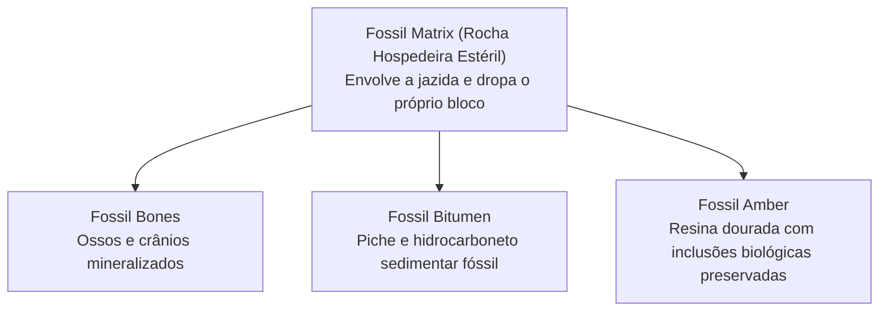

# Catálogo e Estrutura de Worldbuilding: Minérios e Metalogenia (Mineralogia)

Todas as texturas ativas de minérios e fósseis estão organizadas na pasta:
📂 **`docs/worldbuilding/ores`** *(88 texturas ativas: 28 overlays normais, 28 overlays densos, 28 blocos maciços brutos/raw e 4 blocos fósseis independentes)*

Texturas compartilhadas de matriz rochosa hospedeira estão na pasta:
📂 **`docs/worldbuilding/rocks`** *(38 rochas mineráveis prontas para receber sobreposição de minérios)*

---

## 1. Classificação Metalogênica e Mineralógica (As 4 Grandes Famílias Paritárias)

Assim como a Petrologia divide as rochas em *Sedimentares, Ígneas e Metamórficas*, e a Pedologia divide os solos em *Biológicos, Climáticos e Sedimentos*, a **Metalogênia e a Mineralogia** do jogo organizam os **28 minérios** em **4 Domínios Paritários Simétricos**:

```mermaid
graph TD
    A["Mineralogia & Metalogenia (28 Minérios)"] --> B["1. Metais Nativos, Preciosos & Estruturais (8)"]
    A --> C["2. Metais Pesados, Ligas & Estratégicos (4)"]
    A --> D["3. Gemas Preciosas & Cristalografia (8)"]
    A --> E["4. Químicos, Sais & Não-Metálicos (8)"]

    B --> B1["Iron: Siderurgia estrutural pesada (Ferro bruto / Aço carbono)"]
    B --> B2["Copper: Metal condutor maleável (Tubulações, Fios, Ligas de Bronze/Latão)"]
    B --> B3["Tin: Estanho essencial para fundir Bronze com Cobre (Cassiterita)"]
    B --> B4["Zinc: Zinco para liga de Latão naval e galvanização anticorrosiva"]
    B --> B5["Gold: Metal nobre inerte (Moeda, Joalheria, Alquimia, Alta tecnologia)"]
    B --> B6["Silver: Máxima condutividade térmica/elétrica, espelhos e purificação"]
    B --> B7["Platinum: Metal nobre imperial ultra-denso e resistente (Moeda suprema, catalisador)"]
    B --> B8["Aluminum: Metal leve ultrarresistente à corrosão (Bauxita)"]

    C --> C1["Lead: Metal cinza ultra-denso (Galena; soldas, baterias, blindagem radiológica)"]
    C --> C2["Nickel: Metal tenaz anticorrosivo (Aço Inoxidável e superligas térmicas)"]
    C --> C3["Rhodochrosite: Minério de manganês rosa (Aço Hadfield de altíssimo impacto)"]
    C --> C4["Uranium: Actinídeo radioativo pesado (Energia nuclear, fissão, calor)"]

    D --> D1["Diamond: Carbono cúbico de dureza máxima (Dureza 10 Mohs, Corte, Blindagem)"]
    D --> D2["Ruby: Coríndon vermelho com cromo (Dureza 9 Mohs, Fogo, Lasers)"]
    D --> D3["Sapphire: Coríndon azul com titânio/ferro (Dureza 9 Mohs, Óptica refratária)"]
    D --> D4["Topaz: Fluorssilicato de alumínio (Dureza 8 Mohs, Refratários cerâmicos)"]
    D --> D5["Emerald: Berilo verde cromífero (Dureza 7.5-8 Mohs, Lentes, Comércio nobre)"]
    D --> D6["Peridot: Olivina magnesiana do manto (Dureza 6.5-7 Mohs, Manto superior)"]
    D --> D7["Jade: Jadeíta / Nefrita fibrosa tenaz (Dureza 6-6.5 Mohs, Tenacidade suprema)"]
    D --> D8["Opal: Sílica hidratada animada com iridescência furta-cor (Play-of-color, Magia)"]

    E --> E1["Coal: Hidrocarboneto fóssil sedimentar (Combustível primário, Fornos, Redutor)"]
    E --> E2["Salt: Sal-gema evaporítico cúbico (Cura de alimentos, curtimento, química)"]
    E --> E3["Saltpeter: Salitre/Nitro evaporítico (Pólvora clássica com Carvão/Enxofre, Fertilizante)"]
    E --> E4["Quartz: Quartzo límpido piezoelétrico (Óptica refratária, vidros, circuitos)"]
    E --> E5["Sulfur: Mineral vulcânico nativo hidrotermal (Pólvora, Ácido sulfúrico)"]
    E --> E6["Cinnabar: Sulfeto de mercúrio escarlate (Mercúrio líquido, Azougue, Automação)"]
    E --> E7["Purpurite: Fosfato de manganês e ferro púrpura real (Pegmatitos nobres)"]
    E --> E8["Lapis Lazuli: Lazurita azul ultramarina com pirita (Pigmento real, Alquimia)"]
```



---

## 2. A Estrutura de Texturas: Tríades Minerais Completas (Normais, Densos e Raws)

O sistema mineralógico do jogo divide a representação de cada minério em 3 camadas visuais e funcionais:

```mermaid
graph LR
    O1["1. Overlay Normal<br>(ore_<nome>_overlay.png)<br>Veio comum disperso (15-35% mineral)"] -->|Maior profundidade / Núcleo de jazida| O2["2. Overlay Denso<br>(dense_ore_<nome>_overlay.png)<br>Veio rico compacto (35-42% mineral)"]
    O1 -->|Mineração com Picareta| N["Fragmentos Minerais Brutos<br>(Raw Nuggets / Chunks)"]
    O2 -->|Mineração com Picareta (2x a 3x drops)| N
    N -->|Compactação 3x3 no Inventário| R["3. Bloco Maciço Bruto<br>(raw_<nome>.png)<br>Armazenamento compacto (100% mineral)"]
```

1. **Overlay Normal (`ore_<nome>_overlay.png`)**:
   - Canal RGBA transparente.
   - Padrão 16x16 (ou 16x64 vertical animado no caso da Opala).
   - Representa os veios distribuídos naturalmente pelas paredes de cavernas e montanhas.
2. **Overlay Denso (`dense_ore_<nome>_overlay.png`)**:
   - Canal RGBA transparente.
   - Padrão 16x16 (ou 16x64 vertical animado no caso da Opala).
   - Representa os veios ricos em profundidade (*dense veins*), com aglomerados minerais densificados que rendem 2x a 3x mais drops ao jogador.
3. **Bloco Maciço Bruto (`raw_<nome>.png`)**:
   - Canal RGB sólido.
   - Padrão 16x16 (ou 16x64 vertical animado no caso da Opala).
   - Utilizado para estocagem econômica (9 fragmentos brutos = 1 bloco bruto) e construção arquitetônica temática.

---

## 3. Catálogo dos 28 Minérios do Jogo (Tríades Completas: 84 Texturas)

| # | Minério | Família Metalogênica | Overlay Normal | Overlay Denso | Bloco Maciço (Raw) | Dureza | Papel no Mundo / Gameplay |
| :-: | :--- | :--- | :--- | :--- | :--- | :--- | :--- |
| **01** | **Coal** | **Fóssil / Hidrocarboneto** | `ore_coal_overlay.png` | `dense_ore_coal_overlay.png` | `raw_coal.png` | 1.0 – 2.5 | Combustível primário de fornos, geração de vapor, tochas e redutor siderúrgico. |
| **02** | **Copper** | **Metal de Transição** | `ore_copper_overlay.png` | `dense_ore_copper_overlay.png` | `raw_copper.png` | 2.5 – 3.0 | Condutividade elétrica e térmica; tubulações e base para ligas (Bronze e Latão). |
| **03** | **Tin** | **Metal de Transição (Cassiterita)** | `ore_tin_overlay.png` | `dense_ore_tin_overlay.png` | `raw_tin.png` | 6.0 – 7.0 | **Idade do Bronze**: Fundido com Cobre gera Bronze autêntico para ferramentas e armas. |
| **04** | **Iron** | **Metal Siderúrgico** | `ore_iron_overlay.png` | `dense_ore_iron_overlay.png` | `raw_iron.png` | 4.0 – 5.0 | Espinha dorsal da tecnologia: ferramentas resistentes, trilhos, blindagens e aço. |
| **05** | **Zinc** | **Metal de Transição (Esfalerita)** | `ore_zinc_overlay.png` | `dense_ore_zinc_overlay.png` | `raw_zinc.png` | 3.5 – 4.0 | Forja de **Latão** (*Brass* = Cobre + Zinco) e galvanização antiferrugem em chapas de ferro. |
| **06** | **Gold** | **Metal Nobre Precioso** | `ore_gold_overlay.png` | `dense_ore_gold_overlay.png` | `raw_gold.png` | 2.5 – 3.0 | Moeda universal inalterável, joalheria, componentes alquímicos e circuitos finos. |
| **07** | **Silver** | **Metal Nobre Precioso** | `ore_silver_overlay.png` | `dense_ore_silver_overlay.png` | `raw_silver.png` | 2.5 – 3.0 | Maior condutividade térmica/elétrica conhecida; espelhos ópticos e purificação. |
| **08** | **Platinum** | **Metal Nobre Precioso** | `ore_platinum_overlay.png` | `dense_ore_platinum_overlay.png` | `raw_platinum.png` | 4.0 – 4.5 | Metal imperial ultra-denso e inerte; moeda de nível superior ao ouro, cadinhos térmicos e catalisadores. |
| **09** | **Aluminum** | **Metal Estrutural Leve** | `ore_aluminum_overlay.png` | `dense_ore_aluminum_overlay.png` | `raw_aluminum.png` | 2.5 – 3.5 | Metal leve resistente à oxidação (Bauxita); engenharia aérea e ligas leves. |
| **10** | **Lead** | **Metal Pesado (Galena)** | `ore_lead_overlay.png` | `dense_ore_lead_overlay.png` | `raw_lead.png` | 2.5 | Metal ultra-denso e maleável; soldas, baterias e blindagem contra radiação. |
| **11** | **Nickel** | **Metal Ferromagnético** | `ore_nickel_overlay.png` | `dense_ore_nickel_overlay.png` | `raw_nickel.png` | 4.0 – 5.0 | Essencial para **Aço Inoxidável** e superligas resistentes a calor extremo. |
| **12** | **Rhodochrosite** | **Estratégico (Manganês)** | `ore_rhodochrosite_overlay.png` | `dense_ore_rhodochrosite_overlay.png` | `raw_rhodochrosite.png` | 3.5 – 4.0 | Fonte de **Manganês**: essencial para o **Aço Hadfield** (ultra-resistente a impacto). |
| **13** | **Diamond** | **Gemologia Suprema** | `ore_diamond_overlay.png` | `dense_ore_diamond_overlay.png` | `raw_diamond.png` | **10.0** | Dureza máxima mineral: brocas diamantadas, serras industriais e joalheria nobre. |
| **14** | **Ruby** | **Gemologia Coríndon** | `ore_ruby_overlay.png` | `dense_ore_ruby_overlay.png` | `raw_ruby.png` | 9.0 | Vermelho-sangue vítreo de dureza 9; emissores térmicos e núcleos de lasers. |
| **15** | **Sapphire** | **Gemologia Coríndon** | `ore_sapphire_overlay.png` | `dense_ore_sapphire_overlay.png` | `raw_sapphire.png` | 9.0 | Azul safira marinho; óptica refratária de precisão e vidro-safira inquebrável. |
| **16** | **Topaz** | **Gemologia Nesossilicato** | `ore_topaz_overlay.png` | `dense_ore_topaz_overlay.png` | `raw_topaz.png` | 8.0 | Laranja-âmbar solar; refratário cerâmico de alta temperatura e lentes de fogo. |
| **17** | **Emerald** | **Gemologia Berilo** | `ore_emerald_overlay.png` | `dense_ore_emerald_overlay.png` | `raw_emerald.png` | 7.5 – 8.0 | Moeda diplomática, gemologia verde requintada e prismas ópticos especiais. |
| **18** | **Peridot** | **Silicato do Manto** | `ore_peridot_overlay.png` | `dense_ore_peridot_overlay.png` | `raw_peridot.png` | 6.5 – 7.0 | Olivina forsterita do manto superior; diagnóstico de rochas ígneas ultramáficas. |
| **19** | **Jade** | **Inossilicato Fibroso** | `ore_jade_overlay.png` | `dense_ore_jade_overlay.png` | `raw_jade.png` | 6.0 – 6.5 | Tenacidade máxima (não estilhaça ao impacto); armas tribais lendárias e selos. |
| **20** | **Opal** | **Silicato Iridescente Animado** | `ore_opal_overlay.png` *(16x64)* | `dense_ore_opal_overlay.png` *(16x64)* | `raw_opal.png` *(16x64)* | 5.5 – 6.5 | **Textura animada de 4 fases**: refração furta-cor (*play-of-color*); gemologia mística e prismas etéreos. |
| **21** | **Purpurite** | **Fosfato de Pegmatito** | `ore_purpurite_overlay.png` | `dense_ore_purpurite_overlay.png` | `raw_purpurite.png` | 4.0 – 4.5 | Fosfato mineral púrpura régio; ligas químicas exóticas e pigmento imperial. |
| **22** | **Cinnabar** | **Sulfeto Hidrotermal** | `ore_cinnabar_overlay.png` | `dense_ore_cinnabar_overlay.png` | `raw_cinnabar.png` | 2.0 – 2.5 | Fonte de **Mercúrio Líquido (Azougue)**: amalgamação de ouro/prata e automação. |
| **23** | **Sulfur** | **Mineral Vulcânico Nativo** | `ore_sulfur_overlay.png` | `dense_ore_sulfur_overlay.png` | `raw_sulfur.png` | 1.5 – 2.5 | Veios subterrâneos de enxofre: pólvora, fertilizantes, ácido sulfúrico e alquimia. |
| **24** | **Salt** | **Haleto Evaporítico (Halita)** | `ore_salt_overlay.png` | `dense_ore_salt_overlay.png` | `raw_salt.png` | 2.0 – 2.5 | Sal-gema cúbico: preservação duradoura de carnes, curtimento de couros e eletrólise. |
| **25** | **Saltpeter** | **Nitrato Evaporítico (Nitro)** | `ore_saltpeter_overlay.png` | `dense_ore_saltpeter_overlay.png` | `raw_saltpeter.png` | 1.5 – 2.0 | **Salitre clássico**: fecha a Tríade da Pólvora com Carvão e Enxofre; super-fertilizante agrícola. |
| **26** | **Quartz** | **Tectossilicato Cristalino** | `ore_quartz_overlay.png` | `dense_ore_quartz_overlay.png` | `raw_quartz.png` | 7.0 | Quartzo leitoso piezoelétrico; osciladores de relógio, vidraria refratária e prismas. |
| **27** | **Lapis Lazuli** | **Tectossilicato Nobre** | `ore_lapis_overlay.png` | `dense_ore_lapis_overlay.png` | `raw_lapis.png` | 5.0 – 5.5 | Azul ultramarino com pirita dourada; pigmento real, encantamentos e mosaicos. |
| **28** | **Uranium** | **Actinídeo Radioativo** | `ore_uranium_overlay.png` | `dense_ore_uranium_overlay.png` | `raw_uranium.png` | 5.5 – 6.0 | Energia nuclear massiva, fissão, fontes térmicas duradouras e luminescência. |

---

## 4. O Quarteto Fóssil e Paleontológico (4 Blocos Sedimentares Independentes)

Os depósitos fósseis possuem matriz sedimentar autônoma e **não utilizam o sistema de overlays**, atuando como formações geológicas completas:



| Bloco | Arquivo de Textura | Matriz Geológica / Origem | Propriedade Visual | Papel Tecnológico & Arqueológico |
| :--- | :--- | :--- | :--- | :--- |
| **Fossil Bones** | `fossil_bones.png` | Rocha sedimentar escura de leito fóssil | Fragmentos e ossos calcários fossilizados | Farinha de ossos, fertilização biológica, taxidermia e arqueologia. |
| **Fossil Bitumen** | `fossil_bitumen.png` | Rocha sedimentar escura com piche fóssil | Betume/óleo negro cru denso viscoso brilhante | Combustível pesado de alta caloria, tochas impermeáveis e selante. |
| **Fossil Amber** | `fossil_amber.png` | Rocha sedimentar escura com nódulos de resina | Gotas de âmbar dourado com inclusões antigas | Alquimia ancestral, gemologia rara, extração de seiva pré-histórica. |
| **Fossil Matrix** | `fossil_matrix.png` | Rocha sedimentar hospedeira estéril | Leito fóssil sem macro-inclusões (rocha pura) | Rocha hospedeira circundante; bloco de construção arquitetônica temática. |

---

## 5. Especificações Especiais de Texturas

### Textura Animada de Opala (`16x64 pixels`)
A Opala mineralógica possui o fenômeno óptico único de **Play-of-Color** (iridescência de arco-íris interna). Para reproduzir essa beleza óptica, as texturas de Opala foram criadas como tiras verticais de **16x64 pixels (4 frames de 16x16 pixels empilhados)**:
- **Frame 0 (y: 0..15)**: *Fase Fogo/Âmbar* (base perolada com refrações escarlate, coral e ouro solar).
- **Frame 1 (y: 16..31)**: *Fase Aurora/Esmeralda* (base perolada com refrações verde-primavera, lima e ouro-limão).
- **Frame 2 (y: 32..47)**: *Fase Oceânica/Pavão* (base perolada com refrações ciano elétrico, azul celeste e turquesa).
- **Frame 3 (y: 48..63)**: *Fase Cósmica/Orquídea* (base perolada com refrações violeta real, magenta neon e lavanda).
- **Loop**: Ao transitar de 0 a 3 e retornar a 0, cria uma refração suave e contínua do ciclo espectral completo.

---

## 6. Inventário Técnico Completo de Texturas em `worldbuilding/ores/` (88 Texturas Ativas)

Todas as texturas possuem largura **16 pixels** (16x16 padrão, com exceção da Opala animada em 16x64):

### A. Overlays Normais com Transparência Alfa (28 Texturas RGBA)
`ore_coal_overlay.png`, `ore_copper_overlay.png`, `ore_tin_overlay.png`, `ore_iron_overlay.png`, `ore_zinc_overlay.png`, `ore_gold_overlay.png`, `ore_silver_overlay.png`, `ore_platinum_overlay.png`, `ore_aluminum_overlay.png`, `ore_lead_overlay.png`, `ore_nickel_overlay.png`, `ore_rhodochrosite_overlay.png`, `ore_diamond_overlay.png`, `ore_emerald_overlay.png`, `ore_ruby_overlay.png`, `ore_sapphire_overlay.png`, `ore_topaz_overlay.png`, `ore_peridot_overlay.png`, `ore_jade_overlay.png`, `ore_opal_overlay.png` *(16x64)*, `ore_purpurite_overlay.png`, `ore_cinnabar_overlay.png`, `ore_sulfur_overlay.png`, `ore_salt_overlay.png`, `ore_saltpeter_overlay.png`, `ore_quartz_overlay.png`, `ore_lapis_overlay.png`, `ore_uranium_overlay.png`.

### B. Overlays Densos com Transparência Alfa (28 Texturas RGBA)
`dense_ore_coal_overlay.png`, `dense_ore_copper_overlay.png`, `dense_ore_tin_overlay.png`, `dense_ore_iron_overlay.png`, `dense_ore_zinc_overlay.png`, `dense_ore_gold_overlay.png`, `dense_ore_silver_overlay.png`, `dense_ore_platinum_overlay.png`, `dense_ore_aluminum_overlay.png`, `dense_ore_lead_overlay.png`, `dense_ore_nickel_overlay.png`, `dense_ore_rhodochrosite_overlay.png`, `dense_ore_diamond_overlay.png`, `dense_ore_emerald_overlay.png`, `dense_ore_ruby_overlay.png`, `dense_ore_sapphire_overlay.png`, `dense_ore_topaz_overlay.png`, `dense_ore_peridot_overlay.png`, `dense_ore_jade_overlay.png`, `dense_ore_opal_overlay.png` *(16x64)*, `dense_ore_purpurite_overlay.png`, `dense_ore_cinnabar_overlay.png`, `dense_ore_sulfur_overlay.png`, `dense_ore_salt_overlay.png`, `dense_ore_saltpeter_overlay.png`, `dense_ore_quartz_overlay.png`, `dense_ore_lapis_overlay.png`, `dense_ore_uranium_overlay.png`.

### C. Blocos Maciços / Raw Blocks Opacos (28 Texturas RGB / P)
`raw_coal.png`, `raw_copper.png`, `raw_tin.png`, `raw_iron.png`, `raw_zinc.png`, `raw_gold.png`, `raw_silver.png`, `raw_platinum.png`, `raw_aluminum.png`, `raw_lead.png`, `raw_nickel.png`, `raw_rhodochrosite.png`, `raw_diamond.png`, `raw_emerald.png`, `raw_ruby.png`, `raw_sapphire.png`, `raw_topaz.png`, `raw_peridot.png`, `raw_jade.png`, `raw_opal.png` *(16x64)*, `raw_purpurite.png`, `raw_cinnabar.png`, `raw_sulfur.png`, `raw_salt.png`, `raw_saltpeter.png`, `raw_quartz.png`, `raw_lapis.png`, `raw_uranium.png`.

### D. Blocos Fósseis Independentes (4 Texturas Opacas)
`fossil_bones.png`, `fossil_bitumen.png`, `fossil_amber.png`, `fossil_matrix.png`.


