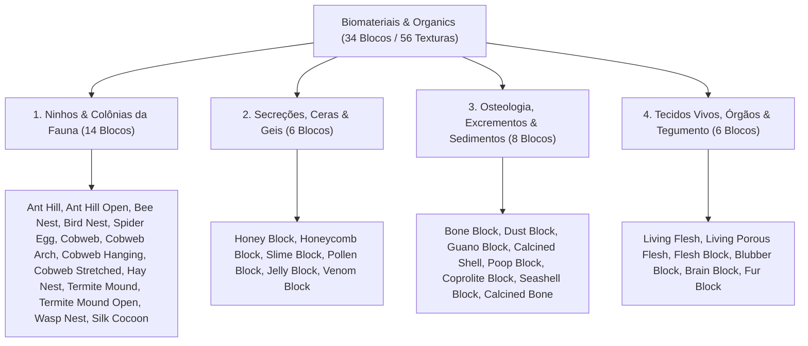

# Catálogo e Estrutura de Worldbuilding: Biomateriais, Fauna e Matéria Orgânica (Organics)

Todas as texturas ativas de estruturas da fauna, ninhos, secreções animais, osteologia, excrementos, tecidos e biomassa visceral estão organizadas na pasta:
📂 **`docs/worldbuilding/organics`** *(56 texturas PNG ativas, representando 34 blocos únicos divididos em 4 categorias ecológicas)*

---

## 1. Classificação Ecológica e Domínios Faunísticos

O ecossistema de biomateriais e fauna do mundo é organizado em **4 Categorias Biológicas (34 Blocos Únicos / 56 Texturas)**:

---

## 2. Estrutura e Distribuição dos Blocos

Com a definição do **Calcined Bone** e **Calcined Shell**, a integração do **Hay Nest**, a separação autônoma de **Ant Hill Open** e **Termite Mound Open**, a transição das teias para blocos verticais autônomos, o padrão de meias-alturas (*slabs*) para ninhos e a adição do **Jelly Block** e **Venom Block**, o catálogo atinge a marca balanceada de **34 blocos únicos**:

| Categoria Biológica | Qtd de Blocos | Espécimes Integrados |
| :--- | :---: | :--- |
| **1. Ninhos & Colônias da Fauna** | **14** | `Ant Hill`, `Ant Hill Open`, `Bee Nest`, `Bird Nest`, `Spider Egg`, `Cobweb`, `Cobweb Arch`, `Cobweb Hanging`, `Cobweb Stretched`, `Hay Nest`, `Termite Mound`, `Termite Mound Open`, `Wasp Nest`, `Silk Cocoon` |
| **2. Secreções, Ceras & Geis** | **6** | `Honey Block`, `Honeycomb Block`, `Slime Block`, `Pollen Block`, `Jelly Block`, `Venom Block` |
| **3. Osteologia, Excrementos & Sedimentos** | **8** | `Bone Block`, `Dust Block`, `Guano Block`, `Poop Block`, `Calcined Shell`, `Coprolite Block`, `Seashell Block`, `Calcined Bone` |
| **4. Tecidos Vivos, Órgãos & Tegumento** | **6** | `Living Flesh`, `Living Porous Flesh`, `Flesh Block`, `Blubber Block`, `Brain Block`, `Fur Block` |
| **TOTAL GERAL** | **34** | **34 Blocos Únicos / 56 Texturas PNG** |

---

## 3. Padrões Estruturais e Nomenclatura Unificada

Todas as texturas utilizam estritamente o prefixo **`bio_`** e a padronização oficial de faces: **`_top`** (topo), **`_side`** (laterais), **`_bot`** (base inferior) e **`_front`** (face frontal):

1. **Blocos com Texturas Direcionais e Estados Múltiplos**:
   - **Bee Nest**: Mapeamento cúbico direcional (`top`, `bot`, `side`, `front`) com variante de escorrimento de mel (`front_honey`).
   - **Wasp Nest**: Ninho suspenso de celulose e papel machê vegetal cinzento com mapeamento direcional completo: anel concêntrico de ancoragem no topo (`bio_wasp_nest_top.png`), faixas onduladas de celulose mastigada nas laterais (`bio_wasp_nest_side.png`) e espiral concêntrica afunilada com orifício de entrada escuro na base (`bio_wasp_nest_bot.png`).
   - **Bird Nest**: Modelo de meia-altura (*slab* / 8 pixels de altura). Tigela compacta tecida de galhos e musgo com depressão e ovos de Robin no topo (`bio_bird_nest_top.png`), face lateral com metade superior transparente (`bio_bird_nest_side.png`) e base densa de galhos entrelaçados (`bio_bird_nest_bot.png`).
   - **Hay Nest**: Modelo de meia-altura (*slab* / 8 pixels de altura) tecido de palha e feno agrícola em sincronia cromática com o `Hay Bale`. Topo côncavo com leito macio de feno (`bio_hay_nest_top.png`), face lateral de fibras horizontais com metade superior transparente (`bio_hay_nest_side.png`) e base densa de feno compactado (`bio_hay_nest_bot.png`).
   - **Spider Egg**: Ooteca esférica de seda com teia na base (`bio_spider_egg_bot.png`), casulo central com ovos vermelhos (`bio_spider_egg_side.png`) e cúpula compacta (`bio_spider_egg_top.png`).
   - **Silk Cocoon**: Casulo pupal elipsoide afilado de seda pura contínua com modelo customizado e transparência periférica: filamentos espiralados perolados nas laterais (`bio_silk_cocoon_side.png`), cúpula apical com fios concêntricos convergentes (`bio_silk_cocoon_top.png`) e base de fixação com radiação de ancoragem (`bio_silk_cocoon_bot.png`).
   - **Bone Block**: Estrutura cilíndrica axial orientável (`side` para o corpo compacto do osso e `top` para o canal medular fóssil).
   - **Calcined Bone**: Estrutura cilíndrica axial orientável piro-mineralizada em cinza-claro gizoso (`bio_calcined_bone_side.png` para as estrias corticais e `bio_calcined_bone_top.png` para a cavidade trabecular e medular).
   - **Calcined Shell**: Rocha sedimentar clástica calcítica formada por conchas marinhas e bioclastos calcinados piro-mineralizados em tons de cinza-claro gizoso (`bio_calcined_shell.png`), perfeitamente sincronizada à paleta de cinzas do `Calcined Bone`.
   - **Flesh Block**: Bloco estático de matéria muscular e tecido conjuntivo cru com corte transversal membranoso no topo (`bio_flesh_top.png`) e feixes musculares densos nas laterais (`bio_flesh_side.png`).
   - **Fur Block**: Pelagem animal densa orientável com escorrimento vertical dos pelos nas laterais (`bio_fur_side.png`) e espiral do couro no topo (`bio_fur_top.png`).
   - **Ant Hill**: Estado inativo fechado (`bio_ant_hill.png`) e estado ativo com galeria aberta (`bio_ant_hill_open.png`), ambos com 6 faces uniformes.
   - **Termite Mound**: Estrutura monolítica de terra marrom-argilosa cimentada de savana com caneluras verticais fechadas (`bio_termite_mound.png`) e estado ativo com chaminés de ventilação verticais e galerias assimétricas profundas (`bio_termite_mound_open.png`), ambos com 6 faces uniformes.
2. **Teias de Aranha (Volumétrica e Modelos Planos Verticais)**:
   - **Cobweb (Bloco Tridimensional)**: Bloco cúbico volumétrico de seda biológica proteica densa com 3 variações estocásticas (`bio_cobweb.png`, `bio_cobweb1.png`, `bio_cobweb2.png`).
   - **Teias de Aplicação Vertical (Cobweb Arch, Hanging, Stretched)**: Blocos bidimensionais planos fixados diretamente contra faces verticais sólidas (paredes, quinas e vergas de tetos), vazados com transparência alpha: arco superior de canto (`bio_cobweb_arch.png`), cortina suspensa pendente (`bio_cobweb_hanging.png`) e teia tensionada entre superfícies verticais (`bio_cobweb_stretched.png`).
3. **Texturas Animadas em Tira Vertical (Animated Meshes)**:
   - **`bio_living_flesh.png` (16×48 pixels)**: Contém 3 quadros sequenciais de 16×16 que reproduzem a pulsação contínua e autônoma de feixes musculares vivos.
   - **`bio_living_porous_flesh.png` (16×32 pixels)**: Contém 2 quadros sequenciais de 16×16 que simulam o movimento de respiração e exsudação de cavidades viscerais profundas.
4. **Propriedades Físicas Especiais**:
   - **`bio_blubber`**: Bloco de gordura/banha animal semitranslúcida (alpha 204), isolante térmico contra congelamento e combustível biológico duradouro.
   - **`bio_brain`**: Massa encefálica viva rosada com convoluções cerebrais densas que reage a estímulos e sinapses.
   - **`bio_jelly`**: Gel orgânico translúcido viscoelástico arroxeado (alpha 191), variante elástica amortecedora que dissipa impacto sem conferir a aderência pegajosa do slime.
   - **`bio_venom`**: Peçonha cáustica densa e coagulada em tom roxo-escuro profundo quase negro; exala miasma tóxico e causa dano cáustico por contato físico prolongado.
   - **`bio_coprolite`**: Dureza de rocha sedimentar fóssil calcítica.
   - **`bio_seashell`**: Conchas marinhas multicoloridas costeiras compactadas (diferente do `bio_calcined_shell`, que é coquina calcinada fóssil).

---

## 4. Catálogo dos 34 Blocos Orgânicos Únicos (56 Texturas)

| # | Bloco / Espécime | Categoria | Arquivo(s) de Textura | Variações / Faces | Biomas & Ocorrência Natural | Definição Biológica & Características |
| :-: | :--- | :--- | :--- | :--- | :---: | :--- |
| **01** | **Ant Hill** | **Ninhos & Colônias** | `bio_ant_hill.png` | 6 faces | Savanas, Campos Abertos, Bosques | Monte cônico de partículas de solo cimentadas com saliva por formigas em estado fechado inativo. |
| **02** | **Ant Hill Open** | **Ninhos & Colônias** | `bio_ant_hill_open.png` | 6 faces | Savanas, Campos Abertos, Bosques | Monte de formigueiro em estado ativo com galerias e orifícios de entrada escavados. |
| **03** | **Bee Nest** | **Ninhos & Colônias** | `bio_bee_nest_bot...top.png` `bio_bee_nest_front_honey.png` | 5 faces | Florestas Floridas, Bosques Claros | Colônia silvestre suspensa em troncos construída por abelhas com alvéolos de cera e gotejamento de mel. |
| **04** | **Bird Nest** | **Ninhos & Colônias** | `bio_bird_nest_bot.png` `bio_bird_nest_side...top.png` | 3 faces (Slab) | Copas de Árvores, Penhascos | Tigela compacta tecida de galhos, musgo seco e plumas com ovos pontilhados azul-turquesa; modelo de meia-altura (slab). |
| **05** | **Spider Egg** | **Ninhos & Colônias** | `bio_spider_egg_bot.png` `bio_spider_egg_side...top.png` | 3 faces | Cavernas Profundas, Fendas Escuras | Ooteca de seda densa tecida por artrópodes contendo aglomerados de ovos esféricos escarlates em gestação. |
| **06** | **Cobweb** | **Ninhos & Colônias** | `bio_cobweb.png`, `1`, `2` | 3 variações | Minas Abandonadas, Cânions, Cavernas | Fios de seda biológica proteica viscosa entrelaçados em planos diagonais em cruz com alta elasticidade e poeira; bloco volumétrico 3D. |
| **07** | **Cobweb Arch** | **Ninhos & Colônias** | `bio_cobweb_arch.png` | Face vertical | Cantos de Caverna, Portais, Minas | Teia em arco diagonal tecida em leque no canto superior entre parede e teto; bloco plano aplicado em face vertical. |
| **08** | **Cobweb Hanging** | **Ninhos & Colônias** | `bio_cobweb_hanging.png` | Face vertical | Tetos de Túneis, Vergas, Criptas | Véu de teia suspenso que pende a partir do topo de blocos em estalactites de seda; bloco plano aplicado em face vertical. |
| **09** | **Cobweb Stretched** | **Ninhos & Colônias** | `bio_cobweb_stretched.png` | Face vertical | Fendas Estreitas, Corredores | Teia esticada e tensionada entre bordas verticais simulando armadilha de passagem; bloco plano aplicado em face vertical. |
| **10** | **Hay Nest** | **Ninhos & Colônias** | `bio_hay_nest_bot.png` `bio_hay_nest_side...top.png` | 3 faces (Slab) | Fazendas, Celeiros, Pradarias Altas | Ninho aconchegante tecido de feno e palha seca prensada para avicultura, galinheiros e pequenos roedores de pasto; modelo de meia-altura (slab). |
| **11** | **Termite Mound** | **Ninhos & Colônias** | `bio_termite_mound.png` | 6 faces | Savanas Áridas, Chapadas, Bosques Secos | Estrutura monolítica de terra marrom-argilosa cimentada de savana com caneluras colunares verticais fechadas. |
| **12** | **Termite Mound Open** | **Ninhos & Colônias** | `bio_termite_mound_open.png` | 6 faces | Savanas Áridas, Chapadas, Bosques Secos | Estrutura de cupinzeiro ativa com chaminés de ventilação verticais e galerias profundas abertas. |
| **13** | **Wasp Nest** | **Ninhos & Colônias** | `bio_wasp_nest_bot.png` `bio_wasp_nest_side.png` `bio_wasp_nest_top.png` | 3 faces | Galhos Densos, Cavernas, Ruínas | Ninho suspenso de celulose vegetal ("papel machê" cinzento) com topo de ancoragem, laterais estratificadas e base com orifício de entrada. |
| **14** | **Silk Cocoon** | **Ninhos & Colônias** | `bio_silk_cocoon_bot.png` `bio_silk_cocoon_side.png` `bio_silk_cocoon_top.png` | 3 faces | Florestas Temperadas, Selvas Úmidas | Casulo pupal compacto afilado de fios de seda pura contínua enrolados em casca marfim-pérola brilhante; modelo vazado e fonte nobre de seda. |
| **15** | **Honey Block** | **Secreções & Ceras** | `bio_honey_block_bot...top.png` | 3 faces | Colmeias Silvestres, Matas Cálidas | Secreção viscosa semitranslúcida de néctar processado e desidratado com alta densidade de açúcares naturais. |
| **16** | **Honeycomb Block**| **Secreções & Ceras** | `bio_honeycomb_block.png` | 1 bloco | Colmeias Antigas, Ocos de Tronco | Matriz prismática hexagonal regular de cera pura sintetizada por glândulas abdominais de insetos sociais. |
| **17** | **Slime Block** | **Secreções & Ceras** | `bio_slime.png` | 1 bloco (Translúcido) | Pântanos Úmidos, Fendas Subterrâneas | Matéria coloidal viva translúcida viscoelástica verde que retém umidade e amortece impactos cinéticos. |
| **18** | **Pollen Block** | **Secreções & Ceras** | `bio_pollen.png` | 1 bloco | Prados Floridos, Proximidades de Colmeias | Bloco denso aveludado de grãos de pólen vegetal comprimidos; solta poeira dourada ao quebrar e atrai polinizadores. |
| **19** | **Jelly Block** | **Secreções & Ceras** | `bio_jelly.png` | 1 bloco (Translúcido) | Pomares Úmidos, Ocos de Frutas, Colônias | Geleia orgânica pura translúcida viscoelástica arroxeada com alta resiliência elástica para saltos sem retenção viscosa. |
| **20** | **Venom Block** | **Secreções & Ceras** | `bio_venom.png` | 1 bloco | Covis de Serpentes, Fendas Peçonhentas, Ninhos | Peçonha biológica cáustica altamente densa e coagulada em roxo-escuro profundo quase preto; emite toxicidade letal. |
| **21** | **Bone Block** | **Osteologia & Sedimentos**| `bio_bone_side.png` `bio_bone_top.png` | 2 faces | Desertos, Ravinas, Fósseis Antigos | Estrutura de matriz de fosfato de cálcio fóssil e hidroxiapatita de megafauna extinta mineralizada pelo tempo. |
| **22** | **Dust Block** | **Osteologia & Sedimentos**| `bio_dust.png` | 1 bloco | Catacumbas, Câmaras Fechadas | Acúmulo compacto de partículas orgânicas inertes, células descamadas, exoesqueletos microscópicos e cinzas. |
| **23** | **Guano Block** | **Osteologia & Sedimentos**| `bio_guano.png` | 1 bloco | Cavernas de Quirópteros, Ilhas | Depósito sedimentar fóssil rico em nitratos e fosfatos originado do excremento dessecado de morcegos e aves. |
| **24** | **Poop Block** | **Osteologia & Sedimentos**| `bio_poop.png` | 1 bloco | Pastos, Currais, Tiras de Fauna | Bloco denso de esterco e estrume animal orgânico com fibras vegetais não digeridas e matéria rica em nutrientes. |
| **25** | **Calcined Shell** | **Osteologia & Sedimentos**| `bio_calcined_shell.png` | 1 bloco | Praias Antigas, Leitos Fósseis, Fornos | Aglomerado de conchas e bivalves marinhos calcinados piro-mineralizados em cinza-claro gizoso, rico em calcário desidratado. |
| **26** | **Coprolite Block**| **Osteologia & Sedimentos**| `bio_coprolite.png` | 1 bloco | Jazidas Fósseis, Desertos, Cavernas Antigas | Excremento fóssil petrificado de megafauna extinta mineralizado em fosfato de cálcio duro e rocha sedimentar. |
| **27** | **Seashell Block** | **Osteologia & Sedimentos**| `bio_seashell.png` | 1 bloco | Litorais Rochosos, Recifes, Praias Quentes | Aglomerado costeiro denso de conchas marinhas inteiras e bivalves coloridos em tons terracota e coral. |
| **28** | **Calcined Bone** | **Osteologia & Sedimentos**| `bio_calcined_bone_side.png` `bio_calcined_bone_top.png` | 2 faces | Covas Fósseis, Fornos Antigos, Estratos Vulcânicos | Osso submetido a altas temperaturas piro-mineralizado em cinza-claro gizoso, rico em hidroxiapatita recristalizada. |
| **29** | **Living Flesh** | **Tecidos & Biomassa** | `bio_living_flesh.png` *(16×48 px)* | Animado (3f) | Zonas Viscerais, Covas Abissais | Tecido muscular estriado biológico pulsante contínuo e autônomo, mantendo calor orgânico vivo nas fendas. |
| **30** | **Living Porous Flesh**| **Tecidos & Biomassa** | `bio_living_porous_flesh.png` *(16×32 px)* | Animado (2f) | Entranhas de Macrofissuras | Tecido conjuntivo esponjoso visceral vivo com poros abertos que exsudam fluidos orgânicos em ritmo respiratório. |
| **31** | **Flesh Block** | **Tecidos & Biomassa** | `bio_flesh_side.png` `bio_flesh_top.png` | 2 faces | Açougues, Covas, Covis Predatórios | Bloco sólido e denso de carne crua e músculo fatiado com topo membranoso e laterais em feixes fibrosos. |
| **32** | **Blubber Block** | **Tecidos & Biomassa** | `bio_blubber.png` | Semitranslúcido | Biomas Árticos, Megafauna Marinha | Camada densa de tecido adiposo animal e gordura isolante esbranquiçada/amarelada; combustível biológico premium. |
| **33** | **Brain Block** | **Tecidos & Biomassa** | `bio_brain.png` | 1 bloco | Fendas Psíquicas, Biomas Viscerais | Massa encefálica viva rosada com convoluções cerebrais densas que reage a estímulos e sinapses. |
| **34** | **Fur Block** | **Tecidos & Biomassa** | `bio_fur_side.png` `bio_fur_top.png` | 2 faces | Taigas, Tundras Frias, Currais | Couro com pelagem animal espessa marrom-escura isolante térmica contra frio severo. |

---

## 5. Teias de Fixação Vertical vs. Overlays de Bloco

Anteriormente concebidas como texturas de decalque/overlay em `worldbuilding/overlays/`, as teias finas foram migradas para **blocos autônomos de face vertical** em `worldbuilding/organics/`:

* **Separação Arquitetural**: Overlays são destinados a compor dinamicamente a textura de um bloco hospedeiro (como musgo em pedras ou grama no solo). Já as teias agora funcionam como blocos próprios autônomos, possuindo hitbox vazada, comportamento de colisão próprio (abrandamento cinético) e drop independente.
* **Mapeamento em Faces Verticais**:
  * **`bio_cobweb_arch.png` (Cobweb Arch)**: Ocupa a quina superior de paredes verticais e cantos de teto em formato de arco/leque.
  * **`bio_cobweb_hanging.png` (Cobweb Hanging)**: Fixada na aresta superior ou verga vertical, caindo livremente em franjas e véus de seda suspensos.
  * **`bio_cobweb_stretched.png` (Cobweb Stretched)**: Estendida verticalmente entre superfícies ou colunas, simulando armadilha esticada de travessia.

---

## 6. Inventário Técnico Completo em `worldbuilding/organics/` (56 Texturas Ativas)

Todas as 56 texturas utilizam estritamente o prefixo `bio_` e a terminação padronizada de faces:

### A. Ninhos e Colônias da Fauna (30 Arquivos)
* `bio_ant_hill.png`, `bio_ant_hill_open.png`
* `bio_bee_nest_bot.png`, `bio_bee_nest_front.png`, `bio_bee_nest_front_honey.png`, `bio_bee_nest_side.png`, `bio_bee_nest_top.png`
* `bio_bird_nest_bot.png`, `bio_bird_nest_side.png`, `bio_bird_nest_top.png` *(Ninho de Gravetos - Modelo Slab)*
* `bio_cobweb.png`, `bio_cobweb1.png`, `bio_cobweb2.png` *(Bloco Volumétrico Tridimensional)*
* `bio_cobweb_arch.png` *(Teia em Arco de Canto - Face Vertical)*
* `bio_cobweb_hanging.png` *(Teia Suspensa / Véu - Face Vertical)*
* `bio_cobweb_stretched.png` *(Teia Esticada / Tensionada - Face Vertical)*
* `bio_hay_nest_bot.png`, `bio_hay_nest_side.png`, `bio_hay_nest_top.png` *(Ninho de Feno e Palha - Modelo Slab)*
* `bio_silk_cocoon_bot.png`, `bio_silk_cocoon_side.png`, `bio_silk_cocoon_top.png` *(Casulo de Seda Direcional Vazado)*
* `bio_spider_egg_bot.png`, `bio_spider_egg_side.png`, `bio_spider_egg_top.png`
* `bio_termite_mound.png`, `bio_termite_mound_open.png` *(Cupinzeiro Fechado e Aberto)*
* `bio_wasp_nest_bot.png`, `bio_wasp_nest_side.png`, `bio_wasp_nest_top.png` *(Vespário de Celulose Completo)*

### B. Secreções, Ceras e Geis (8 Arquivos)
* `bio_honey_block_bot.png`, `bio_honey_block_side.png`, `bio_honey_block_top.png`
* `bio_honeycomb_block.png`
* `bio_jelly.png` *(Gel Orgânico Translúcido Elástico Arroxeado)*
* `bio_pollen.png` *(Bloco de Pólen Compacto)*
* `bio_slime.png` *(Gel Orgânico Translúcido Viscoelástico Verde)*
* `bio_venom.png` *(Peçonha Cáustica Densa Roxo-Escuro Quase Preto)*

### C. Osteologia, Excrementos e Sedimentos Biológicos (10 Arquivos)
* `bio_bone_side.png`, `bio_bone_top.png`
* `bio_calcined_bone_side.png`, `bio_calcined_bone_top.png` *(Osso Calcinado Orientável)*
* `bio_calcined_shell.png` *(Conchas Calcinadas Piro-Mineralizadas em Tons de Cinza)*
* `bio_coprolite.png` *(Coprólito Fóssil Petrificado)*
* `bio_dust.png`
* `bio_guano.png`
* `bio_poop.png`
* `bio_seashell.png` *(Conchas Marinhas Costeiras)*

### D. Tecidos Vivos, Órgãos e Tegumento (8 Arquivos)
* `bio_blubber.png` *(Gordura Animal / Blubber Semitranslúcido)*
* `bio_brain.png` *(Massa Encefálica Coralina)*
* `bio_flesh_side.png`, `bio_flesh_top.png` *(Bloco Estático de Carne Crua)*
* `bio_fur_side.png`, `bio_fur_top.png` *(Pelagem e Couro Animal)*
* `bio_living_flesh.png` *(16×48 animado pulsante, 3 frames)*
* `bio_living_porous_flesh.png` *(16×32 animado respirante, 2 frames)*

