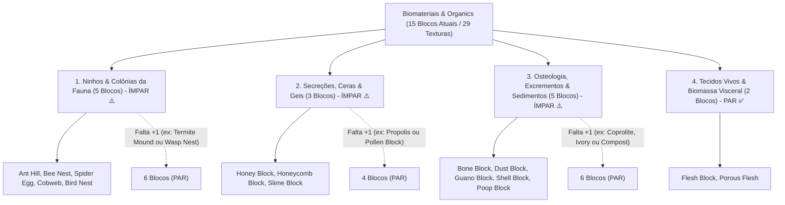

# Catálogo e Estrutura de Worldbuilding: Biomateriais, Fauna e Matéria Orgânica (Organics)

Todas as texturas ativas de estruturas da fauna, ninhos, secreções animais, osteologia, excrementos e biomassa visceral estão organizadas na pasta:
📂 **`docs/worldbuilding/organics`** *(29 texturas PNG ativas, representando 15 blocos únicos divididos em 4 categorias ecológicas)*

---

## 1. Classificação Ecológica e Domínios Faunísticos

O ecossistema de biomateriais e fauna do mundo é organizado em **4 Categorias Biológicas (15 Blocos Atuais / 29 Texturas)**:

---

## 2. Diagnóstico de Paridade: O que Falta para o Equilíbrio Pleno?

Atualmente o acervo conta com **15 blocos únicos** (total ímpar) e 3 categorias ímpares. Para atender à regra arquitetural de **paridade estrita em todas as categorias**, faltam exatamente **3 blocos** para atingir **18 blocos únicos**:

> [!IMPORTANT]
> ### Mapa do que Falta Adicionar:
> 1. **Para Ninhos & Colônias (5 $\rightarrow$ 6 blocos)**:
>    * **Termite Mound (Cupinzeiro)**: Montículo sólido de terra cimentada com celulose e saliva por colônias de cupins em savanas e bosques secos.
>    * *(Alternativa: **Wasp Nest / Vespário** de celulose acinzentada hexagonal suspensa em galhos e grutas).*
> 2. **Para Secreções & Ceras (3 $\rightarrow$ 4 blocos)**:
>    * **Propolis Block (Própolis)**: Resina vegetal escura gomosa coletada por abelhas para calafetar, vedar e esterilizar a colmeia.
>    * *(Alternativa: **Pollen Block / Bloco de Pólen** dourado aveludado acumulado em colmeias, ou **Silk Cocoon / Casulo de Seda**).*
> 3. **Para Osteologia, Excrementos & Sedimentos (5 $\rightarrow$ 6 blocos)**:
>    * **Coprolite Block (Coprólito)**: Fezes fossilizadas petrificadas de megafauna extinta mineralizadas em fosfato de cálcio e rocha sedimentar.
>    * *(Alternativas: **Ivory / Horn Block** de marfim e chifre fóssil, ou **Compost / Composto Orgânico** fermentado).*
> 4. **Biomassa & Tecidos Vivos**: Já possui **2 blocos** (PAR ✅).

Com essas 3 adições, o módulo alcança **18 blocos únicos** (6 + 4 + 6 + 2 = 18), com paridade absoluta em todas as frentes.

---

## 3. Padrões Estruturais e Nomenclatura Unificada

Todas as texturas da pasta utilizam o prefixo unificado **`bio_`**:

1. **Blocos com Texturas Direcionais e Estados Múltiplos**:
   - **Bee Nest**: Mapeamento cúbico direcional (`top`, `bottom`, `side`, `front`) com variante de escorrimento de mel (`front_honey`).
   - **Bird Nest**: Tigela de gravetos trançados com depressão e ovos de Robin no topo (`top`), laterais entrelaçadas (`side`) e base densa (`bottom`).
   - **Spider Egg**: Ooteca esférica de seda com teia na base (`bottom`), casulo central com ovos vermelhos (`side`) e cúpula compacta (`top`).
   - **Bone Block**: Estrutura cilíndrica axial orientável (`side` para o corpo compacto do osso e `top` para o canal medular fóssil).
2. **Texturas Animadas em Tira Vertical (Animated Meshes)**:
   - **`bio_flesh.png` (16×48 pixels)**: Contém 3 quadros sequenciais de 16×16 que reproduzem a pulsação contínua de feixes musculares vivos.
   - **`bio_porous_flesh.png` (16×32 pixels)**: Contém 2 quadros sequenciais de 16×16 que simulam o movimento de respiração e exsudação de cavidades viscerais.
3. **Padrão Cromático Integrado de Aracnídeos**:
   - As texturas de seda de `bio_spider_egg` utilizam rigorosamente os mesmos pigmentos bege-acinzentados minerais da `bio_cobweb`, garantindo coerência visual absoluta em tocas e masmorras.

---

## 4. Catálogo dos 15 Blocos Orgânicos Únicos (29 Texturas)

| # | Bloco / Espécime | Categoria | Arquivo(s) de Textura | Variações / Faces | Biomas & Ocorrência Natural | Definição Biológica & Características |
| :-: | :--- | :--- | :--- | :---: | :--- | :--- |
| **01** | **Ant Hill** | **Ninhos & Colônias** | `bio_ant_hill.png` `bio_ant_hill_open.png` | 2 estados | Savanas, Campos Abertos, Bosques | Monte cônico de partículas de solo cimentadas com saliva por formigas com galeria aberta ativa e fechada. |
| **02** | **Bee Nest** | **Ninhos & Colônias** | `bio_bee_nest_bottom...top.png` `bio_bee_nest_front_honey.png` | 5 faces | Florestas Floridas, Bosques Claros | Colônia silvestre suspensa em troncos construída por abelhas com alvéolos de cera e gotejamento de mel. |
| **03** | **Bird Nest** | **Ninhos & Colônias** | `bio_bird_nest_bottom.png` `bio_bird_nest_side...top.png` | 3 faces | Copas de Árvores, Penhascos | Tigela compacta tecida de galhos, musgo seco e plumas, abrigando ovos pontilhados azul-turquesa no ninho. |
| **04** | **Spider Egg** | **Ninhos & Colônias** | `bio_spider_egg_bottom.png` `bio_spider_egg_side...top.png` | 3 faces | Cavernas Profundas, Fendas Escuras | Ooteca de seda densa tecida por artrópodes contendo aglomerados de ovos esféricos escarlates em gestação. |
| **05** | **Cobweb** | **Ninhos & Colônias** | `bio_cobweb.png`, `1`, `2` | 3 variações | Minas Abandonadas, Cânions, Cavernas | Fios de seda biológica proteica viscosa entrelaçados em planos diagonais em cruz com alta elasticidade e poeira. |
| **06** | **Honey Block** | **Secreções & Ceras** | `bio_honey_block_bottom...top.png` | 3 faces | Colmeias Silvestres, Matas Cálidas | Secreção viscosa semitranslúcida de néctar processado e desidratado com alta densidade de açúcares naturais. |
| **07** | **Honeycomb Block**| **Secreções & Ceras** | `bio_honeycomb_block.png` | 1 bloco | Colmeias Antigas, Ocos de Tronco | Matriz prismática hexagonal regular de cera pura sintetizada por glândulas abdominais de insetos sociais. |
| **08** | **Slime Block** | **Secreções & Ceras** | `bio_slime.png` | 1 bloco | Pântanos Úmidos, Fendas Subterrâneas | Matéria coloidal viva translúcida viscoelástica verde que retém umidade e amortece impactos cinéticos. |
| **09** | **Bone Block** | **Osteologia & Sedimentos**| `bio_bone_side.png` `bio_bone_top.png` | 2 faces | Desertos, Ravinas, Fósseis Antigos | Estrutura de matriz de fosfato de cálcio fóssil e hidroxiapatita de megafauna extinta mineralizada pelo tempo. |
| **10** | **Dust Block** | **Osteologia & Sedimentos**| `bio_dust.png` | 1 bloco | Catacumbas, Câmaras Fechadas | Acúmulo compacto de partículas orgânicas inertes, células descamadas, exoesqueletos microscópicos e cinzas. |
| **11** | **Guano Block** | **Osteologia & Sedimentos**| `bio_guano.png` | 1 bloco | Cavernas de Quirópteros, Ilhas | Depósito sedimentar fóssil rico em nitratos e fosfatos originado do excremento dessecado de morcegos e aves. |
| **12** | **Poop Block** | **Osteologia & Sedimentos**| `bio_poop.png` | 1 bloco | Pastos, Currais, Tiras de Fauna | Bloco denso de esterco e estrume animal orgânico com fibras vegetais não digeridas e matéria rica em nutrientes. |
| **13** | **Shell Block** | **Osteologia & Sedimentos**| `bio_shell.png` | 1 bloco | Praias Antigas, Leitos Calcários | Coquina bioclástica formada pela cimentação arenosa de milhares de conchas marinhas inteiras e fragmentadas. |
| **14** | **Flesh Block** | **Biomassa & Tecidos** | `bio_flesh.png` *(16×48 px)* | Animado (3f) | Zonas Viscerais, Covas Abissais | Tecido muscular estriado biológico denso que pulsa de forma rítmica e autônoma mantendo calor orgânico. |
| **15** | **Porous Flesh** | **Biomassa & Tecidos** | `bio_porous_flesh.png` *(16×32 px)* | Animado (2f) | Entranhas de Macrofissuras | Tecido conjuntivo esponjoso visceral com poros abertos que exsudam fluidos orgânicos em ritmo respiratório. |

---

## 5. Sistema de Overlays Planos de Teia em `worldbuilding/overlays/`

Além do bloco de teia volumétrica tridimensional (`bio_cobweb`), a pasta de overlays conta com **2 Overlays Planos de Teia** com suas paletas perfeitamente sincronizadas aos tons de seda mineral da `bio_cobweb`:

* **`web_corner_overlay.png`**:
  - Teia tecida em leque no **canto superior esquerdo**, estendendo fios de ancoragem pela aresta superior e lateral.
* **`web_hanging_overlay.png`**:
  - Cortina de teia suspensa que **pende a partir da aresta superior do bloco**, simulando véus de aranha caídos em tetos e vergas de caverna.

---

## 6. Inventário Técnico Completo em `worldbuilding/organics/` (29 Texturas Ativas)

Todas as 29 texturas utilizam estritamente o prefixo `bio_`:

### A. Ninhos e Colônias da Fauna (16 Arquivos)
* `bio_ant_hill.png`, `bio_ant_hill_open.png`
* `bio_bee_nest_bottom.png`, `bio_bee_nest_front.png`, `bio_bee_nest_front_honey.png`, `bio_bee_nest_side.png`, `bio_bee_nest_top.png`
* `bio_bird_nest_bottom.png`, `bio_bird_nest_side.png`, `bio_bird_nest_top.png`
* `bio_cobweb.png`, `bio_cobweb1.png`, `bio_cobweb2.png`
* `bio_spider_egg_bottom.png`, `bio_spider_egg_side.png`, `bio_spider_egg_top.png`

### B. Secreções, Ceras e Geis (5 Arquivos)
* `bio_honey_block_bottom.png`, `bio_honey_block_side.png`, `bio_honey_block_top.png`
* `bio_honeycomb_block.png`
* `bio_slime.png`

### C. Osteologia, Excrementos e Sedimentos Biológicos (6 Arquivos)
* `bio_bone_side.png`, `bio_bone_top.png`
* `bio_dust.png`
* `bio_guano.png`
* `bio_poop.png`
* `bio_shell.png`

### D. Tecidos Vivos e Biomassa Visceral (2 Arquivos)
* `bio_flesh.png` *(16×48 animado)*
* `bio_porous_flesh.png` *(16×32 animado)*
