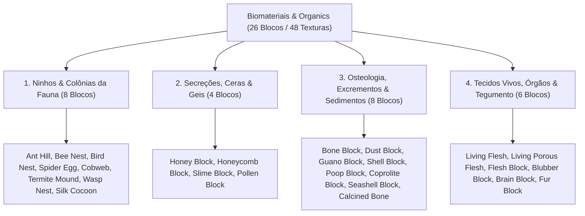

# Catálogo e Estrutura de Worldbuilding: Biomateriais, Fauna e Matéria Orgânica (Organics)

Todas as texturas ativas de estruturas da fauna, ninhos, secreções animais, osteologia, excrementos, tecidos e biomassa visceral estão organizadas na pasta:
📂 **`docs/worldbuilding/organics`** *(48 texturas PNG ativas, representando 26 blocos únicos divididos em 4 categorias ecológicas)*

---

## 1. Classificação Ecológica e Domínios Faunísticos

O ecossistema de biomateriais e fauna do mundo é organizado em **4 Categorias Biológicas (26 Blocos Únicos / 48 Texturas)**:

---

## 2. Estrutura e Distribuição dos Blocos

Com a definição do **Calcined Bone** e a separação entre carne pulsante (**Living Flesh**) e o bloco sólido (**Flesh Block**), o catálogo atinge **26 blocos únicos**:

| Categoria Biológica | Qtd de Blocos | Espécimes Integrados |
| :--- | :---: | :--- |
| **1. Ninhos & Colônias da Fauna** | **8** | `Ant Hill`, `Bee Nest`, `Bird Nest`, `Spider Egg`, `Cobweb`, `Termite Mound`, `Wasp Nest`, `Silk Cocoon` |
| **2. Secreções, Ceras & Geis** | **4** | `Honey Block`, `Honeycomb Block`, `Slime Block`, `Pollen Block` |
| **3. Osteologia, Excrementos & Sedimentos** | **8** | `Bone Block`, `Dust Block`, `Guano Block`, `Poop Block`, `Shell Block`, `Coprolite Block`, `Seashell Block`, `Calcined Bone` |
| **4. Tecidos Vivos, Órgãos & Tegumento** | **6** | `Living Flesh`, `Living Porous Flesh`, `Flesh Block`, `Blubber Block`, `Brain Block`, `Fur Block` |
| **TOTAL GERAL** | **26** | **26 Blocos Únicos / 48 Texturas PNG** |

---

## 3. Padrões Estruturais e Nomenclatura Unificada

Todas as texturas utilizam estritamente o prefixo **`bio_`**:

1. **Blocos com Texturas Direcionais e Estados Múltiplos**:
   - **Bee Nest**: Mapeamento cúbico direcional (`top`, `bottom`, `side`, `front`) com variante de escorrimento de mel (`front_honey`).
   - **Wasp Nest**: Ninho suspenso de celulose e papel machê vegetal cinzento com mapeamento direcional completo: anel concêntrico de ancoragem no topo (`bio_wasp_nest_top.png`), faixas onduladas de celulose mastigada nas laterais (`bio_wasp_nest_side.png`) e espiral concêntrica afunilada com orifício de entrada escuro na base (`bio_wasp_nest_bottom.png`).
   - **Bird Nest**: Tigela de gravetos trançados com depressão e ovos de Robin no topo (`top`), laterais entrelaçadas (`side`) e base densa (`bottom`).
   - **Spider Egg**: Ooteca esférica de seda com teia na base (`bottom`), casulo central com ovos vermelhos (`side`) e cúpula compacta (`top`).
   - **Silk Cocoon**: Casulo pupal elipsoide afilado de seda pura contínua com modelo customizado e transparência periférica (idêntico à silhueta do Spider Egg): filamentos espiralados perolados nas laterais (`bio_silk_cocoon_side.png`), cúpula apical com fios concêntricos convergentes (`bio_silk_cocoon_top.png`) e base de fixação com radiação de ancoragem (`bio_silk_cocoon_bottom.png`).
   - **Bone Block**: Estrutura cilíndrica axial orientável (`side` para o corpo compacto do osso e `top` para o canal medular fóssil).
   - **Calcined Bone**: Estrutura cilíndrica axial orientável piro-mineralizada em cinza-claro gizoso (`bio_calcined_bone_side.png` para as estrias corticais e `bio_calcined_bone_top.png` para a cavidade trabecular e medular).
   - **Flesh Block**: Bloco estático de matéria muscular e tecido conjuntivo cru com corte transversal membranoso no topo (`bio_flesh_top.png`) e feixes musculares densos nas laterais (`bio_flesh_side.png`).
   - **Fur Block**: Pelagem animal densa orientável com escorrimento vertical dos pelos nas laterais (`bio_fur_side.png`) e espiral do couro no topo (`bio_fur_top.png`).
   - **Ant Hill**: Estado inativo fechado (`bio_ant_hill.png`) e estado ativo com galeria aberta (`bio_ant_hill_open.png`).
   - **Termite Mound**: Estrutura monolítica de terra marrom-argilosa cimentada de savana com caneluras verticais fechadas (`bio_termite_mound.png`) e estado ativo com chaminés de ventilação verticais e galerias assimétricas profundas (`bio_termite_mound_open.png`).
2. **Texturas Animadas em Tira Vertical (Animated Meshes)**:
   - **`bio_living_flesh.png` (16×48 pixels)**: Contém 3 quadros sequenciais de 16×16 que reproduzem a pulsação contínua e autônoma de feixes musculares vivos.
   - **`bio_living_porous_flesh.png` (16×32 pixels)**: Contém 2 quadros sequenciais de 16×16 que simulam o movimento de respiração e exsudação de cavidades viscerais profundas.
3. **Propriedades Físicas Especiais**:
   - **`bio_blubber`**: Bloco de gordura/banha animal semitranslúcida (alpha 204), isolante térmico contra congelamento e combustível biológico duradouro.
   - **`bio_brain`**: Massa encefálica viva rosada com convoluções cerebrais densas que reage a estímulos e sinapses.
   - **`bio_coprolite`**: Dureza de rocha sedimentar fóssil calcítica.
   - **`bio_seashell`**: Conchas marinhas multicoloridas costeiras compactadas (diferente do `bio_shell`, que é coquina fóssil calcária).

---

## 4. Catálogo dos 26 Blocos Orgânicos Únicos (48 Texturas)

| # | Bloco / Espécime | Categoria | Arquivo(s) de Textura | Variações / Faces | Biomas & Ocorrência Natural | Definição Biológica & Características |
| :-: | :--- | :--- | :--- | :---: | :--- | :--- |
| **01** | **Ant Hill** | **Ninhos & Colônias** | `bio_ant_hill.png` `bio_ant_hill_open.png` | 2 estados | Savanas, Campos Abertos, Bosques | Monte cônico de partículas de solo cimentadas com saliva por formigas com galeria aberta ativa e fechada. |
| **02** | **Bee Nest** | **Ninhos & Colônias** | `bio_bee_nest_bottom...top.png` `bio_bee_nest_front_honey.png` | 5 faces | Florestas Floridas, Bosques Claros | Colônia silvestre suspensa em troncos construída por abelhas com alvéolos de cera e gotejamento de mel. |
| **03** | **Bird Nest** | **Ninhos & Colônias** | `bio_bird_nest_bottom.png` `bio_bird_nest_side...top.png` | 3 faces | Copas de Árvores, Penhascos | Tigela compacta tecida de galhos, musgo seco e plumas, abrigando ovos pontilhados azul-turquesa no ninho. |
| **04** | **Spider Egg** | **Ninhos & Colônias** | `bio_spider_egg_bottom.png` `bio_spider_egg_side...top.png` | 3 faces | Cavernas Profundas, Fendas Escuras | Ooteca de seda densa tecida por artrópodes contendo aglomerados de ovos esféricos escarlates em gestação. |
| **05** | **Cobweb** | **Ninhos & Colônias** | `bio_cobweb.png`, `1`, `2` | 3 variações | Minas Abandonadas, Cânions, Cavernas | Fios de seda biológica proteica viscosa entrelaçados em planos diagonais em cruz com alta elasticidade e poeira. |
| **06** | **Termite Mound** | **Ninhos & Colônias** | `bio_termite_mound.png` `bio_termite_mound_open.png` | 2 estados | Savanas Áridas, Chapadas, Bosques Secos | Estrutura monolítica de terra marrom-argilosa cimentada de savana com caneluras colunares verticais e chaminés de ventilação assimétricas. |
| **07** | **Wasp Nest** | **Ninhos & Colônias** | `bio_wasp_nest_bottom.png` `bio_wasp_nest_side.png` `bio_wasp_nest_top.png` | 3 faces | Galhos Densos, Cavernas, Ruínas | Ninho suspenso de celulose vegetal ("papel machê" cinzento) com topo de ancoragem, laterais estratificadas e base com orifício de entrada. |
| **08** | **Silk Cocoon** | **Ninhos & Colônias** | `bio_silk_cocoon_bottom.png` `bio_silk_cocoon_side.png` `bio_silk_cocoon_top.png` | 3 faces | Florestas Temperadas, Selvas Úmidas | Casulo pupal compacto afilado de fios de seda pura contínua enrolados em casca marfim-pérola brilhante; modelo vazado e fonte nobre de seda. |
| **09** | **Honey Block** | **Secreções & Ceras** | `bio_honey_block_bottom...top.png` | 3 faces | Colmeias Silvestres, Matas Cálidas | Secreção viscosa semitranslúcida de néctar processado e desidratado com alta densidade de açúcares naturais. |
| **10** | **Honeycomb Block**| **Secreções & Ceras** | `bio_honeycomb_block.png` | 1 bloco | Colmeias Antigas, Ocos de Tronco | Matriz prismática hexagonal regular de cera pura sintetizada por glândulas abdominais de insetos sociais. |
| **11** | **Slime Block** | **Secreções & Ceras** | `bio_slime.png` | 1 bloco | Pântanos Úmidos, Fendas Subterrâneas | Matéria coloidal viva translúcida viscoelástica verde que retém umidade e amortece impactos cinéticos. |
| **12** | **Pollen Block** | **Secreções & Ceras** | `bio_pollen.png` | 1 bloco | Prados Floridos, Proximidades de Colmeias | Bloco denso aveludado de grãos de pólen vegetal comprimidos; solta poeira dourada ao quebrar e atrai polinizadores. |
| **13** | **Bone Block** | **Osteologia & Sedimentos**| `bio_bone_side.png` `bio_bone_top.png` | 2 faces | Desertos, Ravinas, Fósseis Antigos | Estrutura de matriz de fosfato de cálcio fóssil e hidroxiapatita de megafauna extinta mineralizada pelo tempo. |
| **14** | **Dust Block** | **Osteologia & Sedimentos**| `bio_dust.png` | 1 bloco | Catacumbas, Câmaras Fechadas | Acúmulo compacto de partículas orgânicas inertes, células descamadas, exoesqueletos microscópicos e cinzas. |
| **15** | **Guano Block** | **Osteologia & Sedimentos**| `bio_guano.png` | 1 bloco | Cavernas de Quirópteros, Ilhas | Depósito sedimentar fóssil rico em nitratos e fosfatos originado do excremento dessecado de morcegos e aves. |
| **16** | **Poop Block** | **Osteologia & Sedimentos**| `bio_poop.png` | 1 bloco | Pastos, Currais, Tiras de Fauna | Bloco denso de esterco e estrume animal orgânico com fibras vegetais não digeridas e matéria rica em nutrientes. |
| **17** | **Shell Block** | **Osteologia & Sedimentos**| `bio_shell.png` | 1 bloco | Praias Antigas, Leitos Calcários | Coquina bioclástica formada pela cimentação arenosa de milhares de conchas marinhas fósseis fragmentadas. |
| **18** | **Coprolite Block**| **Osteologia & Sedimentos**| `bio_coprolite.png` | 1 bloco | Jazidas Fósseis, Desertos, Cavernas Antigas | Excremento fóssil petrificado de megafauna extinta mineralizado em fosfato de cálcio duro e rocha sedimentar. |
| **19** | **Seashell Block** | **Osteologia & Sedimentos**| `bio_seashell.png` | 1 bloco | Litorais Rochosos, Recifes, Praias Quentes | Aglomerado costeiro denso de conchas marinhas inteiras e bivalves coloridos em tons terracota e coral. |
| **20** | **Calcined Bone** | **Osteologia & Sedimentos**| `bio_calcined_bone_side.png` `bio_calcined_bone_top.png` | 2 faces | Covas Fósseis, Fornos Antigos, Estratos Vulcânicos | Osso submetido a altas temperaturas piro-mineralizado em cinza-claro gizoso, rico em hidroxiapatita recristalizada. |
| **21** | **Living Flesh** | **Tecidos & Biomassa** | `bio_living_flesh.png` *(16×48 px)* | Animado (3f) | Zonas Viscerais, Covas Abissais | Tecido muscular estriado biológico pulsante contínuo e autônomo, mantendo calor orgânico vivo nas fendas. |
| **22** | **Living Porous Flesh**| **Tecidos & Biomassa** | `bio_living_porous_flesh.png` *(16×32 px)* | Animado (2f) | Entranhas de Macrofissuras | Tecido conjuntivo esponjoso visceral vivo com poros abertos que exsudam fluidos orgânicos em ritmo respiratório. |
| **23** | **Flesh Block** | **Tecidos & Biomassa** | `bio_flesh_side.png` `bio_flesh_top.png` | 2 faces | Açougues, Covas, Covis Predatórios | Bloco sólido e denso de carne crua e músculo fatiado com topo membranoso e laterais em feixes fibrosos. |
| **24** | **Blubber Block** | **Tecidos & Biomassa** | `bio_blubber.png` | Semitranslúcido | Biomas Árticos, Megafauna Marinha | Camada densa de tecido adiposo animal e gordura isolante esbranquiçada/amarelada; combustível biológico premium. |
| **25** | **Brain Block** | **Tecidos & Biomassa** | `bio_brain.png` | 1 bloco | Fendas Psíquicas, Biomas Viscerais | Massa encefálica viva rosada com convoluções cerebrais densas que reage a estímulos e sinapses. |
| **26** | **Fur Block** | **Tecidos & Biomassa** | `bio_fur_side.png` `bio_fur_top.png` | 2 faces | Taigas, Tundras Frias, Currais | Couro com pelagem animal espessa marrom-escura isolante térmica contra frio severo. |

---

## 5. Sistema de Overlays Planos de Teia em `worldbuilding/overlays/`

Além do bloco de teia volumétrica tridimensional (`bio_cobweb`), a pasta de overlays conta com **2 Overlays Planos de Teia** com suas paletas perfeitamente sincronizadas aos tons de seda mineral da `bio_cobweb`:

* **`web_corner_overlay.png`**:
  - Teia tecida em leque no **canto superior esquerdo**, estendendo fios de ancoragem pela aresta superior e lateral.
* **`web_hanging_overlay.png`**:
  - Cortina de teia suspensa que **pende a partir da aresta superior do bloco**, simulando véus de aranha caídos em tetos e vergas de caverna.

---

## 6. Inventário Técnico Completo em `worldbuilding/organics/` (48 Texturas Ativas)

Todas as 48 texturas utilizam estritamente o prefixo `bio_`:

### A. Ninhos e Colônias da Fauna (24 Arquivos)
* `bio_ant_hill.png`, `bio_ant_hill_open.png`
* `bio_bee_nest_bottom.png`, `bio_bee_nest_front.png`, `bio_bee_nest_front_honey.png`, `bio_bee_nest_side.png`, `bio_bee_nest_top.png`
* `bio_bird_nest_bottom.png`, `bio_bird_nest_side.png`, `bio_bird_nest_top.png`
* `bio_cobweb.png`, `bio_cobweb1.png`, `bio_cobweb2.png`
* `bio_silk_cocoon_bottom.png`, `bio_silk_cocoon_side.png`, `bio_silk_cocoon_top.png` *(Casulo de Seda Direcional Vazado)*
* `bio_spider_egg_bottom.png`, `bio_spider_egg_side.png`, `bio_spider_egg_top.png`
* `bio_termite_mound.png`, `bio_termite_mound_open.png` *(Cupinzeiro Fechado e Aberto)*
* `bio_wasp_nest_bottom.png`, `bio_wasp_nest_side.png`, `bio_wasp_nest_top.png` *(Vespário de Celulose Completo)*

### B. Secreções, Ceras e Geis (6 Arquivos)
* `bio_honey_block_bottom.png`, `bio_honey_block_side.png`, `bio_honey_block_top.png`
* `bio_honeycomb_block.png`
* `bio_pollen.png` *(Bloco de Pólen Compacto)*
* `bio_slime.png`

### C. Osteologia, Excrementos e Sedimentos Biológicos (10 Arquivos)
* `bio_bone_side.png`, `bio_bone_top.png`
* `bio_calcined_bone_side.png`, `bio_calcined_bone_top.png` *(Osso Calcinado Orientável)*
* `bio_coprolite.png` *(Coprólito Fóssil Petrificado)*
* `bio_dust.png`
* `bio_guano.png`
* `bio_poop.png`
* `bio_seashell.png` *(Conchas Marinhas Costeiras)*
* `bio_shell.png` *(Coquina Fóssil Calcária)*

### D. Tecidos Vivos, Órgãos e Tegumento (8 Arquivos)
* `bio_blubber.png` *(Gordura Animal / Blubber Semitranslúcido)*
* `bio_brain.png` *(Massa Encefálica Coralina)*
* `bio_flesh_side.png`, `bio_flesh_top.png` *(Bloco Estático de Carne Crua)*
* `bio_fur_side.png`, `bio_fur_top.png` *(Pelagem e Couro Animal)*
* `bio_living_flesh.png` *(16×48 animado pulsante, 3 frames)*
* `bio_living_porous_flesh.png` *(16×32 animado respirante, 2 frames)*

