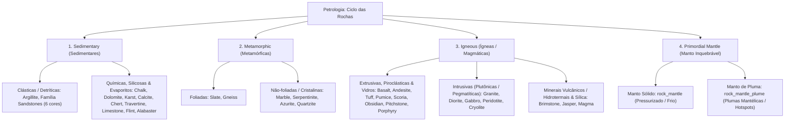

# Catálogo e Estrutura de Worldbuilding: Rochas e Geologia

Todas as texturas de rochas ativas estão organizadas na pasta:
📂 **`docs/worldbuilding/rocks`**

Overlays compartilhados de superfície estão na pasta:
📂 **`docs/worldbuilding/overlays`**

---

## 1. Classificação Geológica (Petrológica)

Na geologia do planeta, todas as rochas pertencem a **3 grandes grupos genéticos**, mais a **Camada Primordial Inquebrável do Manto**:

---

## 2. Catálogo Atual de Rochas Implementadas

| Rocha | Família Petrológica | Subclasse / Origem | Base Visual / Textura | Papel no Mundo / Biomas Recomendados |
| :--- | :--- | :--- | :--- | :--- |
| **Argillite** | **Sedimentar** | Clástica (folhelho/argilito) | Camadas terracota finas e estratificadas | Cânions argilosos, escarpas fluviais, bacias sedimentares úmidas. |
| **Chalk** | **Sedimentar** | Bioquímica (cocólitos marinhos) | Branco calcário puro e macio | Falésias marinhas oceânicas (estilo Dover), platôs de giz litorâneos. |
| **Dolomite** | **Sedimentar** | Carbonática (dolostone) | Cinza claro alpino resistente (Stone Minecraft) | Cordilheiras colossais e agulhas rochosas (estilo Alpes Dolomitas). |
| **Karst** | **Sedimentar** | Carbonática dissolvida quimicamente | Relevo cinza-ocre poroso erodido | Labirintos cársticos, dolinas, paredões de calcário esculpidos por água. |
| **Calcite** | **Sedimentar / Mineral** | Carbonato cristalino (romboédrico) | Branco perolado translúcido brilhante | Veios hidrotermais, geodos minerais, câmaras de cavernas profundas. |
| **Chert** | **Sedimentar** | Química silicosa (microcristalina) | Camadas quentes caramelo/ocre | Pederneiras, nódulos em leitos calcários, ferramentas pré-históricas. |
| **Travertine** | **Sedimentar** | Carbonática de fontes termais | Faixas fibrosas beges e creme | Terraços termais (Pamukkale/Yellowstone), arquitetura clássica romana. |
| **Limestone** | **Sedimentar** | Carbonática clássica estratificada | Tons creme e cinza-claro com camadas suaves | A rocha sedimentar mais famosa da Terra; cânions fluviais e falésias. |
| **Flint** | **Sedimentar** | Química silicosa (nódulos de sílex escuro) | Cinza-chumbo a preto ceroso vítreo com crosta clara | Nódulos encravados em falésias de giz (Chalk) e calcário, ferramentas pré-históricas. |
| **Alabaster** | **Sedimentar** | Química evaporítica (gipsita maciça) | Branco-marfim suave leitoso com nuvens translúcidas de mel | Bacias evaporíticas de lagos secos, cavernas áridas, arquitetura clássica translúcida. |
| **Azurite** | **Metamórfica / Mineral** | Carbonato básico de cobre | Azul mineral profundo com matriz rochosa | Veios de oxidação de cobre, fendas minerais azuis nobres. |
| **Sandstone** | **Sedimentar** | Clástica (areia comum litificada) | Arenito amarelo-dourado contínuo e sem costura | Paredões de cânions, platôs de deserto, escarpas de areia compactada. |
| **Sandstone Red** | **Sedimentar** | Clástica (areia oxidada com hematita) | Arenito avermelhado/laranja quente | Cânions de arenito vermelho (estilo Monument Valley e Zion, Utah). |
| **Sandstone Dune** | **Sedimentar** | Clástica (areia de duna litificada) | Arenito dourado quente e suave | Dunas fósseis e platôs de transição desértica. |
| **Sandstone White** | **Sedimentar** | Clástica (areia branca de quartzo puro) | Arenito perolado/creme claro | Falésias costeiras tropicais, atóis e praias fósseis. |
| **Sandstone Pink** | **Sedimentar** | Clástica (areia rosa com feldspato) | Arenito rosado / arkose suave | Bacias continentais e leques aluviais de terras áridas. |
| **Sandstone Black** | **Sedimentar** | Clástica (areia vulcânica basáltica) | Arenito cinza-escuro / preto vulcânico | Cânions e escarpas de ilhas vulcânicas de areia negra. |
| **Basalt** | **Ígnea** | Vulcânica extrusiva máfica | Cinza escuro / preto denso (Basalt Minecraft) | Derrames de lava, colunas basálticas, arquipélagos vulcânicos. |
| **Gabbro** | **Ígnea** | Plutônica intrusiva máfica | Cristais grossos pretos e grafite (Blackstone ref) | Raízes profundas da crosta, fundo de fossas abissais, câmaras magmáticas. |
| **Peridotite** | **Ígnea** | Plutônica ultramáfica (manto superior / raízes da crosta) | Verde-oliva escuro denso com cristais vítreos de olivina | Raízes profundas da crosta, assoalho oceânico antigo, transição para o manto. |
| **Cryolite** | **Ígnea** | Intrusiva pegmatítica alcalina (mineral glacial) | Branco-gelo vítreo quase translúcido (aparência de gelo rochoso) | Veios pegmatíticos em regiões árticas/polares, intrusões subglaciais em permafrost. |
| **Granite** | **Ígnea** | Plutônica intrusiva félsica | Matriz rosada com quartzo e mica | Escudos continentais antigos, maciços montanhosos, monólitos continentais. |
| **Diorite** | **Ígnea** | Plutônica intrusiva intermediária | Sal-e-pimenta (plagioclásio + anfibólio) | Zonas de transição magmática, plutons intermediários da crosta média. |
| **Andesite** | **Ígnea** | Vulcânica extrusiva intermediária | Cinza neutro médio homogêneo | Arcos vulcânicos e cinturões orogênicos (como a Cordilheira dos Andes). |
| **Tuff** | **Ígnea** | Vulcânica piroclástica (cinzas consolidadas) | Fragmentos angulares de cinza vulcânica | Encostas de caldeiras vulcânicas, depósitos de explosões piroclásticas. |
| **Pumice** | **Ígnea** | Vulcânica vesicular espumosa | Porosa, cinza-areia ultraleve (End Stone ref) | Encostas de vulcões explosivos, flutua na água, abrasivo natural. |
| **Scoria** | **Ígnea** | Vulcânica vesicular máfica escura | Porosa vulcânica marrom-ferrugem escura (Netherrack ref) | Cones vulcânicos de cinzas e escórias, campos de lava basáltica. |
| **Obsidian** | **Ígnea** | Extrusiva (vidro vulcânico amorfo) | Preto vítreo brilhante com reflexos escuros | Resfriamento ultrarrápido de lava em contato com água/gelo. |
| **Pitchstone** | **Ígnea** | Extrusiva (vidro vulcânico resinoso) | Preto-piche e verde-escuro com brilho graxo/resinoso | Derrames de lava félsica úmida, margens de caldeiras, fendas vulcânicas antigas. |
| **Porphyry** | **Ígnea** | Vulcânica/Subvulcânica com fenocristais | Púrpura imperial com cristais salpicados | A rocha nobre dos imperadores romanos; intrusões magmáticas violetas. |
| **Brimstone** | **Ígnea / Hidrotermal** | Rocha sulfurosa nativa vulcânica | Amarelo-canário vívido puro e crostas termais | Fumarolas ativas, fontes termais sulfurosas e caldeiras vulcânicas. |
| **Jasper** | **Ígnea / Hidrotermal** | Rocha silicosa microcristalina (Jaspe Vermelho) | Vermelho escarlate brilhante e carmesim profundo | Fontes termais, zonas vulcânicas de sílica férrica e arquitetura monumental. |
| **Slate** | **Metamórfica** | Foliada lamelar de baixo grau | Cinza grafite escuro (Deepslate Minecraft) | Encostas íngremes dobradas por tectonismo, lajes e telhas. |
| **Gneiss** | **Metamórfica** | Foliada de alto grau (bandada) | Faixas onduladas cinza-escuro e cinza-médio (Ancient Debris ref) | Escudos continentais antigos e maciços colossais (Pão de Açúcar). |
| **Marble** | **Metamórfica** | Não-foliada (calcário recristalizado) | Branco suave nobre polido (Quartz Minecraft) | Templos clássicos, palácios, monumentos e estátuas. |
| **Serpentinite** | **Metamórfica** | Ultramáfica hidratada do manto | Verde-oliva terroso profundo (Opção C) | Rochas de zonas de subducção oceânica, ornamentação verde natural. |
| **Quartzite** | **Metamórfica** | Não-foliada (arenito recristalizado de alta pressão) | Estratificação terrosa quente e âmbar (estilo pilares de Zhangjiajie) | Pilares colossais, agulhas de montanha, cânions verticais e cristas ultra-resistentes à erosão. |
| **Magma** | **Ígnea / Geotérmica** | Rocha vulcânica em fusão / incandescência | Rocha negra com veios e fendas incandescentes animados | Câmaras magmáticas, leitos de lagos de lava, fontes hidrotermais abissais. |
| **Mantle** | **Manto Primordial** | Rocha mantélica inquebrável | Matriz negra ultra-densa com cristais de olivina | O piso absoluto inquebrável do mundo (*Bedrock*). Sem versão cobbled. |
| **Mantle Plume** | **Manto Primordial** | Rocha mantélica de pluma geotérmica | Matriz negra com veios e pontos de calor incandescente | Hotspots e plumas térmicas na base do mundo. Sem versão cobbled. |

---

## 3. A Camada Primordial do Manto (Bedrock Inquebrável)

Diferente de todas as outras rochas do jogo, o **Manto** é **inquebrável**:
- **`rock_mantle.png`**: Representa a rocha ultra-pressurizada das profundezas da Terra (peridotito / komatiito comprimido a milhões de atmosferas com pequenos cristais de olivina).
- **`rock_mantle_plume.png`**: Representa as plumas mantélicas (*mantle plumes* ou *hotspots*), onde o calor ascendente do núcleo gera pontos e fendas incandescentes em brasa entranhados na rocha sólida (sem ser magma líquido).

Ambos não possuem versão cobbled porque ferramentas de mineração não são capazes de quebrá-los.

---

## 4. Filosofia de Afloramento de Superfície: 12 Rochas de Montanha e Relevo

Rochas que formam relevos externos de montanhas, platôs, falésias e escarpas possuem as variantes de cobertura vegetal (`_grass_side.png`) e climática (`_snow_side.png`):

1. **Argillite**: `rock_argillite_grass_side.png`, `rock_argillite_snow_side.png`
2. **Chalk**: `rock_chalk_grass_side.png`, `rock_chalk_snow_side.png`
3. **Dolomite**: `rock_dolomite_grass_side.png`, `rock_dolomite_snow_side.png`
4. **Slate**: `rock_slate_grass_side.png`, `rock_slate_snow_side.png`
5. **Granite**: `rock_granite_grass_side.png`, `rock_granite_snow_side.png`
6. **Andesite**: `rock_andesite_grass_side.png`, `rock_andesite_snow_side.png`
7. **Basalt**: `rock_basalt_grass_side.png`, `rock_basalt_snow_side.png`
8. **Karst**: `rock_karst_grass_side.png`, `rock_karst_snow_side.png`
9. **Travertine**: `rock_travertine_grass_side.png`, `rock_travertine_snow_side.png`
10. **Gneiss**: `rock_gneiss_grass_side.png`, `rock_gneiss_snow_side.png`
11. **Limestone**: `rock_limestone_grass_side.png`, `rock_limestone_snow_side.png`
12. **Quartzite**: `rock_quartzite_grass_side.png`, `rock_quartzite_snow_side.png`

---

## 5. Catálogo de Texturas em `worldbuilding/rocks/` (Atuais: 102 Texturas)

- **40 Rochas Sólidas**:
  - 38 mineráveis: Argillite, Chalk, Dolomite, Karst, Calcite, Chert, Travertine, Limestone, Flint, Alabaster, Azurite, Sandstone, Sandstone Red, Sandstone Dune, Sandstone White, Sandstone Pink, Sandstone Black, Basalt, Gabbro, Peridotite, Cryolite, Granite, Diorite, Andesite, Tuff, Pumice, Scoria, Obsidian, Pitchstone, Porphyry, Brimstone, Jasper, Magma, Slate, Gneiss, Marble, Serpentinite, Quartzite.
  - 2 inquebráveis primordiais: Mantle (`rock_mantle.png`), Mantle Plume (`rock_mantle_plume.png`).
- **38 Rochas Cobbled**: Cobbled de **todas as 38 rochas mineráveis sem exceção** (`cobbled_<nome>.png`).
- **24 Texturas de Afloramento (12 Rochas x Grass & Snow Side)**.

---

## 6. Catálogo Completo de Blocos (102 Blocos)

Este catálogo define a composição de faces (topo, fundo e laterais) e o comportamento básico para cada bloco do sistema geológico do jogo.

---

### A. Rochas Sedimentares (32 Blocos: 16 Sólidos + 16 Cobbled)

Cada uma das 16 rochas sedimentares possui seu bloco de matriz rochosa sólida e sua variante britada (*cobbled*) gerada por mineração:

#### 1. Argillite
- **Argillite**: `rock_argillite.png` em todas as 6 faces.
- **Cobbled Argillite**: `cobbled_argillite.png` em todas as 6 faces.

#### 2. Chalk
- **Chalk**: `rock_chalk.png` em todas as 6 faces.
- **Cobbled Chalk**: `cobbled_chalk.png` em todas as 6 faces.

#### 3. Dolomite
- **Dolomite**: `rock_dolomite.png` em todas as 6 faces.
- **Cobbled Dolomite**: `cobbled_dolomite.png` em todas as 6 faces.

#### 4. Karst
- **Karst**: `rock_karst.png` em todas as 6 faces.
- **Cobbled Karst**: `cobbled_karst.png` em todas as 6 faces.

#### 5. Calcite
- **Calcite**: `rock_calcite.png` em todas as 6 faces.
- **Cobbled Calcite**: `cobbled_calcite.png` em todas as 6 faces.

#### 6. Chert
- **Chert**: `rock_chert.png` em todas as 6 faces.
- **Cobbled Chert**: `cobbled_chert.png` em todas as 6 faces.

#### 7. Travertine
- **Travertine**: `rock_travertine.png` em todas as 6 faces.
- **Cobbled Travertine**: `cobbled_travertine.png` em todas as 6 faces.

#### 8. Limestone
- **Limestone**: `rock_limestone.png` em todas as 6 faces.
- **Cobbled Limestone**: `cobbled_limestone.png` em todas as 6 faces.

#### 9. Flint
- **Flint**: `rock_flint.png` em todas as 6 faces.
- **Cobbled Flint**: `cobbled_flint.png` em todas as 6 faces.

#### 10. Alabaster
- **Alabaster**: `rock_alabaster.png` em todas as 6 faces.
- **Cobbled Alabaster**: `cobbled_alabaster.png` em todas as 6 faces.

#### 11. Sandstone (Arenito Amarelo Comum)
- **Sandstone**: `rock_sandstone_common.png` em todas as 6 faces.
- **Cobbled Sandstone**: `cobbled_sandstone_common.png` em todas as 6 faces.

#### 12. Sandstone Red (Arenito Vermelho)
- **Sandstone Red**: `rock_sandstone_red.png` em todas as 6 faces.
- **Cobbled Sandstone Red**: `cobbled_sandstone_red.png` em todas as 6 faces.

#### 13. Sandstone Dune (Arenito Dourado)
- **Sandstone Dune**: `rock_sandstone_dune.png` em todas as 6 faces.
- **Cobbled Sandstone Dune**: `cobbled_sandstone_dune.png` em todas as 6 faces.

#### 14. Sandstone White (Arenito Branco)
- **Sandstone White**: `rock_sandstone_white.png` em todas as 6 faces.
- **Cobbled Sandstone White**: `cobbled_sandstone_white.png` em todas as 6 faces.

#### 15. Sandstone Pink (Arenito Rosa)
- **Sandstone Pink**: `rock_sandstone_pink.png` em todas as 6 faces.
- **Cobbled Sandstone Pink**: `cobbled_sandstone_pink.png` em todas as 6 faces.

#### 16. Sandstone Black (Arenito Negro Vulcânico)
- **Sandstone Black**: `rock_sandstone_black.png` em todas as 6 faces.
- **Cobbled Sandstone Black**: `cobbled_sandstone_black.png` em todas as 6 faces.

---

### B. Rochas Ígneas / Magmáticas (32 Blocos: 16 Sólidos + 16 Cobbled)

#### 1. Basalt
- **Basalt**: `rock_basalt.png` em todas as 6 faces.
- **Cobbled Basalt**: `cobbled_basalt.png` em todas as 6 faces.

#### 2. Gabbro
- **Gabbro**: `rock_gabbro.png` em todas as 6 faces.
- **Cobbled Gabbro**: `cobbled_gabbro.png` em todas as 6 faces.

#### 3. Peridotite
- **Peridotite**: `rock_peridotite.png` em todas as 6 faces.
- **Cobbled Peridotite**: `cobbled_peridotite.png` em todas as 6 faces.

#### 4. Cryolite
- **Cryolite**: `rock_cryolite.png` em todas as 6 faces.
- **Cobbled Cryolite**: `cobbled_cryolite.png` em todas as 6 faces.

#### 5. Granite
- **Granite**: `rock_granite.png` em todas as 6 faces.
- **Cobbled Granite**: `cobbled_granite.png` em todas as 6 faces.

#### 6. Diorite
- **Diorite**: `rock_diorite.png` em todas as 6 faces.
- **Cobbled Diorite**: `cobbled_diorite.png` em todas as 6 faces.

#### 7. Andesite
- **Andesite**: `rock_andesite.png` em todas as 6 faces.
- **Cobbled Andesite**: `cobbled_andesite.png` em todas as 6 faces.

#### 8. Tuff
- **Tuff**: `rock_tuff.png` em todas as 6 faces.
- **Cobbled Tuff**: `cobbled_tuff.png` em todas as 6 faces.

#### 9. Pumice
- **Pumice**: `rock_pumice.png` em todas as 6 faces.
- **Cobbled Pumice**: `cobbled_pumice.png` em todas as 6 faces.

#### 10. Scoria
- **Scoria**: `rock_scoria.png` em todas as 6 faces.
- **Cobbled Scoria**: `cobbled_scoria.png` em todas as 6 faces.

#### 11. Obsidian
- **Obsidian**: `rock_obsidian.png` em todas as 6 faces.
- **Cobbled Obsidian**: `cobbled_obsidian.png` em todas as 6 faces.

#### 12. Pitchstone
- **Pitchstone**: `rock_pitchstone.png` em todas as 6 faces.
- **Cobbled Pitchstone**: `cobbled_pitchstone.png` em todas as 6 faces.

#### 13. Porphyry
- **Porphyry**: `rock_porphyry.png` em todas as 6 faces.
- **Cobbled Porphyry**: `cobbled_porphyry.png` em todas as 6 faces.

#### 14. Brimstone
- **Brimstone**: `rock_brimstone.png` em todas as 6 faces.
- **Cobbled Brimstone**: `cobbled_brimstone.png` em todas as 6 faces.

#### 15. Jasper
- **Jasper**: `rock_jasper.png` em todas as 6 faces.
- **Cobbled Jasper**: `cobbled_jasper.png` em todas as 6 faces.

#### 16. Magma
- **Magma**: `rock_magma.png` em todas as 6 faces (bloco geotérmico animado; emissão de luz e dano de calor).
- **Cobbled Magma**: `cobbled_magma.png` em todas as 6 faces.

---

### C. Rochas Metamórficas (12 Blocos: 6 Sólidos + 6 Cobbled)

#### 1. Slate
- **Slate**: `rock_slate.png` em todas as 6 faces.
- **Cobbled Slate**: `cobbled_slate.png` em todas as 6 faces.

#### 2. Gneiss
- **Gneiss**: `rock_gneiss.png` em todas as 6 faces.
- **Cobbled Gneiss**: `cobbled_gneiss.png` em todas as 6 faces.

#### 3. Marble
- **Marble**: `rock_marble.png` em todas as 6 faces.
- **Cobbled Marble**: `cobbled_marble.png` em todas as 6 faces.

#### 4. Serpentinite
- **Serpentinite**: `rock_serpentinite.png` em todas as 6 faces.
- **Cobbled Serpentinite**: `cobbled_serpentinite.png` em todas as 6 faces.

#### 5. Azurite
- **Azurite**: `rock_azurite.png` em todas as 6 faces.
- **Cobbled Azurite**: `cobbled_azurite.png` em todas as 6 faces.

#### 6. Quartzite
- **Quartzite**: `rock_quartzite.png` em todas as 6 faces.
- **Cobbled Quartzite**: `cobbled_quartzite.png` em todas as 6 faces.

---

### D. Camada Primordial do Manto (2 Blocos Inquebráveis)

O assoalho tectônico inquebrável (*bedrock*) do planeta. Não geram versão britada:

- **Mantle**: `rock_mantle.png` em todas as 6 faces (manto rígido ultra-pressurizado).
- **Mantle Plume**: `rock_mantle_plume.png` em todas as 6 faces (pluma geotérmica e ponto de calor térmico).

---

### E. Rochas de Afloramento de Superfície (24 Blocos: 12 Grass + 12 Snow)

Blocos geológicos de topo e escarpa que formam os picos, montanhas e falésias do relevo:

#### 1. Rochas com Cobertura de Grama (12 Blocos - Rock Grass)
Para cada bloco:
- Topo: `soil_grass.png` (escala de cinza que recebe Biome Tint).
- Fundo: `rock_<nome>.png` (base rochosa pura, sem tint).
- Lateral: Base `rock_<nome>_grass_side.png` composta por cima com o overlay `soil_grass_side_overlay.png`.
- **Regra de Tinting**: O Biome Tint atua no topo e **exclusivamente na camada de overlay lateral da grama**, garantindo que apenas a franja de grama receba o tom do bioma e a textura rochosa base permaneça com suas cores minerais naturais sem sofrer tingimento.

1. **Argillite Grass**: Topo `soil_grass.png`, fundo `rock_argillite.png`, lateral `rock_argillite_grass_side.png` + `soil_grass_side_overlay.png`.
2. **Chalk Grass**: Topo `soil_grass.png`, fundo `rock_chalk.png`, lateral `rock_chalk_grass_side.png` + `soil_grass_side_overlay.png`.
3. **Dolomite Grass**: Topo `soil_grass.png`, fundo `rock_dolomite.png`, lateral `rock_dolomite_grass_side.png` + `soil_grass_side_overlay.png`.
4. **Slate Grass**: Topo `soil_grass.png`, fundo `rock_slate.png`, lateral `rock_slate_grass_side.png` + `soil_grass_side_overlay.png`.
5. **Granite Grass**: Topo `soil_grass.png`, fundo `rock_granite.png`, lateral `rock_granite_grass_side.png` + `soil_grass_side_overlay.png`.
6. **Andesite Grass**: Topo `soil_grass.png`, fundo `rock_andesite.png`, lateral `rock_andesite_grass_side.png` + `soil_grass_side_overlay.png`.
7. **Basalt Grass**: Topo `soil_grass.png`, fundo `rock_basalt.png`, lateral `rock_basalt_grass_side.png` + `soil_grass_side_overlay.png`.
8. **Karst Grass**: Topo `soil_grass.png`, fundo `rock_karst.png`, lateral `rock_karst_grass_side.png` + `soil_grass_side_overlay.png`.
9. **Travertine Grass**: Topo `soil_grass.png`, fundo `rock_travertine.png`, lateral `rock_travertine_grass_side.png` + `soil_grass_side_overlay.png`.
10. **Gneiss Grass**: Topo `soil_grass.png`, fundo `rock_gneiss.png`, lateral `rock_gneiss_grass_side.png` + `soil_grass_side_overlay.png`.
11. **Limestone Grass**: Topo `soil_grass.png`, fundo `rock_limestone.png`, lateral `rock_limestone_grass_side.png` + `soil_grass_side_overlay.png`.
12. **Quartzite Grass**: Topo `soil_grass.png`, fundo `rock_quartzite.png`, lateral `rock_quartzite_grass_side.png` + `soil_grass_side_overlay.png`.

#### 2. Rochas com Cobertura de Neve (12 Blocos - Rock Snow)
Para cada bloco:
- Topo: `soil_snow.png` (neve sólida pura).
- Fundo: `rock_<nome>.png`.
- Lateral: `rock_<nome>_snow_side.png` direta.
- **Regra de Neve**: Não necessita de overlay lateral de neve, pois a neve possui cor branca fixa estática e não recebe biome tinting.

1. **Argillite Snow**: Topo `soil_snow.png`, fundo `rock_argillite.png`, lateral `rock_argillite_snow_side.png`.
2. **Chalk Snow**: Topo `soil_snow.png`, fundo `rock_chalk.png`, lateral `rock_chalk_snow_side.png`.
3. **Dolomite Snow**: Topo `soil_snow.png`, fundo `rock_dolomite.png`, lateral `rock_dolomite_snow_side.png`.
4. **Slate Snow**: Topo `soil_snow.png`, fundo `rock_slate.png`, lateral `rock_slate_snow_side.png`.
5. **Granite Snow**: Topo `soil_snow.png`, fundo `rock_granite.png`, lateral `rock_granite_snow_side.png`.
6. **Andesite Snow**: Topo `soil_snow.png`, fundo `rock_andesite.png`, lateral `rock_andesite_snow_side.png`.
7. **Basalt Snow**: Topo `soil_snow.png`, fundo `rock_basalt.png`, lateral `rock_basalt_snow_side.png`.
8. **Karst Snow**: Topo `soil_snow.png`, fundo `rock_karst.png`, lateral `rock_karst_snow_side.png`.
9. **Travertine Snow**: Topo `soil_snow.png`, fundo `rock_travertine.png`, lateral `rock_travertine_snow_side.png`.
10. **Gneiss Snow**: Topo `soil_snow.png`, fundo `rock_gneiss.png`, lateral `rock_gneiss_snow_side.png`.
11. **Limestone Snow**: Topo `soil_snow.png`, fundo `rock_limestone.png`, lateral `rock_limestone_snow_side.png`.
12. **Quartzite Snow**: Topo `soil_snow.png`, fundo `rock_quartzite.png`, lateral `rock_quartzite_snow_side.png`.

---

## 7. Metalogenia & Hospedagem de Minérios (Distribuição Geológica dos 28 Minérios)

### 7.1. Diretriz de Design: Ocorrência Geológica vs. Multiplicação Cega
Em vez de aplicar os overlays de minérios cegamente sobre todas as 38 famílias de rocha (o que geraria $38 \times 28 \times 2 = 2.128$ blocos desnecessários, descaracterizando a geologia real e inflacionando o motor), a Voxel Engine adota o modelo de **Afinidade Petrológica de Gênese Mineral**:
- Cada um dos **28 minérios** ocorre exclusivamente em **2 a 6 rochas hospedeiras específicas**, respeitando a gênese real da geologia (sedimentar, ígnea magmática, hidrotermal ou metamórfica).
- **Dolomite como Rocha Matriz Ubíqua**: Por ser a rocha cinza padrão onipresente na maior parte do mundo, a Dolomita abriga minérios de sobrevivência básica e progressão inicial (**Coal**, **Iron**, **Copper**, **Zinc**, **Lead**), garantindo que o jogador nunca fique preso sem recursos vitais no início do jogo.
- **Carvão Antracítico em Ardósia**: A Ardósia (`slate`) também passa a hospedar carvão (antracite metamórfica), garantindo combustível em regiões montanhosas foliadas.
- Isso gera **90 associações mineralógicas únicas**, cada uma com versão **Normal** (`ore_<minerio>_overlay.png`) e **Densa** (`dense_ore_<minerio>_overlay.png`), totalizando **180 blocos de minérios incrustados** no mundo.

### 7.2. Tabela Mestra de Hospedagem Mineralógica Rebalanceada (90 Associações = 180 Blocos)

| # | Minério | Gênese Geológica Principal | Rochas Hospedeiras Específicas | Justificativa Científica e Metalogênica |
| :-: | :--- | :--- | :--- | :--- |
| **01** | **Coal** (Carvão) | Sedimentar Orgânica & Metamórfica | `dolomite`, `limestone`, `argillite`, `sandstone`, `slate` | Bacias sedimentares, dolostones carbonosos e antracite em ardósia; vital para tochas e fornos. |
| **02** | **Copper** (Cobre) | Ígnea / Hidrotermal / Sedimentar | `basalt`, `diorite`, `andesite`, `sandstone_red`, `azurite`, `dolomite` | Pórfiros andinos, basaltos de derrame, arenitos vermelhos e veios disseminados em dolomita. |
| **03** | **Tin** (Estanho) | Ígnea Félsica / Greisen | `granite`, `slate`, `cryolite` | Cassiterita em bordas graníticas, pegmatitos glaciais e xistos/ardósias; chave da Era do Bronze. |
| **04** | **Iron** (Ferro) | BIF / Sedimentar / Máfica | `dolomite`, `limestone`, `chert`, `basalt`, `scoria`, `sandstone_black` | O metal mais abundante da crosta; siderita em dolomita, BIF com chert e basaltos ferrosos. |
| **05** | **Zinc** (Zinco) | Carbonática / Hidrotermal | `dolomite`, `limestone`, `karst` | Depósitos cársticos tipo Mississippi Valley (MVT) com esfalerita em dolostones. |
| **06** | **Gold** (Ouro) | Orogênica / Hidrotermal | `granite`, `quartzite`, `andesite`, `gneiss`, `slate` | Filões de quartzo mesotermais em granitos e quartzitos, e veios em arcos vulcânicos. |
| **07** | **Silver** (Prata) | Epitermal / Hidrotermal | `diorite`, `andesite`, `jasper` | Zonas epitermais vulcânicas intermediárias e filões silicosos de jaspe. |
| **08** | **Platinum** (Platina) | Plutônica Ultramáfica | `gabbro`, `peridotite`, `serpentinite` | Intrusões máficas e ultramáficas profundas estratificadas (tipo Complexo Bushveld). |
| **09** | **Aluminum** (Alumínio) | Intemperismo Residual / Pegmatito | `argillite`, `karst`, `cryolite` | Bauxitas formadas em carstes e argilitos intemperizados; criolita pegmatítica. |
| **10** | **Lead** (Chumbo) | Carbonática Hidrotermal | `limestone`, `dolomite`, `karst` | Galena cúbica associada à dissolução cárstica e dolostones profundos. |
| **11** | **Nickel** (Níquel) | Máfica / Ultramáfica | `gabbro`, `peridotite`, `basalt`, `serpentinite` | Sulfetos de níquel (pentlandita) em rochas ricas em magnésio e ferro do manto. |
| **12** | **Rhodochrosite** (Manganês) | Hidrotermal Carbonática | `calcite`, `marble`, `porphyry` | Carbonato de manganês rosa em veios de calcita pura, mármores e pórfiros. |
| **13** | **Diamond** (Diamante) | Manto Superior / UHP | `peridotite`, `gneiss` | Chaminés mantélicas profundas (kimberlitos/peridotitos) e gnaisses de ultra-alta pressão. |
| **14** | **Ruby** (Rubi) | Metamórfica de Contato | `marble`, `gneiss` | Coríndon vermelho em mármores calcíticos puros (tipo depósitos de Mogok) e gnaisse. |
| **15** | **Sapphire** (Safira) | Metamórfica / Basáltica | `marble`, `basalt`, `gneiss` | Coríndon azul em mármores de contato, derrames de basalto alcalino e gnaisse. |
| **16** | **Topaz** (Topázio) | Pegmatito Félsico | `granite`, `quartzite` | Fluorssilicato formado em cavidades de granitos e veios silicosos de quartzito. |
| **17** | **Emerald** (Esmeralda) | Pegmatito / Hidrotermal | `quartzite`, `marble`, `slate` | Berilo verde em contato de fluidos berilíferos com rochas ricas em cromo/vanádio. |
| **18** | **Peridot** (Peridoto) | Mantélica / Máfica | `peridotite`, `basalt` | Gemologia da forsterita/olivina presente em peridotitos e xenólitos de basalto. |
| **19** | **Jade** (Jade) | Metamórfica de Subducção | `serpentinite`, `slate` | Jadeíta e nefrita de extrema tenacidade formadas em zonas de sutura oceânica. |
| **20** | **Opal** (Opala) | Precipitação Silicosa | `sandstone_white`, `tuff`, `pitchstone` | Sílica amorfa hidratada precipitada em arenitos brancos de quartzo e tufos vulcânicos. |
| **21** | **Purpurite** (Purpurita) | Pegmatito de Fosfatos | `granite`, `porphyry` | Fosfato secundário oxidado rico em manganês/ferro em bordas de granito e pórfiro. |
| **22** | **Cinnabar** (Cinábrio) | Epitermal de Baixa Temperatura | `brimstone`, `travertine`, `tuff`, `karst` | Sulfeto de mercúrio associado a caldeiras sulfurosas, fontes termais e carste. |
| **23** | **Sulfur** (Enxofre) | Vulcânica Exalativa | `brimstone`, `basalt`, `tuff`, `scoria` | Sublimação de gases vulcânicos em crateras, escórias e rochas piroclásticas. |
| **24** | **Salt** (Sal-Gema) | Evaporítica Marinha | `alabaster`, `chalk`, `sandstone_dune` | Halita precipitada em lagos secos com gipsita (alabastro), giz e dunas fósseis. |
| **25** | **Saltpeter** (Salitre) | Evaporítica Cavernosa | `limestone`, `alabaster`, `sandstone_dune` | Nitrato mineral cristalizado em paredes de cavernas calcárias secas e evaporitos. |
| **26** | **Quartz** (Quartzo) | Hidrotermal Universal | `granite`, `quartzite`, `sandstone_white` | Tectossilicato em filões hidrotermais de granitos, quartzitos e arenitos puros. |
| **27** | **Lazurite** (Lazurita) | Metamórfica Alcalina | `marble`, `calcite` | Lápis-lazúli clássico formado pelo metamorfismo de calcários e mármores com pirita. |
| **28** | **Uranium** (Urânio) | Pegmatito Félsico / Bacia | `granite`, `sandstone_pink`, `pitchstone` | Pitchblenda em granitos félsicos, vidros vulcânicos e arenitos sedimentares de bacia. |

### 7.3. Nomenclatura e IDs dos Blocos Registrados
Para cada par **Minério + Rocha**, registram-se 2 blocos de minério no motor gráfico:
1. **Veio Padrão**: `ore_<minerio>_<rocha>` (ex.: `ore_iron_dolomite`, `ore_coal_slate`, `ore_gold_quartzite`).
   - Composição: 6 faces com textura base `rocks/rock_<rocha>.png` + overlay `ores/ore_<minerio>_overlay.png`.
2. **Veio Denso / Concentrado**: `dense_ore_<minerio>_<rocha>` (ex.: `dense_ore_iron_dolomite`, `dense_ore_coal_slate`, `dense_ore_gold_quartzite`).
   - Composição: 6 faces com textura base `rocks/rock_<rocha>.png` + overlay `ores/dense_ore_<minerio>_overlay.png`.

---

## 8. Sistema de Seixos de Superfície: Pebbles (8 Blocos Funcionais)

### 8.1. Filosofia de Sobrevivência e Lascamento Primitivo (Early-Game)
O jogador inicia sua jornada no mundo de mãos vazias e **não quebra blocos de rocha sólida sem ferramentas**. A sobrevivência inicial depende de explorar a superfície e coletar **Pebbles (Seixos soltos)** dispostos pelo chão natural:
- **Modelo no Motor**: Não ocupam um cubo sólido de 1x1x1; são blocos rasteiros de chão (micro-modelo 3D de pedrinhas espalhadas de 1-2 pixels de altura), coletáveis instantaneamente com a mão vazia.
- **Lascamento (*Knapping*)**: Bater duas pedras adequadas entre si (ex.: 2 sílex ou 1 sílex + 1 percutor de quartzo) lasca a rocha, produzindo lâminas de machado, facas, pontas de lança e acendedores de fogo (*flint striker*).

### 8.2. Catálogo dos 8 Blocos de Pebbles em `rocks/`

| # | ID do Bloco | Nome / Seixo | Arquivo de Textura | Papel Arqueológico & de Sobrevivência |
| :-: | :--- | :--- | :--- | :--- |
| **01** | `pebble_flint` | Seixo de Sílex | `rocks/pebble_flint.png` | **O Rei do Early-Game**: Fratura concoidal afiada como navalha; lâminas, machados e acendedor de fogueira. |
| **02** | `pebble_chert` | Seixo de Pederneira (Quirto) | `rocks/pebble_chert.png` | O irmão do sílex; ferramentas cortantes e pontas de flecha onde o sílex for escasso. |
| **03** | `pebble_obsidian`| Seixo de Obsidiana | `rocks/pebble_obsidian.png` | Vidro vulcânico ultra-cortante (fio molecular) em biomas vulcânicos e derrames basálticos. |
| **04** | `pebble_dolomite`| Seixo de Dolomita (Pedra Comum)| `rocks/pebble_dolomite.png`| O seixo mais comum do mundo; construção de fogueiras primitivas (*Campfire*), fornos e projéteis. |
| **05** | `pebble_quartz` | Seixo de Quartzo Leitoso | `rocks/pebble_quartz.png` | Dureza 7 Mohs; percutor primário para bater e lascar o sílex/chert, além de raspadores duros. |
| **06** | `pebble_sandstone`| Seixo de Arenito Abrasivo | `rocks/pebble_sandstone.png`| Pedra de afiar natural (*Whetstone*) para polir ferramentas de osso, madeira e pedra. |
| **07** | `pebble_basalt` | Seixo de Basalto Tenaz | `rocks/pebble_basalt.png` | Pedra máfica ultra-tenaz que não estilhaça; martelos de mão pesados e machados polidos. |
| **08** | `pebble_granite`| Seixo de Granito Áspero | `rocks/pebble_granite.png` | Pedra densa e rugosa para pilões manuais e quebra de nozes/grãos primitivos. |

