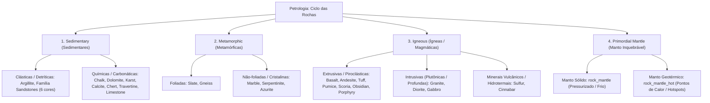

# Catálogo e Estrutura de Worldbuilding: Rochas e Geologia

Todas as texturas de rochas ativas estão organizadas na pasta:
📂 **`C:\Users\rodri\Downloads\worldbuilding\rocks`**

Overlays compartilhados de superfície estão na pasta:
📂 **`C:\Users\rodri\Downloads\worldbuilding\overlays`**

---

## 1. Classificação Geológica (Petrológica)

Na geologia do planeta, todas as rochas pertencem a **3 grandes grupos genéticos**, mais a **Camada Primordial Inquebrável do Manto**:

---

## 2. Catálogo Atual de Rochas Implementadas

| Rocha | Família Petrológica | Subclasse / Origem | Base Visual / Textura | Papel no Mundo / Biomas Recomendados |
| :--- | :--- | :--- | :--- | :--- |
| **Argillite** | **Sedimentar** | Clástica (folhelho/argilito) | Camadas terracota finas e estratificadas | Cânions argilosos, escarpas fluviais, bacias sedimentares úmidas. |
| **Chalk** | **Sedimentar** | Bioquímica (cocólitos marinhos) | Branco calcário puro e macio | Falésias marinhas oceânicas (estilo Dover), platôs de giz litorâneos. |
| **Dolomite** | **Sedimentar** | Carbonática (dolostone) | Cinza claro alpino resistente (Stone Minecraft) | Cordilheiras colossais e agulhas rochosas (estilo Alpes Dolomitas). |
| **Karst** | **Sedimentar** | Carbonática dissolvida quimicamente | Relevo cinza-ocre poroso erodido | Labirintos cársticos, dolinas, paredões de calcário esculpidos por água. |
| **Calcite** | **Sedimentar / Mineral** | Carbonato cristalino (romboédrico) | Branco perolado translúcido brilhante | Veios hidrotermais, geodos minerais, câmaras de cavernas profundas. |
| **Chert** | **Sedimentar** | Química silicosa (microcristalina) | Camadas quentes caramelo/ocre | Pederneiras, nódulos em leitos calcários, ferramentas pré-históricas. |
| **Travertine** | **Sedimentar** | Carbonática de fontes termais | Faixas fibrosas beges e creme | Terraços termais (Pamukkale/Yellowstone), arquitetura clássica romana. |
| **Limestone** | **Sedimentar** | Carbonática clássica estratificada | Tons creme e cinza-claro com camadas suaves | A rocha sedimentar mais famosa da Terra; cânions fluviais e falésias. |
| **Azurite** | **Metamórfica / Mineral** | Carbonato básico de cobre | Azul mineral profundo com matriz rochosa | Veios de oxidação de cobre, fendas minerais azuis nobres. |
| **Sandstone** | **Sedimentar** | Clástica (areia comum litificada) | Arenito amarelo-dourado contínuo e sem costura | Paredões de cânions, platôs de deserto, escarpas de areia compactada. |
| **Sandstone Red** | **Sedimentar** | Clástica (areia oxidada com hematita) | Arenito avermelhado/laranja quente | Cânions de arenito vermelho (estilo Monument Valley e Zion, Utah). |
| **Sandstone Dune** | **Sedimentar** | Clástica (areia de duna litificada) | Arenito dourado quente e suave | Dunas fósseis e platôs de transição desértica. |
| **Sandstone White** | **Sedimentar** | Clástica (areia branca de quartzo puro) | Arenito perolado/creme claro | Falésias costeiras tropicais, atóis e praias fósseis. |
| **Sandstone Pink** | **Sedimentar** | Clástica (areia rosa com feldspato) | Arenito rosado / arkose suave | Bacias continentais e leques aluviais de terras áridas. |
| **Sandstone Black** | **Sedimentar** | Clástica (areia vulcânica basáltica) | Arenito cinza-escuro / preto vulcânico | Cânions e escarpas de ilhas vulcânicas de areia negra. |
| **Basalt** | **Ígnea** | Vulcânica extrusiva máfica | Cinza escuro / preto denso (Basalt Minecraft) | Derrames de lava, colunas basálticas, arquipélagos vulcânicos. |
| **Gabbro** | **Ígnea** | Plutônica intrusiva máfica | Cristais grossos pretos e grafite (Blackstone ref) | Raízes profundas da crosta, fundo de fossas abissais, câmaras magmáticas. |
| **Granite** | **Ígnea** | Plutônica intrusiva félsica | Matriz rosada com quartzo e mica | Escudos continentais antigos, maciços montanhosos, monólitos continentais. |
| **Diorite** | **Ígnea** | Plutônica intrusiva intermediária | Sal-e-pimenta (plagioclásio + anfibólio) | Zonas de transição magmática, plutons intermediários da crosta média. |
| **Andesite** | **Ígnea** | Vulcânica extrusiva intermediária | Cinza neutro médio homogêneo | Arcos vulcânicos e cinturões orogênicos (como a Cordilheira dos Andes). |
| **Tuff** | **Ígnea** | Vulcânica piroclástica (cinzas consolidadas) | Fragmentos angulares de cinza vulcânica | Encostas de caldeiras vulcânicas, depósitos de explosões piroclásticas. |
| **Pumice** | **Ígnea** | Vulcânica vesicular espumosa | Porosa, cinza-areia ultraleve (End Stone ref) | Encostas de vulcões explosivos, flutua na água, abrasivo natural. |
| **Scoria** | **Ígnea** | Vulcânica vesicular máfica escura | Porosa vulcânica marrom-ferrugem escura (Netherrack ref) | Cones vulcânicos de cinzas e escórias, campos de lava basáltica. |
| **Obsidian** | **Ígnea** | Extrusiva (vidro vulcânico amorfo) | Preto vítreo brilhante com reflexos escuros | Resfriamento ultrarrápido de lava em contato com água/gelo. |
| **Porphyry** | **Ígnea** | Vulcânica/Subvulcânica com fenocristais | Púrpura imperial com cristais salpicados | A rocha nobre dos imperadores romanos; intrusões magmáticas violetas. |
| **Sulfur** | **Ígnea / Hidrotermal** | Mineral vulcânico nativo | Amarelo-canário vívido puro | Fumarolas ativas, fontes termais sulfurosas e caldeiras vulcânicas. |
| **Cinnabar** | **Ígnea / Hidrotermal** | Minério de sulfeto de mercúrio | Vermelho escarlate brilhante e carmesim | Veios hidrotermais profundos, fontes termais e zonas de fendas magmáticas. |
| **Slate** | **Metamórfica** | Foliada lamelar de baixo grau | Cinza grafite escuro (Deepslate Minecraft) | Encostas íngremes dobradas por tectonismo, lajes e telhas. |
| **Gneiss** | **Metamórfica** | Foliada de alto grau (bandada) | Faixas onduladas cinza-escuro e cinza-médio (Ancient Debris ref) | Escudos continentais antigos e maciços colossais (Pão de Açúcar). |
| **Marble** | **Metamórfica** | Não-foliada (calcário recristalizado) | Branco suave nobre polido (Quartz Minecraft) | Templos clássicos, palácios, monumentos e estátuas. |
| **Serpentinite** | **Metamórfica** | Ultramáfica hidratada do manto | Verde-oliva terroso profundo (Opção C) | Rochas de zonas de subducção oceânica, ornamentação verde natural. |
| **Mantle** | **Manto Primordial** | Rocha mantélica inquebrável | Matriz negra ultra-densa com cristais de olivina | O piso absoluto inquebrável do mundo (*Bedrock*). Sem versão cobbled. |
| **Mantle Hot** | **Manto Primordial** | Rocha mantélica geotérmica inquebrável | Matriz negra com veios e pontos de calor incandescente | Hotspots e plumas térmicas na base do mundo. Sem versão cobbled. |

---

## 3. A Camada Primordial do Manto (Bedrock Inquebrável)

Diferente de todas as outras rochas do jogo, o **Manto** é **inquebrável**:
- **`rock_mantle.png`**: Representa a rocha ultra-pressurizada das profundezas da Terra (peridotito / komatiito comprimido a milhões de atmosferas com pequenos cristais de olivina).
- **`rock_mantle_hot.png`**: Representa as plumas mantélicas (*mantle plumes* ou *hotspots*), onde o calor do núcleo gera pontos e fendas incandescentes em brasa entranhados na rocha sólida (sem ser magma líquido).

Ambos não possuem versão cobbled porque ferramentas de mineração não são capazes de quebrá-los.

---

## 4. Filosofia de Afloramento de Superfície: 11 Rochas de Montanha e Relevo

Rochas que formam relevos externos de montanhas, platôs, falésias e escarpas possuem as variantes de cobertura vegetal (`_grass_side.png`) e climática (`_snow_side.png`):

1. **Argillite**: `rock_argillite_grass_side.png`, `rock_argillite_snow_side.png`
2. **Chalk**: `rock_chalk_grass_side.png`, `rock_chalk_snow_side.png`
3. **Dolomite**: `rock_dolomite_grass_side.png`, `rock_dolomite_snow_side.png`
4. **Slate**: `rock_slate_grass_side.png`, `rock_slate_snow_side.png`
5. **Granite**: `rock_granite_grass_side.png`, `rock_granite_snow_side.png`
6. **Andesite**: `rock_andesite_grass_side.png`, `rock_andesite_snow_side.png`
7. **Basalt**: `rock_basalt_grass_side.png`, `rock_basalt_snow_side.png`
8. **Karst**: `rock_karst_grass_side.png`, `rock_karst_snow_side.png`
9. **Travertine**: `rock_travertine_grass_side.png`, `rock_travertine_snow_side.png`
10. **Gneiss**: `rock_gneiss_grass_side.png`, `rock_gneiss_snow_side.png`
11. **Limestone**: `rock_limestone_grass_side.png`, `rock_limestone_snow_side.png`

---

## 5. Catálogo de Texturas em `worldbuilding/rocks/` (Atuais: 86 Texturas)

- **33 Rochas Sólidas**:
  - 31 mineráveis: Argillite, Chalk, Dolomite, Karst, Calcite, Chert, Travertine, Limestone, Azurite, Sandstone, Sandstone Red, Sandstone Dune, Sandstone White, Sandstone Pink, Sandstone Black, Basalt, Gabbro, Granite, Diorite, Andesite, Tuff, Pumice, Scoria, Obsidian, Porphyry, Sulfur, Cinnabar, Slate, Gneiss, Marble, Serpentinite.
  - 2 inquebráveis primordiais: Mantle, Mantle Hot.
- **31 Rochas Cobbled**: Cobbled de **todas as 31 rochas mineráveis sem exceção** (`cobbled_<nome>.png`).
- **22 Texturas de Afloramento (11 Rochas x Grass & Snow Side)**.
