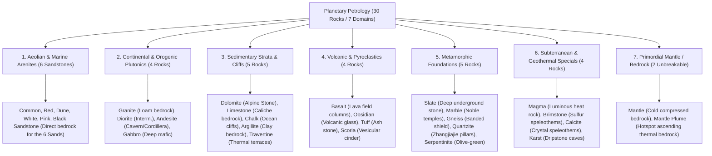

# Worldbuilding Architecture & Proposal: Rocks & Petrology (Rocks)

All active textures for geological matrices, bedrock strata, cobbled stones, and loose ground pebbles are organized in:
📂 **`docs/worldbuilding/rocks`** *(86 active PNG textures on disk after curation)*

Generating a streamlined, harmonious geological foundation connected 1:1 to the **Soils**, **Caverns**, and **Hydrosphere** systems.

Shared surface overlays are located in:
📂 **`docs/worldbuilding/overlays`**

---

## 1. Geological Classification & Pedological Connections

The proposed rock framework organizes the planetary geology into **7 Core Petrological Domains (30 Rocks + 8 Loose Pebbles)**, designed to eliminate redundant inventory bloat while preserving full aesthetic, biome, and crafting diversity:

---

### Direct Pedological Connection Matrix (Rocks $\leftrightarrow$ Soils)

| Soil / Biome Domain | Direct Parent Rock (*Bedrock Strata*) | Geological Rationale |
| :--- | :--- | :--- |
| **Sands (6 Types)** | **Sandstones (6 Types)** | Each sand deposit sits atop its exact lithified fossil sandstone formation. |
| **Clays (4 Types)** | **Argillite** | Terracotta laminated shale formed by deep compaction of alluvial clays. |
| **Caliche (Arid Desert)** | **Limestone & Dolomite** | Alkaline calcium-carbonate crust formed by leaching of limestone bedrocks. |
| **Volcanic Ashes (2 Types)**| **Tuff & Scoria** | Tephra deposits and volcanic ash clouds lithified into solid pyroclastic strata. |
| **Lavas & Magma Fields** | **Basalt, Obsidian & Magma** | Effusive volcanic lava cooling in air (Basalt), water (Obsidian), or retaining heat (Magma). |
| **Temperate Loam & Silt** | **Granite, Diorite & Andesite** | Ancient continental bedrock whose feldspar weathering creates balanced loam topsoils. |
| **Glacial & Cryosphere** | **Dolomite & Slate** | High-altitude alpine summits (Dolomite) and cold deep underground stone (Slate). |
| **Tropical Karst & Caves** | **Karst, Calcite & Travertine** | Soluble carbonates sculpted by rainwater into caverns, sinkholes, and hot springs. |

---

### Surface Outcrops vs. Subterranean Isolation Logic

To maintain strict geological realism and prevent visual anomalies (e.g., surface turf generating deep inside pitch-black caverns):
- **Surface Outcrop Rocks (9 Rocks)**: Only rocks that naturally form open-air mountains, alpine ridges, river canyons, or coastal cliffs possess `_grass_side` and `_snow_side` textures (`Dolomite`, `Granite`, `Andesite`, `Basalt`, `Limestone`, `Chalk`, `Argillite`, `Quartzite`, `Gneiss`).
- **Subterranean & Deep Rocks (21 Rocks)**: Caves, deep strata, hydrothermal formations, volcanic pockets, and the mantle do **not** possess grass or snow variants (`Karst`, `Slate`, `Travertine`, `Gabbro`, `Marble`, `Serpentinite`, `Magma`, `Brimstone`, `Calcite`, `Obsidian`, `Tuff`, `Scoria`, `Mantle`, `Mantle Plume`, and the 6 `Sandstones` which are exclusively topped by loose sands).

---

## 2. Complete Texture Inventory in `worldbuilding/rocks/` (86 Active Textures)

### A. Solid Rock Matrix Textures (30 Base Files, 16×16 px)
* **Sandstones (6)**: `rock_sandstone_common.png`, `rock_sandstone_red.png`, `rock_sandstone_dune.png`, `rock_sandstone_white.png`, `rock_sandstone_pink.png`, `rock_sandstone_black.png`
* **Continental Plutonics (4)**: `rock_granite.png`, `rock_diorite.png`, `rock_andesite.png`, `rock_gabbro.png`
* **Sedimentary Strata (5)**: `rock_dolomite.png`, `rock_limestone.png`, `rock_chalk.png`, `rock_argillite.png`, `rock_travertine.png`
* **Volcanics & Pyroclastics (4)**: `rock_basalt.png`, `rock_obsidian.png`, `rock_tuff.png`, `rock_scoria.png`
* **Metamorphic Foundations (5)**: `rock_slate.png`, `rock_marble.png`, `rock_gneiss.png`, `rock_quartzite.png`, `rock_serpentinite.png`
* **Subterranean & Specials (4)**: `rock_magma.png` *(animated)*, `rock_brimstone.png`, `rock_calcite.png`, `rock_karst.png`
* **Primordial Mantle (2)**: `rock_mantle.png`, `rock_mantle_plume.png`
*(Optional 31st deep rock under evaluation: `rock_peridotite.png`)*

### B. Mined Cobblestone Variants (28 Files, 16×16 px)
All mineable solid rocks drop an unrefined fractured cobblestone upon excavation:
* `cobbled_sandstone_common.png`, `cobbled_sandstone_red.png`, `cobbled_sandstone_dune.png`, `cobbled_sandstone_white.png`, `cobbled_sandstone_pink.png`, `cobbled_sandstone_black.png` (6)
* `cobbled_granite.png`, `cobbled_diorite.png`, `cobbled_andesite.png`, `cobbled_gabbro.png` (4)
* `cobbled_dolomite.png`, `cobbled_limestone.png`, `cobbled_chalk.png`, `cobbled_argillite.png`, `cobbled_travertine.png` (5)
* `cobbled_basalt.png`, `cobbled_obsidian.png`, `cobbled_tuff.png`, `cobbled_scoria.png` (4)
* `cobbled_slate.png`, `cobbled_marble.png`, `cobbled_gneiss.png`, `cobbled_quartzite.png`, `cobbled_serpentinite.png` (5)
* `cobbled_magma.png`, `cobbled_brimstone.png`, `cobbled_calcite.png`, `cobbled_karst.png` (4)
*(Note: `mantle` and `mantle_plume` are unbreakable and have no cobbled variants).*

### C. Mountain Outcrop Veg/Snow Sides (18 Files, 16×16 px)
Exactly **9 surface alpine and cliff rocks** possess lateral turf and snow shelf cutouts:
* **Grass Sides (9)**: `rock_dolomite_grass_side.png`, `rock_granite_grass_side.png`, `rock_andesite_grass_side.png`, `rock_basalt_grass_side.png`, `rock_limestone_grass_side.png`, `rock_chalk_grass_side.png`, `rock_argillite_grass_side.png`, `rock_quartzite_grass_side.png`, `rock_gneiss_grass_side.png`
* **Snow Sides (9)**: `rock_dolomite_snow_side.png`, `rock_granite_snow_side.png`, `rock_andesite_snow_side.png`, `rock_basalt_snow_side.png`, `rock_limestone_snow_side.png`, `rock_chalk_snow_side.png`, `rock_argillite_snow_side.png`, `rock_quartzite_snow_side.png`, `rock_gneiss_snow_side.png`

### D. Ground Pebbles & River Shingle (8 Files, 16×16 px)
Loose surface pebbles collectable by hand on riverbeds, beaches, and gravel banks:
* `pebble_basalt.png` *(Dark volcanic basalt chip)*
* `pebble_chert.png` *(Sharp flint-like silicate nodule for primitive arrowheads)*
* `pebble_dolomite.png` *(Standard gray alpine stone pebble)*
* `pebble_flint.png` *(Pyrite/flint fire-striker nodule dropped from gravel and chalk)*
* `pebble_granite.png` *(Feldspar pinkish river stone)*
* `pebble_obsidian.png` *(Razor-sharp volcanic glass flake)*
* `pebble_quartz.png` *(Smooth white quartz river pebble)*
* `pebble_sandstone.png` *(Coarse golden sandstone pebble)*

---

## 3. Proposed Block Catalog (74 Unique Blocks)

### 3.1. Aeolian & Marine Arenites (12 Blocks: 6 Solid + 6 Cobbled)

| # | Block ID | Name | Category | Texture File(s) | Face Mapping |
| :-: | :--- | :--- | :--- | :--- | :--- |
| **01** | `sandstone_common` | Common Sandstone | **Sedimentary** | `rock_sandstone_common.png` | 6 uniform faces |
| **02** | `cobbled_sandstone_common` | Cobbled Sandstone | **Sedimentary** | `cobbled_sandstone_common.png` | 6 uniform faces |
| **03** | `sandstone_red` | Red Sandstone | **Sedimentary** | `rock_sandstone_red.png` | 6 uniform faces |
| **04** | `cobbled_sandstone_red` | Cobbled Red Sandstone | **Sedimentary** | `cobbled_sandstone_red.png` | 6 uniform faces |
| **05** | `sandstone_dune` | Dune Sandstone | **Sedimentary** | `rock_sandstone_dune.png` | 6 uniform faces |
| **06** | `cobbled_sandstone_dune` | Cobbled Dune Sandstone | **Sedimentary** | `cobbled_sandstone_dune.png` | 6 uniform faces |
| **07** | `sandstone_white` | White Sandstone | **Sedimentary** | `rock_sandstone_white.png` | 6 uniform faces |
| **08** | `cobbled_sandstone_white` | Cobbled White Sandstone | **Sedimentary** | `cobbled_sandstone_white.png` | 6 uniform faces |
| **09** | `sandstone_pink` | Pink Sandstone | **Sedimentary** | `rock_sandstone_pink.png` | 6 uniform faces |
| **10** | `cobbled_sandstone_pink` | Cobbled Pink Sandstone | **Sedimentary** | `cobbled_sandstone_pink.png` | 6 uniform faces |
| **11** | `sandstone_black` | Black Sandstone | **Sedimentary** | `rock_sandstone_black.png` | 6 uniform faces |
| **12** | `cobbled_sandstone_black` | Cobbled Black Sandstone | **Sedimentary** | `cobbled_sandstone_black.png` | 6 uniform faces |

---

### 3.2. Continental Plutonics & Orogenics (12 Blocks: 4 Solid + 4 Cobbled + 4 Outcrops)

| # | Block ID | Name | Category | Texture File(s) | Face Mapping |
| :-: | :--- | :--- | :--- | :--- | :--- |
| **13** | `granite` | Granite | **Plutonic** | `rock_granite.png` | 6 uniform faces |
| **14** | `cobbled_granite` | Cobbled Granite | **Plutonic** | `cobbled_granite.png` | 6 uniform faces |
| **15** | `granite_grass` | Granite Grass Outcrop | **Plutonic** | Top: `soil_grass.png` Bot: `rock_granite.png` Sides: `rock_granite_grass_side.png` | Top + Bot + 4 sides (overlay `soil_grass_side_overlay.png`) |
| **16** | `granite_snow` | Granite Snow Outcrop | **Plutonic** | Top: `soil_snow.png` Bot: `rock_granite.png` Sides: `rock_granite_snow_side.png` | Top + Bot + 4 sides |
| **17** | `andesite` | Andesite | **Continental** | `rock_andesite.png` | 6 uniform faces |
| **18** | `cobbled_andesite` | Cobbled Andesite | **Continental** | `cobbled_andesite.png` | 6 uniform faces |
| **19** | `andesite_grass` | Andesite Grass Outcrop | **Continental** | Top: `soil_grass.png` Bot: `rock_andesite.png` Sides: `rock_andesite_grass_side.png` | Top + Bot + 4 sides (overlay `soil_grass_side_overlay.png`) |
| **20** | `andesite_snow` | Andesite Snow Outcrop | **Continental** | Top: `soil_snow.png` Bot: `rock_andesite.png` Sides: `rock_andesite_snow_side.png` | Top + Bot + 4 sides |
| **21** | `diorite` | Diorite | **Plutonic** | `rock_diorite.png` | 6 uniform faces |
| **22** | `cobbled_diorite` | Cobbled Diorite | **Plutonic** | `cobbled_diorite.png` | 6 uniform faces |
| **23** | `gabbro` | Gabbro | **Plutonic** | `rock_gabbro.png` | 6 uniform faces *(Deep intrusive mafic bedrock)* |
| **24** | `cobbled_gabbro` | Cobbled Gabbro | **Plutonic** | `cobbled_gabbro.png` | 6 uniform faces |

---

### 3.3. Sedimentary Strata & Cliffs (18 Blocks: 5 Solid + 5 Cobbled + 8 Outcrops)

| # | Block ID | Name | Category | Texture File(s) | Face Mapping |
| :-: | :--- | :--- | :--- | :--- | :--- |
| **25** | `dolomite` | Dolomite (Alpine Stone) | **Sedimentary** | `rock_dolomite.png` | 6 uniform faces *(The classic Stone baseline)* |
| **26** | `cobbled_dolomite` | Cobbled Dolomite | **Sedimentary** | `cobbled_dolomite.png` | 6 uniform faces |
| **27** | `dolomite_grass` | Dolomite Grass Outcrop | **Sedimentary** | Top: `soil_grass.png` Bot: `rock_dolomite.png` Sides: `rock_dolomite_grass_side.png` | Top + Bot + 4 sides (overlay `soil_grass_side_overlay.png`) |
| **28** | `dolomite_snow` | Dolomite Snow Outcrop | **Sedimentary** | Top: `soil_snow.png` Bot: `rock_dolomite.png` Sides: `rock_dolomite_snow_side.png` | Top + Bot + 4 sides |
| **29** | `limestone` | Limestone | **Sedimentary** | `rock_limestone.png` | 6 uniform faces |
| **30** | `cobbled_limestone` | Cobbled Limestone | **Sedimentary** | `cobbled_limestone.png` | 6 uniform faces |
| **31** | `limestone_grass` | Limestone Grass Outcrop | **Sedimentary** | Top: `soil_grass.png` Bot: `rock_limestone.png` Sides: `rock_limestone_grass_side.png` | Top + Bot + 4 sides (overlay `soil_grass_side_overlay.png`) |
| **32** | `limestone_snow` | Limestone Snow Outcrop | **Sedimentary** | Top: `soil_snow.png` Bot: `rock_limestone.png` Sides: `rock_limestone_snow_side.png` | Top + Bot + 4 sides |
| **33** | `chalk` | Chalk | **Sedimentary** | `rock_chalk.png` | 6 uniform faces *(Oceanic white cliff face)* |
| **34** | `cobbled_chalk` | Cobbled Chalk | **Sedimentary** | `cobbled_chalk.png` | 6 uniform faces |
| **35** | `chalk_grass` | Chalk Grass Outcrop | **Sedimentary** | Top: `soil_grass.png` Bot: `rock_chalk.png` Sides: `rock_chalk_grass_side.png` | Top + Bot + 4 sides (overlay `soil_grass_side_overlay.png`) |
| **36** | `chalk_snow` | Chalk Snow Outcrop | **Sedimentary** | Top: `soil_snow.png` Bot: `rock_chalk.png` Sides: `rock_chalk_snow_side.png` | Top + Bot + 4 sides |
| **37** | `argillite` | Argillite | **Sedimentary** | `rock_argillite.png` | 6 uniform faces *(Clay bedrock)* |
| **38** | `cobbled_argillite` | Cobbled Argillite | **Sedimentary** | `cobbled_argillite.png` | 6 uniform faces |
| **39** | `argillite_grass` | Argillite Grass Outcrop | **Sedimentary** | Top: `soil_grass.png` Bot: `rock_argillite.png` Sides: `rock_argillite_grass_side.png` | Top + Bot + 4 sides (overlay `soil_grass_side_overlay.png`) |
| **40** | `argillite_snow` | Argillite Snow Outcrop | **Sedimentary** | Top: `soil_snow.png` Bot: `rock_argillite.png` Sides: `rock_argillite_snow_side.png` | Top + Bot + 4 sides |
| **41** | `travertine` | Travertine | **Sedimentary** | `rock_travertine.png` | 6 uniform faces *(Thermal spring terrace limestone)* |
| **42** | `cobbled_travertine` | Cobbled Travertine | **Sedimentary** | `cobbled_travertine.png` | 6 uniform faces |

---

### 3.4. Volcanic & Pyroclastics (10 Blocks: 4 Solid + 4 Cobbled + 2 Outcrops)

| # | Block ID | Name | Category | Texture File(s) | Face Mapping |
| :-: | :--- | :--- | :--- | :--- | :--- |
| **43** | `basalt` | Basalt | **Volcanic** | `rock_basalt.png` | 6 uniform faces |
| **44** | `cobbled_basalt` | Cobbled Basalt | **Volcanic** | `cobbled_basalt.png` | 6 uniform faces |
| **45** | `basalt_grass` | Basalt Grass Outcrop | **Volcanic** | Top: `soil_grass.png` Bot: `rock_basalt.png` Sides: `rock_basalt_grass_side.png` | Top + Bot + 4 sides (overlay `soil_grass_side_overlay.png`) |
| **46** | `basalt_snow` | Basalt Snow Outcrop | **Volcanic** | Top: `soil_snow.png` Bot: `rock_basalt.png` Sides: `rock_basalt_snow_side.png` | Top + Bot + 4 sides |
| **47** | `obsidian` | Obsidian | **Volcanic** | `rock_obsidian.png` | 6 uniform faces *(Amorphous volcanic glass)* |
| **48** | `cobbled_obsidian` | Cobbled Obsidian | **Volcanic** | `cobbled_obsidian.png` | 6 uniform faces |
| **49** | `tuff` | Tuff | **Pyroclastic** | `rock_tuff.png` | 6 uniform faces *(Compacted volcanic ash)* |
| **50** | `cobbled_tuff` | Cobbled Tuff | **Pyroclastic** | `cobbled_tuff.png` | 6 uniform faces |
| **51** | `scoria` | Scoria | **Pyroclastic** | `rock_scoria.png` | 6 uniform faces *(Rusty vesicular cinders)* |
| **52** | `cobbled_scoria` | Cobbled Scoria | **Pyroclastic** | `cobbled_scoria.png` | 6 uniform faces |

---

### 3.5. Metamorphic Foundations (14 Blocks: 5 Solid + 5 Cobbled + 4 Outcrops)

| # | Block ID | Name | Category | Texture File(s) | Face Mapping |
| :-: | :--- | :--- | :--- | :--- | :--- |
| **53** | `slate` | Slate | **Metamorphic** | `rock_slate.png` | 6 uniform faces *(Laminated deep underground stone)* |
| **54** | `cobbled_slate` | Cobbled Slate | **Metamorphic** | `cobbled_slate.png` | 6 uniform faces |
| **55** | `marble` | Marble | **Metamorphic** | `rock_marble.png` | 6 uniform faces *(Pure white architectural stone)* |
| **56** | `cobbled_marble` | Cobbled Marble | **Metamorphic** | `cobbled_marble.png` | 6 uniform faces |
| **57** | `gneiss` | Gneiss | **Metamorphic** | `rock_gneiss.png` | 6 uniform faces *(Ancient banded shield bedrock)* |
| **58** | `cobbled_gneiss` | Cobbled Gneiss | **Metamorphic** | `cobbled_gneiss.png` | 6 uniform faces |
| **59** | `gneiss_grass` | Gneiss Grass Outcrop | **Metamorphic** | Top: `soil_grass.png` Bot: `rock_gneiss.png` Sides: `rock_gneiss_grass_side.png` | Top + Bot + 4 sides (overlay `soil_grass_side_overlay.png`) |
| **60** | `gneiss_snow` | Gneiss Snow Outcrop | **Metamorphic** | Top: `soil_snow.png` Bot: `rock_gneiss.png` Sides: `rock_gneiss_snow_side.png` | Top + Bot + 4 sides |
| **61** | `quartzite` | Quartzite | **Metamorphic** | `rock_quartzite.png` | 6 uniform faces *(Zhangjiajie colossal erosion pillars)* |
| **62** | `cobbled_quartzite` | Cobbled Quartzite | **Metamorphic** | `cobbled_quartzite.png` | 6 uniform faces |
| **63** | `quartzite_grass` | Quartzite Grass Outcrop | **Metamorphic** | Top: `soil_grass.png` Bot: `rock_quartzite.png` Sides: `rock_quartzite_grass_side.png` | Top + Bot + 4 sides (overlay `soil_grass_side_overlay.png`) |
| **64** | `quartzite_snow` | Quartzite Snow Outcrop | **Metamorphic** | Top: `soil_snow.png` Bot: `rock_quartzite.png` Sides: `rock_quartzite_snow_side.png` | Top + Bot + 4 sides |
| **65** | `serpentinite` | Serpentinite | **Metamorphic** | `rock_serpentinite.png` | 6 uniform faces *(Unique deep olive-green hydrated rock)* |
| **66** | `cobbled_serpentinite`| Cobbled Serpentinite | **Metamorphic** | `cobbled_serpentinite.png` | 6 uniform faces |

---

### 3.6. Subterranean & Geothermal Specials (8 Blocks: 4 Solid + 4 Cobbled)

| # | Block ID | Name | Category | Texture File(s) | Face Mapping |
| :-: | :--- | :--- | :--- | :--- | :--- |
| **67** | `magma` | Magma Rock | **Geothermal** | `rock_magma.png` | 6 uniform faces *(Animated incandescent veins, emits light)* |
| **68** | `cobbled_magma` | Cobbled Magma | **Geothermal** | `cobbled_magma.png` | 6 uniform faces |
| **69** | `brimstone` | Brimstone | **Hydrothermal** | `rock_brimstone.png` | 6 uniform faces *(Sulfur fumaroles, cave speleothems)* |
| **70** | `cobbled_brimstone` | Cobbled Brimstone | **Hydrothermal** | `cobbled_brimstone.png` | 6 uniform faces |
| **71** | `calcite` | Calcite | **Mineral** | `rock_calcite.png` | 6 uniform faces *(Crystalline geode matrix, speleothems)* |
| **72** | `cobbled_calcite` | Cobbled Calcite | **Mineral** | `cobbled_calcite.png` | 6 uniform faces |
| **73** | `karst` | Karst Limestone | **Speleological** | `rock_karst.png` | 6 uniform faces *(Porous cave limestone, speleothems)* |
| **74** | `cobbled_karst` | Cobbled Karst | **Speleological** | `cobbled_karst.png` | 6 uniform faces |

---

### 3.7. Primordial Mantle (2 Unbreakable Bedrock Blocks)

| # | Block ID | Name | Category | Texture File(s) | Face Mapping |
| :-: | :--- | :--- | :--- | :--- | :--- |
| **75** | `mantle` | Primordial Mantle | **Bedrock** | `rock_mantle.png` | 6 uniform faces *(Cold high-pressure world floor, unbreakable)* |
| **76** | `mantle_plume` | Mantle Plume | **Bedrock** | `rock_mantle_plume.png` | 6 uniform faces *(Thermal hotspot ascending plume, unbreakable)* |
