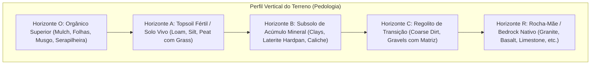

# Catálogo e Estrutura de Worldbuilding: Solos e Terrenos

Todas as texturas ativas de solos e terrenos estão organizadas na pasta:
📂 **`docs/worldbuilding/soils`**

Overlays compartilhados de superfície estão na pasta:
📂 **`docs/worldbuilding/overlays`**

---

## 1. Classificação Edafológica e Pedológica (Ciência dos Solos)

Na pedologia do planeta, os solos e coberturas superficiais são organizados em **4 grandes domínios pedogenéticos**:

```mermaid
graph TD
    A["Pedologia: Classificação dos Solos"] --> B["1. Solos Biológicos / Zonais Temperados"]
    A --> C["2. Solos Climáticos Zonais Extremos"]
    A --> D["3. Sedimentos Granulares & Matrizes Minerais"]
    A --> E["4. Depósitos Piroclásticos, Criosfera & Biológicos"]

    B --> B1["Loam: Solo temperado balanceado (Argila + Silte + Areia)"]
    B --> B2["Silt: Solo aluvial de várzeas e deltas fluviais"]
    B --> B3["Peat: Turfeira ácida e matéria orgânica fóssil saturada"]

    C --> C1["Permafrost: Criosfera polar com matriz congelada e gelo maciço"]
    C --> C2["Caliche: Crosta árida alcalina carbonática de deserto"]
    C --> C3["Laterite: Couraça tropical ferruginosa lixiviada (Terra Roxa/Ferricrete)"]

    D --> D1["Clays (4 Cores): Argilas plásticas impermeáveis (Gray, Red, White, Yellow)"]
    D --> D2["Sands (6 Cores): Areias granulares eólicas/marinhas (Common, Red, Dune, White, Pink, Black)"]
    D --> D3["Gravels (Sistema Matriz): Cascalhos fluviais, terrosos, vulcânicos e glaciais"]

    E --> E1["Cinzas Vulcânicas: Depósitos de tefra (Basáltica escura, Pumice clara)"]
    E --> E2["Neves & Criosfera: Neve compacta sólida e Neve fofa em pó (Powder Snow)"]
    E --> E3["Musgos de Solo (4 Biomas): Forest, Crimson (Tundra), Amber (Pântano), Cave (Bioluminescente)"]
```

---

## 2. Catálogo Edafológico e Pedológico

| Solo / Terreno | Domínio Pedológico | Subclasse / Origem | Drenagem & Umidade | Fertilidade & Agricultura | Papel no Mundo / Biomas Recomendados |
| :--- | :--- | :--- | :--- | :--- | :--- |
| **Loam** | **Biológico** | Franco balanceado (40% areia, 40% silte, 20% argila) | Drenagem ideal equilibrada | **Máxima fertilidade**. Solo nobre de cultivo agrícola. | Florestas temperadas, pradarias, planícies agrícolas e bosques. |
| **Silt** | **Biológico** | Sedimento fino aluvial fluvial/lacustre | Alta retenção de umidade | Alta fertilidade para culturas aquáticas/arroz. | Várzeas fluviais, deltas, margens de rios e meandros úmidos. |
| **Peat** | **Biológico** | Histossolo / Turfeira ácida não-decomposta | Hipersaturado / Encharcado | Ácido; queima lentamente como combustível natural. | Pântanos frios, turfeiras boreais, mangues e charnecas. |
| **Permafrost** | **Climático** | Criosolo congelado com cunhas de gelo | Impermeável (gelo subterrâneo) | Estéril até degelo; impede raízes profundas. | Tundras árticas, taigas boreais, platôs glaciais e calotas polares. |
| **Caliche** | **Climático** | Aridisolo com cimentação de carbonato de cálcio | Drenagem ultrarrápida / Seca | Muito baixa; altamente alcalino e endurecido. | Desertos áridos, estepes secas, chaparrais e cânions de transição. |
| **Laterite** | **Climático** | Latossolo tropical rico em óxidos de ferro/alumínio | Drenagem rápida; lixiviado | Baixa fertilidade natural; endurece sob o sol (ferricrete). | Florestas tropicais úmidas, savanas, selvas equatoriais e platôs de terra roxa. |
| **Gray Clay** | **Sedimento** | Argila aluvial plástica comum | Impermeável | Retém água em arrozais; matéria-prima básica de cerâmica. | Leitos de lagos, várzeas de rios, deltas e bacias sedimentares. |
| **Red Clay** | **Sedimento** | Argila terracota rica em ferro (óxidos) | Impermeável | Ideal para tijolos vermelhos, telhas e cerâmica rústica. | Bacias continentais oxidadas, encostas de cânions e escarpas argilosas. |
| **White Clay** | **Sedimento** | Caulim puro silicato de alumínio hidratado | Impermeável / Refratária | Base para porcelana nobre, cerâmica fina e cosméticos. | Depósitos hidrotermais de feldspato alterado, bacias fluviais puras. |
| **Yellow Clay** | **Sedimento** | Argila ocre rica em limonita / goethita | Impermeável | Pigmentos naturais minerais ocres e argamassa clássica. | Pântanos ricos em ferro, fontes de pântano e bacias aluviais ocres. |
| **Common Sand** | **Sedimento** | Areia quartzosa aluvial/litorânea comum | Drenagem instantânea | Estéril; base para vidro comum e argamassa de construção. | Praias continentais, leitos de rios secos, costas marítimas. |
| **Red Sand** | **Sedimento** | Areia desértica com película de hematita | Drenagem instantânea | Estéril; forma grandes mares de areia eólicas (*ergs*). | Desertos vermelhos (estilo Saara/Outback australiano) e cânions. |
| **Dune Sand** | **Sedimento** | Areia eólica fina e dourada bem selecionada | Drenagem instantânea | Sujeita a movimentação constante pelo vento. | Dunas costeiras ativas, desertos de dunas ondulantes e oásis. |
| **White Sand** | **Sedimento** | Areia bioclástica de corais/conchas ou gipsita | Drenagem instantânea | Praias paradisíacas tropicais e salares alvos. | Atóis de coral, ilhas tropicais, praias de areia branca pura. |
| **Pink Sand** | **Sedimento** | Areia com foraminíferos rosados (*Homotrema*) e feldspato | Drenagem instantânea | Rara e decorativa em orlas litorâneas nobres. | Praias costeiras de ilhas oceânicas tropicais (Bahamas/Bermudas). |
| **Black Sand** | **Sedimento** | Areia basáltica vulcânica pesada (magnetita) | Drenagem rápida; densa | Rica em minerais pesados e calor solar absorvido. | Praias vulcânicas (Havaí/Islândia), arquipélagos e cones costeiros. |
| **Dirty Gravel** | **Cascalho** | Cascalho em matriz terrosa de *loam* | Drenagem moderada | Transição entre solo orgânico e leito rochoso. | Encostas de colinas, transição de florestas e estradas de terra. |
| **Sandy Gravel** | **Cascalho** | Cascalho em matriz de areia fluvial | Alta permeabilidade | Depósito de alta energia cinética de correntes de água. | Leitos de rios torrenciais, praias cascalhentas e deltas. |
| **Ashy Gravel** | **Cascalho** | Cascalho e bombas em cinza vulcânica escura | Poroso / Instável | Solo piroclástico recente de erupções explosivas. | Encostas de vulcões, caldeiras ativas e campos de lava. |
| **Snowy Gravel** | **Cascalho** | Cascalho criogênico em matriz congelada | Congelado / Escorregadio | Crioclastia (fragmentação mecânica de pedra pelo gelo). | Morainas glaciais, picos nevados e margens de geleiras. |
| **Volcanic Ash** | **Piroclástico** | Cinza vulcânica basáltica/máfica escura fina | Drenagem moderada | **Hipersolo fértil após intemperismo** (Andossolo). | Campos ao redor de vulcões ativos, vales termais e caldeiras. |
| **Pumice Ash** | **Piroclástico** | Cinza félsica clara porosa de pedra-pomes | Ultraleve / Flutuante | Abrasivo natural; solo piroclástico claro aerado. | Encostas de caldeiras riolíticas e depósitos de erupções plinianas. |
| **Forest Moss** | **Biológico** | Musgo aveludado verde clássico (*Bryophyta*) | Retém muita água superficial | Protege o solo contra erosão e cria serapilheira viva. | Florestas temperadas úmidas, bosques ribeirinhos e vales sombreados. |
| **Crimson Moss** | **Biológico** | Esfagno carmesim (*Sphagnum rubellum*) | Hiper-retentivo e acidificante | Cria a base orgânica das turfeiras boreais. | Turfeiras ácidas boreais, tundras vermelhas e charnecas frias. |
| **Amber Moss** | **Biológico** | Musgo dourado/âmbar (*Tomenthypnum nitens*) | Retém umidade em clareiras | Indicador de pântanos ricos em minerais (*fens*). | Pântanos ensolarados, clareiras pantanosas e margens de lagos. |
| **Cave Moss** | **Biológico** | Musgo luminescente de gruta (*Schistostega pennata*) | Úmido / Subterrâneo | Reflete luz verde-dourada em cavidades escuras. | Cavernas rasas, tocas, fendas rochosas e grutas subterrâneas. |
| **Snow Block** | **Criosfera** | Neve consolidada e compactada pelo peso | Sólido criosférico | Isolante térmico natural; base para iglus e relevos de gelo. | Picos de montanha, biomas boreais, geleiras e calotas polares. |
| **Powder Snow** | **Criosfera** | Neve fresca aerada e fofa recém-caída | Permeável e instável | Entidades afundam e sofrem hipotermia sem calçados adequados. | Encostas de nevasca, vales nevados profundos e picos tempestuosos. |

---

## 3. Filosofia Pedológica: O Perfil de Solo e a Conexão com as Rochas

Na natureza e na geração procedural do mundo, o solo não é um bloco isolado: ele é o produto direto do **intemperismo da rocha-mãe ao longo de milênios**, organizado em **horizontes verticais**:

1. **Horizonte O (Orgânico):** Camada de serapilheira e folhas caídas (`soil_<tipo>_mulch.png`) ou tapetes de musgo vivo (`soil_moss_<tipo>.png`) protegendo o topo do terreno.
2. **Horizonte A (Solo Vivo / Topsoil):** Camada onde a vegetação cria raízes, com variantes agrícolas aradas (`_tilled.png`), raízes expostas (`_rooted.png`) e laterais com grama (`_grass_side.png`).
3. **Horizonte B (Subsolo Mineral):** Camada profunda de acúmulo iluvial: onde se concentram argilas puras (*Clays*), couraças de ferro endurecidas (*Laterite Hardpan*) ou cimentações salinas (*Caliche Cracked*).
4. **Horizonte C (Regolito):** Zona de fragmentação mecânica da rocha; representada pelos solos ásperos (`_coarse.png`) e pelos **Cascalhos de Matriz** (`soil_gravel_<matriz>.png`).
5. **Horizonte R (Rocha-Mãe Nativa):** A sustentação geológica do terreno — definida no catálogo de [rocks_design.md](file:///c:/Users/Rodrigo/Documents/BevyProjects/VoxelGameEngine/docs/worldbuilding/rocks_design.md).

---

## 4. Filosofia de Design: O Sistema de Cascalhos de Matriz Geológica

Cascalhos não existem isolados no vácuo; seixos rolados são sempre envolvidos pelo sedimento da matriz circundante:
1. **Dirty Gravel (`soil_gravel_dirty.png`):** Matriz de solo orgânico temperado (*Loam*). Encostas de colinas e clareiras florestais.
2. **Sandy Gravel (`soil_gravel_sandy.png`):** Matriz de areia lavada. Leitos de rios torrenciais, praias cascalhentas e deltas.
3. **Ashy Gravel (`soil_gravel_ashy.png`):** Matriz de cinza vulcânica escura basáltica. Encostas de vulcões ativos e campos piroclásticos.
4. **Snowy Gravel (`soil_gravel_snowy.png`):** Matriz de gelo e neve criogênica. Morainas glaciais e cristas congeladas.

---

## 5. Catálogo Completo de Texturas em `worldbuilding/soils/` (66 Texturas)

### A. Solos Biológicos Principais (10 variantes cada = 30 texturas)
Para cada solo biológico (**Loam**, **Silt**, **Peat**):
- **`dirt`**: Bloco base de solo puro.
- **`coarse`**: Solo áspero com seixos embutidos.
- **`grass_side`**: Lateral com cobertura vegetal de grama.
- **`mud`**: Solo encharcado e lamoso.
- **`mulch`**: Camada superior com serapilheira e folhas caídas.
- **`mulch_side`**: Lateral com caimento de folhas.
- **`rooted`**: Solo entrelaçado com raízes expostas.
- **`snow_side`**: Lateral com camada de neve.
- **`tilled`**: Solo preparado e arado para cultivo agrícola.
- **`tilled_side`**: Lateral do solo arado com ranhura de cultivo.

### B. Solos Climáticos (4 variantes cada = 12 texturas)
- **Permafrost (Frio / Polar / Criosfera)**: `dirt`, `coarse`, `grass_side`, `icy`.
- **Caliche (Quente / Árido / Deserto)**: `dirt`, `coarse`, `grass_side`, `cracked`.
- **Laterite (Quente / Úmido / Tropical)**: `dirt`, `coarse`, `grass_side`, `hardpan`.

### C. Argilas / Clays (4 texturas)
- `soil_clay_gray.png` (Aluvial comum)
- `soil_clay_red.png` (Terracota rica em ferro)
- `soil_clay_white.png` (Caulim puro para cerâmica nobre)
- `soil_clay_yellow.png` (Ocre com limonita)

### D. Areias / Sands (6 texturas)
- `soil_sand.png` (Comum quartzosa)
- `soil_sand_red.png` (Desértica com hematita)
- `soil_sand_dune.png` (Dunas eólicas douradas)
- `soil_sand_white.png` (Praia de gipsita/coral)
- `soil_sand_pink.png` (Areia rosa com foraminíferos)
- `soil_sand_black.png` (Areia basáltica vulcânica)

### E. Cascalhos / Gravels (4 texturas)
- `soil_gravel_dirty.png` (Matriz terrosa de loam)
- `soil_gravel_sandy.png` (Matriz arenosa fluvial)
- `soil_gravel_ashy.png` (Matriz de cinza vulcânica escura)
- `soil_gravel_snowy.png` (Matriz congelada com gelo e neve)

### F. Cinzas Vulcânicas (2 texturas)
- `soil_ash_vulcanic.png` (Cinza basáltica escura)
- `soil_ash_pumice.png` (Pó de pedra-pomes clara)

### G. Musgos de Solo (4 texturas)
- `soil_moss_forest.png` (Musgo florestal temperado)
- `soil_moss_crimson.png` (Esfagno carmesim boreal)
- `soil_moss_amber.png` (Musgo dourado de pântanos)
- `soil_moss_cave.png` (Musgo bioluminescente de gruta)

### H. Neves & Grama Topo (4 texturas)
- `soil_snow.png` (Topo e bloco sólido de neve)
- `soil_snow_powder.png` (Neve fofa aerada)
- `soil_grass.png` (Topo de grama em escala de cinza para biome tint)
- `soil_grass_colored.png` (Topo de grama pré-colorido)

---

## 6. Catálogo Completo de Blocos (58 Blocos)

Este catálogo define a composição de faces (topo, fundo e laterais) e o uso de overlays para cada bloco de solo do sistema de voxels:

---

### A. Solos Biológicos (24 Blocos: 8 Loam + 8 Silt + 8 Peat)

#### 1. Loam (Solo Temperado Balanceado)
- **Loam Dirt**: `soil_loam_dirt.png` em todas as 6 faces.
- **Loam Coarse**: `soil_loam_coarse.png` em todas as 6 faces.
- **Loam Mud**: `soil_loam_mud.png` em todas as 6 faces.
- **Loam Rooted**: `soil_loam_rooted.png` em todas as 6 faces.
- **Loam Grass**: Topo `soil_grass.png` (em escala de cinza com biome tint), fundo `soil_loam_dirt.png`, lateral `soil_loam_grass_side.png` com overlay `soil_grass_side_overlay.png` (em escala de cinza com biome tint na camada de grama).
- **Loam Snow**: Topo `soil_snow.png`, fundo `soil_loam_dirt.png`, lateral `soil_loam_snow_side.png`.
- **Loam Mulch**: Topo `soil_loam_mulch.png`, fundo `soil_loam_dirt.png`, lateral `soil_loam_mulch_side.png`.
- **Loam Tilled**: Topo `soil_loam_tilled.png`, fundo `soil_loam_dirt.png`, lateral `soil_loam_tilled_side.png`.

#### 2. Silt (Solo Fino Aluvial / Fluvial)
- **Silt Dirt**: `soil_silt_dirt.png` em todas as 6 faces.
- **Silt Coarse**: `soil_silt_coarse.png` em todas as 6 faces.
- **Silt Mud**: `soil_silt_mud.png` em todas as 6 faces.
- **Silt Rooted**: `soil_silt_rooted.png` em todas as 6 faces.
- **Silt Grass**: Topo `soil_grass.png` (em escala de cinza com biome tint), fundo `soil_silt_dirt.png`, lateral `soil_silt_grass_side.png` com overlay `soil_grass_side_overlay.png` (em escala de cinza com biome tint na camada de grama).
- **Silt Snow**: Topo `soil_snow.png`, fundo `soil_silt_dirt.png`, lateral `soil_silt_snow_side.png`.
- **Silt Mulch**: Topo `soil_silt_mulch.png`, fundo `soil_silt_dirt.png`, lateral `soil_silt_mulch_side.png`.
- **Silt Tilled**: Topo `soil_silt_tilled.png`, fundo `soil_silt_dirt.png`, lateral `soil_silt_tilled_side.png`.

#### 3. Peat (Solo Orgânico de Turfeira / Pântano)
- **Peat Dirt**: `soil_peat_dirt.png` em todas as 6 faces.
- **Peat Coarse**: `soil_peat_coarse.png` em todas as 6 faces.
- **Peat Mud**: `soil_peat_mud.png` em todas as 6 faces.
- **Peat Rooted**: `soil_peat_rooted.png` em todas as 6 faces.
- **Peat Grass**: Topo `soil_grass.png` (em escala de cinza com biome tint), fundo `soil_peat_dirt.png`, lateral `soil_peat_grass_side.png` com overlay `soil_grass_side_overlay.png` (em escala de cinza com biome tint na camada de grama).
- **Peat Snow**: Topo `soil_snow.png`, fundo `soil_peat_dirt.png`, lateral `soil_peat_snow_side.png`.
- **Peat Mulch**: Topo `soil_peat_mulch.png`, fundo `soil_peat_dirt.png`, lateral `soil_peat_mulch_side.png`.
- **Peat Tilled**: Topo `soil_peat_tilled.png`, fundo `soil_peat_dirt.png`, lateral `soil_peat_tilled_side.png`.

---

### B. Solos Climáticos (12 Blocos: 4 Permafrost + 4 Caliche + 4 Laterite)

#### 1. Permafrost (Frio / Polar / Tundra)
- **Permafrost Dirt**: `soil_permafrost_dirt.png` em todas as 6 faces.
- **Permafrost Coarse**: `soil_permafrost_coarse.png` em todas as 6 faces.
- **Permafrost Grass**: Topo `soil_grass.png` (com biome tint), fundo `soil_permafrost_dirt.png`, lateral `soil_permafrost_grass_side.png` com overlay `soil_grass_side_overlay.png`.
- **Permafrost Icy**: `soil_permafrost_icy.png` em todas as 6 faces (solo maciço cortado por veios de gelo puro).

#### 2. Caliche (Árido / Desértico / Chaparral)
- **Caliche Dirt**: `soil_caliche_dirt.png` em todas as 6 faces.
- **Caliche Coarse**: `soil_caliche_coarse.png` em todas as 6 faces.
- **Caliche Cracked**: `soil_caliche_cracked.png` em todas as 6 faces (solo fendilhado pela dessecação extrema).
- **Caliche Grass**: Topo `soil_grass.png` (com biome tint), fundo `soil_caliche_dirt.png`, lateral `soil_caliche_grass_side.png` com overlay `soil_grass_side_overlay.png`.

#### 3. Laterite (Quente / Úmido / Florestas Tropicais)
- **Laterite Dirt**: `soil_laterite_dirt.png` em todas as 6 faces.
- **Laterite Coarse**: `soil_laterite_coarse.png` em todas as 6 faces.
- **Laterite Hardpan**: `soil_laterite_hardpan.png` em todas as 6 faces (couraça laterítica endurecida de pedra de ferro).
- **Laterite Grass**: Topo `soil_grass.png` (com biome tint), fundo `soil_laterite_dirt.png`, lateral `soil_laterite_grass_side.png` com overlay `soil_grass_side_overlay.png`.

---

### C. Musgos de Solo / Moss Blocks (4 Blocos)

Blocos vegetais de solo que também fornecem overlays laterais para transições orgânicas:

- **Forest Moss**: `soil_moss_forest.png` em todas as 6 faces. *(Overlay lateral para solo/rocha: `moss_forest_side_overlay.png`)*
- **Crimson Moss**: `soil_moss_crimson.png` em todas as 6 faces. *(Overlay lateral para solo/rocha: `moss_crimson_side_overlay.png`)*
- **Amber Moss**: `soil_moss_amber.png` em todas as 6 faces. *(Overlay lateral para solo/rocha: `moss_amber_side_overlay.png`)*
- **Cave Moss**: `soil_moss_cave.png` em todas as 6 faces. *(Overlay lateral para solo/rocha: `moss_cave_side_overlay.png`)*

---

### D. Argilas / Clays (4 Blocos)

Blocos sedimentares minerais plásticos e impermeáveis:

- **Gray Clay**: `soil_clay_gray.png` em todas as 6 faces.
- **Red Clay**: `soil_clay_red.png` em todas as 6 faces.
- **White Clay**: `soil_clay_white.png` em todas as 6 faces.
- **Yellow Clay**: `soil_clay_yellow.png` em todas as 6 faces.

---

### E. Areias / Sands (6 Blocos)

Blocos granulares homogêneos de deposição eólica e litorânea:

- **Common Sand**: `soil_sand.png` em todas as 6 faces.
- **Red Sand**: `soil_sand_red.png` em todas as 6 faces.
- **Dune Sand**: `soil_sand_dune.png` em todas as 6 faces.
- **White Sand**: `soil_sand_white.png` em todas as 6 faces.
- **Pink Sand**: `soil_sand_pink.png` em todas as 6 faces.
- **Black Sand**: `soil_sand_black.png` em todas as 6 faces.

---

### F. Cascalhos / Gravels (4 Blocos)

Blocos detríticos compostos por seixos suspensos em matrizes geológicas diferenciadas:

- **Dirty Gravel**: `soil_gravel_dirty.png` em todas as 6 faces (matriz de solo loam).
- **Sandy Gravel**: `soil_gravel_sandy.png` em todas as 6 faces (matriz arenosa fluvial).
- **Ashy Gravel**: `soil_gravel_ashy.png` em todas as 6 faces (matriz de cinza vulcânica escura).
- **Snowy Gravel**: `soil_gravel_snowy.png` em todas as 6 faces (matriz congelada com gelo/neve).

---

### G. Cinzas Vulcânicas / Ashes (2 Blocos)

Depósitos piroclásticos homogêneos:

- **Volcanic Ash**: `soil_ash_vulcanic.png` em todas as 6 faces.
- **Pumice Ash**: `soil_ash_pumice.png` em todas as 6 faces.

---

### H. Neves / Snows (2 Blocos)

Precipitação sólida e criosfera do mundo:

- **Snow Block**: `soil_snow.png` em todas as 6 faces (também utilizado como textura do topo de solos e rochas nevados).
- **Powder Snow**: `soil_snow_powder.png` em todas as 6 faces (neve fofa e aerada com física de afundamento e congelamento).
