# Catálogo e Estrutura de Worldbuilding: Árvores e Madeiras (Dendrologia)

Todas as texturas ativas de árvores e madeiras estão organizadas na pasta:
📂 **`docs/worldbuilding/trees`** *(96 texturas PNG ativas em 22 espécies botânicas)*
E os overlays dinâmicos de folhagem nevada e floral em:
📂 **`docs/worldbuilding/overlays`** *(inclui 4 overlays de neve e 4 overlays de flores de copas)*

---

## 1. Classificação Dendrológica e Botânica (Ecologia Florestal)

Na ecologia e worldbuilding do planeta, as árvores e plantas lenhosas estão organizadas em **5 grandes zonas bioclimáticas e morfologias de copa**, cobrindo desde taigas árticas congeladas até desertos escaldantes, pântanos tropicais e costas oceânicas:

```mermaid
graph TD
    A["Dendrologia: 22 Espécies Florestais do Planeta"] --> B["1. Florestas Temperadas & Decíduas (6)"]
    A --> C["2. Florestas Boreais, Alpinas & Coníferas (4)"]
    A --> D["3. Florestas Tropicais & Selvas Úmidas (4)"]
    A --> E["4. Biomas Áridos, Semiáridos & Savanas (4)"]
    A --> F["5. Zonas Costeiras, Ripárias & Piroclásticas (4)"]

    B --> B1["Oak: Carvalho temperado clássico (Comum, Flowering, Lush)"]
    B --> B2["Birch: Bétula de casca branca delgada e madeira clara"]
    B --> B3["Maple: Bordo de outono vibrante (Folhas Laranja, Vermelha, Amarela)"]
    B --> B4["Cherry: Cerejeira oriental ornamental com flores (Sakura)"]
    B --> B5["Aspen: Álamo tremedor de montanha (Folhas Douradas e Snowy Top/Side)"]
    B --> B6["Willow: Salgueiro-chorão de margens fluviais com folhagem pendente"]

    C --> C1["Pine: Pinheiro silvestre de taiga (Agulhas perenes + Snowy Top/Side Overlay)"]
    C --> C2["Fir: Abeto cônico de alta montanha (Folhagem Normal e Snowy nativa)"]
    C --> C3["Redwood: Sequóia colossal de cerne vermelho-tijolo e troncos massivos"]
    C --> C4["Yew: Teixo nobre e sombrio de madeira negra (Dark Oak + Snowy Top/Side Overlay)"]

    D --> D1["Mahogany: Mogno nobre de selva densa com madeira avermelhada luxuosa"]
    D --> D2["Bamboo: Bambu gigante lenhoso com colmos ocos e folhas em leque"]
    D --> D3["Mangrove: Mangue costeiro com sistema de raízes aéreas submersas"]
    D --> D4["Kapok: Sumaúma gigante emergente de dossel tropical com madeira clara"]

    E --> E1["Acacia: Acácia de savana com copa horizontal e madeira alaranjada"]
    E --> E2["Baobab: Baobá colossal ancestral com tronco dilatado para retenção de água"]
    E --> E3["Joshua: Árvore-de-josué suculenta e retorcida de semiárido"]
    E --> E4["Cactus: Cacto colunar saguaro com nervuras suculentas e espinhos"]

    F --> F1["Palm: Palmeira tropical de oásis e litorais com copa radiada"]
    F --> F2["Cypress: Cipreste de pântano e mediterrâneo com madeira imputrescível"]
    F --> F3["Driftwood: Madeira flutuante encalhada lavada por sal marinho (Bleached Wood)"]
    F --> F4["Charred: Madeira ancestral carbonizada de zonas piroclásticas e vulcânicas"]
```

---

## 2. Matriz Comparativa Dendrológica (22 Espécies)

| # | Espécie | Inspiração Botânica | Bioma Nativo | Arquitetura de Tronco & Casca | Tom das Tábuas (`planks`) | Variantes de Folhas / Neve | Papel Ecológico / Arquitetura |
| :-: | :--- | :--- | :--- | :--- | :--- | :--- | :--- |
| **01** | **Oak** | *Quercus robur* | Planícies & Florestas Temperadas | Casca marrom rugosa clássica, anéis concêntricos equilibrados | Marrom-âmbar neutro clássico | Comum, Flowering, Lush *(+ Overlays florais)* | Estrutura florestal base e madeira arquitetônica universal. |
| **02** | **Birch** | *Betula pendula* | Florestas Temperadas & Encostas | Casca branca leitosa com lenticelas escuras | Madeira muito clara/marfim | Folhas verde-amareladas delgadas | Contraste luminoso em biomas temperados e interiores escandinavos. |
| **03** | **Maple** | *Acer saccharum* | Florestas Decíduas de Outono | Casca cinzenta com anéis beges quentes | Castanho aconchegante suave | 3 fases sazonais: Orange, Red, Yellow | Biomas de outono perene com gradientes de cores impressionantes. |
| **04** | **Cherry** | *Prunus serrulata* | Bosques Orientais & Montanhas | Casca marrom-acinzentada com anéis suaves | Bege rosado delicado | Flores rosadas de cerejeira (Sakura) | Estética oriental contemplativa, jardins e palácios. |
| **05** | **Aspen** | *Populus tremuloides* | Encostas Alpinas & Montanhosas | Casca bege-clara com nós pretos verticais | Bege pálido límpido | Folhas douradas de outono e **Versão Snowy (Top & Side)** | Transição alpina e picos de montanha nevados. |
| **06** | **Willow** | *Salix babylonica* | Várzeas, Rios & Margens Lacustres | Casca marrom-escura fibrosa e retorcida | Bege acastanhado leve | Folhagem pendente de dossel baixo | Vegetação ripária, pontes fluviais e lagos sombreados. |
| **07** | **Pine** | *Pinus sylvestris* | Taigas, Florestas Boreais & Tundra | Casca marrom-acinzentada rústica em placas | Castanho terroso escuro | Grayscale (tintable) + **Snowy Top/Side Overlays** | Florestas frias densas, cabanas nórdicas e vigas rústicas. |
| **08** | **Fir** | *Abies alba* | Taigas de Altitude & Encostas Nevadas | Casca cinza-escura vertical densa | Castanho café suave elegante | Folhas verde-azulado nativas e **Versão Snowy completa** | Conífera pontiaguda de montanhas árticas e picos glaciais. |
| **09** | **Redwood** | *Sequoia sempervirens* | Florestas Úmidas de Gigantes da Costa | Casca avermelhada espessa e fibrosa sulcada | Vermelho-tijolo rico e nobre (Sequoia) | Agulhas verde-oliva densas perenes | Árvores colossais de troncos largos (2×2 a 4×4 blocos). |
| **10** | **Yew** | *Taxus baccata* | Florestas Sombrias & Bosques Antigos | Casca escura profunda quase negra | Chocolate ultra-escuro (Dark Oak / Ébano) | Grayscale sombrio + **Snowy Top/Side Overlays** | Madeira nobre de luxo, catedrais, masmorras e telhados góticos. |
| **11** | **Mahogany** | *Swietenia macrophylla* | Selvas Tropicais & Florestas Pluviais | Casca marrom-escura rugosa tropical | Vermelho amarronzado nobre e quente | Folhas densas de dossel tropical | Florestas equatoriais exuberantes e carpintaria naval/fina. |
| **12** | **Bamboo** | *Bambusoideae* | Selvas de Bambu & Vales Úmidos | Colmos articulados ocos em gomos (`stalk`) | Palha dourada trançada | Large Leaves (copa alta) e Small Leaves (brotos) | Andaimes, construções orientais leves e pisos táteis. |
| **13** | **Mangrove** | *Rhizophora mangle* | Deltas Marinhos & Pântanos Salgados | Casca cinzenta-oliva com sistema de raízes aéreas | Bege acobreado terroso | Folhagem cerosa resistente ao sal | Zonas de maré, estuários e ilhas de pântano navegáveis. |
| **14** | **Kapok** | *Ceiba pentandra* | Selvas Equatoriais & Florestas Tropicais | Casca cinzenta com nós e base de sapopemas | Bege-argila tropical quente e claro | Folhas largas digitadas de dossel emergente | Árvores gigantescas da selva que furam a copa da floresta. |
| **15** | **Acacia** | *Acacia sensu lato* | Savanas Africanas & Chapadas | Casca cinzenta listrada com fendas claras | Laranja-tijolo vivo inconfundível | Folhagem esparsa adaptada à aridez | Silhuetas horizontais em guarda-chuva no horizonte de savana. |
| **16** | **Baobab** | *Adansonia digitata* | Savanas Áridas & Vales Secos | Casca cinzenta lisa e grossa em tronco colossal | Laranja-cobre ensolarado e fibroso | Folhas miúdas no topo de galhos grossos | Troncos monumentais massivos que funcionam como reservatórios. |
| **17** | **Joshua** | *Yucca brevifolia* | Desertos de Altitude & Zonas Semiáridas | Casca áspera castanho-clara esfarelada | Bege arenoso seco | Folhas pontiagudas espinhosas em roseta | Desertos rochosos frios e transições áridas estéreis. |
| **18** | **Cactus** | *Carnegiea gigantea* | Desertos Quentes & Dunas de Areia | Costelas verdes verticais suculentas com aréolas | *(Suculento lenhoso / Sem tábua)* | *(Caule fotossintetizante com espinhos)* | Formação de colunas no deserto (caules com dano por espinho). |
| **19** | **Palm** | *Arecaceae* | Litorais, Praias & Oásis de Deserto | Casca anelada bege-dourada de estípite curvo | Dourado ensolarado claro | Frondes largas de palmeira em leque | Litorais paradisíacos, praias de areia branca e oásis. |
| **20** | **Cypress** | *Cupressus sempervirens* | Zonas Mediterrâneas & Pântanos Fluviais | Casca castanho-escura acinzentada lisa | Castanho neutro resistente | Folhagem escamosa verde-esmeralda | Paisagismo clássico vertical e pontes de pântano imputrescíveis. |
| **21** | **Driftwood** | *Lignum lavatum* | Costões Rochosos, Praias & Naufrágios | Casca descascada cinzenta-prateada suave pelo sol | Cinza-claro esbranquiçado (*Bleached Pale Wood*) | *(Madeira morta lavada pelo mar / Sem copa)* | Arquitetura costeira nórdica, pontes marítimas e destroços. |
| **22** | **Charred** | *Piroclástico / Fóssil* | Zonas Vulcânicas, Caldeiras & Queimadas | Casca totalmente carbonizada em cinzas e breu | Cinza-grafite escuro queimado | *(Sem folhagem viva / Desprovido de copa)* | Árvores mortas e petrificadas ao redor de fluxos de lava e cinzas. |

---

## 3. Filosofia da Anatomia Botânica na Voxel Engine

### 3.1. O Tronco: Log Direcional Circular vs Wood/Bark Integral
* **`tree_<nome>_log` (Tronco com Anéis Concêntricos)**:
  * **Top / Bottom**: Anéis concêntricos perfeitos de crescimento (`tree_<nome>_log.png`), exibindo cerne e alburno.
  * **Sides**: A casca rugosa externa (`tree_<nome>_bark.png`).
  * Suporta alinhamento de eixo tridimensional nos eixos X, Y e Z.
* **`tree_<nome>_wood` (Casca em 6 Faces)**:
  * Utiliza `tree_<nome>_bark.png` em todas as 6 faces. Usado em galhos horizontais, bifurcações de copas ou arquitetura para esconder anéis cortados.

### 3.2. As Tábuas (`planks`): Padronização Geométrica Estrita
* Todas as espécies construtivas utilizam a proporção universal de **4 pranchas horizontais com junta intercalada** (padrão de tijolo de madeira 16×16).
* Cada tábua é construída rigorosamente com uma rampa de 5 tons:
  1. `Tom A`: Linha de corte/costura profunda mais escura.
  2. `Tom B`: Chanfro de sombra da ranhura.
  3. `Tom C`: Madeira base.
  4. `Tom D`: Madeira média iluminada.
  5. `Tom E`: Realce de luz da fibra.

### 3.3. Anatomia de Folhagens com Neve: Direcionalidade Top vs Side
Quando a neve assenta sobre a copa de uma árvore, a visualização muda drasticamente conforme o ângulo do bloco:
* **Face Superior (`top`)**: Vista de cima para baixo. A neve forma um **manto contínuo plano** cobrindo a folhagem, com pequenas frestas onde as folhas aparecem por baixo.
* **Faces Laterais (`sides`)**: Vista horizontal. A neve acumula sobre os galhos e bordas superiores dos cachos de folhas, escorrendo em sombra para baixo, com folhas visíveis na porção inferior.
* **Face Inferior (`bottom`)**: Vista de baixo para cima. Permanece como folhagem limpa sombreada (sem neve direta).

#### Tipos de Implementação de Neve nas Folhas:
1. **Folhas com Cor Fixa (RGB Nativo - Ex: `Aspen` e `Fir`)**:
   * Não passam por colormap de bioma.
   * `aspen_leaves_snowy`: Usa `tree_aspen_leaves_snowy_top.png` no topo, `tree_aspen_leaves_snowy_side.png` nas laterais e `tree_aspen_leaves.png` na base.
   * `fir_leaves_snowy`: Textura orgânica dapple perfeitamente distribuída em todas as faces.
2. **Folhas em Grayscale com Overlays (Ex: `Pine` e `Yew`)**:
   * O verde da folha vem da cor do bioma.
   * Os overlays em `docs/worldbuilding/overlays/` contêm apenas os pixels de neve branca pura (`249, 253, 255`, `234, 246, 255`, `228, 241, 255`, `219, 235, 255`) e fundo 100% transparente:
     * `tree_pine_leaves_snowy_top_overlay.png` (manto superior)
     * `tree_pine_leaves_snowy_side_overlay.png` (acúmulo lateral)
     * `tree_yew_leaves_snowy_top_overlay.png` (manto superior)
     * `tree_yew_leaves_snowy_side_overlay.png` (acúmulo lateral)

---

## 4. Catálogo de Texturas em `docs/worldbuilding/trees/` (96 Arquivos PNG)

### 4.1. Espécies Temperadas & Decíduas (29 Texturas)
* **Oak (6)**: `tree_oak_bark.png`, `tree_oak_log.png`, `tree_oak_planks.png`, `tree_oak_leaves.png`, `tree_oak_leaves_flowering.png`, `tree_oak_leaves_lush.png`
* **Birch (4)**: `tree_birch_bark.png`, `tree_birch_log.png`, `tree_birch_planks.png`, `tree_birch_leaves.png`
* **Maple (6)**: `tree_maple_bark.png`, `tree_maple_log.png`, `tree_maple_planks.png`, `tree_maple_leaves_orange.png`, `tree_maple_leaves_red.png`, `tree_maple_leaves_yellow.png`
* **Cherry (4)**: `tree_cherry_bark.png`, `tree_cherry_log.png`, `tree_cherry_planks.png`, `tree_cherry_leaves.png`
* **Aspen (6)**: `tree_aspen_bark.png`, `tree_aspen_log.png`, `tree_aspen_planks.png`, `tree_aspen_leaves.png`, `tree_aspen_leaves_snowy_top.png`, `tree_aspen_leaves_snowy_side.png`
* **Willow (4)**: `tree_willow_bark.png`, `tree_willow_log.png`, `tree_willow_planks.png`, `tree_willow_leaves.png`

### 4.2. Espécies Boreais & Coníferas (19 Texturas)
* **Pine (5)**: `tree_pine_bark.png`, `tree_pine_log.png`, `tree_pine_planks.png`, `tree_pine_leaves.png`, `tree_pine_leaves_snowy_top.png`
* **Fir (5)**: `tree_fir_bark.png`, `tree_fir_log.png`, `tree_fir_planks.png`, `tree_fir_leaves.png`, `tree_fir_leaves_snowy.png`
* **Redwood (4)**: `tree_redwood_bark.png`, `tree_redwood_log.png`, `tree_redwood_planks.png`, `tree_redwood_leaves.png`
* **Yew (5)**: `tree_yew_bark.png`, `tree_yew_log.png`, `tree_yew_planks.png`, `tree_yew_leaves.png`, `tree_yew_leaves_snowy_top.png`

### 4.3. Espécies Tropicais & Selvas (18 Texturas)
* **Mahogany (4)**: `tree_mahogany_bark.png`, `tree_mahogany_log.png`, `tree_mahogany_planks.png`, `tree_mahogany_leaves.png`
* **Bamboo (4)**: `tree_bamboo_stalk.png`, `tree_bamboo_planks.png`, `tree_bamboo_large_leaves.png`, `tree_bamboo_small_leaves.png`
* **Mangrove (6)**: `tree_mangrove_bark.png`, `tree_mangrove_log.png`, `tree_mangrove_planks.png`, `tree_mangrove_leaves.png`, `tree_mangrove_roots.png`, `tree_mangrove_roots_top.png`
* **Kapok (4)**: `tree_kapok_bark.png`, `tree_kapok_log.png`, `tree_kapok_planks.png`, `tree_kapok_leaves.png`

### 4.4. Espécies Áridas & Savanas (15 Texturas)
* **Acacia (4)**: `tree_acacia_bark.png`, `tree_acacia_log.png`, `tree_acacia_planks.png`, `tree_acacia_leaves.png`
* **Baobab (4)**: `tree_baobab_bark.png`, `tree_baobab_log.png`, `tree_baobab_planks.png`, `tree_baobab_leaves.png`
* **Joshua (4)**: `tree_joshua_bark.png`, `tree_joshua_log.png`, `tree_joshua_planks.png`, `tree_joshua_leaves.png`
* **Cactus (3)**: `tree_cactus_top.png`, `tree_cactus_bot.png`, `tree_cactus_side.png`

### 4.5. Espécies Costeiras, Ripárias & Especiais (15 Texturas)
* **Palm (4)**: `tree_palm_bark.png`, `tree_palm_log.png`, `tree_palm_planks.png`, `tree_palm_leaves.png`
* **Cypress (4)**: `tree_cypress_bark.png`, `tree_cypress_log.png`, `tree_cypress_planks.png`, `tree_cypress_leaves.png`
* **Driftwood (3)**: `tree_driftwood_bark.png`, `tree_driftwood_log.png`, `tree_driftwood_planks.png`
* **Charred (3)**: `tree_charred_bark.png`, `tree_charred_log.png`, `tree_charred_planks.png`

---

## 5. Overlays Florestais em `docs/worldbuilding/overlays/` (6 Arquivos PNG)

Como as faces superiores nevadas cobrem integralmente o topo da folhagem, elas utilizam texturas diretas de bloco (`tree_*_leaves_snowy_top.png`), poupando uma passagem extra de renderização. Os overlays dinâmicos concentram-se nas laterais nevadas e nas inflorescências modulares que se sobrepõem a qualquer folhagem:

| Arquivo de Overlay | Função no Bloco de Folhas | Espécies Botânicas Ideais / Aplicação no Mundo |
| :--- | :--- | :--- |
| `tree_pine_leaves_snowy_side_overlay.png` | Acúmulo lateral de neve nos ramos de agulhas | `Pine` *(Taigas frias e cumes de montanha)* |
| `tree_yew_leaves_snowy_side_overlay.png` | Acúmulo lateral de neve na folhagem densa | `Yew` *(Florestas boreais sombrias e invernos rigorosos)* |
| `tree_white_flower_leaves_overlay.png` | Inflorescências brancas miúdas primaveris (Var 0) | `Oak` (florestas temperadas), `Birch` (bosques claros), `Cherry` (Sakura branca) |
| `tree_white_flower_leaves_overlay1.png` | Inflorescências brancas em buquês densos (Var 1) | `Oak`, `Birch`, `Willow` (amentos florais) |
| `tree_magenta_flower_leaves_overlay.png` | Flores magenta/rosadas vibrantes (Var 0) | `Cherry` (Sakura rosa viva), `Mahogany` & `Kapok` (dossel de selva tropical) |
| `tree_magenta_flower_leaves_overlay1.png` | Flores magenta/rosadas agrupadas (Var 1) | `Cherry`, `Kapok`, `Oak` (Azaleia florescida exuberante) |

---

## 6. Catálogo Completo de Blocos (90 Blocos)

Mapeamento exato de cada bloco do jogo, suas faces registradas no motor gráfico e comportamento físico:

### 6.1. Madeiras Temperadas & Decíduas (29 Blocos)
| # | ID do Bloco | Textura Superior (`top`) | Textura Inferior (`bottom`) | Texturas Laterais (`sides`) | Propriedades Voxel |
| :-: | :--- | :--- | :--- | :--- | :--- |
| **01** | `oak_log` | `tree_oak_log.png` | `tree_oak_log.png` | `tree_oak_bark.png` | Eixo 3D, Combustível |
| **02** | `oak_wood` | `tree_oak_bark.png` | `tree_oak_bark.png` | `tree_oak_bark.png` | Sólido, Combustível |
| **03** | `oak_planks` | `tree_oak_planks.png` | `tree_oak_planks.png` | `tree_oak_planks.png` | Sólido, Construtivo |
| **04** | `oak_leaves` | `tree_oak_leaves.png` | `tree_oak_leaves.png` | `tree_oak_leaves.png` | Cutout, Decaimento |
| **05** | `oak_leaves_flowering` | `tree_oak_leaves_flowering.png` | `tree_oak_leaves_flowering.png` | `tree_oak_leaves_flowering.png` | Cutout, Decaimento |
| **06** | `oak_leaves_lush` | `tree_oak_leaves_lush.png` | `tree_oak_leaves_lush.png` | `tree_oak_leaves_lush.png` | Cutout, Decaimento |
| **07** | `birch_log` | `tree_birch_log.png` | `tree_birch_log.png` | `tree_birch_bark.png` | Eixo 3D, Combustível |
| **08** | `birch_wood` | `tree_birch_bark.png` | `tree_birch_bark.png` | `tree_birch_bark.png` | Sólido, Combustível |
| **09** | `birch_planks` | `tree_birch_planks.png` | `tree_birch_planks.png` | `tree_birch_planks.png` | Sólido, Construtivo |
| **10** | `birch_leaves` | `tree_birch_leaves.png` | `tree_birch_leaves.png` | `tree_birch_leaves.png` | Cutout, Decaimento |
| **11** | `maple_log` | `tree_maple_log.png` | `tree_maple_log.png` | `tree_maple_bark.png` | Eixo 3D, Combustível |
| **12** | `maple_wood` | `tree_maple_bark.png` | `tree_maple_bark.png` | `tree_maple_bark.png` | Sólido, Combustível |
| **13** | `maple_planks` | `tree_maple_planks.png` | `tree_maple_planks.png` | `tree_maple_planks.png` | Sólido, Construtivo |
| **14** | `maple_leaves_orange` | `tree_maple_leaves_orange.png` | `tree_maple_leaves_orange.png` | `tree_maple_leaves_orange.png` | Cutout, Decaimento |
| **15** | `maple_leaves_red` | `tree_maple_leaves_red.png` | `tree_maple_leaves_red.png` | `tree_maple_leaves_red.png` | Cutout, Decaimento |
| **16** | `maple_leaves_yellow` | `tree_maple_leaves_yellow.png` | `tree_maple_leaves_yellow.png` | `tree_maple_leaves_yellow.png` | Cutout, Decaimento |
| **17** | `cherry_log` | `tree_cherry_log.png` | `tree_cherry_log.png` | `tree_cherry_bark.png` | Eixo 3D, Combustível |
| **18** | `cherry_wood` | `tree_cherry_bark.png` | `tree_cherry_bark.png` | `tree_cherry_bark.png` | Sólido, Combustível |
| **19** | `cherry_planks` | `tree_cherry_planks.png` | `tree_cherry_planks.png` | `tree_cherry_planks.png` | Sólido, Construtivo |
| **20** | `cherry_leaves` | `tree_cherry_leaves.png` | `tree_cherry_leaves.png` | `tree_cherry_leaves.png` | Cutout, Decaimento |
| **21** | `aspen_log` | `tree_aspen_log.png` | `tree_aspen_log.png` | `tree_aspen_bark.png` | Eixo 3D, Combustível |
| **22** | `aspen_wood` | `tree_aspen_bark.png` | `tree_aspen_bark.png` | `tree_aspen_bark.png` | Sólido, Combustível |
| **23** | `aspen_planks` | `tree_aspen_planks.png` | `tree_aspen_planks.png` | `tree_aspen_planks.png` | Sólido, Construtivo |
| **24** | `aspen_leaves` | `tree_aspen_leaves.png` | `tree_aspen_leaves.png` | `tree_aspen_leaves.png` | Cutout, Decaimento |
| **25** | `aspen_leaves_snowy` | `tree_aspen_leaves_snowy_top.png` | `tree_aspen_leaves.png` | `tree_aspen_leaves_snowy_side.png` | Cutout, Decaimento, Nevado |
| **26** | `willow_log` | `tree_willow_log.png` | `tree_willow_log.png` | `tree_willow_bark.png` | Eixo 3D, Combustível |
| **27** | `willow_wood` | `tree_willow_bark.png` | `tree_willow_bark.png` | `tree_willow_bark.png` | Sólido, Combustível |
| **28** | `willow_planks` | `tree_willow_planks.png` | `tree_willow_planks.png` | `tree_willow_planks.png` | Sólido, Construtivo |
| **29** | `willow_leaves` | `tree_willow_leaves.png` | `tree_willow_leaves.png` | `tree_willow_leaves.png` | Cutout, Decaimento |

### 6.2. Coníferas, Boreais & Alpinas (17 Blocos)
| # | ID do Bloco | Textura Superior (`top`) | Textura Inferior (`bottom`) | Texturas Laterais (`sides`) | Propriedades Voxel |
| :-: | :--- | :--- | :--- | :--- | :--- |
| **30** | `pine_log` | `tree_pine_log.png` | `tree_pine_log.png` | `tree_pine_bark.png` | Eixo 3D, Combustível |
| **31** | `pine_wood` | `tree_pine_bark.png` | `tree_pine_bark.png` | `tree_pine_bark.png` | Sólido, Combustível |
| **32** | `pine_planks` | `tree_pine_planks.png` | `tree_pine_planks.png` | `tree_pine_planks.png` | Sólido, Construtivo |
| **33** | `pine_leaves` | `tree_pine_leaves.png` *(ou + top overlay)* | `tree_pine_leaves.png` | `tree_pine_leaves.png` *(ou + side overlay)* | Cutout, Decaimento, Tintable |
| **34** | `fir_log` | `tree_fir_log.png` | `tree_fir_log.png` | `tree_fir_bark.png` | Eixo 3D, Combustível |
| **35** | `fir_wood` | `tree_fir_bark.png` | `tree_fir_bark.png` | `tree_fir_bark.png` | Sólido, Combustível |
| **36** | `fir_planks` | `tree_fir_planks.png` | `tree_fir_planks.png` | `tree_fir_planks.png` | Sólido, Construtivo |
| **37** | `fir_leaves` | `tree_fir_leaves.png` | `tree_fir_leaves.png` | `tree_fir_leaves.png` | Cutout, Decaimento |
| **38** | `fir_leaves_snowy` | `tree_fir_leaves_snowy.png` | `tree_fir_leaves_snowy.png` | `tree_fir_leaves_snowy.png` | Cutout, Decaimento, Nevado |
| **39** | `redwood_log` | `tree_redwood_log.png` | `tree_redwood_log.png` | `tree_redwood_bark.png` | Eixo 3D, Colossal |
| **40** | `redwood_wood` | `tree_redwood_bark.png` | `tree_redwood_bark.png` | `tree_redwood_bark.png` | Sólido, Combustível |
| **41** | `redwood_planks` | `tree_redwood_planks.png` | `tree_redwood_planks.png` | `tree_redwood_planks.png` | Sólido, Construtivo |
| **42** | `redwood_leaves` | `tree_redwood_leaves.png` | `tree_redwood_leaves.png` | `tree_redwood_leaves.png` | Cutout, Decaimento |
| **43** | `yew_log` | `tree_yew_log.png` | `tree_yew_log.png` | `tree_yew_bark.png` | Eixo 3D, Madeira Negra |
| **44** | `yew_wood` | `tree_yew_bark.png` | `tree_yew_bark.png` | `tree_yew_bark.png` | Sólido, Combustível |
| **45** | `yew_planks` | `tree_yew_planks.png` | `tree_yew_planks.png` | `tree_yew_planks.png` | Sólido, Ébano/Dark Oak |
| **46** | `yew_leaves` | `tree_yew_leaves.png` *(ou + top overlay)* | `tree_yew_leaves.png` | `tree_yew_leaves.png` *(ou + side overlay)* | Cutout, Decaimento, Tintable |

### 6.3. Madeiras Tropicais & Selvas (17 Blocos)
| # | ID do Bloco | Textura Superior (`top`) | Textura Inferior (`bottom`) | Texturas Laterais (`sides`) | Propriedades Voxel |
| :-: | :--- | :--- | :--- | :--- | :--- |
| **47** | `mahogany_log` | `tree_mahogany_log.png` | `tree_mahogany_log.png` | `tree_mahogany_bark.png` | Eixo 3D, Combustível |
| **48** | `mahogany_wood` | `tree_mahogany_bark.png` | `tree_mahogany_bark.png` | `tree_mahogany_bark.png` | Sólido, Combustível |
| **49** | `mahogany_planks` | `tree_mahogany_planks.png` | `tree_mahogany_planks.png` | `tree_mahogany_planks.png` | Sólido, Construtivo |
| **50** | `mahogany_leaves` | `tree_mahogany_leaves.png` | `tree_mahogany_leaves.png` | `tree_mahogany_leaves.png` | Cutout, Decaimento |
| **51** | `bamboo_stalk` | `tree_bamboo_stalk.png` | `tree_bamboo_stalk.png` | `tree_bamboo_stalk.png` | Coluna fina/Tubo oco |
| **52** | `bamboo_planks` | `tree_bamboo_planks.png` | `tree_bamboo_planks.png` | `tree_bamboo_planks.png` | Sólido, Palha trançada |
| **53** | `bamboo_large_leaves` | `tree_bamboo_large_leaves.png` | `tree_bamboo_large_leaves.png` | `tree_bamboo_large_leaves.png` | Cutout, Copa alta |
| **54** | `bamboo_small_leaves` | `tree_bamboo_small_leaves.png` | `tree_bamboo_small_leaves.png` | `tree_bamboo_small_leaves.png` | Cutout, Folhagem rasteira |
| **55** | `mangrove_log` | `tree_mangrove_log.png` | `tree_mangrove_log.png` | `tree_mangrove_bark.png` | Eixo 3D, Combustível |
| **56** | `mangrove_wood` | `tree_mangrove_bark.png` | `tree_mangrove_bark.png` | `tree_mangrove_bark.png` | Sólido, Combustível |
| **57** | `mangrove_planks` | `tree_mangrove_planks.png` | `tree_mangrove_planks.png` | `tree_mangrove_planks.png` | Sólido, Construtivo |
| **58** | `mangrove_leaves` | `tree_mangrove_leaves.png` | `tree_mangrove_leaves.png` | `tree_mangrove_leaves.png` | Cutout, Decaimento |
| **59** | `mangrove_roots` | `tree_mangrove_roots_top.png` | `tree_mangrove_roots_top.png` | `tree_mangrove_roots.png` | Semi-sólido, Permeável |
| **60** | `kapok_log` | `tree_kapok_log.png` | `tree_kapok_log.png` | `tree_kapok_bark.png` | Eixo 3D, Colossal tropical |
| **61** | `kapok_wood` | `tree_kapok_bark.png` | `tree_kapok_bark.png` | `tree_kapok_bark.png` | Sólido, Sapopemas |
| **62** | `kapok_planks` | `tree_kapok_planks.png` | `tree_kapok_planks.png` | `tree_kapok_planks.png` | Sólido, Bege tropical |
| **63** | `kapok_leaves` | `tree_kapok_leaves.png` | `tree_kapok_leaves.png` | `tree_kapok_leaves.png` | Cutout, Decaimento |

### 6.4. Madeiras de Savanas & Áridas (13 Blocos)
| # | ID do Bloco | Textura Superior (`top`) | Textura Inferior (`bottom`) | Texturas Laterais (`sides`) | Propriedades Voxel |
| :-: | :--- | :--- | :--- | :--- | :--- |
| **64** | `acacia_log` | `tree_acacia_log.png` | `tree_acacia_log.png` | `tree_acacia_bark.png` | Eixo 3D, Combustível |
| **65** | `acacia_wood` | `tree_acacia_bark.png` | `tree_acacia_bark.png` | `tree_acacia_bark.png` | Sólido, Combustível |
| **66** | `acacia_planks` | `tree_acacia_planks.png` | `tree_acacia_planks.png` | `tree_acacia_planks.png` | Sólido, Construtivo |
| **67** | `acacia_leaves` | `tree_acacia_leaves.png` | `tree_acacia_leaves.png` | `tree_acacia_leaves.png` | Cutout, Decaimento |
| **68** | `baobab_log` | `tree_baobab_log.png` | `tree_baobab_log.png` | `tree_baobab_bark.png` | Eixo 3D, Esponjoso/Água |
| **69** | `baobab_wood` | `tree_baobab_bark.png` | `tree_baobab_bark.png` | `tree_baobab_bark.png` | Sólido, Tronco Gordo |
| **70** | `baobab_planks` | `tree_baobab_planks.png` | `tree_baobab_planks.png` | `tree_baobab_planks.png` | Sólido, Construtivo |
| **71** | `baobab_leaves` | `tree_baobab_leaves.png` | `tree_baobab_leaves.png` | `tree_baobab_leaves.png` | Cutout, Decaimento |
| **72** | `joshua_log` | `tree_joshua_log.png` | `tree_joshua_log.png` | `tree_joshua_bark.png` | Eixo 3D, Combustível |
| **73** | `joshua_wood` | `tree_joshua_bark.png` | `tree_joshua_bark.png` | `tree_joshua_bark.png` | Sólido, Combustível |
| **74** | `joshua_planks` | `tree_joshua_planks.png` | `tree_joshua_planks.png` | `tree_joshua_planks.png` | Sólido, Construtivo |
| **75** | `joshua_leaves` | `tree_joshua_leaves.png` | `tree_joshua_leaves.png` | `tree_joshua_leaves.png` | Cutout, Decaimento |
| **76** | `cactus` | `tree_cactus_top.png` | `tree_cactus_bot.png` | `tree_cactus_side.png` | Suculento, Dano de contato |

### 6.5. Costeiras, Ripárias & Especiais (14 Blocos)
| # | ID do Bloco | Textura Superior (`top`) | Textura Inferior (`bottom`) | Texturas Laterais (`sides`) | Propriedades Voxel |
| :-: | :--- | :--- | :--- | :--- | :--- |
| **77** | `palm_log` | `tree_palm_log.png` | `tree_palm_log.png` | `tree_palm_bark.png` | Eixo 3D, Combustível |
| **78** | `palm_wood` | `tree_palm_bark.png` | `tree_palm_bark.png` | `tree_palm_bark.png` | Sólido, Combustível |
| **79** | `palm_planks` | `tree_palm_planks.png` | `tree_palm_planks.png` | `tree_palm_planks.png` | Sólido, Construtivo |
| **80** | `palm_leaves` | `tree_palm_leaves.png` | `tree_palm_leaves.png` | `tree_palm_leaves.png` | Cutout, Frondes |
| **81** | `cypress_log` | `tree_cypress_log.png` | `tree_cypress_log.png` | `tree_cypress_bark.png` | Eixo 3D, Combustível |
| **82** | `cypress_wood` | `tree_cypress_bark.png` | `tree_cypress_bark.png` | `tree_cypress_bark.png` | Sólido, Combustível |
| **83** | `cypress_planks` | `tree_cypress_planks.png` | `tree_cypress_planks.png` | `tree_cypress_planks.png` | Sólido, Construtivo |
| **84** | `cypress_leaves` | `tree_cypress_leaves.png` | `tree_cypress_leaves.png` | `tree_cypress_leaves.png` | Cutout, Decaimento |
| **85** | `driftwood_log` | `tree_driftwood_log.png` | `tree_driftwood_log.png` | `tree_driftwood_bark.png` | Eixo 3D, Resistente à água |
| **86** | `driftwood_wood` | `tree_driftwood_bark.png` | `tree_driftwood_bark.png` | `tree_driftwood_bark.png` | Sólido, Lavado/Descascado |
| **87** | `driftwood_planks` | `tree_driftwood_planks.png` | `tree_driftwood_planks.png` | `tree_driftwood_planks.png` | Sólido, Madeira Pálida Costeira |
| **88** | `charred_log` | `tree_charred_log.png` | `tree_charred_log.png` | `tree_charred_bark.png` | Eixo 3D, Resistente ao fogo |
| **89** | `charred_wood` | `tree_charred_bark.png` | `tree_charred_bark.png` | `tree_charred_bark.png` | Sólido, Carbonizado |
| **90** | `charred_planks` | `tree_charred_planks.png` | `tree_charred_planks.png` | `tree_charred_planks.png` | Sólido, Preto queimado |
