# Catálogo e Estrutura de Worldbuilding: Árvores e Madeiras (Dendrologia)

Todas as texturas ativas de árvores e madeiras estão organizadas na pasta:
📂 **`docs/worldbuilding/trees`** *(114 texturas PNG ativas em 22 espécies botânicas)*
E os overlays dinâmicos de folhagem nevada e floral em:
📂 **`docs/worldbuilding/overlays`** *(inclui 2 overlays de neve e 8 overlays florais)*

---

## 1. Classificação Dendrológica e Botânica (Ecologia Florestal)

Na ecologia e worldbuilding do planeta, as árvores e plantas lenhosas estão organizadas em **5 grandes zonas bioclimáticas e morfologias de copa**, cobrindo desde taigas árticas congeladas até desertos escaldantes, pântanos tropicais e costas oceânicas:

```mermaid
graph TD
    A["Dendrologia: 22 Espécies Florestais do Planeta"] --> B["1. Florestas Temperadas & Decíduas (6)"]
    A --> C["2. Florestas Boreais, Alpinas & Coníferas (4)"]
    A --> D["3. Florestas Tropicais & Selvas Úmidas (4)"]
    A --> E["4. Biomas Áridos, Semiáridos & Savanas (4)"]
    A --> F["5. Zonas Costeiras, Ripárias & Piroclásticas (4)"]

    B --> B1["Oak: Carvalho temperado clássico (Comum, Flowering, Lush, Dead)"]
    B --> B2["Birch: Bétula de casca branca delgada e madeira clara (Normal e Dead)"]
    B --> B3["Maple: Bordo de outono vibrante (Folhas Laranja, Vermelha, Amarela, Dead)"]
    B --> B4["Cherry: Cerejeira oriental ornamental com flores (Sakura e Dead)"]
    B --> B5["Aspen: Álamo tremedor de montanha (Folhas Douradas, Snowy Top/Side, Dead)"]
    B --> B6["Willow: Salgueiro-chorão de margens fluviais com folhagem pendente (Normal e Dead)"]

    C --> C1["Pine: Pinheiro silvestre de taiga (Agulhas perenes, Snowy Top/Side, Dead)"]
    C --> C2["Fir: Abeto cônico de alta montanha (Folhagem Normal, Snowy e Dead)"]
    C --> C3["Redwood: Sequóia colossal de cerne vermelho-tijolo e troncos massivos (Normal e Dead)"]
    C --> C4["Yew: Teixo nobre e sombrio de madeira negra (Dark Oak, Snowy Top/Side, Dead)"]

    D --> D1["Mahogany: Mogno nobre de selva densa com madeira avermelhada luxuosa (Normal e Dead)"]
    D --> D2["Bamboo: Bambu gigante lenhoso com colmos ocos e folhas em leque (Large e Small)"]
    D --> D3["Mangrove: Mangue costeiro com sistema de raízes aéreas submersas (Normal e Dead)"]
    D --> D4["Kapok: Sumaúma gigante emergente de dossel tropical com madeira clara (Normal e Dead)"]

    E --> E1["Acacia: Acácia de savana com copa horizontal e madeira alaranjada (Normal e Dead)"]
    E --> E2["Baobab: Baobá colossal ancestral com tronco dilatado (Normal e Dead)"]
    E --> E3["Joshua: Árvore-de-josué suculenta e retorcida de semiárido (Normal e Dead)"]
    E --> E4["Cactus: Cacto colunar saguaro com nervuras suculentas e espinhos"]

    F --> F1["Palm: Palmeira tropical de oásis e litorais com copa radiada (Normal e Dead)"]
    F --> F2["Cypress: Cipreste de pântano e mediterrâneo com madeira imputrescível (Normal e Dead)"]
    F --> F3["Driftwood: Madeira flutuante encalhada lavada por sal marinho (Bleached Wood)"]
    F --> F4["Charred: Madeira ancestral carbonizada de zonas piroclásticas e vulcânicas"]
```

---

## 2. Matriz Comparativa Dendrológica (22 Espécies)

| # | Espécie | Inspiração Botânica | Bioma Nativo | Arquitetura de Tronco & Casca | Tom das Tábuas (`planks`) | Variantes de Folhas / Sazonalidade | Papel Ecológico / Arquitetura |
| :-: | :--- | :--- | :--- | :--- | :--- | :--- | :--- |
| **01** | **Oak** | *Quercus robur* | Planícies & Florestas Temperadas | Casca marrom rugosa clássica, anéis concêntricos equilibrados | Marrom-âmbar neutro clássico | Normal, Flowering, Lush, **Dead** *(+ Overlays florais)* | Estrutura florestal base e madeira arquitetônica universal. |
| **02** | **Birch** | *Betula pendula* | Florestas Temperadas & Encostas | Casca branca leitosa com lenticelas escuras | Madeira muito clara/marfim | Normal, **Dead** | Contraste luminoso em biomas temperados e interiores escandinavos. |
| **03** | **Maple** | *Acer saccharum* | Florestas Decíduas de Outono | Casca cinzenta com anéis beges quentes | Castanho aconchegante suave | 3 fases sazonais (Orange, Red, Yellow), **Dead** | Biomas de outono perene com gradientes de cores impressionantes. |
| **04** | **Cherry** | *Prunus serrulata* | Bosques Orientais & Montanhas | Casca marrom-acinzentada com anéis suaves | Bege rosado delicado | Sakura floral, **Dead** | Estética oriental contemplativa, jardins e palácios. |
| **05** | **Aspen** | *Populus tremuloides* | Encostas Alpinas & Montanhosas | Casca bege-clara com nós pretos verticais | Bege pálido límpido | Douradas de outono, **Snowy (Top/Side)**, **Dead** | Transição alpina e picos de montanha nevados. |
| **06** | **Willow** | *Salix babylonica* | Várzeas, Rios & Margens Lacustres | Casca marrom-escura fibrosa e retorcida | Bege acastanhado leve | Folhagem pendente normal, **Dead** | Vegetação ripária, pântanos sombrios e lagos desolados. |
| **07** | **Pine** | *Pinus sylvestris* | Taigas, Florestas Boreais & Tundra | Casca marrom-acinzentada rústica em placas | Castanho terroso escuro | Normal (tintable), **Snowy Top/Side**, **Dead** | Florestas frias densas, cabanas nórdicas e vigas rústicas. |
| **08** | **Fir** | *Abies alba* | Taigas de Altitude & Encostas Nevadas | Casca cinza-escura vertical densa | Castanho café suave elegante | Normal nativo, **Snowy nativo**, **Dead** | Conífera pontiaguda de montanhas árticas e picos glaciais. |
| **09** | **Redwood** | *Sequoia sempervirens* | Florestas Úmidas de Gigantes da Costa | Casca avermelhada espessa e fibrosa sulcada | Vermelho-tijolo rico e nobre (Sequoia) | Agulhas perenes normais, **Dead** | Árvores colossais de troncos largos (2×2 a 4×4 blocos). |
| **10** | **Yew** | *Taxus baccata* | Florestas Sombrias & Bosques Antigos | Casca escura profunda quase negra | Chocolate ultra-escuro (Dark Oak / Ébano) | Normal sombrio, **Snowy Top/Side**, **Dead** | Madeira nobre de luxo, catedrais, masmorras e telhados góticos. |
| **11** | **Mahogany** | *Swietenia macrophylla* | Selvas Tropicais & Florestas Pluviais | Casca marrom-escura rugosa tropical | Vermelho amarronzado nobre e quente | Normal tropical, **Dead** | Florestas equatoriais exuberantes e carpintaria naval/fina. |
| **12** | **Bamboo** | *Bambusoideae* | Selvas de Bambu & Vales Úmidos | Colmos articulados ocos em gomos (`stalk`) | Palha dourada trançada | Large Leaves (copa alta), Small Leaves (brotos) | Andaimes, construções orientais leves e pisos táteis. |
| **13** | **Mangrove** | *Rhizophora mangle* | Deltas Marinhos & Pântanos Salgados | Casca cinzenta-oliva com sistema de raízes aéreas | Bege acobreado terroso | Normal resistente ao sal, **Dead** | Zonas de maré, estuários salinizados e manguezais mortos. |
| **14** | **Kapok** | *Ceiba pentandra* | Selvas Equatoriais & Florestas Tropicais | Casca cinzenta com nós e base de sapopemas | Bege-argila tropical quente e claro | Folhas largas digitadas, **Dead** | Árvores gigantescas da selva que furam a copa da floresta. |
| **15** | **Acacia** | *Acacia sensu lato* | Savanas Africanas & Chapadas | Casca cinzenta listrada com fendas claras | Laranja-tijolo vivo inconfundível | Normal esparsa de savana, **Dead** | Silhuetas horizontais em guarda-chuva no horizonte de savana. |
| **16** | **Baobab** | *Adansonia digitata* | Savanas Áridas & Vales Secos | Casca cinzenta lisa e grossa em tronco colossal | Laranja-cobre ensolarado e fibroso | Normal em tufos, **Dead** | Troncos monumentais em períodos de estiagem severa. |
| **17** | **Joshua** | *Yucca brevifolia* | Desertos de Altitude & Zonas Semiáridas | Casca áspera castanho-clara esfarelada | Bege arenoso seco | Rosetas pontiagudas normais, **Dead** | Desertos rochosos frios com folhas secas retorcidas na base. |
| **18** | **Cactus** | *Carnegiea gigantea* | Desertos Quentes & Dunas de Areia | Costelas verdes verticais suculentas com aréolas | *(Suculento lenhoso / Sem tábua)* | *(Caule fotossintetizante com espinhos)* | Formação de colunas no deserto (caules com dano por espinho). |
| **19** | **Palm** | *Arecaceae* | Litorais, Praias & Oásis de Deserto | Casca anelada bege-dourada de estípite curvo | Dourado ensolarado claro | Frondes largas verdes, **Dead** | Litorais tropicais, praias secas e saias de palha seca no estípite. |
| **20** | **Cypress** | *Cupressus sempervirens* | Zonas Mediterrâneas & Pântanos Fluviais | Casca castanho-escura acinzentada lisa | Castanho neutro resistente | Normal verde-esmeralda, **Dead** | Paisagismo vertical, cemitérios góticos e pântanos mortos. |
| **21** | **Driftwood** | *Lignum lavatum* | Costões Rochosos, Praias & Naufrágios | Casca descascada cinzenta-prateada suave pelo sol | Cinza-claro esbranquiçado (*Bleached Pale Wood*) | *(Madeira morta lavada pelo mar / Sem copa)* | Arquitetura costeira nórdica, pontes marítimas e destroços. |
| **22** | **Charred** | *Piroclástico / Fóssil* | Zonas Vulcânicas, Caldeiras & Queimadas | Casca totalmente carbonizada em cinzas e breu | Cinza-grafite escuro queimado | *(Sem folhagem viva / Desprovido de copa)* | Árvores mortas e petrificadas ao redor de fluxos de lava e cinzas. |

---

## 3. Filosofia da Anatomia Botânica na Voxel Engine

### 3.1. O Tronco: Log Direcional Circular vs Wood/Bark Integral
* **`tree_<nome>_log` (Tronco com Anéis Concêntricos)**:
  * **Top / Bottom**: Anéis concêntricos perfeitos de crescimento (`tree_<nome>_log.png`), exibindo cerne e alburno.
  * **Sides**: A casca rugosa externa (`tree_<nome>_bark.png`).
  * Suporta alinhamento de eixo tridimensional nos eixos X, Y e Z.
* **`tree_<nome>_wood` (Casca em 6 Faces)**:
  * Utiliza `tree_<nome>_bark.png` em todas as 6 faces. Usado em galhos horizontais, bifurcações de copas ou arquitetura para esconder anéis cortados.

### 3.2. As Tábuas (`planks`): Padronização Geométrica Estrita
* Todas as espécies construtivas utilizam a proporção universal de **4 pranchas horizontais com junta intercalada** (padrão de tijolo de madeira 16×16).
* Cada tábua é construída rigorosamente com uma rampa de 5 tons:
  1. `Tom A`: Linha de corte/costura profunda mais escura.
  2. `Tom B`: Chanfro de sombra da ranhura.
  3. `Tom C`: Madeira base.
  4. `Tom D`: Madeira média iluminada.
  5. `Tom E`: Realce de luz da fibra.

### 3.3. Anatomia de Folhagens Vivas, Nevadas e Secas/Mortas (`leaves_dead`)
* **Folhagens Vivas (`tree_*_leaves.png`)**: Texturas com transparência alfa binária (alpha cutout) representando a folha ativa e túrgida no ápice vegetativo.
* **Folhagens Nevadas (`tree_*_leaves_snowy`)**:
  * **Top**: Manto de neve plano visto de cima (`tree_*_leaves_snowy_top.png`), cobrindo a face superior.
  * **Side**: Acúmulo de neve nos galhos horizontais (`tree_*_leaves_snowy_side.png` ou overlay dedicado).
* **Folhagens Secas e Mortas (`tree_*_leaves_dead.png`)**:
  * Representam folhagens murchas, secas por estiagem severa, geada mortal, queimadas brandas ou senescência outonal tardia.
  * Padronizadas rigorosamente na **Paleta de Decomposição e Seca Vegetal em 5 tons**:
    * `(88, 57, 44, 255)`: Sombra profunda de folha seca
    * `(103, 72, 53, 255)`: Marrom terroso de sombra
    * `(124, 92, 57, 255)`: Tom médio de palha/folha ressecada
    * `(140, 106, 60, 255)`: Realce ocre de folha seca quebradiça
    * `(154, 125, 83, 255)`: Pontas claras secas e ressecadas pelo sol
  * Comportamento físico: Quebradiço, som crocante ao caminhar/quebrar, altamente inflamável e decaimento acelerado sem tronco vivo.

---

## 4. Catálogo de Texturas em `docs/worldbuilding/trees/` (114 Arquivos PNG)

### 4.1. Espécies Temperadas & Decíduas (35 Texturas)
* **Oak (7)**: `tree_oak_bark.png`, `tree_oak_log.png`, `tree_oak_planks.png`, `tree_oak_leaves.png`, `tree_oak_leaves_flowering.png`, `tree_oak_leaves_lush.png`, `tree_oak_leaves_dead.png`
* **Birch (5)**: `tree_birch_bark.png`, `tree_birch_log.png`, `tree_birch_planks.png`, `tree_birch_leaves.png`, `tree_birch_leaves_dead.png`
* **Maple (7)**: `tree_maple_bark.png`, `tree_maple_log.png`, `tree_maple_planks.png`, `tree_maple_leaves_orange.png`, `tree_maple_leaves_red.png`, `tree_maple_leaves_yellow.png`, `tree_maple_leaves_dead.png`
* **Cherry (5)**: `tree_cherry_bark.png`, `tree_cherry_log.png`, `tree_cherry_planks.png`, `tree_cherry_leaves.png`, `tree_cherry_leaves_dead.png`
* **Aspen (7)**: `tree_aspen_bark.png`, `tree_aspen_log.png`, `tree_aspen_planks.png`, `tree_aspen_leaves.png`, `tree_aspen_leaves_snowy_top.png`, `tree_aspen_leaves_snowy_side.png`, `tree_aspen_leaves_dead.png`
* **Willow (5)**: `tree_willow_bark.png`, `tree_willow_log.png`, `tree_willow_planks.png`, `tree_willow_leaves.png`, `tree_willow_leaves_dead.png`

### 4.2. Espécies Boreais & Coníferas (23 Texturas)
* **Pine (6)**: `tree_pine_bark.png`, `tree_pine_log.png`, `tree_pine_planks.png`, `tree_pine_leaves.png`, `tree_pine_leaves_snowy_top.png`, `tree_pine_leaves_dead.png`
* **Fir (6)**: `tree_fir_bark.png`, `tree_fir_log.png`, `tree_fir_planks.png`, `tree_fir_leaves.png`, `tree_fir_leaves_snowy.png`, `tree_fir_leaves_dead.png`
* **Redwood (5)**: `tree_redwood_bark.png`, `tree_redwood_log.png`, `tree_redwood_planks.png`, `tree_redwood_leaves.png`, `tree_redwood_leaves_dead.png`
* **Yew (6)**: `tree_yew_bark.png`, `tree_yew_log.png`, `tree_yew_planks.png`, `tree_yew_leaves.png`, `tree_yew_leaves_snowy_top.png`, `tree_yew_leaves_dead.png`

### 4.3. Espécies Tropicais & Selvas (21 Texturas)
* **Mahogany (5)**: `tree_mahogany_bark.png`, `tree_mahogany_log.png`, `tree_mahogany_planks.png`, `tree_mahogany_leaves.png`, `tree_mahogany_leaves_dead.png`
* **Bamboo (4)**: `tree_bamboo_stalk.png`, `tree_bamboo_planks.png`, `tree_bamboo_large_leaves.png`, `tree_bamboo_small_leaves.png`
* **Mangrove (7)**: `tree_mangrove_bark.png`, `tree_mangrove_log.png`, `tree_mangrove_planks.png`, `tree_mangrove_leaves.png`, `tree_mangrove_roots.png`, `tree_mangrove_roots_top.png`, `tree_mangrove_leaves_dead.png`
* **Kapok (5)**: `tree_kapok_bark.png`, `tree_kapok_log.png`, `tree_kapok_planks.png`, `tree_kapok_leaves.png`, `tree_kapok_leaves_dead.png`

### 4.4. Espécies Áridas & Savanas (18 Texturas)
* **Acacia (5)**: `tree_acacia_bark.png`, `tree_acacia_log.png`, `tree_acacia_planks.png`, `tree_acacia_leaves.png`, `tree_acacia_leaves_dead.png`
* **Baobab (5)**: `tree_baobab_bark.png`, `tree_baobab_log.png`, `tree_baobab_planks.png`, `tree_baobab_leaves.png`, `tree_baobab_leaves_dead.png`
* **Joshua (5)**: `tree_joshua_bark.png`, `tree_joshua_log.png`, `tree_joshua_planks.png`, `tree_joshua_leaves.png`, `tree_joshua_leaves_dead.png`
* **Cactus (3)**: `tree_cactus_top.png`, `tree_cactus_bot.png`, `tree_cactus_side.png`

### 4.5. Espécies Costeiras, Ripárias & Especiais (17 Texturas)
* **Palm (5)**: `tree_palm_bark.png`, `tree_palm_log.png`, `tree_palm_planks.png`, `tree_palm_leaves.png`, `tree_palm_leaves_dead.png`
* **Cypress (5)**: `tree_cypress_bark.png`, `tree_cypress_log.png`, `tree_cypress_planks.png`, `tree_cypress_leaves.png`, `tree_cypress_leaves_dead.png`
* **Driftwood (3)**: `tree_driftwood_bark.png`, `tree_driftwood_log.png`, `tree_driftwood_planks.png`
* **Charred (3)**: `tree_charred_bark.png`, `tree_charred_log.png`, `tree_charred_planks.png`

---

## 5. Overlays Florestais em `docs/worldbuilding/overlays/` (10 Arquivos PNG)

Como as faces superiores nevadas cobrem integralmente o topo da folhagem, elas utilizam texturas diretas de bloco (`tree_*_leaves_snowy_top.png`), poupando uma passagem extra de renderização. Os overlays dinâmicos concentram-se nas laterais nevadas e nas inflorescências modulares que se sobrepõem a qualquer folhagem:

| Arquivo de Overlay | Função no Bloco de Folhas | Espécies Botânicas Ideais / Aplicação no Mundo |
| :--- | :--- | :--- |
| `leaves_snowy_pine_side_overlay.png` | Acúmulo lateral de neve nos ramos de agulhas | `Pine` *(Taigas frias e cumes de montanha)* |
| `leaves_snowy_yew_side_overlay.png` | Acúmulo lateral de neve na folhagem densa | `Yew` *(Florestas boreais sombrias e invernos rigorosos)* |
| `flower_leaves_white_overlay.png` | Inflorescências brancas miúdas primaveris (Var 0) | `Oak` (florestas temperadas), `Birch` (bosques claros), `Cherry` (Sakura branca) |
| `flower_leaves_white_overlay1.png` | Inflorescências brancas em buquês densos (Var 1) | `Oak`, `Birch`, `Willow` (amentos florais) |
| `flower_leaves_magenta_overlay.png` | Flores magenta/rosadas vibrantes (Var 0) | `Cherry` (Sakura rosa viva), `Mahogany` & `Kapok` (dossel de selva tropical) |
| `flower_leaves_magenta_overlay1.png` | Flores magenta/rosadas agrupadas (Var 1) | `Cherry`, `Kapok`, `Oak` (Azaleia florescida exuberante) |
| `flower_leaves_yellow_overlay.png` | Flores amarelas douradas primaveris (Var 0) | `Acacia`, `Oak` (bosques ensolarados), `Birch`, `Golden Wattle` |
| `flower_leaves_yellow_overlay1.png` | Flores amarelas agrupadas em cachos (Var 1) | `Acacia`, `Willow`, `Kapok` |
| `flower_leaves_blue_overlay.png` | Inflorescências azuis/celestes miúdas (Var 0) | `Jacaranda`, `Wisteria`, `Willow` (bosques boreais e encantados) |
| `flower_leaves_blue_overlay1.png` | Flores azuis em buquês densos (Var 1) | `Jacaranda`, `Paulownia`, `Hydrangea` arbórea |

---

## 6. Catálogo Completo de Blocos (108 Blocos)

Mapeamento exato de cada bloco do jogo, suas faces registradas no motor gráfico e comportamento físico:

### 6.1. Madeiras Temperadas & Decíduas (35 Blocos)
| # | ID do Bloco | Textura Superior (`top`) | Textura Inferior (`bottom`) | Texturas Laterais (`sides`) | Propriedades Voxel |
| :-: | :--- | :--- | :--- | :--- | :--- |
| **01** | `oak_log` | `tree_oak_log.png` | `tree_oak_log.png` | `tree_oak_bark.png` | Eixo 3D, Combustível |
| **02** | `oak_wood` | `tree_oak_bark.png` | `tree_oak_bark.png` | `tree_oak_bark.png` | Sólido, Combustível |
| **03** | `oak_planks` | `tree_oak_planks.png` | `tree_oak_planks.png` | `tree_oak_planks.png` | Sólido, Construtivo |
| **04** | `oak_leaves` | `tree_oak_leaves.png` | `tree_oak_leaves.png` | `tree_oak_leaves.png` | Cutout, Decaimento |
| **05** | `oak_leaves_lush_flowering` | `tree_oak_leaves_flowering.png` | `tree_oak_leaves_flowering.png` | `tree_oak_leaves_flowering.png` | Cutout, Decaimento |
| **06** | `oak_leaves_lush` | `tree_oak_leaves_lush.png` | `tree_oak_leaves_lush.png` | `tree_oak_leaves_lush.png` | Cutout, Decaimento |
| **07** | `oak_leaves_dead` | `tree_oak_leaves_dead.png` | `tree_oak_leaves_dead.png` | `tree_oak_leaves_dead.png` | Cutout, Seco, Inflamável |
| **08** | `birch_log` | `tree_birch_log.png` | `tree_birch_log.png` | `tree_birch_bark.png` | Eixo 3D, Combustível |
| **09** | `birch_wood` | `tree_birch_bark.png` | `tree_birch_bark.png` | `tree_birch_bark.png` | Sólido, Combustível |
| **10** | `birch_planks` | `tree_birch_planks.png` | `tree_birch_planks.png` | `tree_birch_planks.png` | Sólido, Construtivo |
| **11** | `birch_leaves` | `tree_birch_leaves.png` | `tree_birch_leaves.png` | `tree_birch_leaves.png` | Cutout, Decaimento |
| **12** | `birch_leaves_dead` | `tree_birch_leaves_dead.png` | `tree_birch_leaves_dead.png` | `tree_birch_leaves_dead.png` | Cutout, Seco, Inflamável |
| **13** | `maple_log` | `tree_maple_log.png` | `tree_maple_log.png` | `tree_maple_bark.png` | Eixo 3D, Combustível |
| **14** | `maple_wood` | `tree_maple_bark.png` | `tree_maple_bark.png` | `tree_maple_bark.png` | Sólido, Combustível |
| **15** | `maple_planks` | `tree_maple_planks.png` | `tree_maple_planks.png` | `tree_maple_planks.png` | Sólido, Construtivo |
| **16** | `maple_leaves_orange` | `tree_maple_leaves_orange.png` | `tree_maple_leaves_orange.png` | `tree_maple_leaves_orange.png` | Cutout, Decaimento |
| **17** | `maple_leaves_red` | `tree_maple_leaves_red.png` | `tree_maple_leaves_red.png` | `tree_maple_leaves_red.png` | Cutout, Decaimento |
| **18** | `maple_leaves_yellow` | `tree_maple_leaves_yellow.png` | `tree_maple_leaves_yellow.png` | `tree_maple_leaves_yellow.png` | Cutout, Decaimento |
| **19** | `maple_leaves_dead` | `tree_maple_leaves_dead.png` | `tree_maple_leaves_dead.png` | `tree_maple_leaves_dead.png` | Cutout, Seco, Inflamável |
| **20** | `cherry_log` | `tree_cherry_log.png` | `tree_cherry_log.png` | `tree_cherry_bark.png` | Eixo 3D, Combustível |
| **21** | `cherry_wood` | `tree_cherry_bark.png` | `tree_cherry_bark.png` | `tree_cherry_bark.png` | Sólido, Combustível |
| **22** | `cherry_planks` | `tree_cherry_planks.png` | `tree_cherry_planks.png` | `tree_cherry_planks.png` | Sólido, Construtivo |
| **23** | `cherry_leaves` | `tree_cherry_leaves.png` | `tree_cherry_leaves.png` | `tree_cherry_leaves.png` | Cutout, Decaimento |
| **24** | `cherry_leaves_dead` | `tree_cherry_leaves_dead.png` | `tree_cherry_leaves_dead.png` | `tree_cherry_leaves_dead.png` | Cutout, Seco, Inflamável |
| **25** | `aspen_log` | `tree_aspen_log.png` | `tree_aspen_log.png` | `tree_aspen_bark.png` | Eixo 3D, Combustível |
| **26** | `aspen_wood` | `tree_aspen_bark.png` | `tree_aspen_bark.png` | `tree_aspen_bark.png` | Sólido, Combustível |
| **27** | `aspen_planks` | `tree_aspen_planks.png` | `tree_aspen_planks.png` | `tree_aspen_planks.png` | Sólido, Construtivo |
| **28** | `aspen_leaves` | `tree_aspen_leaves.png` | `tree_aspen_leaves.png` | `tree_aspen_leaves.png` | Cutout, Decaimento |
| **29** | `aspen_leaves_snowy` | `tree_aspen_leaves_snowy_top.png` | `tree_aspen_leaves.png` | `tree_aspen_leaves_snowy_side.png` | Cutout, Decaimento, Nevado |
| **30** | `aspen_leaves_dead` | `tree_aspen_leaves_dead.png` | `tree_aspen_leaves_dead.png` | `tree_aspen_leaves_dead.png` | Cutout, Seco, Inflamável |
| **31** | `willow_log` | `tree_willow_log.png` | `tree_willow_log.png` | `tree_willow_bark.png` | Eixo 3D, Combustível |
| **32** | `willow_wood` | `tree_willow_bark.png` | `tree_willow_bark.png` | `tree_willow_bark.png` | Sólido, Combustível |
| **33** | `willow_planks` | `tree_willow_planks.png` | `tree_willow_planks.png` | `tree_willow_planks.png` | Sólido, Construtivo |
| **34** | `willow_leaves` | `tree_willow_leaves.png` | `tree_willow_leaves.png` | `tree_willow_leaves.png` | Cutout, Decaimento |
| **35** | `willow_leaves_dead` | `tree_willow_leaves_dead.png` | `tree_willow_leaves_dead.png` | `tree_willow_leaves_dead.png` | Cutout, Seco, Pântano |

### 6.2. Coníferas, Boreais & Alpinas (21 Blocos)
| # | ID do Bloco | Textura Superior (`top`) | Textura Inferior (`bottom`) | Texturas Laterais (`sides`) | Propriedades Voxel |
| :-: | :--- | :--- | :--- | :--- | :--- |
| **36** | `pine_log` | `tree_pine_log.png` | `tree_pine_log.png` | `tree_pine_bark.png` | Eixo 3D, Combustível |
| **37** | `pine_wood` | `tree_pine_bark.png` | `tree_pine_bark.png` | `tree_pine_bark.png` | Sólido, Combustível |
| **38** | `pine_planks` | `tree_pine_planks.png` | `tree_pine_planks.png` | `tree_pine_planks.png` | Sólido, Construtivo |
| **39** | `pine_leaves` | `tree_pine_leaves.png` | `tree_pine_leaves.png` | `tree_pine_leaves.png` | Cutout, Decaimento, Tintable |
| **40** | `pine_leaves_snowy` | `tree_pine_leaves_snowy_top.png` | `tree_pine_leaves.png` | `tree_pine_leaves.png` *(+ side overlay)* | Cutout, Nevado |
| **41** | `pine_leaves_dead` | `tree_pine_leaves_dead.png` | `tree_pine_leaves_dead.png` | `tree_pine_leaves_dead.png` | Cutout, Agulhas Secas |
| **42** | `fir_log` | `tree_fir_log.png` | `tree_fir_log.png` | `tree_fir_bark.png` | Eixo 3D, Combustível |
| **43** | `fir_wood` | `tree_fir_bark.png` | `tree_fir_bark.png` | `tree_fir_bark.png` | Sólido, Combustível |
| **44** | `fir_planks` | `tree_fir_planks.png` | `tree_fir_planks.png` | `tree_fir_planks.png` | Sólido, Construtivo |
| **45** | `fir_leaves` | `tree_fir_leaves.png` | `tree_fir_leaves.png` | `tree_fir_leaves.png` | Cutout, Decaimento |
| **46** | `fir_leaves_snowy` | `tree_fir_leaves_snowy.png` | `tree_fir_leaves_snowy.png` | `tree_fir_leaves_snowy.png` | Cutout, Decaimento, Nevado |
| **47** | `fir_leaves_dead` | `tree_fir_leaves_dead.png` | `tree_fir_leaves_dead.png` | `tree_fir_leaves_dead.png` | Cutout, Conífera Seca |
| **48** | `redwood_log` | `tree_redwood_log.png` | `tree_redwood_log.png` | `tree_redwood_bark.png` | Eixo 3D, Colossal |
| **49** | `redwood_wood` | `tree_redwood_bark.png` | `tree_redwood_bark.png` | `tree_redwood_bark.png` | Sólido, Combustível |
| **50** | `redwood_planks` | `tree_redwood_planks.png` | `tree_redwood_planks.png` | `tree_redwood_planks.png` | Sólido, Construtivo |
| **51** | `redwood_leaves` | `tree_redwood_leaves.png` | `tree_redwood_leaves.png` | `tree_redwood_leaves.png` | Cutout, Decaimento |
| **52** | `redwood_leaves_dead` | `tree_redwood_leaves_dead.png` | `tree_redwood_leaves_dead.png` | `tree_redwood_leaves_dead.png` | Cutout, Sequóia Seca |
| **53** | `yew_log` | `tree_yew_log.png` | `tree_yew_log.png` | `tree_yew_bark.png` | Eixo 3D, Madeira Negra |
| **54** | `yew_wood` | `tree_yew_bark.png` | `tree_yew_bark.png` | `tree_yew_bark.png` | Sólido, Combustível |
| **55** | `yew_planks` | `tree_yew_planks.png` | `tree_yew_planks.png` | `tree_yew_planks.png` | Sólido, Ébano/Dark Oak |
| **56** | `yew_leaves` | `tree_yew_leaves.png` | `tree_yew_leaves.png` | `tree_yew_leaves.png` | Cutout, Decaimento, Tintable |
| **57** | `yew_leaves_snowy` | `tree_yew_leaves_snowy_top.png` | `tree_yew_leaves.png` | `tree_yew_leaves.png` *(+ side overlay)* | Cutout, Nevado |
| **58** | `yew_leaves_dead` | `tree_yew_leaves_dead.png` | `tree_yew_leaves_dead.png` | `tree_yew_leaves_dead.png` | Cutout, Seco, Sombrio |

### 6.3. Madeiras Tropicais & Selvas (20 Blocos)
| # | ID do Bloco | Textura Superior (`top`) | Textura Inferior (`bottom`) | Texturas Laterais (`sides`) | Propriedades Voxel |
| :-: | :--- | :--- | :--- | :--- | :--- |
| **59** | `mahogany_log` | `tree_mahogany_log.png` | `tree_mahogany_log.png` | `tree_mahogany_bark.png` | Eixo 3D, Combustível |
| **60** | `mahogany_wood` | `tree_mahogany_bark.png` | `tree_mahogany_bark.png` | `tree_mahogany_bark.png` | Sólido, Combustível |
| **61** | `mahogany_planks` | `tree_mahogany_planks.png` | `tree_mahogany_planks.png` | `tree_mahogany_planks.png` | Sólido, Construtivo |
| **62** | `mahogany_leaves` | `tree_mahogany_leaves.png` | `tree_mahogany_leaves.png` | `tree_mahogany_leaves.png` | Cutout, Decaimento |
| **63** | `mahogany_leaves_dead` | `tree_mahogany_leaves_dead.png` | `tree_mahogany_leaves_dead.png` | `tree_mahogany_leaves_dead.png` | Cutout, Selva Seca |
| **64** | `bamboo_stalk` | `tree_bamboo_stalk.png` | `tree_bamboo_stalk.png` | `tree_bamboo_stalk.png` | Coluna fina/Tubo oco |
| **65** | `bamboo_planks` | `tree_bamboo_planks.png` | `tree_bamboo_planks.png` | `tree_bamboo_planks.png` | Sólido, Palha trançada |
| **66** | `bamboo_large_leaves` | `tree_bamboo_large_leaves.png` | `tree_bamboo_large_leaves.png` | `tree_bamboo_large_leaves.png` | Cutout, Copa alta |
| **67** | `bamboo_small_leaves` | `tree_bamboo_small_leaves.png` | `tree_bamboo_small_leaves.png` | `tree_bamboo_small_leaves.png` | Cutout, Folhagem rasteira |
| **68** | `mangrove_log` | `tree_mangrove_log.png` | `tree_mangrove_log.png` | `tree_mangrove_bark.png` | Eixo 3D, Combustível |
| **69** | `mangrove_wood` | `tree_mangrove_bark.png` | `tree_mangrove_bark.png` | `tree_mangrove_bark.png` | Sólido, Combustível |
| **70** | `mangrove_planks` | `tree_mangrove_planks.png` | `tree_mangrove_planks.png` | `tree_mangrove_planks.png` | Sólido, Construtivo |
| **71** | `mangrove_leaves` | `tree_mangrove_leaves.png` | `tree_mangrove_leaves.png` | `tree_mangrove_leaves.png` | Cutout, Decaimento |
| **72** | `mangrove_roots` | `tree_mangrove_roots_top.png` | `tree_mangrove_roots_top.png` | `tree_mangrove_roots.png` | Semi-sólido, Permeável |
| **73** | `mangrove_leaves_dead` | `tree_mangrove_leaves_dead.png` | `tree_mangrove_leaves_dead.png` | `tree_mangrove_leaves_dead.png` | Cutout, Mangue Salinizado |
| **74** | `kapok_log` | `tree_kapok_log.png` | `tree_kapok_log.png` | `tree_kapok_bark.png` | Eixo 3D, Colossal tropical |
| **75** | `kapok_wood` | `tree_kapok_bark.png` | `tree_kapok_bark.png` | `tree_kapok_bark.png` | Sólido, Sapopemas |
| **76** | `kapok_planks` | `tree_kapok_planks.png` | `tree_kapok_planks.png` | `tree_kapok_planks.png` | Sólido, Bege tropical |
| **77** | `kapok_leaves` | `tree_kapok_leaves.png` | `tree_kapok_leaves.png` | `tree_kapok_leaves.png` | Cutout, Decaimento |
| **78** | `kapok_leaves_dead` | `tree_kapok_leaves_dead.png` | `tree_kapok_leaves_dead.png` | `tree_kapok_leaves_dead.png` | Cutout, Estiagem Tropical |

### 6.4. Madeiras de Savanas & Áridas (16 Blocos)
| # | ID do Bloco | Textura Superior (`top`) | Textura Inferior (`bottom`) | Texturas Laterais (`sides`) | Propriedades Voxel |
| :-: | :--- | :--- | :--- | :--- | :--- |
| **79** | `acacia_log` | `tree_acacia_log.png` | `tree_acacia_log.png` | `tree_acacia_bark.png` | Eixo 3D, Combustível |
| **80** | `acacia_wood` | `tree_acacia_bark.png` | `tree_acacia_bark.png` | `tree_acacia_bark.png` | Sólido, Combustível |
| **81** | `acacia_planks` | `tree_acacia_planks.png` | `tree_acacia_planks.png` | `tree_acacia_planks.png` | Sólido, Construtivo |
| **82** | `acacia_leaves` | `tree_acacia_leaves.png` | `tree_acacia_leaves.png` | `tree_acacia_leaves.png` | Cutout, Decaimento |
| **83** | `acacia_leaves_dead` | `tree_acacia_leaves_dead.png` | `tree_acacia_leaves_dead.png` | `tree_acacia_leaves_dead.png` | Cutout, Savana Seca |
| **84** | `baobab_log` | `tree_baobab_log.png` | `tree_baobab_log.png` | `tree_baobab_bark.png` | Eixo 3D, Esponjoso/Água |
| **85** | `baobab_wood` | `tree_baobab_bark.png` | `tree_baobab_bark.png` | `tree_baobab_bark.png` | Sólido, Tronco Gordo |
| **86** | `baobab_planks` | `tree_baobab_planks.png` | `tree_baobab_planks.png` | `tree_baobab_planks.png` | Sólido, Construtivo |
| **87** | `baobab_leaves` | `tree_baobab_leaves.png` | `tree_baobab_leaves.png` | `tree_baobab_leaves.png` | Cutout, Decaimento |
| **88** | `baobab_leaves_dead` | `tree_baobab_leaves_dead.png` | `tree_baobab_leaves_dead.png` | `tree_baobab_leaves_dead.png` | Cutout, Estiagem Árida |
| **89** | `joshua_log` | `tree_joshua_log.png` | `tree_joshua_log.png` | `tree_joshua_bark.png` | Eixo 3D, Combustível |
| **90** | `joshua_wood` | `tree_joshua_bark.png` | `tree_joshua_bark.png` | `tree_joshua_bark.png` | Sólido, Combustível |
| **91** | `joshua_planks` | `tree_joshua_planks.png` | `tree_joshua_planks.png` | `tree_joshua_planks.png` | Sólido, Construtivo |
| **92** | `joshua_leaves` | `tree_joshua_leaves.png` | `tree_joshua_leaves.png` | `tree_joshua_leaves.png` | Cutout, Decaimento |
| **93** | `joshua_leaves_dead` | `tree_joshua_leaves_dead.png` | `tree_joshua_leaves_dead.png` | `tree_joshua_leaves_dead.png` | Cutout, Roseta Seca |
| **94** | `cactus` | `tree_cactus_top.png` | `tree_cactus_bot.png` | `tree_cactus_side.png` | Suculento, Dano de contato |

### 6.5. Costeiras, Ripárias & Especiais (16 Blocos)
| # | ID do Bloco | Textura Superior (`top`) | Textura Inferior (`bottom`) | Texturas Laterais (`sides`) | Propriedades Voxel |
| :-: | :--- | :--- | :--- | :--- | :--- |
| **95** | `palm_log` | `tree_palm_log.png` | `tree_palm_log.png` | `tree_palm_bark.png` | Eixo 3D, Combustível |
| **96** | `palm_wood` | `tree_palm_bark.png` | `tree_palm_bark.png` | `tree_palm_bark.png` | Sólido, Combustível |
| **97** | `palm_planks` | `tree_palm_planks.png` | `tree_palm_planks.png` | `tree_palm_planks.png` | Sólido, Construtivo |
| **98** | `palm_leaves` | `tree_palm_leaves.png` | `tree_palm_leaves.png` | `tree_palm_leaves.png` | Cutout, Frondes |
| **99** | `palm_leaves_dead` | `tree_palm_leaves_dead.png` | `tree_palm_leaves_dead.png` | `tree_palm_leaves_dead.png` | Cutout, Frondes Secas/Palha |
| **100** | `cypress_log` | `tree_cypress_log.png` | `tree_cypress_log.png` | `tree_cypress_bark.png` | Eixo 3D, Combustível |
| **101** | `cypress_wood` | `tree_cypress_bark.png` | `tree_cypress_bark.png` | `tree_cypress_bark.png` | Sólido, Combustível |
| **102** | `cypress_planks` | `tree_cypress_planks.png` | `tree_cypress_planks.png` | `tree_cypress_planks.png` | Sólido, Construtivo |
| **103** | `cypress_leaves` | `tree_cypress_leaves.png` | `tree_cypress_leaves.png` | `tree_cypress_leaves.png` | Cutout, Decaimento |
| **104** | `cypress_leaves_dead` | `tree_cypress_leaves_dead.png` | `tree_cypress_leaves_dead.png` | `tree_cypress_leaves_dead.png` | Cutout, Pântano Morto |
| **105** | `driftwood_log` | `tree_driftwood_log.png` | `tree_driftwood_log.png` | `tree_driftwood_bark.png` | Eixo 3D, Resistente à água |
| **106** | `driftwood_wood` | `tree_driftwood_bark.png` | `tree_driftwood_bark.png` | `tree_driftwood_bark.png` | Sólido, Lavado/Descascado |
| **107** | `driftwood_planks` | `tree_driftwood_planks.png` | `tree_driftwood_planks.png` | `tree_driftwood_planks.png` | Sólido, Madeira Pálida Costeira |
| **108** | `charred_log` | `tree_charred_log.png` | `tree_charred_log.png` | `tree_charred_bark.png` | Eixo 3D, Resistente ao fogo |
| **109** | `charred_wood` | `tree_charred_bark.png` | `tree_charred_bark.png` | `tree_charred_bark.png` | Sólido, Carbonizado |
| **110** | `charred_planks` | `tree_charred_planks.png` | `tree_charred_planks.png` | `tree_charred_planks.png` | Sólido, Preto queimado |
