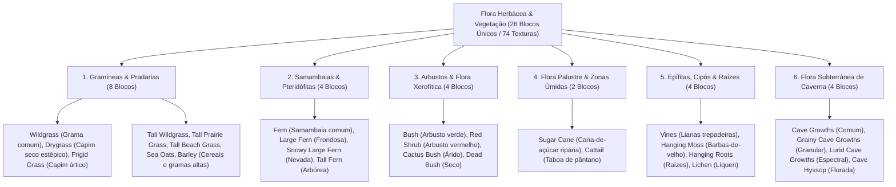

# Catálogo e Estrutura de Worldbuilding: Vegetação Rasteira e Flora Herbácea (Vegetation)

Todas as texturas ativas da vegetação rasteira, arbustos, gramíneas, samambaias e epífitas estão organizadas na pasta:
📂 **`docs/worldbuilding/vegetation`** *(74 texturas PNG ativas, representando 26 blocos únicos divididos em 6 categorias estritamente pares)*

---

## 1. Classificação Ecológica e Estratos Vegetais

A flora herbácea e arbustiva do mundo é organizada em **6 Grandes Domínios Fisionômicos (26 Blocos Únicos)**:

---

## 2. Padrões Estruturais e Variações Aleatórias

Na arquitetura da engine, arquivos com sufixos numéricos (`1, 2, 3...`) não constituem blocos distintos, mas **variações estéticas do mesmo bloco** selecionadas aleatoriamente na geração procedural para quebrar a repetitividade visual da paisagem.

1. **Plantas Simples em Cruz / Billboard (`16x16 pixels RGBA`)**:
   - Renderizadas em interseção diagonal dupla ou em planos verticais recortados.
   - Apresentam de 2 a 5 variações com pequenas alterações de altura, inclinação foliar e curvatura.
2. **Plantas Altas Compostas de Dois Blocos (Double-Tall Flora)**:
   - **Segmento Inferior (`vege_*_bottom.png`)**: Fixação radicular ao solo com caules e colmos mais densos.
   - **Segmento Superior (`vege_*_top.png`)**: Frondes, espigas, inflorescências ou ápices alongados.
   - **Sprites Compostos (`32x32 pixels RGBA`)**: Arquivos consolidados (`vege_tall_wildgrass.png`, `vege_tall_fern.png`) utilizados para modelos especiais e renderização consolidada.
3. **Epífitas de Superfície Vertical e Teto (Hanging & Wall Flora)**:
   - Texturas aplicadas em faces verticais de troncos e rochas (`vege_vines`, `vege_lichen`) ou suspensas a partir de faces inferiores de blocos (`vege_hanging_moss`, `vege_hanging_roots`).

---

## 3. Catálogo dos 26 Blocos Herbáceos Únicos (74 Texturas)

| # | Bloco / Espécie | Categoria Ecológica | Arquivo(s) de Textura | Variações | Biomas & Ocorrência Natural | Definição Botânica & Características |
| :-: | :--- | :--- | :--- | :---: | :--- | :--- |
| **01** | **Wildgrass** | **Gramínea Rasteira** | `vege_wildgrass.png` a `3` | 4 | Campos, Planícies & Bosques | Gramínea herbácea perene cespitosa de folhas lineares verdes, compondo o tapete pioneiro de pradarias temperadas. |
| **02** | **Drygrass** | **Gramínea Estépica** | `vege_drygrass.png` a `3` | 4 | Savanas, Estepes & Semiáridos | Capim perene de folhas estreitas e secas de coloração palha-dourada, adaptado a estações prolongadas de estiagem. |
| **03** | **Frigid Grass** | **Gramínea Ártica** | `vege_frigid_grass.png`, `1` | 2 | Tundras, Taigas & Permafrost | Touceiras baixas de folhas verde-glaucas azuladas cobertas de escarcha, adaptadas a solos congelados e ventos polares. |
| **04** | **Tall Wildgrass** | **Gramínea Alta (2 Blocos)** | `vege_tall_wildgrass.png` *(32x32)* `vege_tall_wildgrass_bottom...3` `vege_tall_wildgrass_top...3` | 4 pares | Pradarias Altas & Várzeas | Touceiras densas de grama que atingem até 2 metros de altura, com caules fibrosos e espigas terminais. |
| **05** | **Tall Prairie Grass**| **Grama de Pradaria (2 Blocos)**| `vege_tall_prairie_grass_bottom.png` `vege_tall_prairie_grass_top.png` | 1 par | Pradarias Centrais & Pampas | Capim alto nativo de folhas delgadas verde-claras onduladas pelo vento em planícies abertas. |
| **06** | **Tall Beach Grass** | **Grama de Praia (2 Blocos)** | `vege_tall_beach_grass_bottom.png` `vege_tall_beach_grass_top.png` | 1 par | Dunas Litorâneas & Praias | Gramínea psamófila de folhas coriáceas resistentes à salinidade e vento marinho, fixadora de dunas costeiras. |
| **07** | **Sea Oats** | **Aveia-do-Mar (2 Blocos)** | `vege_sea_oats_bottom.png` `vege_sea_oats_top.png` | 1 par | Costas Marítimas & Dunas | Planta perene subtropical com panículas pendentes e sementes em leque comprimidas, pioneira em areais litorâneos. |
| **08** | **Barley** | **Cereal Selvagem (2 Blocos)**| `vege_barley_bottom.png` `vege_barley_top.png`, `top1`, `top2` | 3 topos | Encostas Aluviais & Vales | Gramínea cerealífera anual selvagem com colmos eretos e espigas densas com aristas alongadas douradas. |
| **09** | **Fern** | **Pteridófita de Sub-bosque** | `vege_fern.png` a `3` | 4 | Florestas Temperadas & Taigas | Samambaia vascular sem flores com frondes verdes pinadas delicadas que prosperam na sombra úmida sob o dossel arbóreo. |
| **10** | **Large Fern** | **Pteridófita Frondosa** | `vege_fern_large.png` | 1 | Florestas Úmidas & Encostas | Espécime robusto de folhas coriáceas compridas e ápice encurvado, comum em matas de galeria e solos ricos. |
| **11** | **Snowy Large Fern** | **Pteridófita Frondosa Nevada**| `vege_fern_large_snowy.png` | 1 | Taigas Frias & Florestas Nevadas | Frondes robustas de samambaia com deposição natural de cristais e manto de neve nas superfícies foliares superiores. |
| **12** | **Tall Fern** | **Samambaia Arbórea (2 Blocos)**| `vege_tall_fern.png` *(32x32)* `vege_tall_fern_bottom...3` `vege_tall_fern_top...3` | 4 pares | Selvas Tropicais & Bosques Antigos | Pteridófita arborescente com báculo inicial e frondes largas abertas que formam um estrato intermediário de sombra. |
| **13** | **Bush** | **Arbusto Verde Temperado** | `vege_bush.png` a `3` | 4 | Bosques, Bordas de Mata & Colinas | Arbusto lenhoso de copa arredondada baixa e ramificação densa, com folhagem perene verde-escura. |
| **14** | **Red Shrub** | **Arbusto Caducifólio** | `vege_red_shrub.png`, `1` | 2 | Florestas de Outono & Turfeiras | Arbusto com alta concentração de antocianinas, conferindo folhagem escarlate marcante típica de solos ácidos ou outonais. |
| **15** | **Cactus Bush** | **Suculenta Espinhosa** | `vege_cactus_bush.png`, `1` | 2 | Desertos, Chapadas & Caatingas | Planta arbustiva xerofítica suculenta com espinhos finos e cladódios carnosos reservatórios de água. |
| **16** | **Dead Bush** | **Arbusto Lenhoso Seco** | `vege_dead_bush.png` a `3` | 4 | Desertos, Tundras & Solos Estéreis | Restos secos e lignificados de arbustos que perderam a folhagem por dessecação extrema, vento ou congelamento severo. |
| **17** | **Sugar Cane** | **Gramínea Palustre** | `vege_sugar_cane.png` a `4` | 5 | Margens de Rios, Lagos & Praias | Planta perene alta com colmos segmentados ocos e ricos em seiva doce, que cresce exclusivamente em solos alagados. |
| **18** | **Cattail** | **Taboa Palustre (2 Blocos)** | `vege_cattail_bottom.png` `vege_cattail_top.png` | 1 par | Brejos, Pântanos & Lagoas | Planta aquática emergente com espigas cilíndricas aveludadas marrons características e folhas laminares compridas. |
| **19** | **Vines** | **Lianas Trepadeiras** | `vege_vines.png` a `2` | 3 | Florestas Tropicais & Paredões | Caules lenhosos volúveis e trepadores que utilizam troncos e superfícies rochosas como suporte mecânico vertical. |
| **20** | **Hanging Moss** | **Briófita Pendente** | `vege_hanging_moss.png` | 1 | Pântanos, Matas de Galeria & Selvas | Aglomerados de briófitas e líquens filamentosos epífitos que pendem de galhos em ambientes de umidade relativa elevada. |
| **21** | **Hanging Roots** | **Raízes Aéreas Expostas** | `vege_hanging_roots.png`, `1` | 2 | Tetos de Caverna, Barrancos & Solos | Sistema radicular secundário de árvores que ultrapassa a camada superficial de terra e fica suspenso em vãos vazios. |
| **22** | **Lichen** | **Líquen Cortical/Rochoso** | `vege_lichen.png` | 1 | Rochas Úmidas, Troncos & Tundras | Associação simbiótica pioneira de fungos e microalgas com hábito crostoso/folioso aderido a superfícies sólidas. |
| **23** | **Cave Growths** | **Flora Umbrófila de Caverna** | `vege_cave_growths.png` | 1 | Cavernas Úmidas & Fendas Escuras | Briófitas e talos clorofilados esparsos adaptados a fendas rochosas com gotejamento constante e ausência de luz direta. |
| **24** | **Grainy Cave Growths**| **Crescimento Granular** | `vege_grainy_cave_growths.png` | 1 | Paredões de Caverna & Fendas | Estruturas crostosas granulares ferruginosas avermelhadas de micro-organismos que colonizam paredes de caverna. |
| **25** | **Lurid Cave Growths** | **Crescimento Espectral** | `vege_lurid_cave_growths.png` | 1 | Cavernas Profundas Abissais | Colônias pálidas azul-esverdeadas fosforescentes que se desenvolvem em nichos de umidade estagnada no subsolo. |
| **26** | **Cave Hyssop** | **Erva Florida Cavernosa** | `vege_cave_hyssop.png` | 1 | Salões de Caverna & Geodos | Planta herbácea umbrófila rara com pequenas flores coral-avermelhadas adaptada a solos ricos em minerais subterrâneos. |

---

## 4. Inventário Técnico Completo de Texturas em `worldbuilding/vegetation/` (74 Texturas Ativas)

Todas as 74 texturas da pasta iniciam estritamente com o prefixo `vege_`:

### A. Gramíneas e Pradarias (31 Arquivos)
* `vege_wildgrass.png`, `vege_wildgrass1.png`, `vege_wildgrass2.png`, `vege_wildgrass3.png`
* `vege_drygrass.png`, `vege_drygrass1.png`, `vege_drygrass2.png`, `vege_drygrass3.png`
* `vege_frigid_grass.png`, `vege_frigid_grass1.png`
* `vege_tall_wildgrass.png` *(32x32)*
* `vege_tall_wildgrass_bottom.png`, `_bottom1.png`, `_bottom2.png`, `_bottom3.png`
* `vege_tall_wildgrass_top.png`, `_top1.png`, `_top2.png`, `_top3.png`
* `vege_tall_prairie_grass_bottom.png`, `vege_tall_prairie_grass_top.png`
* `vege_tall_beach_grass_bottom.png`, `vege_tall_beach_grass_top.png`
* `vege_sea_oats_bottom.png`, `vege_sea_oats_top.png`
* `vege_barley_bottom.png`, `vege_barley_top.png`, `vege_barley_top1.png`, `vege_barley_top2.png`

### B. Samambaias e Pteridófitas (15 Arquivos)
* `vege_fern.png`, `vege_fern1.png`, `vege_fern2.png`, `vege_fern3.png`
* `vege_fern_large.png`, `vege_fern_large_snowy.png`
* `vege_tall_fern.png` *(32x32)*
* `vege_tall_fern_bottom.png`, `_bottom1.png`, `_bottom2.png`, `_bottom3.png`
* `vege_tall_fern_top.png`, `_top1.png`, `_top2.png`, `_top3.png`

### C. Arbustos e Flora Lenhosa/Xerofítica (12 Arquivos)
* `vege_bush.png`, `vege_bush1.png`, `vege_bush2.png`, `vege_bush3.png`
* `vege_red_shrub.png`, `vege_red_shrub1.png`
* `vege_cactus_bush.png`, `vege_cactus_bush1.png`
* `vege_dead_bush.png`, `vege_dead_bush1.png`, `vege_dead_bush2.png`, `vege_dead_bush3.png`

### D. Canaviais e Flora Palustre (7 Arquivos)
* `vege_sugar_cane.png`, `vege_sugar_cane1.png`, `vege_sugar_cane2.png`, `vege_sugar_cane3.png`, `vege_sugar_cane4.png`
* `vege_cattail_bottom.png`, `vege_cattail_top.png`

### E. Epífitas, Lianas e Raízes Aéreas (7 Arquivos)
* `vege_vines.png`, `vege_vines1.png`, `vege_vines2.png`
* `vege_hanging_moss.png`
* `vege_hanging_roots.png`, `vege_hanging_roots1.png`
* `vege_lichen.png`

### F. Flora Subterrânea de Caverna (4 Arquivos)
* `vege_cave_growths.png`
* `vege_grainy_cave_growths.png`
* `vege_lurid_cave_growths.png`
* `vege_cave_hyssop.png`
