# Catálogo e Estrutura de Worldbuilding: Vegetação Rasteira e Flora Herbácea (Vegetation)

Todas as texturas ativas da vegetação rasteira, arbustos, gramíneas, samambaias e epífitas estão organizadas na pasta:
📂 **`docs/worldbuilding/vegetation`** *(59 texturas PNG ativas)*

---

## 1. Classificação Ecológica e Estratos Vegetais

A flora herbácea e arbustiva do mundo é organizada em **6 Grandes Domínios Fisionômicos**:

```mermaid
graph TD
    V["Flora Herbácea & Vegetação (59 Texturas)"] --> A["1. Gramíneas & Pradarias (17 Texturas)"]
    V --> B["2. Samambaias & Pteridófitas (14 Texturas)"]
    V --> C["3. Arbustos & Flora Xerofítica (12 Texturas)"]
    V --> D["4. Flora Ripária & Canaviais (5 Texturas)"]
    V --> E["5. Epífitas, Cipós & Raízes Suspensas (8 Texturas)"]
    V --> F["6. Flora e Crescimentos Subterrâneos (3 Texturas)"]

    A --> A1["Wildgrass: Grama rasteira verde comum (4 variações)"]
    A --> A2["Drygrass: Capim seco estépico dourado (4 variações)"]
    A --> A3["Tall Wildgrass: Grama alta composta de 2 blocos (Sprite 32x32 + 4 Bottom + 4 Top)"]

    B --> B1["Fern: Samambaia comum de sub-bosque (4 variações)"]
    B --> B2["Large Fern: Samambaia frondosa (Normal e Snowy com cobertura de neve)"]
    B --> B3["Tall Fern: Samambaia arbórea de 2 blocos (Sprite 32x32 + 4 Bottom + 4 Top)"]

    C --> C1["Bush: Arbusto denso verde temperado (4 variações)"]
    C --> C2["Red Shrub: Arbusto caducifólio avermelhado (2 variações)"]
    C --> C3["Cactus Bush: Arbusto suculento espinhoso de clima árido (2 variações)"]
    C --> C4["Dead Bush: Arbusto lenhoso seco de deserto e tundra (4 variações)"]

    D --> D1["Sugar Cane: Gramínea alta palustre de margens hídricas (5 variações)"]

    E --> E1["Vines: Cipós e lianas trepadeiras de florestas densas (3 variações)"]
    E --> E2["Hanging Moss: Barbas-de-velho e briófitas pendentes de dossel"]
    E --> E3["Hanging Roots: Raízes adventícias expostas de tetos e barrancos (2 variações)"]
    E --> E4["Lichen: Líquens crostosos de superfícies rochosas e corticais"]

    F --> F1["Cave Growths: Briófitas e vegetação umbrófila de cavernas (3 variações)"]
```

---

## 2. Padrões Estruturais e Composição de Altura

A vegetação do mundo emprega três padrões morfológicos de renderização:

1. **Plantas Simples em Cruz / Billboard (`16x16 pixels`)**:
   - Renderizadas em interseção diagonal dupla ou em planos verticais recortados.
   - Apresentam de 2 a 5 variações com pequenas alterações de altura, inclinação de folhas e curvatura para quebrar a repetitividade da malha visual.
2. **Plantas Altas Compostas de Dois Blocos (Double-Tall Flora)**:
   - **Segmento Inferior (`_bottom.png`)**: Fixação radicular ao solo com caules e nós mais densos.
   - **Segmento Superior (`_top.png`)**: Frondes, inflorescências ou pontas alongadas que se estendem ao ar livre.
   - **Sprites Compostos (`32x32 pixels`)**: Arquivos consolidados (`vege_tall_wildgrass.png`, `vege_tall_fern.png`) utilizados para pré-visualização, ícones de inventário ou modelos detalhados.
3. **Epífitas de Superfície Vertical e Teto (Hanging & Wall Flora)**:
   - Texturas aplicadas coladas a faces verticais de troncos e rochas (`vines`, `lichen`) ou penduradas a partir de faces inferiores de blocos (`hanging_moss`, `hanging_roots`).

---

## 3. Catálogo das Espécies e Formações Herbáceas (59 Texturas)

| Espécie / Formação | Categoria Biológica | Arquivos de Textura | Dimensões | Biomas & Ocorrência Natural | Definição Botânica & Características |
| :--- | :--- | :--- | :---: | :--- | :--- |
| **Wildgrass** | **Gramínea Rasteira** | `vege_wildgrass.png` `vege_wildgrass1.png` `vege_wildgrass2.png` `vege_wildgrass3.png` | 16x16 RGBA *(4x)* | Campos, Planícies & Bosques | Gramínea herbácea cespitosa comum de folhas lineares verdes, compondo o tapete pioneiro de pradarias úmidas. |
| **Drygrass** | **Gramínea Estépica** | `vege_drygrass.png` `vege_drygrass1.png` `vege_drygrass2.png` `vege_drygrass3.png` | 16x16 RGBA *(4x)* | Savanas, Estepes & Semiáridos | Capim perene com folhas estreitas e secas de coloração palha-dourada, adaptado a estações prolongadas de estiagem. |
| **Tall Wildgrass** | **Gramínea Alta (2 Blocos)** | `vege_tall_wildgrass.png` *(32x32)* `vege_tall_wildgrass_bottom...3.png` `vege_tall_wildgrass_top...3.png` | 32x32 RGBA + 16x16 RGBA *(8x)* | Pradarias Altas & Várzeas | Touceiras densas de grama que atingem até 2 metros de altura, com caules fibrosos e espigas de sementes terminais. |
| **Fern** | **Pteridófita de Sub-bosque** | `vege_fern.png` `vege_fern1.png` `vege_fern2.png` `vege_fern3.png` | 16x16 RGBA *(4x)* | Florestas Temperadas & Taigas | Samambaia vascular sem flores com frondes verdes pinadas delicadas que prosperam na sombra úmida sob o dossel arbóreo. |
| **Large Fern** | **Pteridófita Frondosa** | `vege_fern_large.png` `vege_fern_large_snowy.png` | 16x16 RGBA *(2x)* | Florestas Úmidas & Taiga Nevada | Espécime robusto de folhas coriáceas compridas, com variante apresentando acúmulo de flocos de neve sobre as frondes. |
| **Tall Fern** | **Samambaia Arbórea (2 Blocos)** | `vege_tall_fern.png` *(32x32)* `vege_tall_fern_bottom...3.png` `vege_tall_fern_top...3.png` | 32x32 RGBA + 16x16 RGBA *(8x)* | Selvas Tropicais & Bosques Antigos | Pteridófita arborescente com báculo inicial e frondes largas abertas que formam um estrato intermediário de sombra. |
| **Bush** | **Arbusto Verde Temperado** | `vege_bush.png` `vege_bush1.png` `vege_bush2.png` `vege_bush3.png` | 16x16 RGBA *(4x)* | Bosques, Bordas de Mata & Colinas | Arbusto lenhoso de copa arredondada baixa e ramificação densa, com folhagem perene verde-escura. |
| **Red Shrub** | **Arbusto Caducifólio** | `vege_red_shrub.png` `vege_red_shrub1.png` | 16x16 RGBA *(2x)* | Florestas de Outono & Pântanos | Arbusto com alta concentração de antocianinas, conferindo folhagem escarlate marcante típica de solos ácidos ou outonais. |
| **Cactus Bush** | **Suculenta Espinhosa** | `vege_cactus_bush.png` `vege_cactus_bush1.png` | 16x16 RGBA *(2x)* | Desertos, Chapadas & Caatingas | Planta arbustiva xerofítica suculenta com espinhos finos e cladódios carnosos reservatórios de água. |
| **Dead Bush** | **Arbusto Lenhoso Seco** | `vege_dead_bush.png` `vege_dead_bush1.png` `vege_dead_bush2.png` `vege_dead_bush3.png` | 16x16 RGBA *(4x)* | Desertos, Tundras & Solos Estéreis | Restos secos e lignificados de arbustos que perderam a folhagem por dessecação extrema, vento ou congelamento severo. |
| **Sugar Cane** | **Gramínea Palustre** | `vege_sugar_cane.png` `vege_sugar_cane1.png` `vege_sugar_cane2.png` `vege_sugar_cane3.png` `vege_sugar_cane4.png` | 16x16 RGBA *(5x)* | Margens de Rios, Lagos & Praias | Planta perene alta com colmos segmentados ocos e ricos em seiva doce, que cresce exclusivamente em solos alagados. |
| **Vines** | **Lianas Trepadeiras** | `vege_vines.png` `vege_vines1.png` `vege_vines2.png` | 16x16 RGBA *(3x)* | Florestas Tropicais & Paredões | Caules lenhosos volúveis e trepadores que utilizam troncos e superfícies rochosas como suporte mecânico vertical. |
| **Hanging Moss** | **Briófita Pendente** | `vege_hanging_moss.png` | 16x16 RGBA | Pântanos, Matas de Galeria & Selvas | Aglomerados de briófitas e líquens filamentosos epífitos que pendem de galhos em ambientes de umidade relativa elevada. |
| **Hanging Roots** | **Raízes Aéreas Expostas** | `vege_hanging_roots.png` `vege_hanging_roots1.png` | 16x16 RGBA *(2x)* | Tetos de Caverna, Barrancos & Solos | Sistema radicular secundário de árvores que ultrapassa a camada superficial de terra e fica suspenso em vãos vazios. |
| **Lichen** | **Líquen Cortical/Rochoso** | `vege_lichen.png` | 16x16 RGBA | Rochas Úmidas, Troncos & Tundras | Associação simbiótica pioneira de fungos e microalgas com hábito crostoso/folioso aderido a superfícies sólidas. |
| **Cave Growths** | **Flora Umbrófila Cavernosa** | `cave_growths.png` `grainy_cave_growths.png` `lurid_cave_growths.png` | 16x16 P *(3x)* | Cavernas Úmidas & Fendas Escuras | Briófitas, algas microscópicas e crescimentos fúngicos adaptados a ambientes sem luz solar direta e com alta condensação. |

---

## 4. Inventário Técnico Completo de Texturas em `worldbuilding/vegetation/` (59 Texturas Ativas)

### A. Gramíneas e Pradarias (17 Arquivos)
* `vege_wildgrass.png`, `vege_wildgrass1.png`, `vege_wildgrass2.png`, `vege_wildgrass3.png`
* `vege_drygrass.png`, `vege_drygrass1.png`, `vege_drygrass2.png`, `vege_drygrass3.png`
* `vege_tall_wildgrass.png` *(32x32)*
* `vege_tall_wildgrass_bottom.png`, `_bottom1.png`, `_bottom2.png`, `_bottom3.png`
* `vege_tall_wildgrass_top.png`, `_top1.png`, `_top2.png`, `_top3.png`

### B. Samambaias e Pteridófitas (14 Arquivos)
* `vege_fern.png`, `vege_fern1.png`, `vege_fern2.png`, `vege_fern3.png`
* `vege_fern_large.png`, `vege_fern_large_snowy.png`
* `vege_tall_fern.png` *(32x32)*
* `vege_tall_fern_bottom.png`, `_bottom1.png`, `_bottom2.png`, `_bottom3.png`
* `vege_tall_fern_top.png`, `_top1.png`, `_top2.png`, `_top3.png`

### C. Arbustos e Vegetação Xerofítica (12 Arquivos)
* `vege_bush.png`, `vege_bush1.png`, `vege_bush2.png`, `vege_bush3.png`
* `vege_red_shrub.png`, `vege_red_shrub1.png`
* `vege_cactus_bush.png`, `vege_cactus_bush1.png`
* `vege_dead_bush.png`, `vege_dead_bush1.png`, `vege_dead_bush2.png`, `vege_dead_bush3.png`

### D. Canaviais e Plantas Palustres (5 Arquivos)
* `vege_sugar_cane.png`, `vege_sugar_cane1.png`, `vege_sugar_cane2.png`, `vege_sugar_cane3.png`, `vege_sugar_cane4.png`

### E. Epífitas, Lianas e Raízes Aéreas (8 Arquivos)
* `vege_vines.png`, `vege_vines1.png`, `vege_vines2.png`
* `vege_hanging_moss.png`
* `vege_hanging_roots.png`, `vege_hanging_roots1.png`
* `vege_lichen.png`

### F. Crescimentos e Briófitas de Caverna (3 Arquivos)
* `cave_growths.png`, `grainy_cave_growths.png`, `lurid_cave_growths.png`
